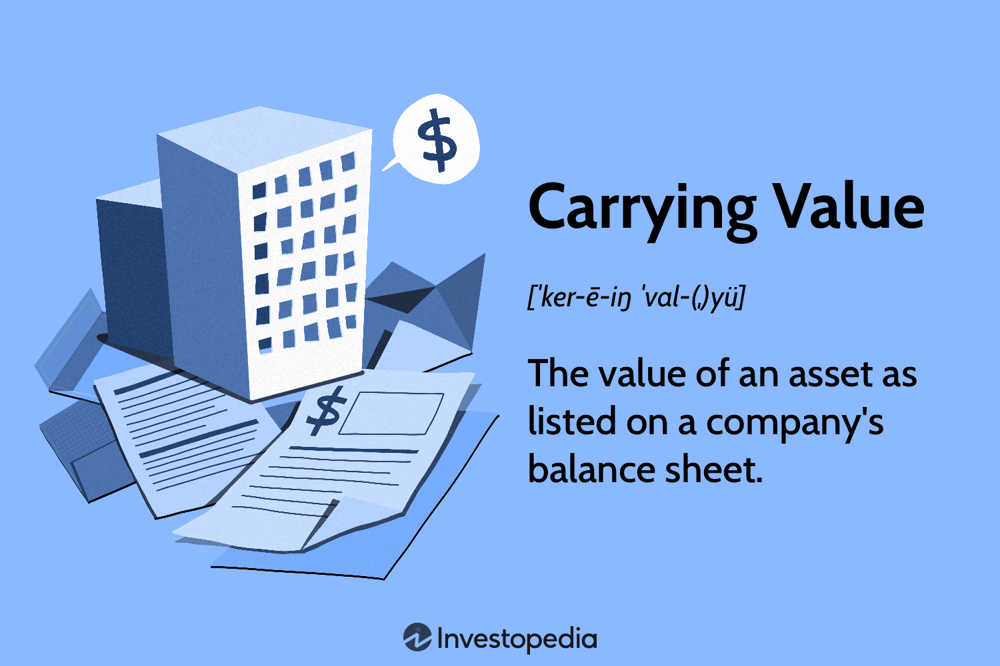

## Table of Contents

## What is carrying value in accounting?

Carrying value, also known as book value, is the amount at which an asset is recognized on a company's balance sheet. It is calculated as the original cost of the asset minus any accumulated depreciation, amortization, or impairment costs. This value represents what the asset is worth to the company according to its accounting records, not necessarily its current market value.

For example, if a company buys a machine for $10,000 and after a year, the accumulated depreciation on that machine is $1,000, the carrying value of the machine would be $9,000. Carrying value is important because it helps businesses track the value of their assets over time and make informed decisions about when to replace or dispose of them. It also plays a key role in financial reporting, as it affects the calculation of a company's net worth and profitability.

## How is carrying value different from market value?

Carrying value and market value are two different ways to measure the worth of an asset. Carrying value, also called book value, is what an asset is worth on a company's balance sheet. It starts with the price the company paid for the asset and then subtracts any depreciation or other costs over time. This value shows what the asset is worth to the company based on its accounting records.

Market value, on the other hand, is what someone would pay for the asset in the open market right now. It can be higher or lower than the carrying value because it depends on what buyers are willing to pay. Market value can change a lot because it is affected by things like supply and demand, economic conditions, and how much people want the asset.

These two values can be very different. For example, a piece of land might have a low carrying value because it was bought a long time ago, but its market value could be much higher because the area has become more popular. Knowing both values helps companies make smart decisions about buying, selling, or keeping their assets.

## What are the components that make up the carrying value of an asset?

The carrying value of an asset is made up of a few key parts. The first part is the original cost, which is how much the company paid to buy the asset. This includes the purchase price and any other costs needed to get the asset ready for use, like delivery or installation fees.

The second part is the accumulated depreciation or amortization. Depreciation is used for physical assets like machinery or vehicles, and it spreads the cost of the asset over its useful life. Amortization is similar but is used for intangible assets like patents or software. Both reduce the carrying value of the asset over time. If an asset loses a lot of value suddenly, an impairment cost might also be subtracted from the carrying value. Together, these parts help show what the asset is worth to the company at any given time.

## How is the carrying value of an asset calculated?

The carrying value of an asset is calculated by starting with the original cost of the asset. This original cost is the price the company paid to buy the asset, including any additional costs needed to get it ready for use, like delivery or installation fees.

Next, you subtract any accumulated depreciation or amortization from the original cost. Depreciation is used for physical assets like machinery or vehicles, and it spreads the cost of the asset over its useful life. Amortization is similar but is used for intangible assets like patents or software. If an asset loses a lot of value suddenly, you might also need to subtract an impairment cost. The result is the carrying value, which shows what the asset is worth to the company at that time.

## Can you explain the process of depreciation and its impact on carrying value?

Depreciation is a way to spread out the cost of a physical asset over the time it is used. Imagine you buy a machine for your business. You don't want to count the whole cost of the machine in one year because it will be used for many years. So, you use depreciation to divide the cost of the machine over its useful life. Every year, you take a little bit of the cost and subtract it from the value of the machine on your balance sheet. This smaller amount each year is called depreciation expense.

The impact of depreciation on carrying value is straightforward. Let's say you bought that machine for $10,000 and it lasts for 10 years. Each year, you might subtract $1,000 from the machine's value as depreciation. So, after one year, the carrying value of the machine would be $9,000. After two years, it would be $8,000, and so on. Depreciation reduces the carrying value of the asset over time, showing that the asset is getting older and less valuable. This helps businesses keep their financial records accurate and understand the true worth of their assets.

## What role does amortization play in determining the carrying value of intangible assets?

Amortization is a way to spread out the cost of an intangible asset over the time it is used, just like depreciation does for physical assets. Intangible assets are things you can't touch, like patents or software. When a company buys an intangible asset, it doesn't want to count the whole cost in one year. Instead, it uses amortization to divide the cost over the years the asset will be useful. Each year, a little bit of the cost is taken away from the value of the asset on the balance sheet. This smaller amount each year is called amortization expense.

The impact of amortization on the carrying value of an intangible asset is similar to how depreciation works for physical assets. If a company buys a patent for $5,000 and it lasts for 5 years, they might subtract $1,000 each year as amortization. So, after one year, the carrying value of the patent would be $4,000. After two years, it would be $3,000, and so on. Amortization reduces the carrying value of the intangible asset over time, showing that the asset is getting older and less valuable. This helps businesses keep their financial records accurate and understand the true worth of their intangible assets.

## How does impairment affect the carrying value of an asset?

Impairment is when an asset loses a lot of its value suddenly. This can happen if the asset gets damaged, if the market changes, or if the asset is no longer as useful as it was before. When a company thinks an asset might be impaired, they have to check its value. If they find out that the asset is worth less than its carrying value, they need to lower the carrying value to match the new, lower value. This is called an impairment loss.

When an impairment loss is recorded, the carrying value of the asset goes down. For example, if a company bought a machine for $10,000 and it has been depreciated to a carrying value of $8,000, but then something happens and the machine is now only worth $5,000, the company would have to record an impairment loss of $3,000. This would bring the carrying value of the machine down to $5,000. This helps the company show a more accurate picture of what their assets are worth on their balance sheet.

## What are the accounting standards that govern the reporting of carrying value?

The rules for reporting carrying value are set by accounting standards like the Generally Accepted Accounting Principles (GAAP) in the United States and the International Financial Reporting Standards (IFRS) used in many other countries. These standards make sure that companies report the value of their assets in a clear and consistent way. GAAP and IFRS both say that carrying value should start with the original cost of the asset and then subtract any depreciation, amortization, or impairment losses.

Both GAAP and IFRS have specific rules on how to calculate depreciation and amortization, and when to check for impairment. For example, GAAP might use the straight-line method for depreciation, while IFRS allows more flexibility in choosing a method. When it comes to impairment, both standards require companies to look at their assets regularly to see if they need to lower the carrying value. By following these rules, companies can make sure their financial reports are accurate and helpful for investors and other people who look at their financial health.

## How do companies report carrying value in their financial statements?

Companies report the carrying value of their assets on their balance sheet, which is one of the main financial statements. The balance sheet shows what a company owns (assets) and what it owes (liabilities) at a certain time. The carrying value is the number you see for each asset after taking away any depreciation, amortization, or impairment costs. This helps people see what the company thinks its assets are worth right now, based on their accounting records.

For example, if a company has a machine that cost $10,000 when they bought it, and after some time, they've taken away $2,000 for depreciation, the carrying value on the balance sheet would be $8,000. The balance sheet will list this machine at $8,000, showing that the company thinks it's worth that much now. This way, anyone looking at the financial statements can understand how the value of the company's assets has changed over time.

## What are some common mistakes companies make when calculating carrying value?

One common mistake companies make when calculating carrying value is not keeping track of depreciation or amortization correctly. Sometimes, they might forget to subtract the right amount each year, or they might use the wrong method to calculate it. This can make the carrying value of their assets look higher than it should be, which can mess up their financial reports and make them look more valuable than they really are.

Another mistake is not checking for impairment often enough or not recognizing it when it happens. If an asset loses a lot of value suddenly, like if it gets damaged or if the market changes, the company needs to lower the carrying value to match the new, lower value. If they don't do this, the carrying value will be too high, and their financial statements won't show the true worth of their assets. Keeping an eye on these things and making the right adjustments is important for accurate financial reporting.

## How does the carrying value influence investment decisions and company valuation?

Carrying value helps investors and companies make smart choices about investments and how much a company is worth. When investors look at a company's financial statements, they see the carrying value of its assets. This tells them how much the company thinks its assets are worth right now. If the carrying value is much lower than the market value, it might mean the company has assets that could be sold for more money than they're worth on paper. This could make the company look like a good investment because it has hidden value.

On the other hand, if the carrying value is too high because the company didn't account for depreciation or impairment properly, investors might think the company is worth more than it really is. This can lead to bad investment decisions because the company's true value is lower than what's shown on the financial statements. By understanding the carrying value, investors can better judge if a company is a good investment and how much the company is really worth.

## Can you discuss a real-world example where carrying value had a significant impact on a company's financials?

A famous example of carrying value affecting a company's financials is what happened with Enron in the early 2000s. Enron was an energy company that used a lot of tricky accounting to make their financials look better than they really were. One of the things they did was to keep the carrying value of their assets high, even when those assets were losing value. They didn't record the right amount of depreciation or impairment, so their balance sheet showed higher asset values than what was real. This made Enron look more valuable and profitable than it actually was, which fooled investors into thinking the company was doing great.

When the truth came out, it turned out that Enron's carrying values were way off. Their assets weren't worth as much as they claimed, and this led to one of the biggest corporate scandals in history. The company had to admit that their financial statements were wrong, and this caused their stock price to crash. Enron ended up going bankrupt, and many people lost their jobs and money. This example shows how important it is for companies to report the carrying value of their assets correctly, so investors can trust the financial statements and make good decisions.

## What is the Understanding of Accounting Carrying Value?

Carrying value, also termed book value, represents the value at which an asset is recorded on a company's balance sheet. This metric is a crucial element in accounting, reflecting the net value of an asset over time. It is calculated by taking the initial purchase cost of an asset and deducting any accumulated depreciation or amortization. The formula to compute carrying value is:

$$
\text{Carrying Value} = \text{Original Cost} - \text{Accumulated Depreciation/Amortization}
$$

**Calculation Methods**: 

1. **Original Cost**: This is the purchase price of the asset, including any costs associated with bringing the asset to its intended use, such as installation fees or initial testing.

2. **Accumulated Depreciation/Amortization**: This represents the total depreciation or amortization that has been charged against the asset since it was acquired. Depreciation is used for tangible assets like machinery, whereas amortization refers to intangible assets such as patents.

Different methods exist to calculate depreciation and amortization, influencing the carrying value. Common methods include:

- **Straight-Line Method**: Equal depreciation is charged over the useful life of the asset. It is represented as:

  \[ \text{Annual Depreciation} = \frac{\text{Original Cost} - \text{Residual Value}}{\text{Useful Life}}
$$

- **Declining Balance Method**: Depreciation is greatest in the initial years and decreases over time.

- **Units of Production Method**: Based on the usage of the asset, leading to variable depreciation amounts each period.

**Factors Influencing Carrying Value**:

- **Asset Revaluation**: Sometimes, assets are revalued to reflect their fair market value. This can result in an increase or decrease in carrying value.

- **Impairment**: If an asset's market value drops below its carrying amount, an impairment loss is recognized, reducing the carrying value.

- **Useful Life Estimation**: The estimated useful life plays a significant role. A longer lifespan implies lower annual depreciation, affecting carrying value.

**Implications for Businesses**:

Carrying value plays a vital role in financial analysis and decision-making. For investors, it provides insight into the valuation of a company’s assets, which is integral for calculating ratios such as return on assets (ROA) and debt-to-equity ratio. Companies also utilize carrying value to make strategic decisions regarding asset replacement, sales, or upgrades. Accurate computation and reporting of carrying value ensure compliance with accounting standards and provide transparency to stakeholders, influencing investment and financing decisions.

## What is the interconnection between carrying value and algo trading?

The interplay between carrying value, balance sheet analysis, and algorithmic trading is a significant dimension of contemporary investing. Carrying values, reflected as book values on balance sheets, directly impact trading strategies, especially in algorithmic trading that relies heavily on real-time data analytics.

Carrying value provides a snapshot of an asset's worth after accounting for depreciation and amortization. This metric is vital for traders using algorithmic strategies to evaluate the true value of a company’s assets relative to their current market prices. For instance, if the carrying value significantly diverges from market value, it could indicate potential overvaluation or undervaluation, prompting specific trading actions.

Algorithmic trading, which automates trade executions using pre-defined criteria, can integrate carrying values as part of its evaluative criteria. Algorithms can be programmed to incorporate financial ratios derived from carrying values, such as Price-to-Book (P/B) ratio, to assess investment opportunities:

$$
\text{P/B Ratio} = \frac{\text{Market Price per Share}}{\text{Book Value per Share}}
$$

A low P/B ratio might trigger buy signals in an algorithmic trading system, suggesting that the asset may be undervalued relative to its book value. Conversely, a high P/B ratio could signal overvaluation, prompting sell orders.

Moreover, algorithmic trading systems can exploit anomalies between carrying value and market value swiftly, leveraging discrepancies identified during balance sheet analysis. By using historical data and statistical models, algo trading can predict movements based on shifts in accounting metrics like carrying values, thus optimizing trading outcomes. For example, [machine learning](/wiki/machine-learning) models can analyze patterns and make predictions on asset valuation changes, incorporating carrying value as a key variable.

Implementing such systems requires a profound understanding of both financial accounting and computational finance. Robust algorithms ensure traders can promptly react to fluctuations, harnessing the full potential of carrying values for refined decision-making in asset management and trading.

In summary, the integration of carrying values into algorithmic trading strategies can significantly enhance value investing efforts. By leveraging these accounting metrics with advanced computational techniques, traders can uncover latent opportunities, manage risks, and ultimately optimize their investment strategies to align with broader financial objectives.

## References & Further Reading

[1]: ["Financial Reporting and Analysis"](https://www.wallstreetmojo.com/financial-reporting/) by Charles H. Gibson

[2]: ["Intermediate Accounting"](https://accountingtestprep.com/intermediate-accounting-2/) by Donald E. Kieso, Jerry J. Weygandt, and Terry D. Warfield

[3]: ["Algorithmic Trading & DMA: An introduction to direct access trading strategies"](https://www.amazon.com/Algorithmic-Trading-DMA-introduction-strategies/dp/0956399207) by Barry Johnson

[4]: ["Advances in Financial Machine Learning"](https://www.amazon.com/Advances-Financial-Machine-Learning-Marcos/dp/1119482089) by Marcos Lopez de Prado

[5]: ["Quantitative Trading: How to Build Your Own Algorithmic Trading Business"](https://www.amazon.com/Quantitative-Trading-Build-Algorithmic-Business/dp/1119800064) by Ernest P. Chan