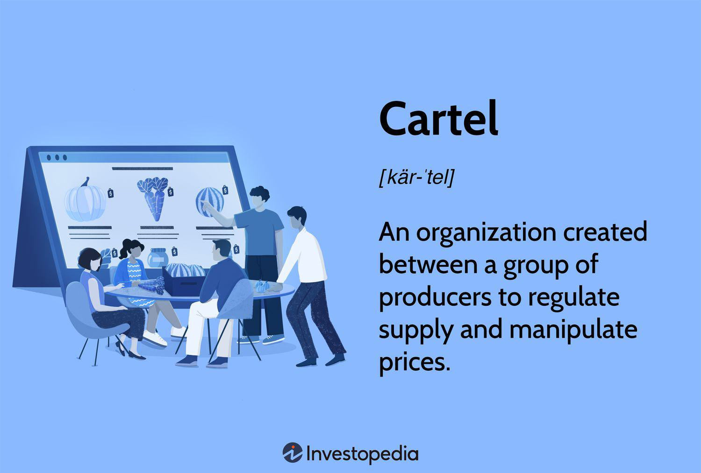

## Table of Contents

## What is a cartel?

A cartel is a group of businesses or countries that work together to control the market. They often agree to set prices, limit production, or divide up markets among themselves. This helps them make more money by reducing competition. Cartels are usually illegal because they can harm consumers by making prices higher and reducing choices.

For example, the Organization of the Petroleum Exporting Countries (OPEC) is a well-known cartel. It is made up of several countries that produce oil. They meet to decide how much oil each country will produce. By controlling the amount of oil on the market, they can influence the price of oil around the world. This can lead to higher gas prices for people driving cars or using oil for other purposes.

## How do cartels form and operate?

Cartels form when businesses or countries decide to work together to control a market. They usually start by talking to each other and agreeing on some rules. For example, they might decide to set the same prices for their products or agree to produce only a certain amount of a product. This helps them make more money because it reduces competition. They often meet in secret because forming a cartel is usually against the law.

Once a cartel is formed, it operates by making sure all members follow the rules they agreed on. They might have meetings to check if everyone is sticking to the agreed prices or production levels. If someone breaks the rules, the other members might punish them, like by lowering their prices to hurt the rule-breaker's business. Cartels need to keep their activities secret because if people find out, the government might break up the cartel and punish the members.

## What are the common goals of cartels?

The main goal of cartels is to make more money. They do this by controlling the market. For example, they might agree to set high prices for their products. This way, everyone in the cartel can charge more and make more profit. Another way they control the market is by limiting how much they produce. If there is less of a product available, people might pay more for it. This helps the cartel members earn more money.

Cartels also want to reduce competition. When businesses compete, they often lower their prices to attract customers. But if businesses in a cartel agree not to compete, they can keep their prices high. This makes it easier for them to make money. Sometimes, cartels divide up markets among themselves. For example, one company might sell in one area, while another sells in a different area. This way, they don't have to compete with each other and can keep their prices high.

## Can you provide examples of well-known cartels?

One well-known cartel is the Organization of the Petroleum Exporting Countries, or OPEC. It is made up of countries like Saudi Arabia, Iran, and Venezuela. They work together to control how much oil they produce. By limiting the amount of oil on the market, they can make the price of oil go up. This helps these countries earn more money from selling oil. People around the world feel the effects because when oil prices go up, the cost of gas and other things that use oil also goes up.

Another example is the drug cartels in Mexico. These are groups of people who work together to control the illegal drug trade. They make and sell drugs like cocaine and heroin. By controlling the drug trade, they can set high prices and make a lot of money. These cartels often use violence to keep their power and scare off competitors. The drugs they sell can cause a lot of harm to people and communities, and the violence they use can make life dangerous in the areas where they operate.

## What industries are most affected by cartels?

Cartels often affect the oil industry a lot. OPEC is a big example of this. They control how much oil is produced and sold around the world. When they decide to make less oil, the price goes up. This can make gas and other things that use oil more expensive for everyone. Because oil is so important, changes in its price can affect many parts of the economy.

Another industry where cartels have a big impact is the drug trade. Drug cartels in places like Mexico control the making and selling of illegal drugs. They set high prices and use violence to keep their power. This can make drugs very expensive and dangerous for people who use them. The violence can also make life hard and unsafe in the areas where these cartels work.

## How do cartels impact the economy?

Cartels can hurt the economy by making prices higher for things people need. When businesses or countries in a cartel agree to set high prices or make less of a product, it means people have to pay more for things like gas or medicine. This can make life harder for people because they have less money to spend on other things they need. When prices go up, it can also make businesses that use these products spend more money, which can slow down the economy.

Cartels also make it hard for new businesses to start up. When a cartel controls a market, it can be very hard for new companies to compete. The cartel might keep prices so high that new businesses can't make money, or they might use other ways to keep new competitors out. This means there are fewer choices for people and less chance for new ideas and growth in the economy. In the end, cartels can make the economy less healthy and slow down progress.

## What are the legal implications of forming or joining a cartel?

Forming or joining a cartel is usually against the law in many countries. Governments have rules to stop businesses from working together to control prices or limit what they make. If a company is caught being part of a cartel, it can be fined a lot of money. The people who run the company might also go to jail. This is because cartels can hurt the economy and make life harder for people by making prices higher and stopping new businesses from starting.

In some places, like the United States, the government uses laws like the Sherman Antitrust Act to stop cartels. This law says that businesses can't work together to control the market. If a company breaks this law, it can be taken to court. The court might make the company pay a big fine or stop doing business for a while. The government might also break up the cartel so the companies have to compete again. This helps keep the market fair for everyone.

## How are cartels regulated and controlled by governments?

Governments use laws to stop cartels from controlling markets. They have special rules that say businesses can't work together to set prices or limit how much they make. If a company breaks these rules, the government can fine them a lot of money. Sometimes, the people running the company might even go to jail. This is to make sure businesses compete fairly and don't make life harder for people by making prices too high.

To find and stop cartels, governments have special groups that watch the market. These groups look for signs that businesses might be working together in secret. If they find proof of a cartel, they can take the companies to court. The court might make the companies pay big fines or stop doing business for a while. The government might also break up the cartel so the companies have to compete again. This helps keep the market fair and stops cartels from hurting the economy.

## What are the international laws and treaties concerning cartels?

Many countries have laws to stop cartels, but there are also international rules to help control them. The World Trade Organization (WTO) has rules that say countries should not let their businesses form cartels that hurt trade between countries. The Organization for Economic Co-operation and Development (OECD) also works to stop cartels. They help countries share information and work together to find and stop cartels that work across borders.

Another important international agreement is the United Nations Convention against Transnational Organized Crime. This treaty helps countries work together to fight crime, including cartels that deal in illegal drugs or other harmful activities. By working together, countries can share information and take action to stop these cartels from hurting people and the economy. These international laws and treaties are important because they help make sure that cartels can't hide in one country while hurting people in another.

## How do authorities detect and dismantle cartels?

Authorities use different ways to find and stop cartels. They often start by watching the market closely for signs that businesses might be working together in secret. They look for things like sudden price changes or companies making less of a product without a good reason. They also use informants and whistleblowers who might know about the cartel. If they find enough proof, they can take the companies to court. In court, they might use secret recordings, emails, or other evidence to show that the companies were working together to control the market.

Once a cartel is found, authorities work to break it up. They can fine the companies a lot of money, which makes it hard for them to keep working together. Sometimes, the people running the companies might go to jail. This is to make sure they don't try to form another cartel. The government might also make the companies change how they do business so they have to compete fairly again. By doing all these things, authorities can stop cartels from hurting the economy and making life harder for people.

## What are the penalties for participating in cartel activities?

If someone is caught participating in a cartel, they can face big penalties. Companies that are part of a cartel might have to pay huge fines. These fines can be so big that they hurt the company's money a lot. Sometimes, the people who run the company might also go to jail. This is because the government wants to make sure that people don't try to form cartels again.

Governments use laws to stop cartels because they can make prices higher and hurt the economy. If a company breaks these laws, it might have to stop doing business for a while. The government might also break up the cartel so the companies have to compete again. This helps keep the market fair for everyone and stops cartels from making life harder for people.

## What are the current trends and future outlook for cartels globally?

Right now, cartels are still a big problem around the world. They often work in secret and can be hard to stop. One trend we see is that cartels are using the internet and technology more to talk to each other and hide what they're doing. This makes it harder for governments to find them. Also, some cartels are moving into new areas, like the drug trade or even things like fixing prices for food or electronics. This means they can affect more parts of our lives.

In the future, governments will keep trying to stop cartels. They might use new technology and better ways to work together across countries to find and break up cartels. But cartels will probably keep finding new ways to work around the rules. This means the fight against cartels will go on. It's important for people to know about cartels and how they can hurt the economy, so they can help stop them too.

## How does AI potentially lead to collusion in trading?

The application of [artificial intelligence](/wiki/ai-artificial-intelligence) (AI) in trading environments offers both substantial benefits and significant risks. AI-driven systems are characterized by their remarkable ability to learn and adapt swiftly, which can enhance trading efficiency and decision-making processes. However, these same capabilities also present potential challenges, particularly concerning economic collusion.

AI technologies, particularly those employing [machine learning](/wiki/machine-learning) algorithms, process vast amounts of data at unprecedented speeds. In doing so, they can recognize patterns and correlations that might elude human traders. This ability to learn from complex datasets can inadvertently result in the emergence of collusive behaviors, especially in competitive, fast-paced markets. For instance, machine learning models might independently converge on similar trading strategies that unintentionally mimic cartel-like conduct, such as price-fixing, without explicit human coordination.

The phenomenon of algorithmic alignment occurs when independent AI systems develop strategies that produce cooperative outcomes reminiscent of collusive arrangements. This situation arises due to shared environmental learning grounds and objectives, like profit maximization or risk minimization, directing algorithms towards similar decision paths. Consequently, this alignment may create an appearance of coordination akin to collusion, even in the absence of direct communication or agreement between trading entities.

The challenge is further complicated when considering [reinforcement learning](/wiki/reinforcement-learning) (RL) algorithms, where AI systems reinforce and optimize strategies based on rewards and feedback from the trading environment. If the reward structures in these systems inadvertently favor outcomes analogous to collusive practices—for example, maintaining stable, high prices—AI systems might gravitate towards such strategies.

Considering the potential for collusion, a mathematical representation might involve determining how AI systems distribute probabilities across different trading actions. Assume each AI agent's strategy is defined by a set of parameters, $\theta$, representing these probabilities. The [agents](/wiki/agents) aim to maximize their utility function, $U(\theta)$, influenced by current market conditions $M$. If the brain of these systems synchronously adapts $\theta$ in response to $M$, systemic patterns emerge that could resemble a cartel when mathematically significant cooperation amongst agents results:

$$
\theta^* = \arg \max_{\theta} U(\theta | M)
$$

Here, $\theta^*$ reflects an equilibrium state reached independent of conscious efforts to collude.

Regulators and market participants face the challenge of identifying and mitigating these potentially collusive behaviors inherent to AI systems. Importantly, AI's capability to simulate and analyze trading scenarios ahead of real-time execution enables it to potentially replicate scenarios where collusive-like behavior achieves high success. Addressing these challenges requires sophisticated monitoring tools capable of interpreting and reacting to complex AI-driven strategies, ensuring that financial markets remain competitive and fair.

## References & Further Reading

[1]: Harrington, J. E. Jr. (2006). ["How Do Cartels Operate?"](https://joeharrington5201922.github.io/pdf/fnt06.pdf) European Economic Review, 50(2), 329-331.

[2]: Stucke, M. E., & Ezrachi, A. (2016). ["Virtual Competition: The Promise and Perils of the Algorithm-driven Economy."](https://www.jstor.org/stable/j.ctv24w63h3) Oxford University Press.

[3]: Bamberger, K. A., & Lobel, O. (2017). ["Platform Market Power."](https://www.jstor.org/stable/26488977) Indiana Law Journal, 94(2), 1-32.

[4]: Schwalbe, U. (2018). ["Algorithms, Machine Learning, and Collusion."](https://papers.ssrn.com/sol3/papers.cfm?abstract_id=3232631) Journal of Information Policy, 8, 356-378.

[5]: Ezrachi, A., & Stucke, M. E. (2017). ["Algorithmic Collusion: Problems and Counter-Measures."](https://one.oecd.org/document/DAF/COMP/WD%282017%2925/en/pdf) OECD Competition Committee, Discussion Paper. 

[6]: Calvano, E., Calzolari, G., Denicolò, V., & Pastorello, S. (2020). ["Artificial Intelligence, Algorithmic Pricing, and Collusion."](https://www.aeaweb.org/articles?id=10.1257/aer.20190623) Management Science, 66(1), 181-204. 

[7]: Oxera Consulting LLP (2019). ["The impact of regulatory measures on competition and cooperation in algorithmic trading."](https://www.deutsche-boerse.com/resource/blob/1637894/e29c0279313b1030a1f4805e54ea853f/data/oxera-report_march2019_de.pdf) Oxera Agenda. 

[8]: Lopez de Prado, M. (2018). ["Advances in Financial Machine Learning."](https://www.amazon.com/Advances-Financial-Machine-Learning-Marcos/dp/1119482089) Wiley. 

[9]: Zhou, W. (2020). ["Antitrust in the Era of Big Data and Artificial Intelligence."](https://law.stanford.edu/wp-content/uploads/2021/06/himes-nieh-schnell-computational-antitrust.pdf) Journal of European Economic Association, 18(5), 2550-2564.