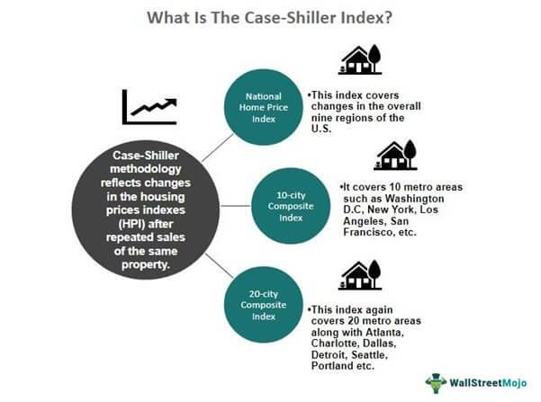

The U.S. housing market is a pivotal component of the nation's economic landscape, reflecting broader economic trends and serving as an essential barometer for economic health. Changes in home prices are intricately linked to critical economic aspects such as consumer spending, inflation, and monetary policy. To assess these changes, one of the most reliable and respected tools is the Case-Shiller Index. Formally known as the S&P CoreLogic Case-Shiller U.S. National Home Price NSA Index, it offers a comprehensive measure of fluctuations in the value of single-family homes across the United States.

Developed in the 1980s by economists Karl Case and Robert Shiller, the index employs a sophisticated methodology to ensure accurate reflections of housing market trends. This methodology focuses on repeat-sales pricing, which examines the prices of the same properties in consecutive sales. By concentrating on arm's length transactions and excluding non-typical sales such as foreclosures or flips, the index provides a reliable gauge of genuine market dynamics.



Understanding the Case-Shiller Index is crucial for anyone involved in real estate, investment, or economic policymaking. It goes beyond mere market analysis, intersecting with advanced techniques like algorithmic trading in real estate. The integration of these data points facilitates informed decision-making, allowing investors to predict market movements and optimize asset acquisition strategies effectively. This fusion of traditional economic measurement with modern algorithmic methods underscores the evolving nature of real estate investment, making the Case-Shiller Index not just a historical barometer but a tool for future strategic planning.

## Table of Contents

## Understanding the Case-Shiller Index

The Case-Shiller Index, officially the S&P CoreLogic Case-Shiller U.S. National Home Price NSA Index, is a prominent tool for assessing fluctuations in the value of single-family homes throughout the United States. Developed by economists Karl Case and Robert Shiller in the 1980s, this index employs a repeat-sales pricing technique. This method concentrates on arms-length transaction sales to provide an accurate reflection of price movements over time.

The repeat-sales method adopted by the Case-Shiller Index involves tracking the sale prices of the same property in subsequent transactions. This approach minimizes variations attributable to property-specific features and focuses on genuine market value changes. By excluding non-arms-length transactions—such as sales between relatives or related parties—and frequent flip sales, the index achieves greater accuracy and reliability.

The Case-Shiller Index is composed of various measures that offer insights at different geographic levels. The national index provides an overarching view of housing trends in the U.S., while the 10-city and 20-city composite indices offer detailed insights into specific urban areas. These composite indices are designed to represent price dynamics in key metropolises, reflecting both regional variations and overall market trends.

The comprehensive nature of the Case-Shiller Index and its emphasis on repeat-sales methodology make it an invaluable resource for economists, analysts, and policymakers aiming to understand the U.S. housing market's evolving landscape. It integrates robust data from various real estate registries and recording offices, ensuring that the indices reflect true market conditions and changes over time.

## Methodology of the Case-Shiller Index

The Case-Shiller Index employs the repeat-sales method, a statistical technique that provides an accurate reflection of housing price movements by focusing on changes in the sale prices of the same property over time. This approach aims to mitigate the influence of variable property characteristics and market conditions on price estimation. By exclusively considering arms-length transactions, the index ensures that sales between related parties, which could skew price data, are excluded. Similarly, frequent flip sales, often associated with speculative activity rather than actual value changes, are also omitted to maintain the credibility of the index.

Creation of the index for diverse price tiers and regions is crucial in capturing the heterogeneity of the U.S. housing market. This segmentation is vital as it acknowledges the varying economic conditions and housing market dynamics prevalent across different geographies and price levels. It allows for a nuanced analysis of housing trends, facilitating more localized policy making and investment decisions.

The methodology relies heavily on comprehensive data sourcing from real estate registries and recording offices. This extensive dataset is essential for not only constructing the indexes but also for periodic updates that maintain the index's relevance and accuracy. By utilizing these extensive records, the Case-Shiller Index can effectively capture real-time market dynamics, providing an invaluable tool for economists, policymakers, and investors.

## Significance of the Case-Shiller Index

The Case-Shiller Index holds significant importance in the U.S. housing market and broader economic analysis due to its detailed tracking of residential property price trends. As a reliable gauge of housing price movements, it provides valuable insights into consumer behavior and economic conditions. Changes in housing prices, reflected by the index, have a direct impact on consumer spending. When home values rise, homeowners generally feel wealthier and may increase their spending, known as the wealth effect. Conversely, declining home prices can lead to reduced consumer confidence and spending, affecting overall economic activity.

Moreover, the housing sector is a critical driver of employment, particularly in construction. Variations in house prices, as captured by the Case-Shiller Index, influence construction industry employment. A surge in prices typically leads to increased demand for new housing, thus boosting employment in construction and related industries. Conversely, when prices fall, construction activities may slow, leading to potential job losses.

The economic confidence of various regions is often mirrored in housing market trends. Rising house prices generally indicate strong demand and a growing local economy, while declining prices may reflect economic uncertainty or dwindling demand. Economists and analysts use the Case-Shiller Index to forecast regional housing market trends, providing invaluable input for both policy and investment decisions.

Additionally, the index serves as a foundational tool in the creation of financial instruments. These instruments, including futures and options based on housing prices, allow investors to speculate or hedge against price movements in the housing market. For instance, property investors and [hedge fund](/wiki/hedge-fund-trading-strategies) managers can use derivatives linked to the Case-Shiller Index to manage risks associated with fluctuating home prices.

The development of such financial products highlights the index's crucial role in enabling market participants to engage with the housing sector analytically and strategically. The availability of these instruments also contributes to market [liquidity](/wiki/liquidity-risk-premium), allowing for more robust trading and investment activities in the real estate sector.

In summary, the Case-Shiller Index is indispensable for understanding the interplay between housing prices and broader economic variables. By providing data-driven insights, it aids in crafting informed investment strategies and economic policies, while facilitating sophisticated financial instruments for market engagement.

## Algorithmic Trading in Real Estate

Algorithmic trading involves using computer algorithms to automatically execute trades at very high speeds based on specific criteria. In the context of real estate, this trading approach harnesses data from various sources, including the Case-Shiller Index, to forecast market trends and enhance asset acquisition strategies. These algorithms analyze vast amounts of data to identify patterns and correlations that may not be apparent to human traders.

One of the key advantages of [algorithmic trading](/wiki/algorithmic-trading) in real estate is the enhancement of decision-making processes. By employing sophisticated models, algorithms can assess large datasets to predict price fluctuations and detect market inefficiencies. For instance, historical data from the Case-Shiller Index can be used to create predictive models that identify potential investment opportunities by estimating future housing price movements.

Algorithmic trading also allows for the implementation of quantitative strategies that depend on real-time data and complex calculations. Through the continual analysis of market conditions, these algorithms can adjust investment strategies on the fly, ensuring optimal performance. Data-driven insights derived from algorithms enable investors to respond quickly to market changes, thus capitalizing on profitable trends before they dissipate.

Moreover, the technology can evaluate and mitigate risks effectively. By simulating various market scenarios, algorithms can help investors understand potential risks and devise strategies to minimize them. The application of [machine learning](/wiki/machine-learning) techniques further refines these predictive models, as they continuously learn and adapt from new data, improving their accuracy over time.

In practical terms, a simplified Python example of using historical data to develop a forecast could look like this:

```python
import pandas as pd
from sklearn.model_selection import train_test_split
from sklearn.linear_model import LinearRegression

# Load historical home price data
data = pd.read_csv('case_shiller_data.csv')

# Features and target variable
X = data[['Year', 'Month']]
y = data['HomePriceIndex']

# Split data into training and testing sets
X_train, X_test, y_train, y_test = train_test_split(X, y, test_size=0.2, random_state=42)

# Initialize and fit linear regression model
model = LinearRegression()
model.fit(X_train, y_train)

# Predict home prices
predictions = model.predict(X_test)

print(predictions)
```

This example demonstrates how basic data science techniques can be applied to real estate data to forecast future prices. While this model is simplified, real-world algorithmic trading utilizes more advanced statistical methods and machine learning models to achieve accuracy and efficiency.

Overall, algorithmic trading transforms real estate investment by providing tools to optimally navigate market trends and seize opportunities promptly, resulting in potentially higher returns and more robust investment strategies.

## The Intersection of the Case-Shiller Index and Algo Trading

The Case-Shiller Index serves as a foundational dataset for algorithmic trading in real estate markets. Its detailed records of single-family home prices over time offer a valuable resource for constructing predictive models. By analyzing these data points, investors can identify price trends, market cycles, and potential economic bubbles in various metropolitan areas.

Algorithmic models use statistical techniques such as regression analysis, time series forecasting, and machine learning algorithms to interpret the Case-Shiller Index data. For instance, a linear regression model could be employed to predict future home prices based on historical trends:

```python
from sklearn.linear_model import LinearRegression
import numpy as np

# Example data representing past Case-Shiller Index values
past_index_values = np.array([[1], [2], [3], [4], [5]])
future_index_values = np.array([[6], [7], [8]])

# Corresponding home prices
prices = np.array([200000, 210000, 215000, 220000, 225000])

# Initialize and fit the linear regression model
model = LinearRegression().fit(past_index_values, prices)

# Predict future prices
predicted_prices = model.predict(future_index_values)
print(predicted_prices)
```

This model predicts the home price trajectory using historical index values, aiding traders in investment decisions. These strategies are especially useful in dynamic and geographically diverse markets, where price fluctuations are prevalent. By identifying anomalies or rapid changes in index trends, investors can pinpoint speculative bubbles and mitigate risks or seize opportunities.

The insight offered through such data-driven approaches transforms traditional real estate investment by replacing intuitive decision-making with empirical analysis, thus allowing for potentially higher returns. This integration of the Case-Shiller Index with cutting-edge algorithmic methods marks a significant advancement in trading strategies, offering enhanced precision and efficiency.

## Conclusion

The Case-Shiller Index continues to be an essential instrument for comprehending U.S. real estate trends and their corresponding economic impacts. By accurately tracking fluctuations in housing prices, this index offers crucial insights into consumer behavior, economic confidence, and potential market bubbles. Such insights enable policymakers to devise strategies that stabilize housing markets and support economic growth.

With the rise of advanced data analytics, the integration of the Case-Shiller Index into algorithmic trading strategies has the potential to revolutionize how market participants engage with real estate investments. Algorithmic trading, characterized by its ability to process large datasets and execute trades rapidly based on predefined criteria, benefits substantially from incorporating index data. By leveraging this information, traders can build predictive models to anticipate market movements, optimize allocations, and mitigate risks.

The convergence of the Case-Shiller Index and algorithmic trading enhances the precision of investment strategies, facilitating more informed decision-making. For traders, this amalgamation offers a competitive edge through data-driven insights that can lead to higher returns and reduced exposure to market volatilities. For policymakers, understanding these dynamics supports the development of comprehensive frameworks that adequately address housing market challenges. Collectively, these tools have transformed real estate investments into a more transparent and efficient marketplace.

## References & Further Reading

[1]: Case, Karl E., & Shiller, Robert J. (1989). ["The Efficiency of the Market for Single-Family Homes."](https://www.jstor.org/stable/1804778) The American Economic Review, 79(1), 125-137.

[2]: Shiller, Robert J. (2003). ["The New Financial Order: Risk in the 21st Century."](https://www.jstor.org/stable/j.ctt7rhkh) Princeton University Press.

[3]: Glaeser, Edward, & Gyourko, Joseph. (2008). ["Rethinking Federal Housing Policy: How to Make Housing Plentiful and Affordable."](https://aei.org/wp-content/uploads/2014/03/-rethinking-federal-housing-policy_101542221914.pdf) American Enterprise Institute.

[4]: Shiller, Robert J. (2015). ["Irrational Exuberance"](https://press.princeton.edu/books/paperback/9780691173122/irrational-exuberance) (3rd edition). Princeton University Press.

[5]: Mayer, Christopher, & Sinai, Todd. (2009). ["U.S. House Price Dynamics and Behavioral Finance."](https://www.semanticscholar.org/paper/U-.-S-.-House-Price-Dynamics-and-Behavioral-Finance-Mayer/a07de769293d285524ec7a0b8c1370e4f3795086) National Bureau of Economic Research Working Paper No. 15566.