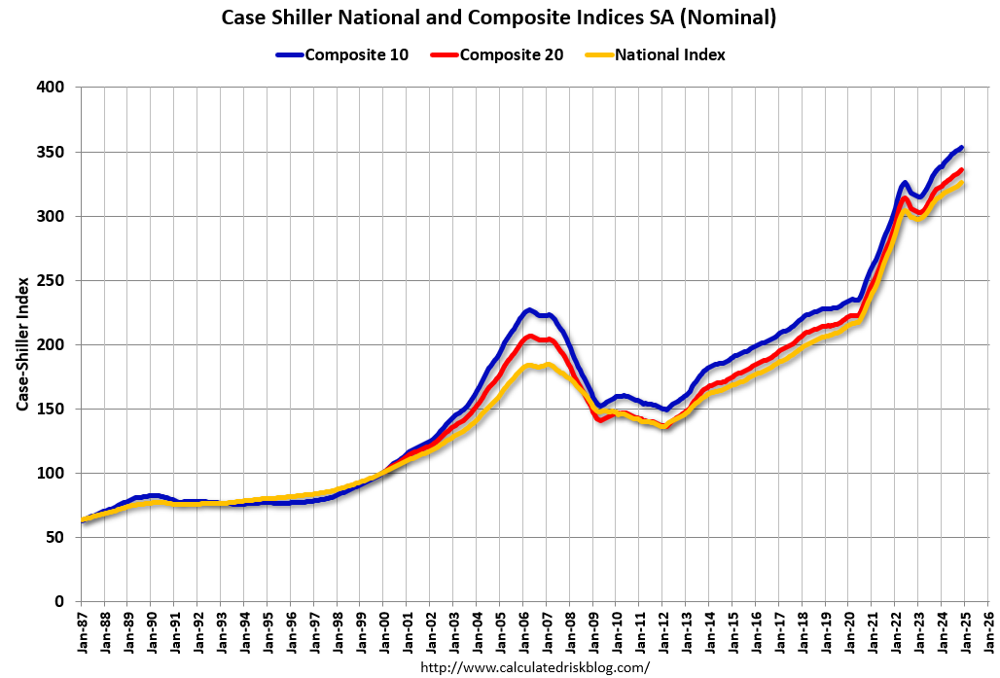

## Table of Contents

## What is the Case-Shiller Housing Index?

The Case-Shiller Housing Index is a tool that measures the changes in the prices of homes in different parts of the United States. It helps people understand how much home prices are going up or down over time. The index looks at the prices of homes when they are sold and compares them to previous sales to see if prices are increasing or decreasing. This information is useful for people who want to buy or sell homes, as well as for those who study the economy.

The index is created by looking at repeat sales of single-family homes. This means they track the same homes over time to see how their prices change. The Case-Shiller Index covers many different cities across the country, so it gives a good picture of what is happening with home prices everywhere. It is considered a reliable source of information because it uses a lot of data and a careful method to calculate the changes in home prices.

## Who created the Case-Shiller Housing Index and why?

The Case-Shiller Housing Index was created by Karl Case and Robert Shiller. Karl Case was an economist who studied housing markets, and Robert Shiller is a famous economist who won a Nobel Prize for his work on how markets work. They started working on the index in the 1980s because they wanted to understand how home prices were changing over time. They thought that having a good way to measure home price changes would help people make better decisions about buying and selling homes.

Case and Shiller created the index because they saw that there wasn't a good way to track home prices across the country. They wanted to help people, including homeowners, investors, and policymakers, understand the housing market better. By creating the Case-Shiller Index, they provided a tool that could show whether home prices were going up or down in different areas. This has been really helpful for people who need to make smart choices about real estate.

## How is the Case-Shiller Housing Index calculated?

The Case-Shiller Housing Index is calculated by looking at the prices of the same homes over time. They use something called a "repeat sales" method. This means they only look at homes that have been sold more than once. By comparing the price of a home when it was sold the first time to the price when it was sold again, they can see how much the price has changed. They do this for a lot of homes in different cities to get a good picture of what is happening with home prices everywhere.

To make the index, they take all the price changes they found and put them together. They use a special math formula to make sure the index shows the average change in home prices. This way, the index can tell us if home prices are going up or down overall. The index is updated every month, so people can see the latest changes in home prices. This helps people who are thinking about buying or selling a home, as well as those who study the economy.

## What are the different versions of the Case-Shiller Index?

There are different versions of the Case-Shiller Index to help people understand home prices in different ways. The main versions are the National Home Price Index, the 10-City Composite Index, and the 20-City Composite Index. The National Home Price Index looks at home prices across the whole country. It gives a big picture of what is happening with home prices everywhere. The 10-City Composite Index looks at home prices in ten big cities. This helps people see how home prices are changing in these important places. The 20-City Composite Index is similar but looks at twenty big cities. This gives an even broader view of home prices in major cities.

Each of these versions helps people in different ways. The National Home Price Index is good for understanding the overall trend in home prices across the United States. If you want to know about home prices in specific big cities, the 10-City or 20-City Composite Index can give you that information. These indexes are useful for people who are thinking about buying or selling a home in those cities. They can also help people who study the economy to see how home prices are changing in different parts of the country.

## Which cities are included in the Case-Shiller Index?

The Case-Shiller Index includes many cities to give a good picture of home prices across the United States. The 10-City Composite Index covers big cities like Boston, Chicago, Denver, Las Vegas, Los Angeles, Miami, New York, San Diego, San Francisco, and Washington, D.C. These cities are important because they help show how home prices are changing in major urban areas.

The 20-City Composite Index includes all the cities from the 10-City Index plus ten more. The additional cities are Atlanta, Charlotte, Cleveland, Dallas, Detroit, Minneapolis, Phoenix, Portland, Seattle, and Tampa. By looking at these twenty cities, the index gives an even broader view of home price trends in different parts of the country.

## How often is the Case-Shiller Index updated?

The Case-Shiller Index is updated every month. This means that every month, new data is added to the index to show the latest changes in home prices. People can look at the most recent numbers to see if home prices are going up or down in different parts of the country.

Having monthly updates is really helpful for people who need to make decisions about buying or selling homes. It gives them the latest information so they can understand what is happening with home prices right now. It's also useful for people who study the economy because they can see how home prices are changing over time.

## What does the Case-Shiller Index tell us about the housing market?

The Case-Shiller Index helps us understand how home prices are changing in different parts of the United States. It looks at the same homes that have been sold more than once to see if their prices are going up or down over time. By doing this for many homes in different cities, the index gives us a good picture of what is happening with home prices everywhere. This can be really helpful for people who are thinking about buying or selling a home because they can see if prices are going up or down in the areas they are interested in.

The index has different versions, like the National Home Price Index, the 10-City Composite Index, and the 20-City Composite Index. The National Index shows us what is happening with home prices across the whole country. The 10-City and 20-City Indexes focus on big cities, so they help us see how home prices are changing in these important places. The index is updated every month, so people can always see the latest changes in home prices. This is useful for anyone who needs to make decisions about real estate or wants to understand the economy better.

## How can the Case-Shiller Index be used to predict housing market trends?

The Case-Shiller Index can help predict housing market trends by showing how home prices have changed in the past. By looking at the index over time, people can see if home prices are going up or down. If the index shows that prices have been going up for a while, it might mean that prices will keep going up in the future. On the other hand, if the index shows that prices have been going down, it might mean that prices will keep going down. This information can help people decide if it's a good time to buy or sell a home.

The index also helps by looking at different cities. For example, if the 10-City or 20-City Composite Index shows that prices are going up in many big cities, it might mean that the whole housing market is getting stronger. But if prices are going down in these cities, it might mean the market is getting weaker. By watching these trends, people can make smarter choices about when and where to buy or sell homes. The monthly updates of the index make it even more useful because people can see the latest changes and predict what might happen next.

## What are the limitations of the Case-Shiller Index?

The Case-Shiller Index has some limitations that people should know about. One big limitation is that it only looks at homes that have been sold more than once. This means it does not include new homes or homes that have only been sold once. Because of this, the index might not show the whole picture of what is happening with home prices. It might miss out on important changes in the housing market, especially in areas where a lot of new homes are being built.

Another limitation is that the index can be slow to show changes in home prices. It takes a while for the data to be collected and for the index to be updated. This means that the index might not show the latest changes in the housing market right away. People who need to make quick decisions about buying or selling homes might find that the index is not as helpful because it does not give them the most up-to-date information.

## How does the Case-Shiller Index compare to other housing market indicators?

The Case-Shiller Index is just one way to look at home prices, but there are other indicators too. One of these is the Housing Price Index (HPI) from the Federal Housing Finance Agency (FHFA). The HPI looks at home prices using data from mortgages that are backed by the government. Unlike the Case-Shiller Index, the HPI includes data from new homes and homes that have only been sold once. This means the HPI can give a more complete picture of the housing market, but it might not be as good at showing price changes for the same homes over time like the Case-Shiller Index does.

Another indicator is the National Association of Realtors (NAR) Home Price Index. This index uses data from home sales reported by real estate [agents](/wiki/agents). It can show home prices in different parts of the country and is updated more quickly than the Case-Shiller Index. However, it might not be as accurate because it depends on the information real estate agents give, which can vary. Each of these indicators has its own strengths and weaknesses, so people often look at all of them together to get a better understanding of what is happening in the housing market.

## What historical trends have been observed in the Case-Shiller Index data?

The Case-Shiller Index has shown some big changes in home prices over the years. One of the most famous times was during the housing boom in the early 2000s. Home prices went up a lot, and the Case-Shiller Index showed this by going up too. But then, around 2006, the index started to go down. This was the start of the housing crash that led to the big financial crisis in 2008. The index kept going down for a few years, showing that home prices were falling all over the country.

After the financial crisis, the Case-Shiller Index started to go up again, but it took a while. By around 2012, the index began to show that home prices were going up again in many places. This recovery has continued, with the index showing steady increases in home prices over the last few years. But the index also shows that home prices can go up and down a lot in different cities. For example, cities like San Francisco and Seattle have seen big increases in home prices, while other places have not seen as much change.

## How can investors use the Case-Shiller Index to make informed decisions?

Investors can use the Case-Shiller Index to understand how home prices are changing in different parts of the country. By looking at the index, they can see if home prices are going up or down over time. If the index shows that prices have been going up for a while, investors might decide it's a good time to buy homes because they think prices will keep going up. On the other hand, if the index shows that prices have been going down, investors might wait to buy or even sell their homes because they think prices will keep going down. This helps investors make smart choices about when to buy or sell homes.

The Case-Shiller Index also helps investors see how home prices are changing in different cities. For example, if the 10-City or 20-City Composite Index shows that prices are going up in big cities like San Francisco or New York, investors might decide to buy homes in those cities. But if prices are going down in certain cities, investors might avoid buying homes there. By watching these trends every month, investors can stay up-to-date on the latest changes in home prices and make better decisions about where and when to invest in real estate.

## References & Further Reading

[1]: Case, Karl E., & Shiller, Robert J. (1989). ["The Efficiency of the Market for Single-Family Homes."](https://www.jstor.org/stable/1804778) The American Economic Review, 79(1), 125-137.

[2]: Shiller, Robert J. (2003). ["The New Financial Order: Risk in the 21st Century."](https://www.jstor.org/stable/j.ctt7rhkh) Princeton University Press.

[3]: Glaeser, Edward, & Gyourko, Joseph. (2008). ["Rethinking Federal Housing Policy: How to Make Housing Plentiful and Affordable."](https://aei.org/wp-content/uploads/2014/03/-rethinking-federal-housing-policy_101542221914.pdf) American Enterprise Institute.

[4]: Shiller, Robert J. (2015). ["Irrational Exuberance"](https://press.princeton.edu/books/paperback/9780691173122/irrational-exuberance) (3rd edition). Princeton University Press.

[5]: Mayer, Christopher, & Sinai, Todd. (2009). ["U.S. House Price Dynamics and Behavioral Finance."](https://www.semanticscholar.org/paper/U-.-S-.-House-Price-Dynamics-and-Behavioral-Finance-Mayer/a07de769293d285524ec7a0b8c1370e4f3795086) National Bureau of Economic Research Working Paper No. 15566.