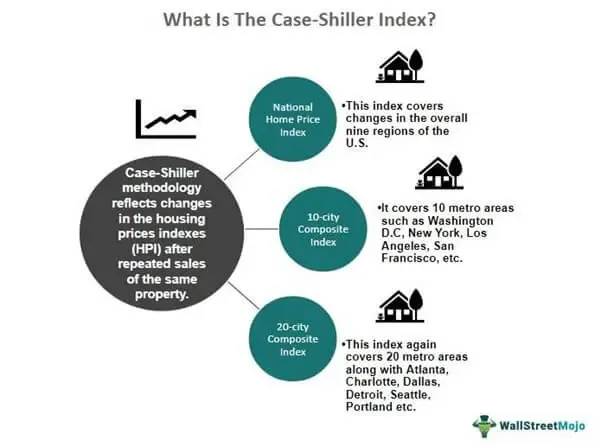

Understanding the intricacies of the housing market is essential for investors and financial analysts. The S&P CoreLogic Case-Shiller U.S. National Home Price NSA Index serves as a critical tool for assessing changes in the residential housing market. This index has proven invaluable not only in traditional market analysis but also in the context of automated trading algorithms—a growing facet of modern financial operations. Algorithmic trading, which is heavily reliant on data-driven decisions, benefits immensely from the robust analytical framework provided by the Case-Shiller Index.

The importance of this index lies in its ability to track variations in home prices across the United States with accuracy and timeliness. By doing so, it allows traders and analysts to detect emerging trends and potential market shifts, which could be used to inform investment strategies. The integration of this index into algorithmic trading systems exemplifies how advanced analytics can empower strategic decisions, manage risk, and optimize trade execution.



Regular monitoring of such indices offers crucial insights into broader economic landscapes. Housing markets can often reflect underlying economic conditions, providing early warnings of economic upturns or downturns. Thus, staying attuned to these indices not only supports informed decision-making in real estate but also contributes to a nuanced understanding of the economy at large.

## Table of Contents

## What is the S&P CoreLogic Case-Shiller Index?

The S&P CoreLogic Case-Shiller Index serves as a crucial gauge of U.S. residential real estate market dynamics, acting as a reliable barometer for trends in housing prices and offering insights into the broader economic conditions. This index primarily focuses on single-family residential homes, capturing the nuances of price fluctuations by analyzing a thorough compendium of purchase and resale values over an extended period. It purposefully omits data related to new constructions, co-ops, and condominiums, honing its scope to offer a more precise reflection of the existing home sales market.

Emerging in the 1980s, the index was developed with the intent to provide a standard measure for residential housing prices, creating a reference point for economists, policymakers, and investors alike. Initially devised by economists Karl Case and Robert Shiller, along with Allan Weiss, this index revolutionized the approach to understanding housing price trends by introducing a repeat sales methodology to eliminate biases stemming from property quality variations—ensuring the index reflects true market dynamics rather than changes in the composition of the physical properties being sold within the dataset.

By concentrating on repeat sales, the index uses pairs of sales transactions representing the same property at different points in time, allowing analysts to extract appreciable insights into market movements. This methodology leads to a more accurate portrayal of market conditions, isolating effects from extraneous variables and providing a clearer narrative of price trends over time. Consequently, the Case-Shiller Index has maintained its relevance and importance over decades, facilitating strategic decision-making processes for various stakeholders engaged in or monitoring the residential real estate sector.

## Index Methodology and Data Composition

The S&P CoreLogic Case-Shiller Index employs a sophisticated methodology to ensure a reliable measure of price changes in single-family detached homes across the United States. At the heart of this methodology is the repeat sales model, which meticulously tracks the price variations of the same property over different points in time. By focusing exclusively on properties that have been sold multiple times, the index effectively eliminates the distortions that can arise from comparing different properties with varying characteristics.

Sales pairs, which are essentially price points of the same property at distinct intervals, form the backbone of the index's analytical framework. This approach ensures that the comparison remains specific to the property's historical transaction data, thereby providing a consistent measure of price appreciation or depreciation. By doing so, the index minimizes the influence of external factors such as changes in property size or quality, allowing it to serve as a precise gauge of genuine market trends.

To further refine its accuracy, the index incorporates a three-month moving average into its calculations. This statistical technique smooths out short-term [volatility](/wiki/volatility-trading-strategies) and provides a more stable representation of price trajectories over time. The moving average is particularly advantageous in filtering out irregularities and transient fluctuations, rendering the index a more reliable tool for long-term analysis.

The choice of this repeat sales methodology, combined with adjustments for market noise through the moving average, underpins the index's robustness. By maintaining consistency in property characteristics and employing temporal smoothing methods, the S&P CoreLogic Case-Shiller Index provides a critical benchmark for evaluating residential real estate market movements. This meticulous approach enhances its credibility and utility as a barometer of housing market health in economic assessments and automated financial systems.

## The Role of the Case-Shiller Index in Automated Trading

Algorithmic traders and automated investing systems utilize the S&P CoreLogic Case-Shiller Index as an essential tool for evaluating real estate market conditions. The index offers a stream of reliable, high-quality data that is indispensable for predictive analytics related to residential real estate prices. This predictive capability is instrumental in enabling algorithmic models to develop informed trading strategies, manage risk efficiently, and optimize the execution of trades.

The role of the Case-Shiller Index extends beyond mere data provision; its timeliness and accuracy are vital for decision-making processes within algorithmic frameworks. As housing prices can significantly impact both microeconomic decisions and broader economic trends, incorporating this data into algorithms enables traders to anticipate market movements and react swiftly to changing conditions.

Algorithmic models often employ mathematical and statistical techniques to interpret the data derived from the Case-Shiller Index. For instance, [machine learning](/wiki/machine-learning) algorithms can be used to identify patterns and trends within the data, allowing for more accurate forecasts of future price movements. Below is a simple Python example demonstrating how the index data might be integrated into a predictive model using a linear regression approach:

```python
import pandas as pd
from sklearn.linear_model import LinearRegression
from sklearn.model_selection import train_test_split

# Load Case-Shiller Index data
data = pd.read_csv('case_shiller_index.csv')
X = data[['time_lag_feature1', 'economic_indicator']]
y = data['home_price']

# Split dataset into training and testing sets
X_train, X_test, y_train, y_test = train_test_split(X, y, test_size=0.2, random_state=42)

# Create and train the linear regression model
model = LinearRegression()
model.fit(X_train, y_train)

# Evaluate model performance
predictions = model.predict(X_test)
```

Moreover, the integration of the Case-Shiller Index into automated trading platforms highlights its significance as a core component of broader investment strategies. By maintaining an updated and comprehensive database of housing price changes, the index enables systems to make proactive adjustments in real-time, supporting the dynamic nature of financial markets.

In summary, the Case-Shiller Index significantly enhances the capabilities of automated trading systems by providing a structured and reliable form of real estate data. Its integration facilitates improved predictive accuracy, strategic resource allocation, and effective risk management, making it an indispensable tool for traders in the housing market.

## The Impact on the Housing Market and the Economy

The S&P CoreLogic Case-Shiller U.S. National Home Price NSA Index serves as a critical benchmark of housing prices, significantly influencing both the housing market and the broader economy. When the index rises, it often correlates with heightened investments in the housing sector. This uptick in activity can lead to an increase in residential property values, thereby contributing positively to the Gross Domestic Product (GDP). The housing market can be a substantial component of the GDP, as it affects various ancillary sectors, including construction, home improvement, and real estate services.

Conversely, downturns in the index might be indicative of market corrections. Such declines can have far-reaching effects, starting with diminishing consumer confidence. This loss of confidence can result in reduced spending, affecting the broader economy. Market corrections signaled by the index can influence economic policy decisions as well. Policymakers often look to this index to evaluate the effectiveness of existing monetary policies and to assess potential adjustments. For instance, a significant drop in the index may prompt interventions such as [interest rate](/wiki/interest-rate-trading-strategies) cuts to stimulate borrowing and reinvigorate market activity.

Furthermore, economists and policymakers closely monitor the Case-Shiller Index to gauge economic impact and housing affordability. By tracking the variations in housing prices, they can identify trends related to affordability, which is a critical aspect of social and economic policy. High home prices may lead to decreased homeownership rates among middle- and lower-income populations, affecting wealth distribution and economic stability over the long term.

Overall, the S&P CoreLogic Case-Shiller Index is not just a reflection of current market conditions but also a predictive tool for future economic trends. It provides valuable insights that help shape consumer behavior, investment strategies, and economic policies aimed at maintaining a balanced and equitable housing market.

## Alternative Indices Measuring Home Prices

While the S&P CoreLogic Case-Shiller Index is widely recognized as a premier indicator of U.S. housing market trends, several other indices exist that provide alternative perspectives, enriching the analysis of residential real estate dynamics. Each of these indices employs distinct methodologies, catering to different segments and geographic focuses within the housing market.

The Federal Housing Finance Agency’s (FHFA) House Price Index (HPI) is a prominent alternative. This index emphasizes purchases and refinance appraisals of single-family properties with mortgages securitized or guaranteed by Fannie Mae and Freddie Mac. The HPI is calculated using a weighted repeat-sales methodology, similar to the Case-Shiller Index, but its mortgage-based data offers a unique view that excludes cash transactions and jumbo loans. This distinct focus suggests that the HPI may better reflect trends influencing homeowners within the conventional conforming loan market.

Local indices, such as those published by regional real estate boards or economic research organizations, offer additional granularity by concentrating on specific urban or metropolitan areas. These indices often employ methodologies tailored to local housing patterns, employ region-specific data sources, or measure housing segments that national indices might overlook. For instance, indices focusing on rental prices or commercial real estate segments supplement traditional housing indices.

The integration of multiple indices facilitates a more comprehensive analysis of housing conditions. Traders and investors often aggregate data from these indices to capture diverse market insights and mitigate the weaknesses present in individual measurements. For example, an inversely weighted sum model could be employed to reduce noise and improve signal clarity, defined as:

$$
I_{\text{combined}} = \frac{1}{n} \sum_{i=1}^{n} \frac{I_i}{\sigma_i}
$$

where $I_{\text{combined}}$ is the combined index measure, $n$ represents the number of indices used, $I_i$ are the individual index measurements, and $\sigma_i$ denotes their respective standard deviations.

Value is derived from this multifaceted approach as it underpins strategic decisions in real estate investment, risk assessment, and policy formulation. By leveraging diverse indices, stakeholders can develop nuanced perspectives on the housing market, accommodating its inherent complexity and region-specific behaviors.

## Conclusion

The S&P CoreLogic Case-Shiller Index stands as an essential instrument in understanding the dynamics of the U.S. housing market. Its extensive application has transcended beyond conventional real estate analysis, playing a pivotal role in automated trading systems. By providing accurate and timely data, the index empowers algorithmic traders to develop sophisticated models that can accurately predict market trends and optimize trading strategies.

An in-depth comprehension of the index's methodology and applications is critical for enhancing investment strategies and economic forecasts. For investors and analysts, integrating the insights gained from the Case-Shiller Index into their decision-making frameworks can lead to more informed and strategic outcomes. The index's ability to reflect key market movements facilitates a proactive approach in anticipating and responding to market shifts, thereby offering a competitive edge in investment decisions.

As the real estate market continues to evolve, the reliance on indices such as the S&P CoreLogic Case-Shiller Index remains indispensable for market participants. Its comprehensive data collection and analysis not only provide a snapshot of current market conditions but also contribute to a deeper understanding of long-term economic trends. Thus, for investors, economists, and policymakers alike, continuous engagement with such indices is vital for crafting effective strategies and policies that are responsive to the ever-changing landscape of the housing market.

## References

### References

1. **S&P Dow Jones Indices**: The methodology and applications of the S&P CoreLogic Case-Shiller Index can be explored through the official publications and resources provided by S&P Dow Jones Indices. These documents offer detailed insights into how the index is constructed, its historical reliability, and its utility for analysts and investors in tracking and predicting housing market trends.

2. **Federal Reserve Bank of St. Louis**: The Federal Reserve Economic Data (FRED) database, maintained by the Federal Reserve Bank of St. Louis, provides extensive historical data and trends concerning the Case-Shiller Index. This resource is invaluable for examining historical patterns and understanding the impacts of economic cycles on residential real estate prices.

3. **Federal Housing Finance Agency**: The FHFA offers insights into alternative indices that measure home prices, such as the FHFA House Price Index. This information is crucial for comparative analysis, allowing investors and policymakers to consider different data sets and methodologies to gain a more comprehensive understanding of housing market dynamics.

## References & Further Reading

[1]: Case, K. E., Quigley, J. M., & Shiller, R. J. (2012). ["Robert Shiller, Google Scholar Profile."](http://www.econ.yale.edu/~shiller/pubs/p1181.pdf)

[2]: S&P Dow Jones Indices. ["S&P CoreLogic Case-Shiller Home Price Indices."](https://www.spglobal.com/spdji/en/documents/indexnews/announcements/20240827-1474001/1474001_cshomeprice-release-0827.pdf)

[3]: Federal Reserve Bank of St. Louis. ["Federal Reserve Economic Data (FRED) - S&P/Case-Shiller U.S. National Home Price Index."](https://fred.stlouisfed.org/)

[4]: Federal Housing Finance Agency. ["FHFA House Price Index."](https://www.fhfa.gov/data/hpi)