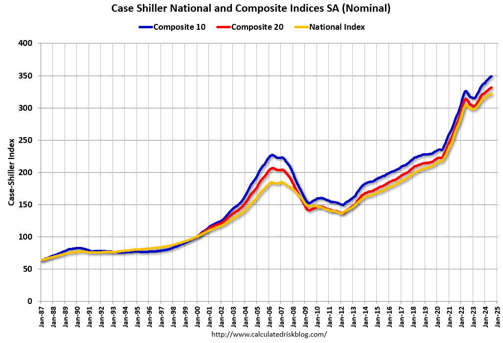

## Table of Contents

## What is the Case-Shiller U.S. National Home Price Index?

The Case-Shiller U.S. National Home Price Index is a way to measure how home prices are changing across the whole country. It looks at the prices of homes in different cities and then combines this information to give an overall picture of what's happening with home prices in the U.S. This index is important because it helps people understand if home prices are going up, going down, or staying the same over time.

The index was created by economists Karl Case and Robert Shiller. They wanted a reliable way to track home prices that would be useful for homeowners, investors, and policymakers. The Case-Shiller Index is updated every month, so it gives a current view of the housing market. It's considered a good tool because it uses a lot of data from many places, making it a comprehensive measure of the national housing market.

## Who developed the Case-Shiller Index and why is it important?

The Case-Shiller Index was developed by economists Karl Case and Robert Shiller. They wanted a way to track home prices across the United States that would be accurate and useful. By creating this index, they made it easier for people to understand how home prices were changing over time.

The index is important because it helps a lot of people make decisions. Homeowners can use it to see if it's a good time to sell their house. Investors can use it to decide if they should buy or sell real estate. And policymakers can use it to understand the health of the housing market and make laws that help people. The Case-Shiller Index is updated every month, so it gives a current picture of what's happening with home prices all over the country.

## How is the Case-Shiller Index calculated?

The Case-Shiller Index is calculated by looking at the prices of homes that have been sold at least twice. This method is called a "repeat sales" approach. It helps to focus on how the price of the same house changes over time, rather than comparing different houses. The index starts with a base period, usually set at 100, and then tracks how prices change from that point. For example, if the index goes up to 110, it means home prices have gone up by 10% since the base period.

To make the index, data is collected from many cities across the U.S. This data is then combined to create a national picture of home prices. The index uses a weighted average, which means that cities with more home sales have a bigger impact on the final number. This way, the index can show a true reflection of the national housing market. It's updated every month, so it stays current with what's happening in the market.

## What types of homes are included in the Case-Shiller Index?

The Case-Shiller Index includes single-family homes that have been sold at least twice. This means it looks at the same homes over time to see how their prices change. The index does not include new homes that have never been sold before or homes that are sold only once. It also does not include condos, townhouses, or other types of multi-family housing.

The homes included in the index come from many different cities across the United States. This helps the index show a good picture of the whole country's housing market. The index uses data from places like New York, Los Angeles, and Chicago, as well as smaller cities. By looking at these homes, the Case-Shiller Index can tell us if home prices are going up or down across the nation.

## How often is the Case-Shiller Index updated and where can one find the latest data?

The Case-Shiller Index is updated every month. This means that new information about home prices is added each month to show the latest changes in the housing market. It's important for the index to be updated often so that people can see what's happening with home prices right now.

You can find the latest data for the Case-Shiller Index on the website of Standard & Poor's, which is the company that now manages the index. They have a special section on their website where they publish the new numbers every month. You can also find this information in financial news reports and on other websites that talk about the housing market.

## What are the key differences between the Case-Shiller National Index and regional indices?

The Case-Shiller National Index and the regional indices both measure how home prices are changing, but they look at different areas. The National Index combines data from many cities all over the United States to give a big picture of the whole country's housing market. This helps people understand if home prices are going up or down across the nation. On the other hand, regional indices focus on specific cities or areas. For example, there might be a Case-Shiller Index just for New York or Los Angeles. These regional indices show how home prices are changing in those particular places, which can be different from the national trend.

The way these indices are calculated is similar, but the National Index uses a weighted average to make sure that cities with more home sales have a bigger impact on the final number. This helps the National Index be a true reflection of the whole country. Regional indices, however, only use data from their specific area, so they give a more detailed view of what's happening in that city or region. Both types of indices are important because they help different people make decisions. Homeowners in a specific city might care more about the regional index, while investors looking at the whole country might focus on the National Index.

## How does the Case-Shiller Index compare to other home price indices like the FHFA?

The Case-Shiller Index and the FHFA (Federal Housing Finance Agency) Home Price Index both measure how home prices change over time, but they do it in different ways. The Case-Shiller Index uses a "repeat sales" method, which means it looks at the same homes that have been sold at least twice. This helps to see how the price of a specific home changes over time. The FHFA Index also uses a repeat sales approach, but it focuses on homes with mortgages backed by Fannie Mae and Freddie Mac. This means the FHFA Index might miss homes bought with cash or other types of financing.

Another key difference is the coverage of these indices. The Case-Shiller Index covers a wide range of cities across the U.S., and it combines this data to give a national picture. It's updated every month, so it's very current. On the other hand, the FHFA Index covers all 50 states and uses data from a larger number of homes, but it's updated quarterly, which means it's not as up-to-date as the Case-Shiller Index. Both indices are important, but they might give slightly different views of the housing market because of their different methods and coverage.

## What economic factors influence the Case-Shiller Index?

The Case-Shiller Index is affected by many economic factors. One big [factor](/wiki/factor-investing) is interest rates. When interest rates go down, it becomes cheaper for people to borrow money to buy a home. This can make more people want to buy homes, which can push home prices up. On the other hand, when interest rates go up, borrowing money becomes more expensive, and fewer people might want to buy homes, which can make home prices go down. Another important factor is the economy's overall health. When the economy is doing well, people feel more confident about spending money, including on homes. But if the economy is struggling, people might be more cautious and less likely to buy a home, which can affect home prices.

Another factor that influences the Case-Shiller Index is the supply and demand for homes. If there are a lot of people wanting to buy homes but not many homes for sale, prices can go up. This can happen in popular cities where lots of people want to live. On the flip side, if there are a lot of homes for sale but not many people wanting to buy them, prices can go down. Government policies can also play a role. For example, tax incentives for homebuyers can make more people want to buy homes, which can push prices up. All these factors together help shape the numbers we see in the Case-Shiller Index.

## Can the Case-Shiller Index be used to predict future housing market trends?

The Case-Shiller Index can give us some clues about what might happen in the housing market, but it's not perfect for predicting the future. It looks at past home prices and shows us how they've changed over time. By seeing these patterns, we might guess if prices will keep going up or if they might start to go down. But, the housing market can be affected by many things like interest rates, the economy, and government policies, which can change quickly and unexpectedly.

For example, if the Case-Shiller Index has been going up for a long time, it might suggest that home prices will keep rising. But if something big happens, like a sudden change in interest rates or a new law, it could change the direction of the market. So, while the Case-Shiller Index is a helpful tool for understanding the past and present of the housing market, it's not a crystal ball that can tell us exactly what will happen in the future.

## How has the methodology of the Case-Shiller Index evolved over time?

The Case-Shiller Index started out with a pretty simple way of figuring out home prices. It used what's called a "repeat sales" method, where they looked at homes that had been sold at least twice. This helped them see how the price of the same house changed over time. When it first came out, the index only covered a few big cities. But over time, they added more cities to get a better picture of the whole country's housing market. They also started using a weighted average, which means cities with more home sales had a bigger impact on the final number. This made the index more accurate.

As time went on, the people who make the Case-Shiller Index, now part of Standard & Poor's, kept making it better. They started updating the index every month instead of every few months, so it could show what was happening in the housing market right now. They also added new ways to look at the data, like breaking it down into different price tiers. This means they could show how home prices were changing for cheaper homes versus more expensive ones. These changes have helped the Case-Shiller Index stay a useful tool for understanding the housing market.

## What are some criticisms or limitations of the Case-Shiller Index?

The Case-Shiller Index has some limitations that people talk about. One big criticism is that it only looks at homes that have been sold at least twice. This means it might not include new homes or homes that are sold only once. Because of this, the index might not give a full picture of the housing market. Another issue is that the index focuses on single-family homes and doesn't include condos or townhouses. So, if those types of homes are doing something different in the market, the Case-Shiller Index won't show it.

Another limitation is that the index can take a while to update. Even though it's updated every month, there's a delay because it takes time to collect and process all the data. This means the index might not always show what's happening in the housing market right now. Also, the index uses a weighted average, which means cities with more home sales have a bigger impact on the final number. This can make the index less useful for people who are only interested in what's happening in smaller cities or less popular areas.

## How do investors and policymakers use the Case-Shiller Index in decision-making?

Investors use the Case-Shiller Index to make smart choices about buying and selling homes. If the index shows that home prices are going up, investors might decide it's a good time to buy homes to sell later for a higher price. But if the index shows prices are going down, they might wait to buy or even sell their homes before prices drop more. The index helps them see trends in the housing market, so they can plan their investments better. It's like a map that shows them where the market is heading.

Policymakers also use the Case-Shiller Index to make decisions that affect the whole country. If the index shows that home prices are rising too fast, they might create new rules or programs to help more people buy homes. On the other hand, if prices are falling a lot, they might try to help the housing market by changing interest rates or offering help to homeowners. The index gives them a clear picture of what's happening with home prices, so they can make laws and policies that keep the housing market healthy and help people.

## What are Alternative Indices Measuring Home Prices?

While the S&P CoreLogic Case-Shiller Index is widely recognized as a premier indicator of U.S. housing market trends, several other indices exist that provide alternative perspectives, enriching the analysis of residential real estate dynamics. Each of these indices employs distinct methodologies, catering to different segments and geographic focuses within the housing market.

The Federal Housing Finance Agency’s (FHFA) House Price Index (HPI) is a prominent alternative. This index emphasizes purchases and refinance appraisals of single-family properties with mortgages securitized or guaranteed by Fannie Mae and Freddie Mac. The HPI is calculated using a weighted repeat-sales methodology, similar to the Case-Shiller Index, but its mortgage-based data offers a unique view that excludes cash transactions and jumbo loans. This distinct focus suggests that the HPI may better reflect trends influencing homeowners within the conventional conforming loan market.

Local indices, such as those published by regional real estate boards or economic research organizations, offer additional granularity by concentrating on specific urban or metropolitan areas. These indices often employ methodologies tailored to local housing patterns, employ region-specific data sources, or measure housing segments that national indices might overlook. For instance, indices focusing on rental prices or commercial real estate segments supplement traditional housing indices.

The integration of multiple indices facilitates a more comprehensive analysis of housing conditions. Traders and investors often aggregate data from these indices to capture diverse market insights and mitigate the weaknesses present in individual measurements. For example, an inversely weighted sum model could be employed to reduce noise and improve signal clarity, defined as:

$$
I_{\text{combined}} = \frac{1}{n} \sum_{i=1}^{n} \frac{I_i}{\sigma_i}
$$

where $I_{\text{combined}}$ is the combined index measure, $n$ represents the number of indices used, $I_i$ are the individual index measurements, and $\sigma_i$ denotes their respective standard deviations.

Value is derived from this multifaceted approach as it underpins strategic decisions in real estate investment, risk assessment, and policy formulation. By leveraging diverse indices, stakeholders can develop nuanced perspectives on the housing market, accommodating its inherent complexity and region-specific behaviors.

## References & Further Reading

[1]: Case, K. E., Quigley, J. M., & Shiller, R. J. (2012). ["Robert Shiller, Google Scholar Profile."](http://www.econ.yale.edu/~shiller/pubs/p1181.pdf)

[2]: S&P Dow Jones Indices. ["S&P CoreLogic Case-Shiller Home Price Indices."](https://www.spglobal.com/spdji/en/documents/indexnews/announcements/20240827-1474001/1474001_cshomeprice-release-0827.pdf)

[3]: Federal Reserve Bank of St. Louis. ["Federal Reserve Economic Data (FRED) - S&P/Case-Shiller U.S. National Home Price Index."](https://fred.stlouisfed.org/)

[4]: Federal Housing Finance Agency. ["FHFA House Price Index."](https://www.fhfa.gov/data/hpi)