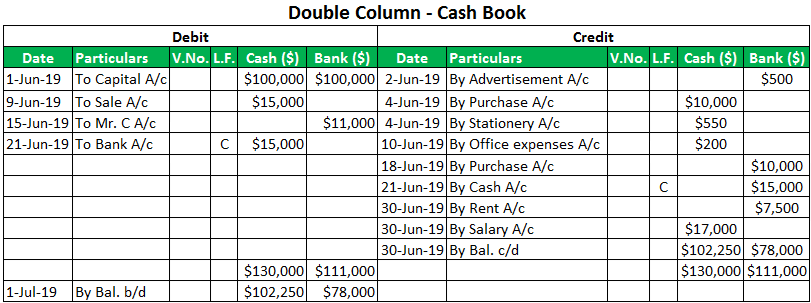

Understanding financial terms is essential for effective personal and professional financial management. The ability to comprehend concepts ranging from cash accounts to algorithmic trading is foundational for making informed financial decisions. Financial terminology often seems complex and daunting, yet gaining clarity in these areas can significantly enhance financial literacy and decision-making capabilities.

This article aims to demystify these terms by providing clear and concise explanations, focusing on the fundamental concepts of cash accounts, bank accounts, and algorithmic trading. Cash accounts are a critical component of brokerage, allowing for trading without borrowing funds, thereby mitigating risks associated with leverage. On the other hand, bank accounts serve as the bedrock of personal finance management, offering diverse options like savings and checking accounts tailored to different financial goals and transaction needs.



Algorithmic trading represents the technological advancement in financial markets, using computer algorithms to execute trades at optimal speeds. This method leverages data analysis and predefined criteria to ensure efficiency and reduced transaction costs, highlighting a shift towards automated financial processes in modern markets.

Our goal is to equip you with the knowledge needed to navigate the financial world with confidence. By understanding these core concepts, you will be better prepared to make strategic financial decisions, enhancing both personal wealth management and investment opportunities.

## Table of Contents

## What is a Cash Account?

A cash account is a type of brokerage account where all transactions must be fully paid with available cash funds. Unlike margin accounts, which allow investors to borrow funds from their broker to purchase securities, cash accounts require that the investor has enough cash in the account to cover the purchase of securities. This characteristic notably restricts the potential for trading on leverage, thereby reducing the risk associated with trading activities.

Regulation T, a rule established by the Federal Reserve Board, governs cash accounts by outlining the settlement period for security transactions. Typically, this regulation mandates a two-business-day settlement period after the trade date, known as T+2. During this period, the investor must ensure that the necessary funds are available to complete the transaction.

Several key violations related to cash accounts that investors should be aware of include cash liquidation violations, good faith violations, and free-riding violations. A cash liquidation violation occurs when an investor sells a security without fully paying for it from settled funds. On the other hand, a good faith violation happens when an investor buys and sells a security without waiting for the initial purchase to fully settle, relying on anticipated incoming cash to make the purchase. Free-riding violations arise when an investor sells a security before paying for its purchase, using the proceeds from the sale to settle the purchase.

Cash accounts are ideally suited for investors who prefer a straightforward investment approach, avoiding the complexities and risks associated with trading on margin. By restricting transactions to only available cash, these accounts offer a risk-averse method of investing in the financial markets, appealing to those who prioritize security and simplicity in their trading activities.

## Understanding Bank Accounts

Bank accounts play a crucial role in the management of personal finances, savings, and everyday transactions. They provide individuals with a secure, convenient way to store money, transact, and manage savings effectively. There are several types of bank accounts, each designed to serve a distinct purpose and offer specific features and benefits to account holders.

**Types of Bank Accounts:**

1. **Savings Accounts**: These accounts are designed primarily for saving money and earning interest over time. Interest rates for savings accounts can vary based on the bank or financial institution, and they often come with limitations on the number of withdrawals allowed per month.

2. **Checking Accounts**: Checking accounts are suitable for daily transactions, such as deposits, withdrawals, and payments. They offer account holders unlimited access to funds via checks, debit cards, and online banking. Checking accounts typically do not offer high interest rates but provide the flexibility needed for frequent transactions.

3. **Money Market Accounts (MMAs)**: Money market accounts combine features of both savings and checking accounts. They usually offer higher interest rates than regular savings accounts, while also allowing limited check-writing capabilities. MMAs often require a higher minimum balance to earn interest.

Choosing the right type of bank account depends on an individual’s financial goals and transactional requirements. For example, those looking to save money over time and earn interest may benefit from a savings account, whereas individuals who need frequent access to their funds may prefer a checking account. Money market accounts can be an option for those who seek a combination of both saving and transactional features, albeit with higher balance requirements.

The security and convenience offered by bank accounts make them a fundamental tool in personal finance management. Banks are typically insured by government agencies, such as the Federal Deposit Insurance Corporation (FDIC) in the United States, which provides protection for depositors' funds. Additionally, features like online banking, mobile apps, and automated services enhance the accessibility and ease of managing finance.

In conclusion, understanding the various types of bank accounts and their functionalities is key to optimizing personal finance management. By assessing financial objectives and transactional habits, one can select the most suitable bank account to effectively manage, save, and transact funds.

 to Algorithmic Trading

Algorithmic trading employs computer-based algorithms to execute trading orders at speeds and frequencies beyond human capacity. By leveraging technology, [algorithmic trading](/wiki/algorithmic-trading) analyzes market data in real-time, executing trades based on predefined criteria and mathematical models. This approach significantly enhances efficiency by minimizing transaction costs and eliminating the emotional biases that often hinder human traders.

At the core of algorithmic trading is the reliance on historical and real-time data to make informed trading decisions. Algorithms scan vast datasets, identifying market trends and opportunities through complex statistical techniques. These systems can process multiple variables, such as price, timing, and [volume](/wiki/volume-trading-strategy), optimizing the execution of trades in a fraction of a second. For instance, a basic Python implementation of an algorithmic trading strategy leveraging libraries like NumPy for numerical operations and pandas for data manipulation could look like this:

```python
import numpy as np
import pandas as pd

# Simulated market data
data = pd.DataFrame({
    'Price': np.random.randn(1000).cumsum() + 100
})

# Simple moving average strategy
short_window = 40
long_window = 100

data['Short_MA'] = data['Price'].rolling(window=short_window, min_periods=1).mean()
data['Long_MA'] = data['Price'].rolling(window=long_window, min_periods=1).mean()

# Signal generation
data['Signal'] = 0
data['Signal'][short_window:] = np.where(data['Short_MA'][short_window:] > data['Long_MA'][short_window:], 1, -1)

# Positions
data['Position'] = data['Signal'].diff()

print(data)
```

This example demonstrates the programmatic calculation of short and long moving averages to generate trading signals, a basic yet widely used strategy in algorithmic trading.

Algorithmic trading's efficiency and objectivity have propelled its popularity, particularly among large institutional investors, including hedge funds and high-frequency trading firms. These entities require the capacity to execute large volumes of trades, often exploiting minute price differences across markets ([arbitrage](/wiki/arbitrage)). The advantage of speed conferred by automated systems is a substantial [factor](/wiki/factor-investing) in managing vast portfolios and [liquidity](/wiki/liquidity-risk-premium).

In recent years, algorithmic trading has also gained traction among retail investors. The accessibility of advanced trading platforms, coupled with educational resources on coding and market analysis, has enabled individual traders to implement automated strategies. However, successful algorithmic trading requires extensive knowledge of both programming and the financial markets. Traders must be able to understand and manipulate data, build robust algorithms, and mitigate potential risks such as overfitting and technical failures.

As technology continues to advance, innovations in [artificial intelligence](/wiki/ai-artificial-intelligence) and [machine learning](/wiki/machine-learning) are further expanding the capabilities of algorithmic trading. These developments aim to refine predictive analytics, increase accuracy, and enhance trading strategies, heralding a new era of market interaction in the financial industry.

## Comparing Cash Accounts and Margin Accounts

Cash accounts and margin accounts represent two fundamental types of brokerage accounts, each catering to different investment strategies and risk appetites. Understanding the differences between these account types is crucial for making informed financial decisions.

Cash accounts operate on a straightforward principle: all trades must be settled with the cash available in the account. This means that an investor can only purchase securities up to the amount of cash they have deposited in their account. Since trades are limited by the available funds, cash accounts inherently prevent the complexities and risks associated with trading on leverage. This simplicity makes them ideal for risk-averse investors who prefer to avoid the potential pitfalls of borrowed capital.

In contrast, margin accounts allow investors to borrow funds from their brokerage to purchase additional securities beyond their cash balance. This borrowing is facilitated by using the securities in the account as collateral. The ability to trade on leverage amplifies both potential gains and losses. For instance, if an investor has $10,000 in their margin account and the brokerage offers a 2:1 leverage, they can purchase up to $20,000 worth of securities. The formula to calculate the buying power in a margin account is:

$$
\text{Buying Power} = \text{Cash Balance} + \text{(Available Margin \times Leverage)}
$$

While margin accounts offer increased flexibility, they require diligent management to avoid margin calls—a demand from the brokerage to deposit more funds or sell securities to cover losses. Margin calls occur when the value of the account falls below the broker's required maintenance margin, which is the minimum account balance needed to maintain the position. Failure to meet a margin call can result in the forced sale of securities at potentially unfavorable prices, leading to significant financial consequences.

Investors must carefully assess their risk tolerance and financial strategies when choosing between cash and margin accounts. Those with a higher risk appetite and a thorough understanding of market dynamics may find margin accounts appealing due to the potential for multiplied returns. However, the added risk necessitates a higher level of market acumen and constant monitoring.

Conversely, cash accounts offer straightforwardness and safety, catering to those who prefer steady growth without the added complexity of leverage. Ultimately, the choice between a cash account and a margin account should align with an investor's overall financial objectives, risk tolerance, and level of market expertise.

## The Role of Algo Trading in Modern Finance

Algorithmic trading significantly contributes to enhancing market liquidity and efficiency. By automating trade execution, it enables high-frequency trading and arbitrage opportunities, crucial elements in maintaining an orderly and fluid market. The process involves the use of computer algorithms that analyze market data and execute trades based on predefined strategies, often at speeds and frequencies that a human trader cannot match. This capability allows for the rapid capitalization on price discrepancies, contributing to the overall stability and liquidity of financial markets.

Algorithmic trading is essential in today's dynamic and fast-paced financial environment. The ability to process vast amounts of data quickly and make informed trading decisions is invaluable, particularly when market [volatility](/wiki/volatility-trading-strategies) is high. For large financial institutions, this means they can manage their portfolios more efficiently, reduce transaction costs, and exploit small market movements to their advantage.

The integration of artificial intelligence (AI) and machine learning into algorithmic trading is continuously enhancing its capabilities. By utilizing machine learning, algorithms can improve their decision-making processes over time, learning from historical data to predict future market trends and optimize trading strategies. AI-driven models can also adapt to changing market conditions, providing a competitive edge in an ever-evolving financial landscape.

Innovations in technology are expanding the scope and efficiency of algorithmic trading. Algorithms now not only execute trades but also conduct complex market analyses and risk assessments, enabling more sophisticated trading strategies. As the technology advances, its application is becoming increasingly prevalent among retail traders, offering tools that were once exclusive to institutional investors.

Algorithmic trading systems follow a systematic approach, often using quantitative models to define trading rules. For example, a moving average crossover strategy might be implemented using Python as follows:

```python
def moving_average(prices, window):
    return [sum(prices[i:i+window])/window for i in range(len(prices)-window+1)]

def trading_strategy(data, short_window, long_window):
    short_ma = moving_average(data, short_window)
    long_ma = moving_average(data, long_window)
    signals = []

    for i in range(len(short_ma)):
        if short_ma[i] > long_ma[i]:
            signals.append("Buy")
        elif short_ma[i] < long_ma[i]:
            signals.append("Sell")
        else:
            signals.append("Hold")

    return signals

# Example usage
prices = [110, 112, 105, 115, 120, 125, 130, 128, 126]
short_window = 3
long_window = 5

signals = trading_strategy(prices, short_window, long_window)
print(signals)
```

In this example, a simple moving average crossover signals when to buy or sell based on short-term and long-term trends. This illustrates the power of algorithmic trading to automate and optimize trading decisions, freeing traders from manual analysis and execution. As these technologies continue to evolve, they will play an even more critical role in the future of finance, driving innovation and efficiency across global markets.

## Conclusion

Mastering financial terms like cash accounts, bank accounts, and algorithmic trading is essential for making informed decisions in both personal and professional financial contexts. These concepts are foundational to effective personal finance management and strategic investment planning. Understanding how cash accounts function, for instance, enables individuals to engage in trading activities without the complexities and risks associated with leverage, making it a preferred choice for risk-averse investors. 

Similarly, comprehending the various types of bank accounts, such as savings and checking accounts, helps in optimizing personal finance management by aligning one's financial goals with the appropriate account type. The ability to select the right account type can lead to better management of savings and daily transactions, contributing to financial stability and growth over time.

Algorithmic trading represents a significant advancement in financial markets, offering efficiencies and opportunities that were previously inaccessible to individual traders. With technology playing an increasingly pivotal role in trading strategies, understanding algorithmic trading can lead to improved investment outcomes by taking advantage of speed and precision.

Continual learning in these areas is crucial. Financial markets and instruments are constantly evolving, and staying informed about new developments can significantly enhance one's financial acumen. By keeping abreast of changes, individuals are better equipped to adapt their strategies to meet their financial objectives.

In conclusion, empowering oneself with knowledge in these financial domains provides a solid foundation for managing and growing financial assets effectively. By doing so, individuals can take control of their financial future, seizing opportunities and navigating challenges with confidence.

## References & Further Reading

[1]: ["Regulation T of the Federal Reserve Board"](https://www.ecfr.gov/current/title-12/chapter-II/subchapter-A/part-220)

[2]: ["Advances in Financial Machine Learning"](https://www.amazon.com/Advances-Financial-Machine-Learning-Marcos/dp/1119482089) by Marcos Lopez de Prado

[3]: ["The Basics of Algorithmic Trading: Concepts and Examples"](https://www.investopedia.com/articles/active-trading/101014/basics-algorithmic-trading-concepts-and-examples.asp) on Investopedia

[4]: ["Algorithmic and High-Frequency Trading"](https://www.amazon.com/Algorithmic-High-Frequency-Trading-Mathematics-Finance/dp/1107091144) by Álvaro Cartea, Sebastian Jaimungal, and José Penalva

[5]: ["Quantitative Trading: How to Build Your Own Algorithmic Trading Business"](https://www.amazon.com/Quantitative-Trading-Build-Algorithmic-Business/dp/1119800064) by Ernest P. Chan

[6]: ["Machine Learning for Algorithmic Trading"](https://github.com/stefan-jansen/machine-learning-for-trading) by Stefan Jansen

[7]: ["The Role of Algorithmic Trading in Market Liquidity"](https://fastercapital.com/content/Market-Liquidity--Understanding-Market-Liquidity-in-the-Context-of-Algorithmic-Trading.html) by the Association for Computing Machinery