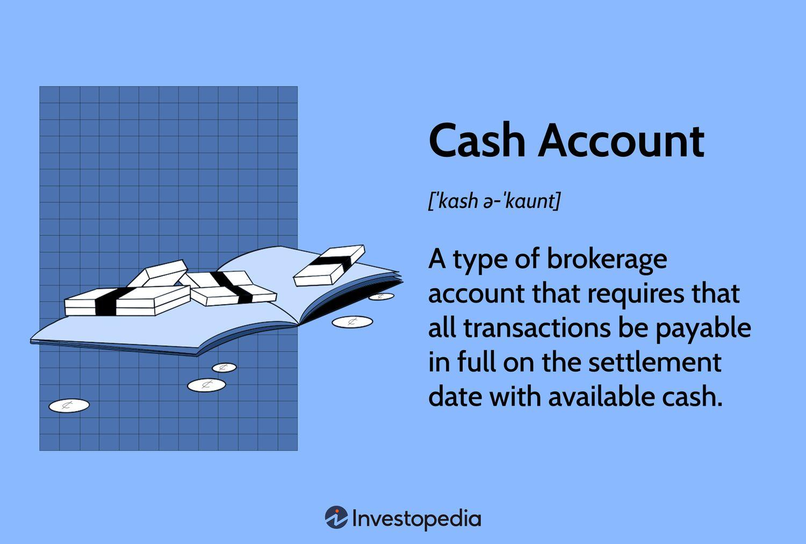

## Table of Contents

## What is a cash account?

A cash account is a type of brokerage account where you can buy and sell stocks, bonds, and other investments using the money you have deposited into the account. Unlike a margin account, you can't borrow money from the brokerage to make trades. This means you can only spend the cash you have available in your account.

Using a cash account is a good way to manage your investments safely. Since you can't spend more than what you have, it helps you avoid getting into debt. It's a simple and straightforward way to invest, especially if you're new to trading or prefer to keep things simple.

## How does a cash account differ from other types of accounts?

A cash account is different from other types of accounts, like a margin account or a retirement account. In a cash account, you can only use the money you put into the account to buy investments. You can't borrow money from the brokerage to buy more stocks or other investments. This makes it a safer choice because you won't owe money if your investments lose value.

A margin account, on the other hand, lets you borrow money from the brokerage to buy more investments. This can help you make bigger trades, but it's riskier because you have to pay back the borrowed money, even if your investments lose value. A retirement account, like an IRA or 401(k), is used to save for the future and has special tax benefits, but it often has rules about when you can take your money out.

In summary, a cash account is simpler and safer because it only lets you spend what you have. A margin account gives you more options but comes with more risk, and a retirement account is focused on long-term savings with tax advantages but with withdrawal restrictions.

## What are the benefits of using a cash account?

Using a cash account has many benefits. One big benefit is that it helps you stay out of debt. With a cash account, you can only spend the money you have in the account. This means you won't borrow money to buy stocks or other investments, so you won't owe anything if your investments go down in value. It's a safe way to invest because you can't lose more money than you put in.

Another benefit is that cash accounts are simple and easy to use. You don't have to worry about paying back loans or keeping track of interest rates like you would with a margin account. This makes it a good choice if you are new to investing or if you want to keep your investments straightforward. Plus, you can still buy and sell a wide range of investments like stocks, bonds, and mutual funds, giving you plenty of options to grow your money.

## Can you explain the process of opening a cash account?

Opening a cash account is pretty easy. First, you need to choose a brokerage firm that offers cash accounts. You can do this by looking online or asking friends for recommendations. Once you've picked a brokerage, you'll go to their website and look for an option to open a new account. You'll need to fill out some forms with your personal information, like your name, address, and Social Security number. The brokerage will use this information to set up your account and make sure it's secure.

After you've filled out the forms, you'll need to fund your account. This means you'll put money into your cash account so you can start buying investments. You can usually do this by transferring money from your bank account or by mailing a check. Once your money is in the account, you're ready to start trading. The whole process can take a few days, but once it's done, you can use your cash account to buy and sell stocks, bonds, and other investments.

## What are the typical fees associated with a cash account?

When you open a cash account, you might have to pay some fees. One common fee is the account maintenance fee. This is a fee that the brokerage might charge just for having the account open. Some brokerages don't charge this fee, but others might charge a small amount each month or year. Another fee you might see is the trading fee. This is what you pay every time you buy or sell a stock or other investment. Some brokerages offer free trades, but others might charge a few dollars for each trade.

There can also be other fees to watch out for. For example, if you want to withdraw money from your account, you might have to pay a withdrawal fee. Some brokerages also charge fees for things like transferring your account to another brokerage or for paper statements. It's a good idea to read the fee schedule from your brokerage so you know what to expect. By understanding these fees, you can choose a cash account that fits your needs and helps you save money.

## How can one manage a cash account effectively?

Managing a cash account effectively starts with keeping a close eye on your money. Always know how much cash you have in your account before you make any trades. This helps you avoid trying to buy more investments than you can afford. It's also a good idea to set a budget for your investing. Decide how much money you can put into your account each month and stick to it. This way, you can slowly build up your investments without spending more than you should.

Another important part of managing your cash account is understanding the fees you might have to pay. Some brokerages charge fees for things like trading, account maintenance, or withdrawing money. Make sure you know what these fees are and try to keep them as low as possible. You can do this by choosing a brokerage with low or no fees, and by trading less often if there's a fee for each trade. By keeping an eye on your money and understanding the fees, you can make the most of your cash account and grow your investments over time.

## What are the security features of a cash account?

A cash account has several security features to keep your money and personal information safe. One of the main features is encryption. This means that when you enter your information or make a trade online, the data is turned into a code that's hard for hackers to read. Another important security feature is two-[factor](/wiki/factor-investing) authentication. This means that to log into your account, you need to enter a password and a special code sent to your phone. This makes it much harder for someone else to get into your account, even if they know your password.

Brokerages also use other ways to keep your account safe. They often check your account for strange activity, like if someone is trying to log in from a new place or if there are a lot of trades happening at once. If they see something odd, they might ask you to confirm that it's really you. Plus, they have insurance that protects your money if something bad happens to the brokerage. All these security features work together to make sure your cash account stays safe and secure.

## What are the limitations of using a cash account?

Using a cash account can have some limitations. One big limitation is that you can only use the money you have in the account to buy investments. This means if you want to buy more stocks or bonds, you have to wait until you have more money to put into your account. This can be slow if you want to grow your investments quickly. Also, some brokerages might charge fees for things like trading or keeping your account open, which can eat into your money over time.

Another limitation is that you might miss out on some opportunities. Because you can't borrow money like you can with a margin account, you might not be able to buy investments when prices are low if you don't have enough cash. This can be frustrating if you see a good deal but can't take advantage of it. Overall, while a cash account is safe and easy to use, these limitations mean you need to be patient and careful with your money.

## How does a cash account impact personal finance management?

A cash account can help you manage your personal finances by making it easy to keep track of your money. Because you can only spend what you have in the account, you won't borrow money to buy investments. This means you won't get into debt, which is good for your financial health. Plus, you can see how much money you have at any time, which helps you plan your spending and saving better.

However, there are some things to think about with a cash account. You need to wait until you have enough money to buy new investments, which can be slow if you want to grow your money quickly. Also, you might have to pay fees for trading or keeping the account open, which can take away from your savings. So, while a cash account is safe and simple, it's important to be patient and watch out for fees to manage your personal finances well.

## What are the tax implications of transactions in a cash account?

When you use a cash account to buy and sell investments, you need to think about taxes. If you make money from your investments, you have to pay taxes on that money. This is called capital gains tax. If you hold an investment for less than a year before you sell it, you'll pay a short-term capital gains tax, which is the same as your regular income tax rate. If you hold it for more than a year, you'll pay a long-term capital gains tax, which is usually lower.

You also need to know about something called a wash sale. If you sell an investment at a loss and buy the same or a similar investment within 30 days, you can't use that loss to lower your taxes right away. The IRS has rules to stop people from selling investments just to get a tax break. Keeping good records of your trades is important so you can figure out your taxes correctly. Talking to a tax advisor can help you understand how to handle your taxes with a cash account.

## How do regulatory requirements affect cash accounts?

Regulatory requirements set by the government and financial bodies help keep your cash account safe and fair. One big rule is from the Securities and Exchange Commission (SEC), which makes brokerages follow strict rules to protect your money. They have to keep your money separate from their own and make sure it's safe if something goes wrong with the brokerage. This is to stop fraud and make sure your investments are secure.

Another rule is the Financial Industry Regulatory Authority (FINRA) rules, which set standards for how brokerages can handle your account. They make sure that brokerages tell you about all the fees and risks before you start investing. They also check that brokerages are not doing anything wrong, like giving bad advice or making trades without your okay. These rules help you trust that your cash account is being managed the right way.

## What advanced strategies can be used to optimize returns from a cash account?

To get the most out of your cash account, you can use a strategy called dollar-cost averaging. This means you put a fixed amount of money into your account at regular times, like every month. By doing this, you buy more shares when prices are low and fewer when prices are high, which can help you save money over time. It's a simple way to grow your investments without trying to guess when the market will go up or down.

Another strategy is to focus on dividend reinvestment. When you own stocks that pay dividends, you can choose to use those dividends to buy more shares instead of taking the money out. This can help your investments grow faster because you're using the money you earn to buy more stocks. Over time, this can make a big difference in how much money you make from your cash account.

## What are the differences between Cash Accounts and Margin Accounts?

Cash accounts and margin accounts represent two fundamental types of brokerage accounts, each catering to different investment strategies and risk appetites. Understanding the differences between these account types is crucial for making informed financial decisions.

Cash accounts operate on a straightforward principle: all trades must be settled with the cash available in the account. This means that an investor can only purchase securities up to the amount of cash they have deposited in their account. Since trades are limited by the available funds, cash accounts inherently prevent the complexities and risks associated with trading on leverage. This simplicity makes them ideal for risk-averse investors who prefer to avoid the potential pitfalls of borrowed capital.

In contrast, margin accounts allow investors to borrow funds from their brokerage to purchase additional securities beyond their cash balance. This borrowing is facilitated by using the securities in the account as collateral. The ability to trade on leverage amplifies both potential gains and losses. For instance, if an investor has $10,000 in their margin account and the brokerage offers a 2:1 leverage, they can purchase up to $20,000 worth of securities. The formula to calculate the buying power in a margin account is:

$$
\text{Buying Power} = \text{Cash Balance} + \text{(Available Margin \times Leverage)}
$$

While margin accounts offer increased flexibility, they require diligent management to avoid margin calls—a demand from the brokerage to deposit more funds or sell securities to cover losses. Margin calls occur when the value of the account falls below the broker's required maintenance margin, which is the minimum account balance needed to maintain the position. Failure to meet a margin call can result in the forced sale of securities at potentially unfavorable prices, leading to significant financial consequences.

Investors must carefully assess their risk tolerance and financial strategies when choosing between cash and margin accounts. Those with a higher risk appetite and a thorough understanding of market dynamics may find margin accounts appealing due to the potential for multiplied returns. However, the added risk necessitates a higher level of market acumen and constant monitoring.

Conversely, cash accounts offer straightforwardness and safety, catering to those who prefer steady growth without the added complexity of leverage. Ultimately, the choice between a cash account and a margin account should align with an investor's overall financial objectives, risk tolerance, and level of market expertise.

## References & Further Reading

[1]: ["Regulation T of the Federal Reserve Board"](https://www.ecfr.gov/current/title-12/chapter-II/subchapter-A/part-220)

[2]: ["Advances in Financial Machine Learning"](https://www.amazon.com/Advances-Financial-Machine-Learning-Marcos/dp/1119482089) by Marcos Lopez de Prado

[3]: ["The Basics of Algorithmic Trading: Concepts and Examples"](https://www.investopedia.com/articles/active-trading/101014/basics-algorithmic-trading-concepts-and-examples.asp) on Investopedia

[4]: ["Algorithmic and High-Frequency Trading"](https://www.amazon.com/Algorithmic-High-Frequency-Trading-Mathematics-Finance/dp/1107091144) by Álvaro Cartea, Sebastian Jaimungal, and José Penalva

[5]: ["Quantitative Trading: How to Build Your Own Algorithmic Trading Business"](https://www.amazon.com/Quantitative-Trading-Build-Algorithmic-Business/dp/1119800064) by Ernest P. Chan

[6]: ["Machine Learning for Algorithmic Trading"](https://github.com/stefan-jansen/machine-learning-for-trading) by Stefan Jansen

[7]: ["The Role of Algorithmic Trading in Market Liquidity"](https://fastercapital.com/content/Market-Liquidity--Understanding-Market-Liquidity-in-the-Context-of-Algorithmic-Trading.html) by the Association for Computing Machinery