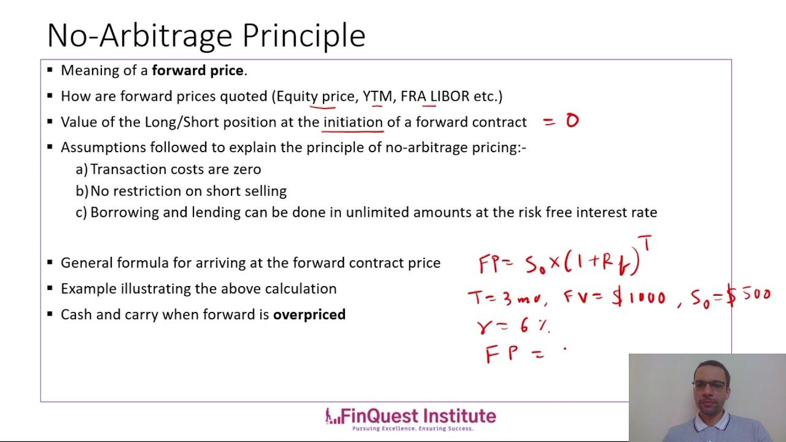

## Table of Contents

## What is cash-and-carry arbitrage?

Cash-and-carry arbitrage is a trading strategy used in financial markets, especially in futures and commodities trading. It involves buying an asset in the spot market and simultaneously selling a futures contract for the same asset. The goal is to profit from the difference between the current price of the asset and its future price, if the futures price is higher than the spot price plus the costs of holding the asset until the futures contract expires.

This strategy works well when the market is in a state of contango, where the futures price is higher than the spot price. Traders can lock in a profit by holding the asset until the futures contract matures and then delivering the asset to fulfill the futures contract. However, it's important to consider the costs involved, such as storage and financing costs, which can eat into the potential profit. If managed correctly, cash-and-carry arbitrage can be a low-risk way to make money in the financial markets.

## How does cash-and-carry arbitrage work in the context of futures markets?

Cash-and-carry arbitrage in futures markets involves buying an asset today and selling a futures contract for that asset at the same time. Imagine you buy a physical item, like gold, at today's price. Then, you sell a contract that promises to deliver that gold at a future date for a higher price. The idea is to make money from the difference between what you paid for the gold now and what you'll get for it later.

To make this work, the future price of the asset must be higher than the current price plus the costs of holding the asset until the contract expires. These costs can include things like storage fees for the gold and interest on the money you borrowed to buy it. If the future price is high enough to cover these costs and still leave you with a profit, then cash-and-carry arbitrage can be a good way to make money with little risk. You just need to hold onto the asset until the futures contract is due, then deliver it and collect your profit.

## What are the key components required for cash-and-carry arbitrage?

To do cash-and-carry arbitrage, you need three main things. First, you need an asset that you can buy right now, like gold or oil. This is called the spot market. Second, you need a futures contract for that same asset, which is a promise to buy or sell it at a set price in the future. Third, you need the futures price to be higher than the spot price, plus any costs you'll have to pay to hold onto the asset until the future date.

The key is that the difference between the spot price and the futures price must be big enough to cover your costs and still leave you with a profit. These costs can include things like storage fees if you're holding onto physical goods, or interest if you borrowed money to buy the asset. If everything lines up right, you can buy the asset now, sell the futures contract, and then just wait until the contract date to deliver the asset and make your money.

## Can you explain the process of executing a cash-and-carry arbitrage strategy?

To do a cash-and-carry arbitrage, first, you buy an asset in the spot market. This could be something like gold or oil. You need to have enough money to buy it, or you might need to borrow money and pay interest on it. After you buy the asset, you sell a futures contract for the same asset. This means you agree to deliver the asset at a future date for a price that's already set. The key is that the price you get from the futures contract should be higher than what you paid for the asset, plus any costs you have to pay to hold onto it until the future date.

The second part of the process is waiting until the futures contract expires. During this time, you need to take care of the asset. If it's something physical like gold, you might have to pay for storage. If you borrowed money to buy the asset, you'll need to pay interest on that loan. When the futures contract comes due, you deliver the asset and get the money from the contract. If everything goes as planned, the money you get from the futures contract will be more than what you paid for the asset and your holding costs. This difference is your profit from the cash-and-carry arbitrage.

## What are the risks associated with cash-and-carry arbitrage?

Cash-and-carry arbitrage is usually seen as a low-risk way to make money, but there are still some risks to watch out for. One big risk is if the price of the asset you bought drops a lot before the futures contract is due. If this happens, you might lose money on the asset even though you make money on the futures contract. Another risk is if the costs of holding the asset go up. These costs could be things like storage fees or interest on borrowed money. If these costs get too high, they could eat up your profit or even make you lose money.

Another thing to think about is if the futures market changes. Sometimes, the difference between the spot price and the futures price can get smaller, which means your profit could shrink. Also, there's a chance that the person who bought the futures contract from you might not be able to pay when it's time to deliver the asset. This is called counterparty risk. If you're not careful, these risks can turn what seems like a sure thing into a money-losing deal.

## How do transaction costs impact the profitability of cash-and-carry arbitrage?

Transaction costs can have a big impact on how much money you make from cash-and-carry arbitrage. When you do this kind of trading, you buy an asset and sell a futures contract at the same time. But every time you buy or sell something, you have to pay fees. These fees can be for things like brokerage charges, commissions, and even the cost of actually making the trade. If these costs are high, they can eat into the difference between what you paid for the asset and what you get from the futures contract. This means your profit might be smaller than you expected, or you might not make any money at all.

It's important to keep an eye on these costs because they can add up quickly. For example, if you're trading something that needs to be stored, like oil, you'll have to pay for storage too. And if you borrowed money to buy the asset, you'll have to pay interest on that loan. All these little costs can make a big difference in the end. So, when you're thinking about doing cash-and-carry arbitrage, you need to make sure that the price difference between the spot and futures market is big enough to cover all your costs and still leave you with a profit.

## What role does the basis play in cash-and-carry arbitrage?

The basis is really important for cash-and-carry arbitrage. It's just the difference between the spot price of an asset and the price of a futures contract for that same asset. When you do cash-and-carry arbitrage, you want the basis to be positive. This means the futures price is higher than the spot price. If the basis is big enough to cover all your costs, like storage and interest, you can make a profit.

But the basis can change over time, and this can affect how much money you make. If the basis gets smaller, your profit might shrink too. Sometimes, the basis can even become negative, which means the futures price is lower than the spot price. If that happens, you could lose money on your arbitrage deal. So, keeping an eye on the basis is a big part of making sure cash-and-carry arbitrage works out well for you.

## How can one identify opportunities for cash-and-carry arbitrage?

To find opportunities for cash-and-carry arbitrage, you need to look at the difference between the price of an asset right now and the price of a futures contract for that asset. This difference is called the basis. If the futures price is higher than the spot price, and that difference is big enough to cover your costs like storage and interest, then you might have a good chance to make money. You can check financial news, use trading platforms, or look at market data to see where these opportunities might be.

It's also important to keep an eye on how the basis might change over time. Markets can be unpredictable, and the difference between the spot and futures prices can get smaller or even turn negative. If you see that the basis is likely to stay positive and cover your costs, that's a good sign to go ahead with the arbitrage. Always make sure to do your homework and understand the risks before you jump into a cash-and-carry arbitrage deal.

## What are the differences between cash-and-carry arbitrage and reverse cash-and-carry arbitrage?

Cash-and-carry arbitrage and reverse cash-and-carry arbitrage are two strategies used in futures trading, but they work in opposite ways. In cash-and-carry arbitrage, you buy an asset in the spot market and then sell a futures contract for that same asset. You do this when the futures price is higher than the spot price, and the difference is big enough to cover your costs like storage and interest. The goal is to make money from the price difference by holding the asset until the futures contract expires and then delivering it.

Reverse cash-and-carry arbitrage is the opposite. Here, you sell the asset in the spot market and buy a futures contract for it. You do this when the futures price is lower than the spot price, a situation called backwardation. The idea is to make money from the price difference by buying back the asset at a lower price when the futures contract expires. Both strategies aim to profit from the difference between spot and futures prices, but they use different approaches depending on market conditions.

## How do market inefficiencies affect the feasibility of cash-and-carry arbitrage?

Market inefficiencies can make cash-and-carry arbitrage more or less possible. When markets are not working perfectly, it can create bigger differences between the price of an asset right now and the price of a futures contract for that asset. This bigger difference, called the basis, can make it easier to find good opportunities for cash-and-carry arbitrage. If the basis is big enough to cover all the costs like storage and interest, you might be able to make a profit.

But, market inefficiencies can also make things trickier. Sometimes, the prices can be all over the place, and it can be hard to predict how they will change. If the basis gets smaller or turns negative while you're holding the asset, you could lose money instead of making a profit. So, even though market inefficiencies can create opportunities for cash-and-carry arbitrage, they also add more risk and uncertainty to the strategy.

## What regulatory considerations should be taken into account when performing cash-and-carry arbitrage?

When you do cash-and-carry arbitrage, you need to think about the rules that control trading. Different countries have different rules about how you can buy and sell assets and futures contracts. You might need to follow rules about how much money you have to put up to trade, called margin requirements. Also, there might be rules about reporting your trades to make sure everything is fair and open. If you don't follow these rules, you could get in trouble or lose money.

Another thing to consider is taxes. The money you make from cash-and-carry arbitrage could be taxed, and the tax rules can be different depending on where you live and what you're trading. You might also need to think about rules that control how you can hold onto the asset you bought, like storage rules for physical goods. It's important to understand all these rules before you start trading, so you don't run into any surprises that could mess up your plan to make a profit.

## Can you discuss advanced strategies that involve combining cash-and-carry arbitrage with other trading techniques?

One advanced strategy that traders use is to combine cash-and-carry arbitrage with options trading. In this approach, you might buy an asset and sell a futures contract like in regular cash-and-carry arbitrage. But then, you also buy or sell options on that asset to protect yourself from big price changes. For example, if you're worried that the price of the asset might drop a lot before the futures contract expires, you could buy a put option. This gives you the right to sell the asset at a set price, which can help limit your losses if the market goes against you. By using options, you can make your cash-and-carry arbitrage strategy safer and maybe even make more money if the market moves in your favor.

Another strategy is to use cash-and-carry arbitrage along with spread trading. Spread trading involves buying and selling different futures contracts at the same time to make money from the difference in their prices. You could do cash-and-carry arbitrage on one asset and then use spread trading on related assets. For example, if you're doing cash-and-carry arbitrage on oil, you might also trade the difference between oil futures contracts that expire at different times. This can help you make more money if the price differences between the contracts change in a way that benefits you. By combining these strategies, you can take advantage of more opportunities in the market and maybe make bigger profits.

## What is Cash-and-Carry Arbitrage and How Does it Work?

Cash-and-carry arbitrage relies on exploiting the price difference between the spot market and the futures market by taking strategic positions to generate risk-free profits. This strategy necessitates a long position in the spot market — purchasing the asset outright — and simultaneously, a short position in the futures market, effectively agreeing to sell the asset at a future date.

The primary objective of cash-and-carry arbitrage is to benefit from the price discrepancies between an asset's current price and its futures price. The opportunity for arbitrage arises when the futures price of an asset is higher than the spot price plus the associated carrying costs. The carrying costs encompass several components, including storage costs, insurance, and financing charges, all of which must be precisely calculated to determine the profitability of the strategy.

Mathematically, the relationship can be expressed as:

$$
\text{Futures Price} = \text{Spot Price} + \text{Carrying Costs}
$$

To execute this strategy, an arbitrageur buys the asset in the spot market at the current price and simultaneously sells a futures contract for the same asset at a higher price. The position is "carried" across the contract's duration, meaning that the asset is held until the expiration of the futures contract. At this point, the futures contract is settled, and the arbitrageur delivers the asset to fulfill the contractual agreement.

For the execution to be risk-free, the futures price should be sufficiently higher than the sum of the spot price and carrying costs. This net difference, if positive, represents the arbitrageur's profit margin. It is crucial for traders using cash-and-[carry](/wiki/carry-trading) [arbitrage](/wiki/arbitrage) to vigilantly monitor carrying costs as fluctuations in these costs can influence overall profitability. Moreover, this strategy requires careful timing and execution to align the spot purchases with futures sales, ensuring that the positions are properly hedged against market conditions.

## What are the key components and calculations?

Successful cash-and-carry arbitrage requires precise calculations of spot prices, futures prices, and carrying costs. The fundamental formula for this strategy is: 

$$
\text{Futures Price} = \text{Spot Price} + \text{Cost of Carry}
$$

The "Cost of Carry" includes all expenses associated with holding the underlying asset until the futures contract's expiration. These costs typically encompass storage, insurance, and financing charges.

To identify potential arbitrage opportunities, traders must first ensure that the futures price is greater than the sum of the spot price and the carrying costs. This differential highlights the potential for arbitrage profit. Explicitly, the potential profit can be calculated with the formula:

$$
\text{Profit} = \text{Futures Price} - (\text{Spot Price} + \text{Carrying Costs})
$$

Assessing market conditions is crucial. Factors such as supply and demand dynamics, interest rates, and economic indicators can influence both spot and futures prices. Financing options are also a critical consideration, as the cost of borrowing to finance the spot purchase impacts overall arbitrage feasibility. Potential transaction fees—defined as costs incurred during asset acquisition, storage, and futures contract trading—need careful assessment to ensure they do not erode potential profits.

Effective risk management strategies are paramount. Understanding market dynamics enables traders to anticipate potential risks, such as unexpected price movements or changes in carrying costs that could affect profitability. A comprehensive risk management plan should include measures to mitigate exposure to market [volatility](/wiki/volatility-trading-strategies), [liquidity](/wiki/liquidity-risk-premium) constraints, and credit risks associated with counterparties.

Overall, a successful cash-and-carry arbitrage strategy relies on meticulous planning and execution, supported by a thorough understanding of market factors and the ability to respond adeptly to changing conditions.

## References & Further Reading

[1]: Hull, J. (2017). ["Options, Futures, and Other Derivatives"](https://elibrary.pearson.de/book/99.150005/9781292212920). Pearson Education Limited.

[2]: Shreve, S. E. (2004). ["Stochastic Calculus for Finance I: The Binomial Asset Pricing Model"](https://archive.org/download/springers-collection-of-books/Stochastic%20Calculus%20for%20Finance%20I%20The%20Binomial%20Asset%20Pricing%20Model%20%28%20PDFDrive%20%29.pdf). Springer Science & Business Media.

[3]: [Kolanovic, M., & Krishnamachari, R. (2017). Machine Learning Applications in Equity Markets. J.P. Morgan.](https://docslib.org/doc/12945320/big-data-and-ai-strategies-machine-learning-and-alternative-data-approach-to-investing)

[4]: Geman, H. (2005). ["Commodities and Commodity Derivatives: Modeling and Pricing for Agriculturals, Metals and Energy."](https://download.e-bookshelf.de/download/0000/5675/90/L-G-0000567590-0015270354.pdf) Wiley Finance.

[5]: Mitra, G., & Mitra, L. (Eds.). (2011). ["The Handbook of News Analytics in Finance."](https://onlinelibrary.wiley.com/doi/book/10.1002/9781118467411) Wiley.