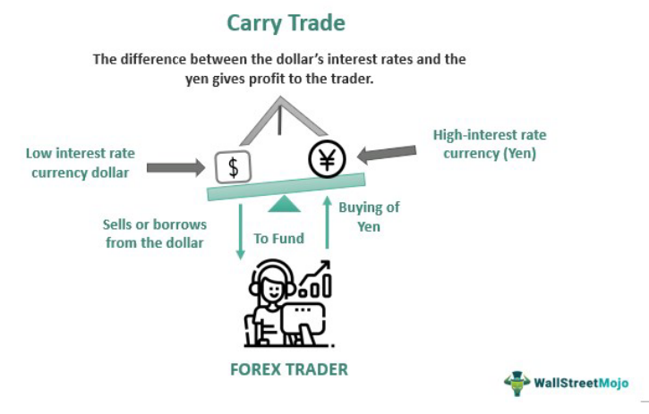

The cash-and-carry trade strategy is a prominent technique in finance, primarily used to exploit price discrepancies between an asset and its corresponding derivative. This strategy is fundamentally rooted in the concept of arbitrage, which involves capitalizing on price differences between markets or forms of the same asset to secure a risk-free profit. Specifically, the cash-and-carry trade leverages mispriced securities by concurrently buying the underlying asset in the cash market and selling its futures contract. This approach thereby locks in the price difference between the two markets, aiming for a positive return when both positions are unwound.

In contrast to other trading strategies, the cash-and-carry trade distinguishes itself through its unique focus on the relationship between spot prices and futures prices. For example, the forex carry trade, despite also being a popular arbitrage strategy, operates on the principle of exploiting interest rate differentials between currencies. Unlike the cash-and-carry trade, it involves borrowing funds in a currency with a lower interest rate and investing them in a currency with a higher rate, hence profiting from the difference in interest rates rather than price discrepancies across markets.



In recent years, algorithmic trading has profoundly transformed the landscape of financial markets, increasing the complexity and efficiency of executing strategies such as the cash-and-carry trade. Algorithms have the capability to swiftly analyze large datasets to identify potential arbitrage opportunities, executing trades with precision and speed that far surpass human capability. This technological evolution not only enhances the traditional approach to cash-and-carry but also reduces the time window during which these opportunities remain exploitable.

The purpose of this article is to examine the intricacies of cash-and-carry trading strategies, along with exploring the automation potential through algorithmic solutions. By understanding both the theoretical and practical aspects of this strategy, investors can better navigate the complexities of modern financial markets, optimizing their approaches to achieve consistent returns.

## Table of Contents

## What is Cash-and-Carry Trade?

A cash-and-carry trade is an arbitrage strategy that targets the pricing inefficiencies between an asset and its corresponding derivative, typically a futures contract. The essence of this strategy is to simultaneously buy the underlying asset and sell the associated futures contract, thereby locking in a profit if certain conditions are met. This classic arbitrage technique is underpinned by the notion that the market should price the spot (current) price of an asset and its futures price—after accounting for costs such as interest rates and storage—in such a way that prevents arbitrage opportunities. When these markets are misaligned, traders can exploit the discrepancy.

### Mechanics of Cash-and-Carry Trade

The cash-and-[carry](/wiki/carry-trading) trade begins with purchasing the asset in the spot market while simultaneously entering a short position in the futures market for the same asset. The investor holds onto the asset until the futures contract expires. Upon expiration, the asset is delivered and the trade is settled.

The profit secured from this trade is determined by the relationship:

$$

\text{Profit} = \text{Futures Price} - (\text{Spot Price} + \text{Carry Costs})
$$

where carry costs include interest expenses and storage costs. If the futures price exceeds the sum of the spot price and the carry cost, then a profit is assured upon settlement.

### Conditions for Profits

A cash-and-carry [arbitrage](/wiki/arbitrage) guarantees profit under the condition that:

$$

\text{Futures Price} > \text{Spot Price} + \text{Carry Costs}
$$

When this inequality holds, the profit is realized once the futures contract is fulfilled. This discrepancy might arise from various market inefficiencies, such as supply-demand imbalances, temporary market distortions, or incorrect investor anticipations regarding future spot prices.

### Example

Consider an example where the spot price of an asset—a commodity such as gold—is $1,800 per ounce, and the futures price is $1,850 for delivery in six months. Suppose the cost to carry (including storage and financing) is $40.

1. **Spot Market Purchase**: Buy one ounce at $1,800.
2. **Futures Market Sale**: Sell a futures contract at $1,850.
3. **Carry Costs**: $40.

The expected profit at expiration would be:

$$

1,850 - (1,800 + 40) = \$10
$$

In this scenario, the cash-and-carry trade yields a profit of $10 per ounce by exploiting the mispricing between the spot price and the futures market price while incorporating the carry costs. This straightforward example highlights the foundational principle upon which cash-and-carry arbitrage operates.

## Steps Involved in Cash-and-Carry Trade

To successfully execute a cash-and-carry trade, traders must follow a structured process that involves several key steps. The foundation of this strategy lies in effectively identifying and exploiting price discrepancies between an asset and its corresponding futures contract. Here is an outline of the critical steps involved:

### Identifying Mispricing

The initial step involves detecting a mispricing between the current spot price of an asset and its futures price. This discrepancy often arises due to differences in supply and demand, market inefficiencies, or variations in interest rates. Mispricing can be quantified using the cost of carry model, which is given by:

$$
F = S \times (1 + r)^t
$$

where:
- $F$ is the futures price,
- $S$ is the spot price,
- $r$ is the risk-free interest rate,
- $t$ is the time to maturity (in years).

A profitable opportunity arises when the market futures price deviates from the theoretically derived futures price.

### Executing Trades

Once mispricing is identified, the cash-and-carry trade is executed in two simultaneous transactions:
1. **Buying the underlying asset** at the spot price.
2. **Selling a futures contract** at the current futures price.

These transactions theoretically lock in the profit derived from the price discrepancy. The trader must ensure that transaction costs are minimized and that [liquidity](/wiki/liquidity-risk-premium) in both the spot and futures markets is adequate to avoid slippage.

### Carrying the Position Until Settlement

The final stage involves holding both the underlying asset and the futures position until the futures contract's expiration. This period, referred to as the carry phase, involves costs that must be managed to maintain profitability. The main components of carry costs include storage fees, interest on borrowed capital, and potential dividends or yields from the underlying asset. Carry costs can affect the profitability of a trade significantly, and if they surpass the arbitrage profit, the trade may result in a loss.

### Example Walkthrough

Consider a hypothetical scenario where a trader identifies an arbitrage opportunity in gold:

- Spot price of gold: $\$1,800$ per ounce
- Futures price for three months: $\$1,850$ per ounce
- Risk-free interest rate: $2\%$ annually
- Carry costs (storage and insurance): $\$10$ per ounce per year

Using the cost of carry model:

$$
F = 1800 \times (1 + 0.02)^{0.25} \approx 1812.71
$$

The futures market is pricing gold at $\$1,850$, considerably higher than the theoretical futures price of $\$1,812.71$. The trader executes the cash-and-carry strategy by buying gold at the spot price and selling futures at $\$1,850$.

Expected profit considering carry cost over three months:

$$
\text{Profit} = (1850 - 1812.71) - \left(\frac{10}{4}\right) = 37.29 - 2.5 = \$34.79 \text{ per ounce}
$$

### Challenges and Risks of Manual Execution

Executing cash-and-carry trades manually presents several challenges:

- **Timing**: Accurate timing is crucial to lock in mispricing efficiently before market corrections eradicate profits.
- **Transaction Costs**: High transaction costs can erode arbitrage profits substantially.
- **Data Accuracy**: Relying on real-time, accurate pricing data is essential but can be prone to errors.
- **Market Risks**: Changes in interest rates or sudden shifts in asset volatility can impact expected profitability.

These challenges underscore the benefits of [algorithmic trading](/wiki/algorithmic-trading) systems, which offer speed and precision in identifying and exploiting such arbitrages while mitigating manual execution risks.

## Algorithmic Trading and Cash-and-Carry

Algorithmic trading refers to the use of computers programmed to follow a defined set of instructions for placing trades in order to generate profits at a speed and frequency that is impossible for a human trader. For the cash-and-carry strategy, algorithmic trading offers a range of benefits that significantly enhance the efficiency and effectiveness of exploiting arbitrage opportunities. 

Algorithms can efficiently identify arbitrage opportunities by continuously scanning multiple markets and instruments to detect price discrepancies between an asset and its corresponding futures contract. This is achieved by integrating real-time data feeds and advanced analytical tools that assess historical and current price data. Algorithms apply quantitative models to evaluate these data streams, which allows for rapid detection of favorable conditions for executing a cash-and-carry trade. 

The role of speed and accuracy in algorithmic trading cannot be overstated. In arbitrage trading, including cash-and-carry, the window of opportunity is typically narrow since market inefficiencies are quickly corrected. Algorithms are capable of executing trades within milliseconds, thus capturing opportunities that would otherwise be missed in manual trading. Automation ensures that trades are executed with high precision based on predefined criteria, thereby reducing the risk of human error that might occur in manual processing.

Several algorithmic trading platforms offer features tailored to cash-and-carry trading strategies. For example, platforms like MetaTrader, NinjaTrader, and QuantConnect provide the necessary tools to design, test, and implement cash-and-carry algorithms. These platforms support features such as [backtesting](/wiki/backtesting), which allows traders to simulate the cash-and-carry strategy on historical data to evaluate its effectiveness before committing capital in real markets. Additionally, they often include risk management options, which help traders minimize potential losses and optimize their strategies. 

In summary, the integration of algorithmic trading with cash-and-carry strategies offers enhanced capabilities for identifying arbitrage opportunities, achieving rapid and accurate execution, and providing comprehensive tools to optimize trades.

## Algorithmic Trading Strategies for Cash-and-Carry

Algorithmic trading strategies have significantly enhanced the execution of cash-and-carry trades by streamlining the process and optimizing profitability. These strategies leverage mathematical models and computational power to identify and exploit arbitrage opportunities with greater precision and speed than manual trading methods.

**Trend-Following Strategies:**  
Trend-following is a popular strategy in algorithmic trading that seeks to capitalize on the [momentum](/wiki/momentum) of asset prices. While traditionally used for directional trading, trend-following can inform cash-and-carry strategies by identifying relational trends between the spot price of an asset and its futures price. Algorithms can track these trends and automate the execution of buy-and-sell orders, ensuring trades are aligned with emerging patterns in the price spread. Despite its utility, trend-following may not fully capitalize on the mispricing central to arbitrage unless complemented by other strategy layers.

**Mean Reversion Strategies:**  
Mean reversion algorithms assume that the asset's price and its futures contract will eventually revert to their mean historical relationship. When applied to cash-and-carry trades, these strategies help identify short-term discrepancies between prices, suggesting potential arbitrage opportunities. If the observed basis – the difference between the spot price and the futures price – deviates significantly from its average, an algorithm could trigger a trade anticipating a convergence back to the mean. Through continuous monitoring, algorithms can pinpoint optimal entry and [exit](/wiki/exit-strategy) points to maximize gains.

**Arbitrage Strategies:**  
Arbitrage is the foundation of cash-and-carry, aiming to exploit immediate price discrepancies without market trend reliance. Algorithms designed for arbitrage can swiftly compare the cost of establishing a position in the spot market against the potential return from selling futures. Automated systems evaluate transaction costs and carry costs, facilitating quick decision-making and execution. Arbitrage algorithms can react to fleeting market conditions that manual traders might miss due to latency or human error, enabling near-instantaneous and often risk-free profits.

**Additional Benefits and Technological Capabilities:**  
Algorithmic trading offers significant advantages in backtesting and risk management, essential for improving strategy performance. Backtesting involves analyzing historical data to simulate a strategy's effectiveness, allowing traders to refine algorithms before deploying them in live markets. Risk management features in algorithms can include setting stop-loss orders, enforcing position limits, and dynamically adjusting trade sizes based on market [volatility](/wiki/volatility-trading-strategies) and liquidity, safeguarding against potential losses.

**Examples of Successful Algorithmic Implementations:**  
Several platforms have implemented algorithmic trading for cash-and-carry strategies effectively. For instance, the QuantConnect platform provides robust tools for developing, testing, and executing algorithmic strategies, including cash-and-carry trades. Using languages like Python, traders can construct and customize algorithms with access to extensive financial libraries and data sets. Another example is the usage of custom-built algorithms on MetaTrader platforms, where traders deploy tailored scripts to exploit specific arbitrage opportunities.

In summary, employing algorithmic trading for cash-and-carry strategies optimizes the process with precision and speed, enhancing profitability through strategic trend-following, mean reversion, and arbitrage techniques. With additional benefits such as backtesting and advanced risk management, algorithmic trading represents a powerful tool for modern traders.

## Financial Example of a Cash-and-Carry Trade

In a cash-and-carry trade, the primary objective is to exploit pricing inefficiencies between an asset and its corresponding futures contract. This arbitrage strategy involves purchasing the underlying asset in the spot market while simultaneously selling its futures contracts. The disparity between the cost of buying the asset and the price at which the future is sold, adjusted for carry costs (financing, storage, and other relevant expenses), results in a risk-free profit if properly calibrated.

### Financial Example Breakdown

Consider a scenario in which a trader notices a pricing inefficiency in a commodity market, specifically in gold. Assume the current spot price of gold is $1,800 per ounce, and the futures contract expiring in six months is trading at $1,850 per ounce. The carry cost, which includes storage and financing, is computed at $30 per ounce over the same period. 

**Step-by-step Analysis:**

1. **Initial Investment:**
   - Spot purchase of gold at $1,800 per ounce. Assume the trader buys 100 ounces.
   - Total cost for 100 ounces = 100 x $1,800 = $180,000.

2. **Futures Sale:**
   - Sell futures contracts for 100 ounces at $1,850 per ounce.
   - Expected revenue from futures = 100 x $1,850 = $185,000.

3. **Cost Factors:**
   - Total carry cost for maintaining the 100 ounces over six months = 100 x $30 = $3,000.

4. **Net Profit Calculation:**
   - Revenue from futures: $185,000.
   - Total cost (spot + carry cost): $180,000 + $3,000 = $183,000.
   - Arbitrage profit: $185,000 - $183,000 = $2,000.

5. **Profit Margins:**
   - Profit percentage = ($2,000 / $183,000) x 100 ≈ 1.09%.

### Algorithmic Enhancement

Implementing an algorithm can significantly refine the cash-and-carry process by automating the identification and execution of arbitrage opportunities. Algorithms, using predetermined criteria and high-speed computations, can continuously scan markets for mispricings. For instance, a Python-based trading algorithm might employ [machine learning](/wiki/machine-learning) models to predict price movements and execute trades instantaneously when conditions align.

**Pseudo-Python Algorithm Example:**

```python
def cash_and_carry_arbitrage(spot_price, futures_price, carry_cost, ounces):
    # Calculate expected revenue and total costs
    total_cost = (spot_price * ounces) + (carry_cost * ounces)
    expected_revenue = futures_price * ounces
    profit = expected_revenue - total_cost
    return profit

# Example execution
spot_price = 1800
futures_price = 1850
carry_cost = 30
ounces = 100

profit = cash_and_carry_arbitrage(spot_price, futures_price, carry_cost, ounces)
print(f"Expected profit: ${profit}")
```

### Market Condition Impacts

Under different market scenarios, the outcomes can vary:

- **Stable Market:** Prices adhere to expected movements; profits align closely with initial calculations.
- **Volatile Market:** Price fluctuations can introduce risk. If spot prices rise significantly or futures prices drop unexpectedly, it might erode potential profits or cause losses.
- **Interest Rate Changes:** Can affect financing costs and thus alter carry cost calculations, impacting the final arbitrage profit margin.

By leveraging algorithmic trading, traders can enhance the precision and efficiency of cash-and-carry strategies, mitigating some market risks through timely and automated execution while constantly adapting to real-time data.

## Risks and Challenges in Cash-and-Carry Trade

Cash-and-carry trades, while potentially profitable, involve various risks and challenges that traders must consider. One of the primary risks is market volatility. Fluctuations in market prices can erode the perceived arbitrage profit margins critical to the success of this strategy. For instance, if the spot price of the underlying asset declines significantly after entering the trade, it could negate the gains expected from the futures position.

Incorrect pricing data presents another serious challenge. Arbitrage opportunities typically arise from minor discrepancies between spot and futures prices. Therefore, accurate and timely data are crucial. Misinformation or delays in obtaining price data can lead to erroneous trade executions that may result in losses rather than profits.

Execution errors are also a concern. Given that cash-and-carry trades often involve large positions to exploit small pricing inefficiencies, even minor mistakes in executing trades can have significant financial implications. Human errors in placing orders, calculating costs, or managing the timing of transactions can transform an ostensibly risk-free arbitrage into a costly gamble.

Unforeseen events, such as geopolitical developments or macroeconomic shifts, can drastically affect asset prices, consequently disrupting arbitrage positions. The uncertainty surrounding these events can introduce substantial risks as they are often difficult to predict or manage within traditional trading frameworks.

Algorithmic trading offers a way to mitigate some of these risks. Algorithms can operate with a high degree of speed and precision, effectively eliminating human errors in execution and enabling the timely identification and exploitation of arbitrage opportunities. Additionally, algorithms can process vast amounts of data swiftly, reducing the likelihood of acting on incorrect pricing information.

However, algorithmic trading also introduces new risks. System failures, such as software bugs or hardware malfunctions, can lead to unanticipated trading losses. Moreover, algorithmic trading systems are not immune to external shocks; unforeseen market events can still have profound effects on the trades they execute.

To manage these risks, traders can implement robust testing and validation processes for their algorithmic strategies, ensuring they perform reliably under various market conditions. Additionally, incorporating real-time monitoring and fail-safes can help detect and rectify issues before they lead to significant financial damage. Balancing the benefits and risks of automation is crucial for optimizing cash-and-carry strategies in today's dynamic trading environment.

## Conclusion

Cash-and-carry trades hold significant strategic value in financial markets by taking advantage of price discrepancies between an asset and its corresponding derivative. This arbitrage strategy enables traders to secure profit with minimized risk, provided the conditions of market mispricing are met. By locking in price differences ahead of time, the cash-and-carry trade offers a methodical approach to generating returns, particularly in markets characterized by notable inefficiencies.

Algorithmic trading advances the efficacy of cash-and-carry strategies by leveraging computational power to identify and act on arbitrage opportunities with speed and precision that manual trading cannot achieve. Algorithms analyze vast datasets in real-time, ensuring that trades are executed at opportune moments, thus maximizing profit potential. The use of algorithmic tools also facilitates backtesting and risk management, allowing traders to refine their strategies and establish a systematic approach to profitability.

Traders and investors are encouraged to integrate algorithmic solutions in their cash-and-carry practices to enhance decision-making, optimize execution, and maintain a competitive edge. The efficiencies gained through automation not only mitigate certain risks, such as human error and latency in execution, but also open new avenues for arbitrage opportunities that were previously inaccessible due to time constraints or complexity.

Looking to the future, the role of algorithmic trading in financial strategies is poised to expand as technological advancements like machine learning and [artificial intelligence](/wiki/ai-artificial-intelligence) become increasingly sophisticated. These technologies will likely lead to more intelligent and adaptive algorithms that can anticipate market movements and adjust strategies dynamically. Consequently, the incorporation of algorithmic trading in cash-and-carry and other financial strategies will continue to evolve, promising greater precision and profitability in an ever-changing market landscape.

## References & Further Reading

[1]: Hull, J. C. (2017). ["Options, Futures, and Other Derivatives"](https://www.semanticscholar.org/paper/Options%2C-Futures%2C-and-Other-Derivatives-Hull/89bdee500c8623864fc9eb7a471546aa713acc44). Pearson Education.

[2]: Lopez de Prado, M. (2018). ["Advances in Financial Machine Learning"](https://www.amazon.com/Advances-Financial-Machine-Learning-Marcos/dp/1119482089). Wiley.

[3]: Chan, E. P. (2008). ["Quantitative Trading: How to Build Your Own Algorithmic Trading Business"](https://github.com/ftvision/quant_trading_echan_book). Wiley.

[4]: Jansen, S. (2020). ["Machine Learning for Algorithmic Trading - Second Edition"](https://github.com/stefan-jansen/machine-learning-for-trading). Packt Publishing.

[5]: Aronson, D. R. (2006). ["Evidence-Based Technical Analysis: Applying the Scientific Method and Statistical Inference to Trading Signals"](https://www.amazon.com/Evidence-Based-Technical-Analysis-Scientific-Statistical/dp/0470008741). Wiley.

[6]: Bergstra, J., Bardenet, R., Bengio, Y., & Kégl, B. (2011). ["Algorithms for Hyper-Parameter Optimization."](https://dl.acm.org/doi/10.5555/2986459.2986743) Advances in Neural Information Processing Systems 24.