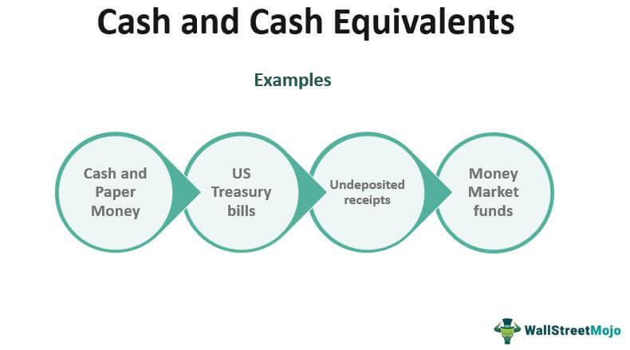

## Table of Contents

## What are cash and cash equivalents?

Cash and cash equivalents are items that a company or person can quickly turn into cash. This includes actual cash, like the money in your wallet or bank account, and things that are almost as good as cash. These things are called cash equivalents and include things like money market funds, treasury bills, and short-term government bonds. They are considered cash equivalents because they can be sold or turned into cash very quickly, usually within 90 days.

Having cash and cash equivalents is important for businesses and individuals. For a business, it helps them pay for daily expenses, like buying supplies or paying employees. It also gives them the flexibility to take advantage of new opportunities or deal with unexpected costs. For individuals, having cash and cash equivalents means they can cover their bills and have money for emergencies. It's like having a safety net that you can use whenever you need it.

## Why are cash and cash equivalents important for businesses?

Cash and cash equivalents are really important for businesses because they help them pay for everyday things like buying supplies or paying workers. Imagine running a store; you need money to buy new products to sell and to pay the people who help you run the store. If you don't have enough cash, you might not be able to keep your business going smoothly.

Having cash and cash equivalents also gives businesses the flexibility to take advantage of new opportunities or handle unexpected problems. For example, if a great deal comes up to buy more inventory at a lower price, a business with enough cash can jump on that opportunity. Or, if something unexpected happens, like a machine breaking down, having cash on hand means the business can fix it quickly without worrying about where the money will come from. This makes cash and cash equivalents a crucial part of keeping a business running well and being ready for anything that comes up.

## What are the main types of cash equivalents?

Cash equivalents are things that are almost as good as cash because they can be turned into cash very quickly, usually within 90 days. The main types of cash equivalents include money market funds, treasury bills, and short-term government bonds. Money market funds are like savings accounts where you put your money with other people's money to invest in safe, short-term things like government securities. Treasury bills are short-term loans you give to the government, and they pay you back with a little interest when they mature. Short-term government bonds are similar but might last a bit longer, up to a year.

These cash equivalents are important because they are very safe and easy to turn into cash. They help businesses and people keep their money working for them while still being able to use it when they need to. For example, if a business needs to buy more supplies quickly, they can sell their treasury bills and get the cash they need right away. This makes cash equivalents a smart way to keep money ready for use but also [earning](/wiki/earning-announcement) a little bit of interest.

## Can you provide examples of cash?

Cash is the money you have that you can use right away. It includes the bills and coins in your wallet or purse. If you have a piggy bank at home, the money inside it is also cash. When you go to the store and pay with cash, you're using actual money to buy things.

Cash also includes the money you have in your bank account that you can take out whenever you want. This is called a checking account. You can use a debit card or write a check to spend this money. For businesses, cash can be the money in their cash registers or the money they have in their business bank accounts that they use to pay for things like supplies and employee salaries.

## What qualifies as a cash equivalent?

Cash equivalents are things that you can quickly turn into cash, usually within 90 days. They are almost as good as cash because they are very safe and easy to sell. Examples of cash equivalents include money market funds, treasury bills, and short-term government bonds. Money market funds are like a pool of money from many people that is invested in safe, short-term things. Treasury bills are like short-term loans you give to the government, and they pay you back with a little interest. Short-term government bonds are similar but can last up to a year.

Having cash equivalents is important because they help you keep your money safe and ready to use. If you need money quickly, like if you want to buy something or if an emergency comes up, you can sell your cash equivalents and get the cash you need right away. This makes cash equivalents a smart way to keep your money working for you while still being able to use it when you need to.

## How do cash equivalents differ from other short-term investments?

Cash equivalents are special because they can be turned into cash very quickly, usually within 90 days. They are also very safe and don't lose value easily. Examples include money market funds, treasury bills, and short-term government bonds. These are like having cash because you can use them right away if you need to. They help you keep your money ready for anything that might come up.

Other short-term investments might take a bit longer to turn into cash or might be a bit riskier. For example, stocks or corporate bonds can go up and down in value, and it might take more time to sell them. These investments might offer a chance to make more money, but they are not as safe or quick to use as cash equivalents. So, while short-term investments can be good for growing your money, cash equivalents are better for having money ready to use when you need it.

## What are the criteria for an asset to be classified as a cash equivalent?

An asset can be classified as a cash equivalent if it can be turned into cash quickly, usually within 90 days. This means you can use it almost as easily as cash when you need money right away. Cash equivalents are also very safe, which means they don't lose value easily. They are like a safe place to keep your money while still being able to use it when you need to.

Examples of cash equivalents include money market funds, treasury bills, and short-term government bonds. Money market funds are like a pool of money from many people that is invested in safe, short-term things. Treasury bills are short-term loans you give to the government, and they pay you back with a little interest. Short-term government bonds are similar but can last up to a year. These assets help you keep your money ready for anything that might come up, like buying something or dealing with an emergency.

## How do companies report cash and cash equivalents on their financial statements?

Companies show their cash and cash equivalents on their financial statements in a part called the balance sheet. The balance sheet is like a big list that tells you what the company owns and owes at a certain time. On this list, cash and cash equivalents are usually put together at the very top because they are the easiest things to turn into money. This section shows how much actual cash the company has, like the money in their bank accounts, and how much they have in things that are almost as good as cash, like money market funds and treasury bills.

When a company makes a report called the statement of cash flows, they also talk about their cash and cash equivalents. This report shows how the company's cash changed over a period of time, like a year. It breaks down where the cash came from and where it went, including how much they had at the start and end of the period. By looking at these reports, people can see if the company is doing well with its cash and if it has enough money to pay for things it needs to buy or do.

## What are the risks associated with holding cash equivalents?

Holding cash equivalents is usually pretty safe, but there are still some risks to think about. One risk is that cash equivalents might not keep up with inflation. Inflation is when the prices of things go up over time, which means your money can buy less. If the interest you earn from cash equivalents is less than the rate of inflation, your money loses value even though you still have the same amount. Another risk is that the company or government you invest in could run into problems. Even though cash equivalents are supposed to be safe, there's still a small chance that something could go wrong, like a bank failing or a government defaulting on its debts.

Also, holding too much in cash equivalents might mean you're missing out on better investment opportunities. While cash equivalents are easy to turn into cash and are safe, they usually don't earn as much money as other investments like stocks or bonds. If you keep all your money in cash equivalents, you might not be making as much money as you could be. So, it's important to balance the safety of cash equivalents with the potential for higher returns from other investments.

## How do changes in interest rates affect the value of cash equivalents?

Changes in interest rates can affect the value of cash equivalents in a few ways. When interest rates go up, new cash equivalents like treasury bills or money market funds might offer higher interest rates. This can make the older cash equivalents you already own less attractive because they pay less interest than the new ones. As a result, if you wanted to sell your older cash equivalents, you might have to sell them for a bit less than what you paid for them, which means their value goes down a little.

On the other hand, when interest rates go down, the cash equivalents you already own become more valuable. This is because they pay more interest than the new cash equivalents that are being offered. If you wanted to sell your cash equivalents when interest rates are low, you might be able to sell them for a bit more than what you paid for them. So, changes in interest rates can make the value of your cash equivalents go up or down, depending on whether rates are rising or falling.

## What strategies can businesses use to manage their cash and cash equivalents effectively?

Businesses can manage their cash and cash equivalents effectively by keeping a close eye on their cash flow. This means they need to know how much money is coming in and going out every day. By understanding their cash flow, businesses can make sure they always have enough cash to pay for things like supplies, salaries, and other expenses. They can also set up a budget to plan how they will use their cash and keep some extra money in cash equivalents like money market funds or treasury bills. This way, they have money ready to use if something unexpected comes up.

Another strategy is to use a cash management system. This system helps businesses keep track of their cash and make sure it's being used in the best way possible. For example, they might move extra cash into cash equivalents to earn a little interest while still being able to use it quickly if needed. Businesses can also look at their cash needs over time and adjust how much they keep in cash and cash equivalents. By doing this, they can make sure they have enough money for daily operations and also save some for future opportunities or emergencies.

## How do cash and cash equivalents impact a company's liquidity and financial health?

Cash and cash equivalents are super important for a company's [liquidity](/wiki/liquidity-risk-premium) and financial health. Liquidity means how easily a company can turn its assets into cash to pay for things it needs. When a company has a lot of cash and cash equivalents, it can quickly pay its bills, buy supplies, or take advantage of new opportunities. This makes the company more flexible and able to handle unexpected costs or emergencies. If a company doesn't have enough cash, it might struggle to keep up with its daily expenses, which can lead to bigger problems down the road.

Having enough cash and cash equivalents also shows that a company is financially healthy. It means the company is good at managing its money and can cover its short-term needs without borrowing or selling other assets. Investors and lenders look at a company's cash and cash equivalents to see if it's a safe bet. If a company has a strong cash position, it's more likely to get loans or attract investors. On the other hand, if a company is always short on cash, it might be seen as risky, which can make it harder to grow or even stay in business.

## What role do cash equivalents play in providing stability in volatile markets?

Cash equivalents are vital components in any investment strategy, especially in volatile market conditions, due to their high liquidity and minimal risk profile. These instruments are designed to be short-term, highly liquid investments that can be swiftly converted to cash with minimal loss of value. Common examples of cash equivalents include Treasury bills, money market funds, and commercial paper. These instruments are appealing because they provide a stable store of value and are less prone to market fluctuations compared to other asset classes like stocks or bonds.

**Treasury Bills (T-Bills):** These are short-term securities issued by the government with maturities ranging from a few days to one year. T-Bills are considered nearly risk-free and are highly liquid, making them a preferred choice for investors seeking safety in turbulent times.

**Money Market Funds:** These are mutual funds that invest in short-term, high-quality debt such as T-bills, commercial paper, and certificates of deposit. Money market funds aim to maintain a stable net asset value (NAV), making them a reliable option for preserving capital. They offer more flexibility than individual securities due to diversified holdings.

**Commercial Paper:** This refers to unsecured, short-term debt issued by corporations. Typically used for financing payroll, accounts payable, and inventories, commercial paper provides higher yield than T-Bills but assumes slightly higher risk due to corporate default possibilities.

### Importance for Financial Stability and Risk Management

Cash equivalents play a critical role in financial stability and risk management. In uncertain markets, holding cash equivalents can help investors buffer against market [volatility](/wiki/volatility-trading-strategies), enabling them to meet short-term liabilities without needing to sell off long-term investments at a loss. These instruments ensure that investors have ready access to funds, which is crucial in addressing unexpected financial needs.

### Integration into Investment Strategies

Successfully integrating cash equivalents into an investment portfolio involves determining the optimal liquidity ratio, which can be defined as follows:

$$
\text{Liquidity Ratio} = \frac{\text{Total Cash Equivalents}}{\text{Total Portfolio Value}}
$$

Investors must assess their liquidity needs to prevent both insufficient and excessive allocation to cash equivalents. Insufficient liquidity may cause strain during cash-flow shortfalls, while excess liquidity might limit potential gains from higher-yielding investments. Building a balanced strategy ensures that sufficient cash is available for immediate use while enabling longer-term investments to grow.

### Balancing Safety and Potential Returns

While cash equivalents provide safety and liquidity, they typically offer lower returns compared to equities or long-term bonds. This necessitates balancing the trade-offs between maintaining liquidity and seeking higher returns. Using a blend of cash equivalents and other investments enables investors to maintain the safety needed in times of market stress while also capturing the benefits of growth-oriented assets.

In summary, cash equivalents are essential components of an effective investment strategy, offering stability and liquidity during volatile market periods. By understanding their role and utilizing them wisely alongside other financial instruments, investors can enhance their risk management framework and better achieve their overall financial goals.

## References & Further Reading

[1]: Bergstra, J., Bardenet, R., Bengio, Y., & Kégl, B. (2011). ["Algorithms for Hyper-Parameter Optimization."](https://papers.nips.cc/paper/4443-algorithms-for-hyper-parameter-optimization) Advances in Neural Information Processing Systems 24.

[2]: ["Advances in Financial Machine Learning"](https://www.amazon.com/Advances-Financial-Machine-Learning-Marcos/dp/1119482089) by Marcos Lopez de Prado

[3]: ["Evidence-Based Technical Analysis: Applying the Scientific Method and Statistical Inference to Trading Signals"](https://www.amazon.com/Evidence-Based-Technical-Analysis-Scientific-Statistical/dp/0470008741) by David Aronson

[4]: ["Machine Learning for Algorithmic Trading"](https://github.com/stefan-jansen/machine-learning-for-trading) by Stefan Jansen

[5]: ["Quantitative Trading: How to Build Your Own Algorithmic Trading Business"](https://www.amazon.com/Quantitative-Trading-Build-Algorithmic-Business/dp/1119800064) by Ernest P. Chan