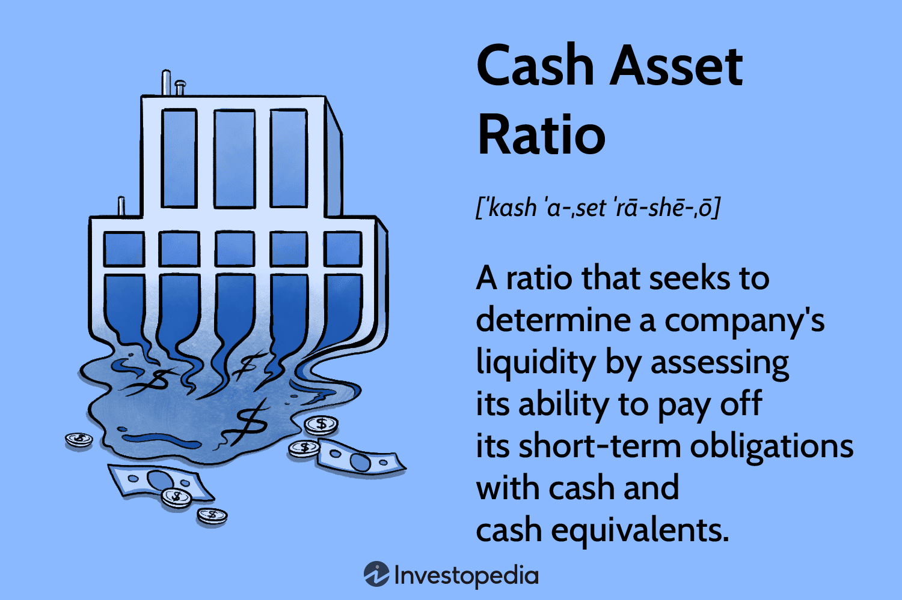

Financial markets rely heavily on specific metrics to evaluate a company's financial standing and performance. One of the key metrics is the cash asset ratio, a crucial measure of liquidity that assesses a firm's ability to meet its short-term obligations. The cash asset ratio is defined as the sum of cash and cash equivalents divided by current liabilities, serving as an important indicator of a company's immediate financial health. 

In recent times, the integration of financial metrics such as the cash asset ratio into algorithmic trading has enhanced trading strategies. Algorithmic trading, which involves using pre-defined rules and algorithms to execute trades, benefits from real-time analysis of financial data. By incorporating liquidity measurements, trading algorithms can be optimized to improve decision-making and manage risk effectively. 



This article explores the intersection of financial metrics, particularly liquidity measurement, and algorithmic trading. It examines key concepts of liquidity, the methodology for calculating the cash asset ratio, and the implications for algorithm trading. The discussion extends to the applications of these metrics in creating robust trading strategies and their role in short-term financial analysis. Through this exploration, the article aims to delve into how financial professionals and traders can utilize liquidity metrics to enhance trading performance and ensure financial stability.

## Table of Contents

## Understanding the Cash Asset Ratio

The cash asset ratio is a key financial metric that measures a company's capacity to settle its short-term liabilities with cash and cash equivalents. Mathematically, the cash asset ratio (CAR) is expressed as:

$$
\text{Cash Asset Ratio} = \frac{\text{Cash + Cash Equivalents}}{\text{Current Liabilities}}
$$

By emphasizing cash and cash equivalents, the cash asset ratio presents a conservative perspective on a firm's [liquidity](/wiki/liquidity-risk-premium). These assets are the most liquid, implying they can be readily converted into cash to meet immediate financial obligations.

A cash asset ratio of 1 indicates that a company is perfectly positioned to meet its short-term liabilities with its liquid assets. This denotes optimal financial stability in terms of liquidity, ensuring investors and creditors that the company can comfortably manage its current debt obligations without needing to liquidate other assets or resort to borrowing. Conversely, a ratio less than 1 suggests potential liquidity issues, as the company might need to leverage less liquid assets or secure additional financing to cover its liabilities.

In assessing a company's financial health, the cash asset ratio is crucial. It directly addresses the company's ability to stay solvent in the short term, which is significant during economic downturns or periods of market [volatility](/wiki/volatility-trading-strategies). Companies with strong cash asset ratios are less susceptible to credit downgrades and bankruptcy because they are better equipped to handle unexpected financial difficulties.

When comparing the cash asset ratio to other liquidity metrics, it stands out for its stringent focus on the most liquid forms of assets. The current ratio, for instance, includes all current assets in its calculation and is expressed as:

$$
\text{Current Ratio} = \frac{\text{Current Assets}}{\text{Current Liabilities}}
$$

The quick ratio, or acid-test ratio, is slightly more conservative than the current ratio, excluding inventory from current assets:

$$
\text{Quick Ratio} = \frac{\text{Cash + Cash Equivalents + Accounts Receivable}}{\text{Current Liabilities}}
$$

Both the current and quick ratios consider accounts receivable, which, while liquid, are not as immediately accessible as cash and cash equivalents. The cash asset ratio, therefore, offers the most conservative assessment by concentrating on assets that can be accessed with the greatest immediacy, providing a clearer picture of immediate liquidity without potential delays in converting other current assets to cash.

## Calculation and Interpretation

The cash asset ratio is a pivotal financial metric in evaluating a company's liquidity. It is calculated using the formula:

$$
\text{Cash Asset Ratio} = \frac{\text{Cash + Cash Equivalents}}{\text{Current Liabilities}}
$$

### Components of the Cash Asset Ratio

**Cash and Cash Equivalents:** These are highly liquid assets and include physical currency, funds in checking accounts, and short-term investments readily convertible to known amounts of cash with insignificant risk of value change. Examples include Treasury bills, commercial paper, and money market funds.

**Current Liabilities:** These are obligations a company must settle within a year. They include accounts payable, short-term debt, accrued liabilities, and other similar obligations.

### Example Calculation

Consider a hypothetical company, XYZ Corp., with the following figures:

- Cash: $200,000
- Cash Equivalents: $100,000
- Current Liabilities: $250,000

The cash asset ratio for XYZ Corp. would be calculated as:

$$
\text{Cash Asset Ratio} = \frac{\$200,000 + \$100,000}{\$250,000} = \frac{\$300,000}{\$250,000} = 1.2
$$

### Interpretation

- **Ratio < 1:** A cash asset ratio below 1 suggests that the company may struggle to cover its short-term liabilities using its most liquid assets, indicating potential liquidity issues.

- **Ratio = 1:** A cash asset ratio of 1 indicates that the firm can exactly cover its short-term obligations with its liquid assets. While it demonstrates sufficient liquidity, it leaves no room for unexpected expenses or investments without acquiring additional funds.

- **Ratio > 1:** This level signifies strong liquidity, implying the company has more liquid assets than needed to cover immediate liabilities. Such a position provides financial flexibility and security, indicating robust financial health.

In summary, a higher cash asset ratio suggests a stronger liquidity position, while a lower number indicates potential vulnerability in meeting short-term financial commitments. Each company's ideal ratio may vary based on industry practices and specific business models.

## The Role of Liquidity Ratios in Financial Analysis

Liquidity ratios serve as a vital component in assessing a company's short-term financial health, providing insights into its capacity to meet immediate obligations. Among the various liquidity ratios, the cash asset ratio stands out due to its conservative approach to evaluating liquidity. Defined as the ratio of cash and cash equivalents to current liabilities, this metric helps ascertain a firm's ability to settle short-term debts without necessitating the sale of non-liquid assets. 

**Evaluating Financial Stability**

Liquidity ratios, such as the cash asset ratio, are instrumental in appraising financial stability. A higher cash asset ratio indicates a stronger liquidity position, suggesting that a company possesses adequate liquid assets to cover its short-term liabilities. Conversely, a lower ratio might signal potential liquidity challenges, highlighting the need for improved cash management strategies. Such insights are invaluable for making timely financial interventions to ensure sustained operational viability.

**Importance for Stakeholders**

For investors, liquidity ratios provide a barometer for assessing risk. A robust liquidity position often translates to lower financial risk, making the company an attractive prospect for investment. Creditors, on the other hand, leverage these ratios to determine creditworthiness, using them to gauge the likelihood of timely repayment. Financial analysts rely on liquidity ratios to paint a comprehensive picture of a company's financial posture, offering stakeholders essential data to inform strategic decision-making.

**Comparative Analysis with Other Ratios**

Besides the cash asset ratio, other liquidity measures such as the current ratio and quick ratio also play a role in analyzing short-term financial health. The current ratio is calculated as:

$$
\text{Current Ratio} = \frac{\text{Current Assets}}{\text{Current Liabilities}}
$$

This metric provides a broad snapshot of a company's ability to cover its obligations using all current assets, including inventory. Although comprehensive, the inclusion of inventory, which may not be readily convertible to cash, makes this ratio less conservative than the cash asset ratio.

The quick ratio, or acid-test ratio, refines this assessment by excluding inventory from current assets:

$$
\text{Quick Ratio} = \frac{\text{Current Assets} - \text{Inventory}}{\text{Current Liabilities}}
$$

This measure offers a middle ground between the current ratio and the cash asset ratio, delivering a faster indication of liquidity while maintaining a level of prudence by eliminating less liquid assets.

In summary, liquidity ratios are indispensable tools in financial analysis, enabling stakeholders to make informed decisions through a clearer understanding of a company's short-term financial resilience. Each ratio offers a unique perspective, collectively providing a multi-faceted view of financial health.

## Algorithmic Trading and Financial Metrics

Algorithmic trading, often referred to as algo trading, is an advanced trading approach that uses pre-programmed software to execute trades based on a series of quantitative financial metrics and rules. One critical aspect of these algorithms is their reliance on liquidity ratios, such as the cash asset ratio, to evaluate a company’s short-term financial health and stability. Integration of liquidity ratios into trading algorithms enhances the ability of these systems to assess market stability by providing a measure of a firm’s capability to fulfill its immediate financial obligations.

Liquidity ratios, including the cash asset ratio, quick ratio, and current ratio, are pivotal in algo trading as they offer insights into a company's capacity to manage short-term liabilities with its liquid assets. By analyzing these ratios, algorithms can gauge the financial health of firms, allowing traders to make informed decisions that minimize risk. For instance, a higher cash asset ratio indicates greater liquidity, suggesting that a company is better poised to meet its short-term debts, thus reducing the risk associated with holding or trading such securities.

High-frequency trading ([HFT](/wiki/high-frequency-trading-strategies)) employs complex algorithms that thrive on real-time data to capitalize on minute price discrepancies occurring within milliseconds. In such a fast-paced environment, liquidity metrics assume a fundamental role. The ability to quickly interpret and react to these financial metrics enables HFT systems to execute buy and sell orders with precision, aiming for optimal profitability while mitigating potential financial risks.

Incorporating real-time liquidity data into algorithmic strategies ensures that the trading systems remain adaptive to market conditions. By processing up-to-the-minute liquidity information, these algorithms can dynamically adjust their trading parameters, increasing or decreasing exposure to specific assets in response to shifts in market liquidity. This agility is vital in maintaining competitiveness and reducing exposure to adverse market movements.

A practical implementation could involve programming an algorithm in Python to monitor changes in liquidity metrics such as the cash asset ratio. The following is a simplified example illustrating how one might implement liquidity-based trading conditions:

```python
# Example: Algorithm to decide trades based on liquidity ratios

# Assume we have a function that fetches cash asset ratio in real-time.
def get_cash_asset_ratio():
    # Dummy implementation for ratio retrieval
    # In practice, this would pull real-time data from financial data sources.
    return 1.2

def trade_decision():
    ratio = get_cash_asset_ratio()

    # Trading logic based on the cash asset ratio
    if ratio > 1:
        print("Initiate Buy Order: Company has adequate liquidity.")
    elif ratio < 0.7:
        print("Initiate Sell Order: Company liquidity is inadequate.")
    else:
        print("Hold: Re-evaluate as new data comes in.")

# Simulating the trading decision process
trade_decision()
```

This Python snippet demonstrates the integration of liquidity assessment with trading logic, highlighting the potential actions of buy, sell, or hold based on the current liquidity ratio. Such algorithms, when configured to process real-time data efficiently, can significantly enhance trading outcomes by ensuring adaptability to ongoing market dynamics.

## Developing Trading Strategies with Liquidity Ratios

Strategies in [algorithmic trading](/wiki/algorithmic-trading) frequently use liquidity ratios to identify and evaluate trading opportunities, thus optimizing risk management and improving returns. Liquidity ratios, such as the cash asset ratio, reflect a company's ability to meet its short-term liabilities using its most liquid assets. This information is crucial for traders seeking to minimize risk and ensure stability in volatile markets.

Liquidity ratios inform risk management in algorithmic trading by providing insights into a company's immediate financial health. A robust liquidity position generally indicates a lower risk of distress, enabling algorithmic traders to filter out companies more likely to experience financial difficulties. By focusing on firms with high liquidity, algorithmic traders can limit exposure to adverse price movements and mitigate potential losses.

The importance of [backtesting](/wiki/backtesting) strategies using historical liquidity data cannot be overstated. Backtesting involves simulating a trading strategy using historical data to evaluate its effectiveness and profitability. Through backtesting, traders can understand how liquidity-reliant strategies would have performed under various market conditions. This analysis helps refine trading algorithms by highlighting potential weaknesses and areas for improvement.

Here's a basic example of how to implement a trading strategy in Python using the cash asset ratio and backtesting with historical data. We'll use the `pandas` library to handle data and a simplified approach to illustrate the concept:

```python
import pandas as pd
import numpy as np

# Sample historical data: For demonstration, create a fake dataset
data = {
    'Date': pd.date_range(start='2023-01-01', periods=5, freq='D'),
    'TotalCash': [100, 200, 150, 180, 160],
    'CurrentLiabilities': [80, 150, 100, 160, 140],
    'StockPrice': [50, 55, 52, 54, 53]
}

df = pd.DataFrame(data)

# Calculate the Cash Asset Ratio
df['CashAssetRatio'] = df['TotalCash'] / df['CurrentLiabilities']

# Define simple strategy: Buy if the ratio > 1, sell otherwise
def trading_strategy(row):
    return 'Buy' if row['CashAssetRatio'] > 1 else 'Sell'

df['Signal'] = df.apply(trading_strategy, axis=1)

# Simulate strategy outcomes
initial_investment = 1000
df['Position'] = np.where(df['Signal'] == 'Buy', 1, -1)
df['Returns'] = df['Position'].shift(1) * df['StockPrice'].pct_change()
df['PortfolioValue'] = initial_investment * (1 + df['Returns']).cumprod()

print(df[['Date', 'CashAssetRatio', 'Signal', 'PortfolioValue']])
```

This code snippet demonstrates a straightforward approach: calculating the cash asset ratio from hypothetical data, generating buy/sell signals based on this metric, and simulating the investment's portfolio value over time. This rudimentary example underscores the potential for integrating liquidity ratios in algorithmic strategies as a risk management tool. However, in practice, more comprehensive models and additional financial metrics would typically be incorporated to enhance strategy robustness and performance. 

Effective utilization of liquidity ratios in algorithmic trading requires a combination of detailed analysis, hypothesis testing, and strategic refinement to successfully navigate dynamic financial markets.

## Challenges and Considerations

Liquidity ratios, including the cash asset ratio, offer essential insights into a company's short-term financial health; however, they have inherent limitations in fully capturing financial dynamics. These ratios primarily focus on the ability to meet short-term obligations, often neglecting the broader context of long-term financial stability and operational efficiency. For example, while a high cash asset ratio might indicate good liquidity, it does not necessarily reflect efficient capital utilization. Companies holding excess cash may exhibit high ratios but might also suffer from forgone investment opportunities that could contribute to growth.

Incorporating liquidity ratios into algorithmic trading systems presents challenges. One major hurdle is the real-time availability and accuracy of the input data. Algorithms rely on precise, current data feeds, and any discrepancies can lead to flawed evaluations and suboptimal trading decisions. Moreover, integrating these ratios requires extensive computational power and sophisticated platforms capable of processing large volumes of data swiftly. Algorithm complexity and scalability also come into play, as the system must be robust enough to handle diverse data sources and adapt to changing market conditions.

Market volatility, slippage, and transaction costs further complicate the practical application of liquidity ratios in trading strategies. Slippage occurs when there is a difference between the expected price of a trade and the actual price, potentially skewing results derived from liquidity-based evaluations. Transaction costs, while often overlooked, can significantly impact the net profitability of trades, especially in high-frequency trading environments. Algorithms incorporating liquidity ratios need to account for these factors to maintain accuracy and reliability.

To ensure a competitive edge in algorithmic trading using liquidity ratios, regular updates and proactive monitoring of models and strategies are crucial. The dynamic nature of financial markets means that models can quickly become obsolete if not consistently aligned with current economic conditions. A strategy that accounted for past market volatility might not be effective against unforeseen global events affecting liquidity dynamics.

Ongoing improvements in data analytics and [machine learning](/wiki/machine-learning) can enhance the application of liquidity ratios in algorithmic systems. By employing adaptive algorithms that learn and adjust to new data patterns, traders can better manage risks associated with volatile markets and optimize transaction costs. Additionally, leveraging historical data for backtesting can refine strategies, ensuring they remain effective across various market cycles and conditions. Regularly recalibrating models based on these insights helps maintain their relevance and performance, ultimately leading to more robust trading strategies.

## Conclusion and Future Prospects

Liquidity ratios are fundamental tools in financial analysis and trading, offering critical insights into a company's capability to meet short-term obligations. Their inclusion in financial assessments enables investors, creditors, and analysts to evaluate a firm's financial stability effectively. These metrics, particularly the cash asset ratio, provide a conservative view by focusing on the most liquid assets available to cover current liabilities. As such, liquidity ratios serve not only as barometers of financial health but also as strategic components in risk management and investment decision-making.

Looking forward, financial technology continues to evolve, with liquidity metrics playing an increasingly pivotal role. The rise of fintech innovations and algorithmic trading platforms has amplified the need for real-time data analysis and automated decision-making processes. These developments are driving trends such as the use of machine learning algorithms to predict liquidity patterns and develop predictive analytics tools that enhance trading strategies. With the integration of advanced technologies, liquidity ratios can be employed more dynamically to assess market conditions and fine-tune trading algorithms for optimized performance.

The integration of liquidity analysis into algorithmic trading highlights several benefits, including enhanced risk management and improved decision-making speed. By utilizing liquidity ratios, trading algorithms can gauge market stability, anticipate potential financial shifts, and execute trades with increased precision. This integration not only minimizes risks associated with volatility but also provides a competitive edge through timely and informed trading actions.

As financial environments are continuously changing, ongoing research and adaptation remain crucial. Financial metrics must be consistently reviewed and updated to reflect the latest market dynamics. By maintaining a proactive approach, stakeholders can better harness the potential of liquidity analysis to make more informed financial decisions. Encouraging a continuous cycle of research, development, and implementation will ensure that financial professionals and institutions stay ahead in an ever-evolving landscape.

In conclusion, the strategic application of liquidity ratios in both financial analysis and trading offers significant advantages. As technology advances, these metrics will become even more integral to financial operations and strategy development. Embracing these tools and remaining adaptable will be key to leveraging their full potential in future financial endeavors.

## References & Further Reading

[1]: Damodaran, A. (2012). ["Investment Valuation: Tools and Techniques for Determining the Value of Any Asset."](https://books.google.com/books/about/Investment_Valuation.html?id=5SRHAAAAQBAJ) John Wiley & Sons.

[2]: Harris, L. (2003). ["Trading and Exchanges: Market Microstructure for Practitioners."](https://www.amazon.com/Trading-Exchanges-Market-Microstructure-Practitioners/dp/0195144708) Oxford University Press.

[3]: Easley, D., & O'Hara, M. (1992). ["Time and the Process of Security Price Adjustment."](https://onlinelibrary.wiley.com/doi/abs/10.1111/j.1540-6261.1992.tb04402.x) The Journal of Finance.

[4]: Chan, E. (2009). ["Quantitative Trading: How to Build Your Own Algorithmic Trading Business."](https://github.com/ftvision/quant_trading_echan_book) John Wiley & Sons.

[5]: Jansen, S. (2018). ["Machine Learning for Algorithmic Trading."](https://github.com/stefan-jansen/machine-learning-for-trading) Packt Publishing.

[6]: Hull, J. (2015). ["Options, Futures, and Other Derivatives."](https://books.google.com/books/about/Options_Futures_and_Other_Derivatives_Gl.html?id=sdg2EAAAQBAJ) Pearson Education.