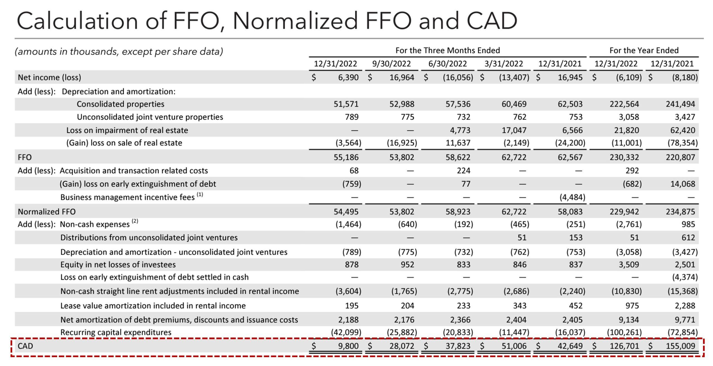

## Table of Contents

## What is Cash Available for Distribution (CAD)?

Cash Available for Distribution (CAD) is a financial measure used mainly by real estate investment trusts (REITs) and master limited partnerships (MLPs). It shows how much money these companies can pay out to their investors, like dividends. CAD is important because it helps investors see if a company can keep paying dividends over time. It is calculated by starting with the company's net income, then making adjustments for things like depreciation, amortization, and any other non-cash expenses.

To calculate CAD, you first look at the company's funds from operations (FFO), which is similar to net income but adjusted for real estate-specific items. Then, you make further adjustments to FFO to account for recurring capital expenditures and other costs that might affect the cash available for dividends. This gives a clearer picture of the actual cash that can be distributed to investors. By using CAD, investors can better understand the sustainability of the dividends they receive from REITs and MLPs.

## Why is CAD important for investors?

Cash Available for Distribution (CAD) is important for investors because it helps them see how much money a company can actually pay out in dividends. This is especially useful for people who invest in real estate investment trusts (REITs) and master limited partnerships (MLPs). These types of companies are known for paying out regular dividends, so knowing how much cash they have available is key. If a company has a high CAD, it means they have more money to share with investors, which can make the investment more attractive.

Investors also use CAD to check if the dividends they are getting are sustainable over time. If a company's CAD is lower than the dividends it is paying out, it might not be able to keep up those payments in the future. This could mean the company might have to cut dividends, which would not be good for investors. By looking at CAD, investors can make smarter choices about where to put their money, choosing companies that are likely to keep paying steady dividends.

## How is CAD calculated?

Cash Available for Distribution, or CAD, is figured out by starting with a company's net income. But, you don't stop there. You need to make some changes to this number. First, you add back things like depreciation and amortization because these are costs that don't actually use up cash. You might also need to adjust for other non-cash expenses that the company reports.

Next, you look at the company's Funds From Operations, or FFO. This is a bit like net income but is tweaked for real estate companies. To get to CAD, you take the FFO and then subtract any regular spending on things like upkeep and repairs that the company needs to keep its properties in good shape. This gives you a clearer picture of how much real cash the company has left to give to investors as dividends.

## What are the key components that affect CAD?

The key components that affect Cash Available for Distribution (CAD) start with the company's net income. This is the profit after all expenses are paid. But to get to CAD, you need to adjust this number. You add back things like depreciation and amortization because these are expenses that don't actually take cash out of the company's pocket. These adjustments help show the real cash the company has.

Another important part is the company's Funds From Operations (FFO). FFO is like net income but adjusted for real estate companies. It takes out the effects of depreciation and adds back gains from property sales. To find CAD, you start with FFO and then subtract regular costs like maintenance and repairs that the company needs to keep its properties running well. These costs are important because they show how much cash is really left over for dividends.

## Can you provide a simple example of how CAD is used in a real estate investment trust (REIT)?

Imagine you own shares in a REIT called "Sunny Homes REIT." This REIT owns and manages apartment buildings. At the end of the year, Sunny Homes REIT reports a net income of $1 million. But, to figure out how much cash they can pay out to shareholders like you, they need to look at their Cash Available for Distribution (CAD).

First, Sunny Homes REIT adds back $200,000 for depreciation and amortization because these are expenses that don't actually take cash out of their pocket. Then, they start with their Funds From Operations (FFO), which is their net income plus the depreciation and amortization, so $1.2 million. But they have to spend $100,000 on regular maintenance to keep their buildings in good shape. So, they subtract this from their FFO to get their CAD, which comes out to $1.1 million. This $1.1 million is the cash Sunny Homes REIT can use to pay dividends to shareholders like you. By knowing this, you can see if the REIT can keep paying you dividends in the future.

## How does CAD differ from Funds From Operations (FFO)?

Cash Available for Distribution (CAD) and Funds From Operations (FFO) are both used to show how much money a company can pay out to its investors, but they are a bit different. FFO starts with the company's net income and then adds back things like depreciation and amortization. These are costs that don't actually take cash away from the company. FFO is often used by real estate companies because it gives a better picture of their earnings without the impact of real estate depreciation.

CAD goes a step further than FFO. It takes the FFO number and then subtracts the money the company needs to spend on regular maintenance and repairs. This gives a clearer idea of the real cash left over that the company can use to pay dividends to its investors. So, while FFO shows earnings adjusted for real estate, CAD shows the actual cash available for distribution after all necessary costs are taken care of.

## What are the common adjustments made to net income to arrive at CAD?

To find Cash Available for Distribution (CAD), you start with the company's net income. But you need to make some changes to this number. First, you add back things like depreciation and amortization. These are costs that show up on the books but don't actually take money out of the company's pocket. This step gives you the Funds From Operations (FFO), which is a bit like net income but adjusted for real estate companies.

Then, to get to CAD, you take the FFO and subtract any money the company needs to spend on regular upkeep and repairs. This is important because these costs are necessary to keep the company's properties in good shape. By subtracting these costs, you can see the real amount of cash left over that the company can use to pay dividends to its investors.

## How can CAD be used to assess the sustainability of dividends?

Cash Available for Distribution (CAD) helps investors figure out if a company can keep paying dividends over time. When you look at CAD, you see how much real cash a company has left after all its costs. If the CAD number is high and bigger than the dividends the company is paying, it's a good sign. It means the company can keep paying the same amount of dividends or even increase them in the future.

But if the CAD is lower than the dividends being paid out, it's a warning sign. It might mean the company is using other money or borrowing to pay dividends, which can't last forever. By keeping an eye on CAD, investors can make smart choices about which companies to invest in, picking ones that are likely to keep their dividends steady and reliable.

## What are the limitations of using CAD as a financial metric?

Using Cash Available for Distribution (CAD) as a financial metric has some limitations. One big problem is that companies can calculate CAD differently. They might choose to add or subtract different things, so it can be hard to compare CAD numbers from one company to another. This means that what one company calls CAD might not be the same as what another company calls CAD, making it tricky for investors to use it to compare different investments.

Another limitation is that CAD doesn't tell the whole story about a company's health. It focuses on the cash that can be paid out as dividends, but it doesn't show if the company is growing or if it has a lot of debt. A company might have a high CAD but still be in trouble because it's not investing in new projects or because it's borrowing too much money. So, while CAD is useful for looking at dividend sustainability, it should be used along with other financial measures to get a full picture of a company's financial health.

## How do different industries apply CAD differently?

Different industries use Cash Available for Distribution (CAD) in their own ways because they have different kinds of businesses and expenses. For example, real estate investment trusts (REITs) use CAD a lot because they own properties and need to show how much cash they can pay out to their investors after taking care of their buildings. They start with their net income, add back things like depreciation, and then subtract the money they spend on regular repairs to get to CAD. This helps their investors see if the REIT can keep paying good dividends.

On the other hand, master limited partnerships (MLPs), which often work in energy and pipelines, use CAD to show how much money they can give back to their investors after running their operations. They might have different kinds of costs and investments compared to REITs, so their way of calculating CAD might be a bit different. They also start with net income, make adjustments for non-cash expenses, and then subtract the costs of keeping their operations going to find out how much cash they have left for dividends. Each industry tweaks the CAD calculation to fit what they do best.

## What advanced techniques can be used to forecast future CAD?

To forecast future Cash Available for Distribution (CAD), companies and investors often use a mix of financial analysis and predictions. One way to do this is by looking at past CAD numbers and figuring out trends. If CAD has been growing over the last few years, you might guess it will keep growing. But you also need to think about things that could change, like new costs for repairs or changes in how much rent the company gets. By using these past numbers and making smart guesses about the future, you can come up with a forecast for CAD.

Another advanced technique is using models that take into account different things that can affect CAD. For example, you might use a model that looks at the economy, interest rates, and even how much people want to rent or buy properties. These models can help you see different possible futures for CAD. By running lots of different scenarios through the model, you can get a range of possible CAD numbers for the future. This helps investors and companies plan better and understand the risks they might face.

## How does CAD influence investment decisions in master limited partnerships (MLPs)?

Cash Available for Distribution (CAD) is really important for people who invest in master limited partnerships (MLPs). MLPs are companies that often work in energy and pipelines, and they are known for paying out a lot of money to their investors. When investors look at CAD, they can see how much real cash the MLP has left after paying for all its costs. If the CAD is high, it means the MLP can pay good dividends to its investors. This makes the MLP a more attractive investment because people like getting regular money from their investments.

But if the CAD is low, it might mean the MLP can't keep paying the same amount of dividends in the future. This could make investors worried and less likely to put their money into that MLP. By looking at CAD, investors can make smarter choices about which MLPs to invest in. They can pick the ones that are likely to keep paying steady dividends, which is what many investors want when they choose to invest in MLPs.

## What is Understanding Cash Available for Distribution (CAD)?

Cash Available for Distribution (CAD) represents the actual cash a Real Estate Investment Trust (REIT) possesses that can be returned to shareholders in the form of dividends. It is a vital measure, particularly for income-focused investors, as it directly impacts the dividend-paying capability of a REIT. CAD is a non-GAAP measure, which means it is not governed by Generally Accepted Accounting Principles (GAAP) and provides more discretion to REITs in its calculation.

The calculation of CAD begins with the Funds from Operations (FFO), another critical non-GAAP financial performance metric often used by REITs. FFO is calculated by adjusting the REIT’s net income for depreciation and amortization, non-recurring gains and losses, and sometimes other items. Once FFO is established, recurring capital expenditures are subtracted to arrive at CAD. Recurring capital expenditures refer to regular, ongoing expenses necessary to maintain the properties and keep them competitive in the market.

The formula for CAD can be expressed as:

$$
\text{CAD} = \text{FFO} - \text{Recurring Capital Expenditures}
$$

This formula highlights the primary role of CAD: to filter down operational cash flow and determine the actual amount available for distribution after accounting for necessary capital spending. The flexibility inherent in non-GAAP measures like CAD allows for some variability in calculation methods, as different REITs might have different views on what constitutes recurring capital expenditures. Consequently, when assessing CAD figures, investors should consider the specific calculation methods used by a given REIT to ensure fair comparison with other investments.

## What is the Formula and Calculation of CAD?

Cash Available for Distribution (CAD) is a crucial metric for real estate investment trusts (REITs) as it reflects the actual cash available for distribution to shareholders. The calculation of CAD involves the basic formula: 

$$
\text{CAD} = \text{FFO} - \text{Recurring Capital Expenditures}
$$

To grasp the full importance of this metric, it's essential to understand its components:

1. **Funds from Operations (FFO):** FFO serves as the core foundation in the calculation of CAD. It is a widely recognized measure of a REIT's operating performance. The calculation of FFO involves the following steps:
   - **Net Income:** Begin with the REIT’s net income, which is the total profit after all expenses have been deducted from revenues.
   - **Add Depreciation and Amortization:** These non-cash expenses are added back to the net income because they do not represent actual cash outflow, yet they significantly impact the net income of property-holding entities due to significant depreciation charges.
   - **Subtract Gains on Property Sales:** Any gains realized from the sale of properties are subtracted as they are not considered part of the recurring income generated from regular operations.
   - **Add Losses on Property Sales:** Similar to gains, losses from such sales are added back, keeping the focus on the sustained operating performance.

   Therefore, the formula for FFO is:
$$
   \text{FFO} = \text{Net Income} + \text{Depreciation and Amortization} - \text{Gains on Property Sales} + \text{Losses on Property Sales}

$$

2. **Recurring Capital Expenditures:** This component includes the costs associated with the long-term maintenance of properties required to sustain current income levels. These expenditures are subtracted from FFO because they represent cash that is not available for distribution.

Understanding these components is paramount. FFO provides a picture of the ongoing profitability from core operations, while subtracting recurring capital expenditures ensures that only the cash truly available for distribution is considered in CAD calculations. Mastery of these elements allows investors to perform meaningful analysis when assessing a REIT's financial health and its ability to sustain dividend payments.

## What is the significance of CAD in REIT analysis?

Cash Available for Distribution (CAD) serves as a crucial metric for income-oriented investors focusing on yield and dividend distributions when assessing Real Estate Investment Trusts (REITs). The primary interest of these investors lies in understanding the distribution potential of REITs, as it directly impacts their income from dividends. By calculating CAD, investors can gain insights into the cash available for dividends, providing a clearer understanding of a REIT's financial health and operational efficiency.

The formula for calculating CAD is:

$$
\text{CAD} = \text{Funds from Operations (FFO)} - \text{Recurring Capital Expenditures}
$$

This calculation underscores the REIT's ability to generate cash that is free for distribution after covering essential capital expenditures needed to maintain and potentially enhance its property portfolio.

By analyzing CAD, investors can determine the sustainability and extent of dividend payments, which are pivotal for evaluating income-generating potential. A high CAD indicates that a REIT has a substantial amount of cash that can be distributed to shareholders, suggesting robust financial health and operational efficiency. This insight is especially beneficial when assessing a REIT's capacity to maintain regular dividend payouts while also strategizing for growth.

Moreover, CAD assists investors in evaluating a REIT's ability to enhance its portfolio. Whether through organic growth or acquisitions, a strong CAD signals that the REIT can fund strategic investments internally without compromising its capacity to pay dividends. This balance between growth and payouts is critical for maintaining investor confidence and ensuring long-term stability.

In conclusion, CAD is indispensable for investors prioritizing dividend yields and distribution consistency in REIT investments. It provides an accurate measure of the funds available for distribution, helping investors make informed decisions regarding the reliability of income and growth potentials of REITs.

## What is the difference between CAD and FFO?

Cash Available for Distribution (CAD) and Funds from Operations (FFO) are pivotal metrics used in the analysis of Real Estate Investment Trusts (REITs), each offering distinct insights into a REIT's financial performance and health. CAD primarily focuses on the real cash flow that is available for distribution to shareholders. It accounts for the actual cash generated from operations after necessary deductions, including recurring capital expenditures. This makes CAD a direct indicator of the cash a REIT can distribute to its investors.

On the other hand, Funds from Operations (FFO) is employed to assess a REIT's operating performance. FFO is calculated as follows:

$$
\text{FFO} = \text{Net Income} + \text{Depreciation and Amortization} - \text{Gains on Property Sales} + \text{Losses from Property Sales}
$$

This formula adjusts a REIT's net income by adding back non-cash expenses like depreciation and amortization and excluding gains from property sales. Unlike CAD, FFO does not deduct recurring capital expenditures, which are significant as they pertain to the routine maintenance and upkeep required to sustain property value and income-generating potential.

The exclusion of capital expenditures from FFO can lead to a potentially inflated view of distributable earnings. If a REIT has high capital expenditure needs but these aren't deducted when calculating FFO, the metric might suggest a higher capacity for dividend distribution than what is realistically feasible when considering cash flow constraints. Conversely, by accounting for these expenditures, CAD presents a more conservative and, arguably, realistic perspective on how much cash is genuinely available for distribution.

Understanding these distinctions is crucial for investors and analysts as they navigate the financial performance landscape of REITs. While FFO provides a cleaner measure of operational performance, CAD offers a pragmatic view of cash flow, vital for assessing a REIT's dividend sustainability. By considering both metrics in tandem, stakeholders can achieve a more holistic view of a REIT's financial condition and investment potential.

## References & Further Reading

[1]: ["Understanding REITs: How REITs Work and How to Invest in Them"](https://www.fool.com/investing/stock-market/market-sectors/real-estate-investing/reit/) by Nareit.

[2]: ["Investing in REITs: Real Estate Investment Trusts"](https://www.nerdwallet.com/article/investing/reit-investing) by Nareit, which provides comprehensive data and research on REIT performance.

[3]: ["Cash Available for Distribution (CAD) and Its Importance in Real Estate Investment Trusts (REITs)"](https://www.investopedia.com/terms/c/cash-available-for-distribution.asp) by Investopedia.

[4]: ["Financial Metrics for Real Estate: Funds from Operations (FFO)"](https://www.investopedia.com/terms/f/fundsfromoperation.asp) by Nareit, detailing the importance of FFO in the REIT industry.

[5]: ["Python for Finance: Mastering Data-Driven Finance"](https://www.amazon.com/Python-Finance-Mastering-Data-Driven/dp/1492024333) by Yves Hilpisch, offering insights into using Python for financial modeling and algorithmic trading.