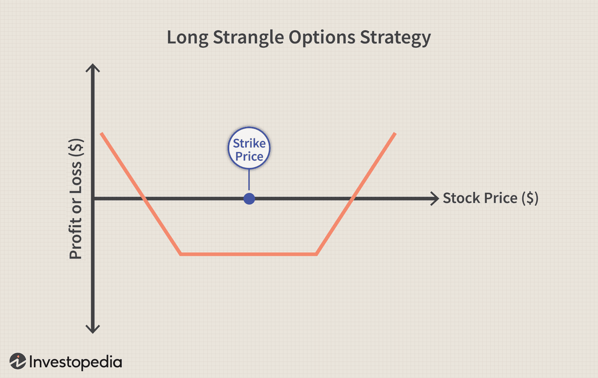

Financial derivatives, particularly options, are essential instruments in financial markets, playing critical roles in hedging, speculation, and arbitrage activities. An option is a financial contract that grants the holder the right, but not the obligation, to buy or sell an underlying asset at a predetermined price within a specified time frame. This flexibility allows options to be uniquely suited to a variety of market conditions, offering strategic advantages for traders aiming to manage risk or capitalize on market movements.

The fusion of options trading with algorithmic trading, often referred to as algo trading, has transformed the landscape of financial markets. Algorithmic trading uses complex algorithms to execute trades at speeds and frequencies that would be impossible for human traders. This automation not only accelerates the trading process but also enhances accuracy and efficiency, minimizing human errors and enabling traders to process and analyze large datasets in real-time.



The integration of cash-based options and algorithmic trading provides traders with a versatile toolkit to navigate the intricacies of financial markets. Cash-based options, which are settled in cash rather than through the physical delivery of an asset, appeal to investors interested in profiting from price movements without taking direct positions in the underlying securities. This form of derivative has risen in popularity, attributed to its simplicity and the efficient price discovery in financial markets.

By examining the dynamics between cash-based options and algorithmic trading, this article aims to present a comprehensive guide for traders eager to harness these powerful financial instruments. Our focus is to highlight the features, benefits, and applications of these tools, offering insights into how traders can optimize their strategies for improved trading outcomes. With the proper understanding and application, cash-based options and algorithmic systems can significantly enhance trading efficiency and profitability in the competitive financial arena.

## Table of Contents

## Understanding Cash-Based Options

Cash-based options are financial derivatives that settle in cash upon expiration or exercise, rather than requiring the actual delivery of the underlying asset. This characteristic provides substantial flexibility for investors who want to capitalize on price movements without holding the asset itself. In essence, investors receive the difference between the market price and the strike price in cash. This cash settlement feature simplifies the process and expense associated with physically acquiring or selling the underlying asset.

A key advantage of cash-based options is their appeal to speculators. By not involving the physical asset, investors can focus purely on price movements, which can lead to significant speculative opportunities. For instance, if an investor believes a particular asset will increase in value, they can buy a cash-based call option. If the market price surpasses the strike price at expiration, the investor earns a profit equal to the difference, absent any physical transaction costs.

The growing popularity of cash-based options is attributed to their simplicity and the efficient price discovery they facilitate. As financial markets have evolved to become more sophisticated, participants increasingly view these instruments as efficient facilitators of market dynamics and information dissemination. This efficiency aids in establishing fair market prices, benefiting all participants with clearer insights and improved trade execution.

Overall, cash-based options offer an efficient, simplified mechanism for engaging with market movements, making them an attractive instrument for investors and traders aiming to speculate or hedge against price [volatility](/wiki/volatility-trading-strategies) without engaging in the logistical complexities of physical asset transactions.

## The Rise of Algorithmic Trading

Algorithmic trading utilizes sophisticated computer algorithms to execute trades in financial markets according to predefined criteria. This revolution in trading technology has drastically enhanced the efficiency, speed, and accuracy of market operations. By employing algorithms, traders automate complex strategies, significantly reducing human error and achieving gains in precision and operational efficiency.

Traditionally, trading required significant manual intervention, which could be both time-consuming and error-prone. Algorithmic trading overcomes these limitations by enabling trades to be executed in microseconds, thereby capitalizing on transient market opportunities that would otherwise be inaccessible to human traders. Moreover, this approach allows for the continuous analysis of vast datasets, enabling traders to make informed decisions based on real-time data. As computational power and data analytics technologies advance, the capability to process large datasets with high speed has become integral to the trading process.

In the context of options trading, algorithmic strategies are increasingly utilized to proficiently manage the complexities of volatile markets and to exploit inefficiencies. Algorithms can analyze a multitude of market parameters, such as price, [volume](/wiki/volume-trading-strategy), and historical trends, to identify trading opportunities that align with predefined strategies. By leveraging statistical and quantitative models, these systems can assess market conditions and execute trades that manage risks effectively. This is particularly useful in options trading, where market volatility and pricing models can present significant challenges.

The implementation of [algorithmic trading](/wiki/algorithmic-trading) requires numerous components and systems working in unison. Fundamental to this approach is the trading algorithm itself, which comprises a set of rules and instructions dictating how and when trades should be made. These algorithms are often based on complex mathematical models and require rigorous testing to ensure they perform as expected in live market conditions.

Critical platforms for algo trading include trading software that interfaces with financial markets, allowing for order placement and execution. These platforms often include features such as [backtesting](/wiki/backtesting), which allows traders to test their algorithms against historical market data. Additionally, connectivity to exchanges and data feeds is essential for the proper functioning of these systems, as it ensures access to real-time market information.

Successful implementation of algorithmic trading also necessitates robust IT infrastructure to support latency-sensitive trading strategies. This includes high-performance computing resources and network capabilities to minimize delays in order transmission and execution, which is vital in fast-moving markets.

In summary, algorithmic trading has transformed the landscape of financial markets by providing tools and technologies that enhance trading capabilities and outcomes. Through automation, vast data processing, and sophisticated execution systems, traders can capitalize on market opportunities with increased speed and reduced error rates.

## Cash-Based Options and Algo Trading Synergy

The integration of cash-based options and algorithmic trading presents a synthesis of advanced financial tools that brings substantial efficiency and strategic advantages to traders. By merging these two elements, traders can achieve a level of precision and speed unattainable through traditional methods.

Algorithmic systems are adept at managing complex option strategies, which typically involve a myriad of calculations and real-time adjustments. These systems can execute trades with minimal human intervention, significantly reducing the scope for human error and emotional biases. One of the standout features of algorithmic trading is its ability to manage risk effectively. Algorithms can be programmed to monitor multiple indicators simultaneously and make immediate strategic adjustments based on pre-set risk parameters. This capability is particularly critical when handling cash-based options, where the timely execution of strategies can impact financial outcomes significantly.

Automated strategies facilitate the trading of cash-based options by optimally adjusting to market fluctuations. Traditional trading can suffer from delays due to human decision-making processes, but algorithmic systems offer the advantage of speed, optimizing entry and [exit](/wiki/exit-strategy) points with precision. This ensures that traders can capitalize on even the smallest price movements, which is crucial in a competitive market environment.

Moreover, algorithms enable traders to capture [arbitrage](/wiki/arbitrage) opportunities efficiently. By continuously scanning for price discrepancies between different markets or securities, these systems can execute trades that exploit these inefficiencies faster than any human trader. Sophisticated hedging strategies also become more manageable with algorithms, which can adjust positions in real-time to maintain the desired risk exposure.

Volatility trading, another area where cash-based options and algorithms converge excellently, is enhanced by the rapid data processing and execution speed that algorithms provide. Traders can deploy algorithms to analyze volatility patterns and execute trades at the optimal moments, thereby improving accuracy and maximizing returns. The synergy between cash-based options and algorithmic trading thus offers a robust framework for traders aiming to excel in today's fast-paced financial markets.

## Implementing Algorithmic Options Strategies

Developing a successful algorithmic trading strategy for options requires precision in formulating trading rules, selecting appropriate platforms, and conducting rigorous backtesting. The foundation of any robust algorithmic system is the data utilized to train and test the algorithms. Traders should prioritize high-quality data, comprising both historical and real-time market information, to ensure the reliability of their strategies. Accurate data allows for effective prediction and adaptation to market trends, which is crucial for maintaining a competitive edge.

**Data Quality**

The importance of data quality cannot be overstated in algorithmic options trading. Historical data provides insights into past market behaviors, while real-time data offers current market conditions, enabling the algorithm to respond swiftly to changes. Traders should source data from reputable providers and ensure it undergoes preprocessing to eliminate any anomalies that could skew results. Techniques such as normalizing data and handling missing values are critical steps in preparing datasets for algorithmic analysis.

**Key Strategies**

Several core strategies are frequently employed in algorithmic options trading:

1. **Delta Hedging**: This involves creating a neutral position with respect to the option's delta, which measures the sensitivity of the option's price to changes in the price of the underlying asset. By dynamically adjusting the hedge, traders can mitigate risk associated with price movements of the underlying asset. The delta ($\Delta$) is mathematically represented as:
$$
   \Delta = \frac{\partial V}{\partial S}

$$

   where $V$ is the price of the option and $S$ is the price of the underlying asset.

2. **Volatility Arbitrage**: This strategy capitalizes on discrepancies between the forecasted volatility of an asset and the implied volatility reflected in the option’s price. Traders can execute trades when they perceive the market has mispriced the option, expecting the volatility to revert to its historical norms.

3. **Spread Trading**: By simultaneously buying and selling different options on the same underlying asset, traders can exploit pricing inefficiencies while managing risk. Common spreads like straddles, strangles, and butterflies enable traders to profit from volatility or price changes in the underlying asset.

**Optimization and Backtesting**

Optimization involves refining strategies to enhance their performance. Traders must be cautious to avoid over-optimization, where a strategy is too tailored to historical data and performs poorly in live markets. Backtesting is essential in validating a strategy's effectiveness by applying it to historical data and evaluating its performance. A robust backtesting framework simulates market conditions and allows traders to assess potential returns and risks before deploying the algorithm in real trading environments.

The use of mathematical and statistical models, along with programming languages like Python, is integral in the development and optimization of algorithmic strategies. Python, with its comprehensive libraries such as NumPy and Pandas, facilitates complex calculations and data manipulation required in backtesting and optimization.

```python
import numpy as np
import pandas as pd

# Example: Calculate the moving average as a simple indicator
def moving_average(data, window_size):
    return data.rolling(window=window_size).mean()

# Simulating a dataset
np.random.seed(42)
prices = np.random.normal(loc=100, scale=10, size=1000)
data = pd.Series(prices)

# Compute the 30-day moving average
ma_30 = moving_average(data, window_size=30)

print(ma_30.tail())
```

By implementing a systematic approach that integrates high-quality data and sophisticated strategies like delta hedging, volatility arbitrage, and spread trading, traders can develop algorithmic options strategies that enhance profitability and manage risk effectively. The strategic use of backtesting and optimization ensures that these strategies are robust and adaptable to diverse market scenarios.

## Risk Management in Algorithmic Options Trading

Proper risk management is essential in algorithmic options trading to navigate the complexities and inherent risks of financial markets. Given the sophisticated nature of options and the speed of algorithmic executions, traders must establish robust frameworks to manage potential losses and ensure long-term profitability.

One of the foundational steps is to define clear risk parameters. These parameters may include setting stop-loss orders, which automatically sell or buy to close a position at a predefined unfavorable price, and take-profit levels, where profits are locked in once a target price is reached. This ensures that traders are both preserving capital and securing gains without human intervention.

Adapting algorithms to ever-changing market conditions is critical. By designing adaptive algorithms, traders ensure their systems can respond to different market scenarios. This might involve dynamic position sizing, adjusting the number of contracts traded based on volatility or market conditions, which can be programmed using simple algorithmic rules in Python:

```python
def adjust_position_size(volatility, base_size):
    if volatility > 0.02:
        return base_size * 0.5  # Reduce size in high volatility
    elif volatility < 0.01:
        return base_size * 1.5  # Increase size in low volatility
    else:
        return base_size

current_size = adjust_position_size(market_volatility, base_position_size)
```

Regular monitoring and performance evaluation of these algorithms are necessary to ensure consistent results. This includes analyzing algorithm outputs and tweaking parameters to reflect current trading environments. Backtesting strategies against historical data and real-time data analysis allow traders to understand how algorithms might perform and adapt for future transactions.

A crucial aspect of options trading is the management of 'the Greeks', which measure various risks associated with options:

- Delta ($\Delta$): Sensitivity of option price to changes in the underlying asset's price.
- Gamma ($\Gamma$): Rate of change of Delta.
- Theta ($\Theta$): Time decay of option value.
- Vega ($\nu$): Sensitivity to volatility changes.
- Rho ($\rho$): Sensitivity to interest rate changes.

Consistent monitoring and management of these Greeks help maintain a balanced and hedged portfolio. For example, delta-neutral strategies can be used to mitigate directional risk by ensuring that the overall delta is near zero.

Diversification is another risk management strategy. By distributing trades across various sectors or instruments, traders reduce the risk of significant losses from a single market movement. Stress-testing portfolios is also vital, which involves simulating adverse market conditions to assess the potential impact on portfolios. This can be done through scenario analysis and stress testing software, allowing traders to mitigate unexpected market events.

In summary, effective risk management in algorithmic options trading includes establishing predefined risk parameters, algorithm adaptability, constant performance monitoring, Greeks management, portfolio diversification, and comprehensive stress-testing. These practices collectively safeguard trading portfolios, enabling traders to engage in the financial markets with greater confidence and resilience.

## Challenges and Considerations

Integrating cash-based options with algorithmic trading presents several challenges that traders must address to maintain the effectiveness of their strategies. One of the primary risks is technical glitches. These are often caused by unforeseen bugs in the trading algorithms or system failures. Such technical issues can lead to incorrect order executions, which might result in substantial financial losses. To mitigate this risk, robust software development practices should be employed, including comprehensive testing and continuous monitoring of the systems.

Over-optimization is another significant challenge faced by traders using algorithmic strategies. This occurs when an algorithm is excessively fine-tuned to perform well on historical data but fails to generalize to new, unseen data. This phenomenon, known as overfitting, can lead to poor real-world performance. To prevent over-optimization, traders should ensure their algorithms are tested across varied datasets and market conditions. Techniques such as cross-validation and out-of-sample testing are essential in maintaining a balance between model complexity and predictive accuracy.

Market upheavals pose additional threats to algorithmic trading systems. Sudden changes in market conditions, such as those caused by geopolitical events or economic announcements, can render existing strategies ineffective. Traders must design their algorithms to be adaptable, incorporating mechanisms such as dynamic parameter adjustment and risk management features to respond to these changes rapidly. Stress testing, which simulates extreme market conditions, can also be a valuable tool in assessing how algorithms will perform under such circumstances.

Regulatory compliance is another critical consideration. Algorithmic trading is subject to a range of regulatory frameworks that vary by jurisdiction. Traders must ensure their strategies comply with these regulations to avoid legal repercussions. This includes implementing controls to prevent market abuse, such as the manipulation of prices or unlawful trading practices. Keeping abreast of regulatory changes and adapting strategies accordingly is vital.

Continuous improvement and rigorous backtesting are essential components of a successful algorithmic trading strategy. Backtesting involves simulating how a strategy would have performed in the past, using historical data to assess its effectiveness. However, traders must use high-quality, accurate data to avoid misleading results. This process should be supplemented by regular evaluation and refinement of the algorithm to incorporate new market information and technological advancements.

In summary, while the integration of cash-based options with algorithmic trading presents numerous opportunities, traders must navigate various challenges. By addressing technical risks, avoiding over-optimization, ensuring adaptability to market changes, maintaining regulatory compliance, and committing to ongoing strategy enhancement, traders can develop robust systems capable of withstanding diverse market scenarios.

## Conclusion

Cash-based options, when combined with the power of algorithmic trading, form an essential component in the toolkit of contemporary traders aiming to enhance efficiency and boost returns. This synergy allows traders to effectively navigate the complex landscapes of financial markets by leveraging precise, automated systems that require minimal human oversight. The integration of cash-based options and algorithmic strategies fosters a robust framework for executing trades with improved accuracy and speed, while minimizing the typical human errors associated with manual trading.

Traders equipped with a comprehensive understanding of these tools and the ability to implement sophisticated trading algorithms can unlock the full potential of options trading. This involves not only setting up algorithms that can dynamically adjust to market conditions but also rigorously testing and optimizing these systems to ensure consistent performance over time. The result is a trading approach that not only manages risks effectively but also seizes opportunities for arbitrage and profit maximization more efficiently than traditional methods.

Ultimately, the integration of cash-based options and algorithmic trading techniques can significantly enhance trading outcomes. This synergy provides traders with a competitive advantage in the ever-evolving financial landscape, allowing them to achieve superior results through strategic innovation and technological advancement. By continually refining their strategies and tools, traders can secure a formidable edge in the competitive arena of financial markets.

## References & Further Reading

[1]: Bergstra, J., Bardenet, R., Bengio, Y., & Kégl, B. (2011). ["Algorithms for Hyper-Parameter Optimization."](https://dl.acm.org/doi/10.5555/2986459.2986743) Advances in Neural Information Processing Systems 24.

[2]: ["Advances in Financial Machine Learning"](https://www.amazon.com/Advances-Financial-Machine-Learning-Marcos/dp/1119482089) by Marcos Lopez de Prado

[3]: ["Evidence-Based Technical Analysis: Applying the Scientific Method and Statistical Inference to Trading Signals"](https://www.amazon.com/Evidence-Based-Technical-Analysis-Scientific-Statistical/dp/0470008741) by David Aronson

[4]: ["Machine Learning for Algorithmic Trading"](https://github.com/stefan-jansen/machine-learning-for-trading) by Stefan Jansen

[5]: ["Quantitative Trading: How to Build Your Own Algorithmic Trading Business"](https://www.amazon.com/Quantitative-Trading-Build-Algorithmic-Business/dp/1119800064) by Ernest P. Chan