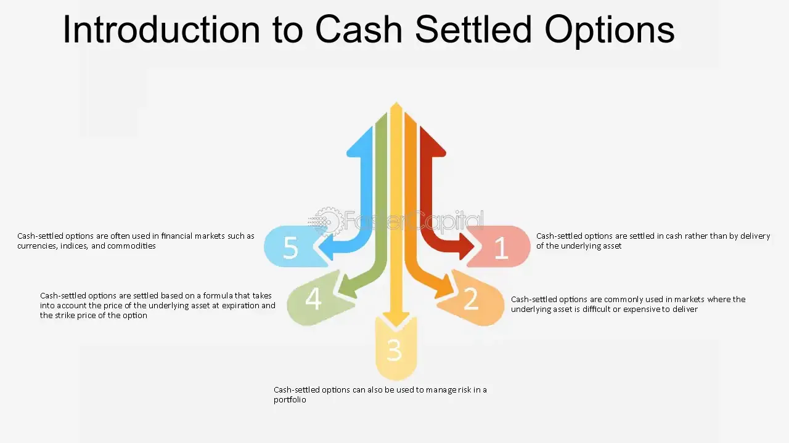

## Table of Contents

## What is a cash-based option?

A cash-based option is a type of financial agreement where the payment for the option is made in cash instead of using the underlying asset. This means that if you have a cash-based option, you don't have to buy or sell the actual thing the option is about, like stocks or commodities. Instead, you just pay or receive money based on the option's value at the time it expires.

These options are often used in financial markets to manage risk or to speculate on price movements without needing to handle the physical asset. For example, if you think the price of oil will go up, you can buy a cash-based option on oil. If the price does go up, you get paid the difference in cash, without ever having to deal with actual oil. This makes cash-based options a flexible tool for investors and traders.

## How does a cash-based option differ from a traditional stock option?

A cash-based option and a traditional stock option both give you the right to buy or sell something, but they work differently when it comes to payment and what you actually get. With a traditional stock option, if you decide to use your option, you end up buying or selling the actual stock. For example, if you have an option to buy 100 shares of a company, exercising that option means you'll get those 100 shares.

On the other hand, a cash-based option doesn't involve trading the actual asset. Instead, if you use your cash-based option, you'll just get paid in cash based on how much the value of the asset has changed. So, if you have an option on the same company's stock but it's cash-based, you won't get the stock itself. You'll just receive money if the stock's price moves in the direction you expected. This makes cash-based options easier to handle because you don't have to worry about what to do with the actual stock or asset.

## What are the key features of a cash-based option?

A cash-based option is a type of financial agreement where you don't actually buy or sell the thing the option is about. Instead, you just get paid in cash based on how much the value of that thing changes. For example, if you have a cash-based option on a stock, you won't get the stock itself. You'll just get money if the stock's price goes up or down in the way you expected.

These options are useful because they let you make money from price changes without having to deal with the actual asset. This makes them easier to use, especially if you don't want to handle stocks, commodities, or other things directly. Cash-based options are popular in financial markets for people who want to manage risk or bet on price movements without the hassle of owning the asset.

## Who typically uses cash-based options and why?

Cash-based options are often used by investors and traders who want to bet on price changes without having to own the actual thing, like stocks or commodities. These people might be interested in making money from how prices move up or down, but they don't want to deal with buying or selling the real asset. For example, a trader might use a cash-based option on oil prices to make money if they think oil prices will go up, without having to buy actual oil.

Another group that uses cash-based options are businesses and companies looking to manage their risk. If a company knows it will need to buy a certain amount of a product in the future, like wheat for a bakery, they might use a cash-based option to protect themselves from price changes. This way, they can make sure they won't lose too much money if the price of wheat goes up a lot before they need to buy it. It's a way for them to feel more secure about their future costs.

## How are cash-based options priced?

Cash-based options are priced based on several things that can affect their value. One big thing is the current price of the thing the option is about, like a stock or commodity. If the price of that thing goes up, the option usually becomes more valuable. Another thing that matters is how much time is left until the option expires. The more time left, the more valuable the option can be because there's more time for the price to move in a way that could make you money. Also, something called "[volatility](/wiki/volatility-trading-strategies)" is important. This means how much the price of the thing goes up and down. If it moves a lot, the option can be more valuable because there's a bigger chance for big price changes.

Another thing that affects the price of cash-based options is the [interest rate](/wiki/interest-rate-trading-strategies). Higher interest rates can make the option more valuable because they affect how much money you could make by waiting to use the option. And there's also something called the "strike price," which is the price at which you can buy or sell the thing the option is about. If the current price is far away from the strike price, the option might be less valuable because it's less likely to be used. All these things together help decide how much a cash-based option is worth, and traders use special math formulas, like the Black-Scholes model, to figure out the exact price.

## What are the tax implications of trading cash-based options?

When you trade cash-based options, you need to think about taxes. If you make money from your options, you have to pay taxes on those profits. The tax you pay depends on how long you held the option before selling it. If you held it for less than a year, the profit is taxed as regular income. This can be at a higher rate, depending on your income level. But if you held the option for more than a year, the profit might be taxed at a lower rate, called the long-term capital gains rate.

It's also important to know that you can't use losses from cash-based options to offset all your income. You can only use these losses to reduce other capital gains you might have. If you have more losses than gains, you can use up to $3,000 of those losses to lower your regular income each year. Any extra losses can be carried over to future years. Always talk to a tax professional to make sure you're doing everything right, because tax rules can change and be different for everyone.

## Can you explain the settlement process for cash-based options?

When a cash-based option reaches its expiration date, the process of settling it is pretty straightforward. Unlike traditional options where you would actually buy or sell the asset, with cash-based options, you just get paid in cash. If you have a call option and the price of the asset is higher than the strike price at expiration, you'll get the difference between the market price and the strike price in cash. If you have a put option and the price is lower than the strike price, you'll also get the difference in cash.

The settlement happens automatically through a clearinghouse, which is like a middleman that makes sure everything goes smoothly. They calculate the final value of your option based on the closing price of the asset on the expiration day. Then, they transfer the cash directly into your trading account. This makes it easy because you don't have to do anything after you buy the option; the cash just shows up in your account if your option ends up being worth something.

## What are the risks associated with cash-based options?

Trading cash-based options can be risky. One big risk is that you could lose all the money you put into the option if the price of the asset doesn't move the way you thought it would. For example, if you buy a call option and the price stays the same or goes down, your option could end up being worthless, and you lose what you paid for it. This is called the risk of the option expiring worthless.

Another risk is that options can be hard to understand and predict. Even if you think you know which way the price will go, it might do something different. This can happen because of things like unexpected news or changes in the market. Also, options can be affected by how much the price of the asset goes up and down, which is called volatility. If the price moves a lot, it can make your option more valuable, but it can also make it riskier because you can't be sure what will happen.

Lastly, there's the risk of not understanding all the costs involved. Besides the price you pay to buy the option, there might be other fees like trading costs or taxes that you have to pay. If you don't think about all these costs, you might end up losing money even if your option does okay. It's important to know all the risks and costs before you start trading cash-based options.

## How do cash-based options fit into a broader investment strategy?

Cash-based options can be a useful part of a bigger investment plan. They let you make money from price changes without actually buying or selling the thing the option is about. This can be good if you want to bet on the price of something going up or down, but don't want to own it. For example, if you think the price of gold will go up, you can buy a cash-based option on gold. If the price does go up, you get paid in cash without having to deal with actual gold. This makes them a flexible tool for people who want to make money from price movements without the hassle of owning the asset.

Another way cash-based options fit into a broader investment strategy is by helping to manage risk. If you own a lot of a certain stock, you can use cash-based options to protect yourself if the stock's price goes down. For example, if you own shares in a tech company, you might buy a cash-based put option on that company's stock. If the stock's price falls, the option will pay you money to help cover your losses. This way, you can feel more secure about your investments. Using cash-based options like this can help you balance your portfolio and manage risk, making them a valuable part of a smart investment strategy.

## What are some common strategies for trading cash-based options?

One common strategy for trading cash-based options is called buying calls. If you think the price of something, like a stock or commodity, will go up, you can buy a call option. This gives you the right to get paid in cash if the price goes above a certain level by the time the option expires. It's a way to make money from price increases without actually buying the thing itself. For example, if you think the price of oil will go up, you can buy a call option on oil. If the price does go up, you get paid the difference in cash, without ever having to deal with actual oil.

Another strategy is buying puts. This is what you do if you think the price of something will go down. By buying a put option, you can get paid in cash if the price falls below a certain level before the option expires. It's like betting against the price, and it can be useful if you want to protect other investments you have. For example, if you own a lot of a certain stock, you might buy a put option on that stock to make money if its price drops, helping to cover any losses you might have on the stock itself.

A third strategy is called a straddle. This involves buying both a call and a put option on the same thing at the same time, with the same expiration date and strike price. You do this if you think the price will move a lot, but you're not sure which way. If the price goes up a lot, the call option pays you. If it goes down a lot, the put option pays you. Either way, you can make money if there's a big move in the price. This strategy can be useful when you expect big news or events that could shake up the market.

## How do regulatory environments affect cash-based options?

Regulatory environments can have a big impact on how cash-based options work. Different countries have different rules about who can trade these options, how they can be traded, and what kind of information has to be shared. For example, in some places, you might need to be a professional trader to buy or sell cash-based options. In other places, anyone can do it. These rules are there to make sure that trading is fair and that people don't get cheated. If the rules change, it can affect how much money you can make or lose from trading these options.

Another way regulations affect cash-based options is by setting limits on how much you can trade. Some countries might have rules about how many options you can buy or sell at one time. This is to stop people from making the market too crazy or from trying to control prices. Also, regulators might ask for more information about trades to make sure everything is above board. If you're thinking about trading cash-based options, it's important to know the rules in your area so you don't get into trouble and can trade safely.

## What advanced techniques can be used to optimize returns from cash-based options?

One advanced technique to optimize returns from cash-based options is called delta hedging. This means you buy or sell the thing the option is about, like a stock, to balance out the risk of the option. For example, if you buy a call option on a stock, you might also sell some of that stock. This way, if the stock's price goes down, the money you lose on the option might be made up by the money you make from selling the stock. It's like playing both sides to keep your overall risk lower and your potential returns higher.

Another technique is using options spreads. This means you buy and sell different options on the same thing at the same time. For example, you might buy a call option with a low strike price and sell a call option with a higher strike price. This can help you make money if the price of the thing goes up, but it also limits how much you can lose if the price doesn't move the way you want. It's a way to fine-tune your strategy and manage risk while trying to get the best possible return from your options.

Lastly, you can use a technique called volatility trading. This involves buying and selling options based on how much the price of the thing goes up and down. If you think the price will move a lot, you can buy options to make money from that movement. If you think the price will stay steady, you might sell options to make money from the calm. This way, you're not just betting on the price going up or down, but on how much it changes. It can be a powerful way to optimize returns if you're good at predicting how wild the market will be.

## How can one implement algorithmic options strategies?

Developing a successful [algorithmic trading](/wiki/algorithmic-trading) strategy for options requires precision in formulating trading rules, selecting appropriate platforms, and conducting rigorous [backtesting](/wiki/backtesting). The foundation of any robust algorithmic system is the data utilized to train and test the algorithms. Traders should prioritize high-quality data, comprising both historical and real-time market information, to ensure the reliability of their strategies. Accurate data allows for effective prediction and adaptation to market trends, which is crucial for maintaining a competitive edge.

**Data Quality**

The importance of data quality cannot be overstated in algorithmic options trading. Historical data provides insights into past market behaviors, while real-time data offers current market conditions, enabling the algorithm to respond swiftly to changes. Traders should source data from reputable providers and ensure it undergoes preprocessing to eliminate any anomalies that could skew results. Techniques such as normalizing data and handling missing values are critical steps in preparing datasets for algorithmic analysis.

**Key Strategies**

Several core strategies are frequently employed in algorithmic options trading:

1. **Delta Hedging**: This involves creating a neutral position with respect to the option's delta, which measures the sensitivity of the option's price to changes in the price of the underlying asset. By dynamically adjusting the hedge, traders can mitigate risk associated with price movements of the underlying asset. The delta ($\Delta$) is mathematically represented as:
$$
   \Delta = \frac{\partial V}{\partial S}

$$

   where $V$ is the price of the option and $S$ is the price of the underlying asset.

2. **Volatility Arbitrage**: This strategy capitalizes on discrepancies between the forecasted volatility of an asset and the implied volatility reflected in the option’s price. Traders can execute trades when they perceive the market has mispriced the option, expecting the volatility to revert to its historical norms.

3. **Spread Trading**: By simultaneously buying and selling different options on the same underlying asset, traders can exploit pricing inefficiencies while managing risk. Common spreads like straddles, strangles, and butterflies enable traders to profit from volatility or price changes in the underlying asset.

**Optimization and Backtesting**

Optimization involves refining strategies to enhance their performance. Traders must be cautious to avoid over-optimization, where a strategy is too tailored to historical data and performs poorly in live markets. Backtesting is essential in validating a strategy's effectiveness by applying it to historical data and evaluating its performance. A robust backtesting framework simulates market conditions and allows traders to assess potential returns and risks before deploying the algorithm in real trading environments.

The use of mathematical and statistical models, along with programming languages like Python, is integral in the development and optimization of algorithmic strategies. Python, with its comprehensive libraries such as NumPy and Pandas, facilitates complex calculations and data manipulation required in backtesting and optimization.

```python
import numpy as np
import pandas as pd

# Example: Calculate the moving average as a simple indicator
def moving_average(data, window_size):
    return data.rolling(window=window_size).mean()

# Simulating a dataset
np.random.seed(42)
prices = np.random.normal(loc=100, scale=10, size=1000)
data = pd.Series(prices)

# Compute the 30-day moving average
ma_30 = moving_average(data, window_size=30)

print(ma_30.tail())
```

By implementing a systematic approach that integrates high-quality data and sophisticated strategies like delta hedging, volatility [arbitrage](/wiki/arbitrage), and spread trading, traders can develop algorithmic options strategies that enhance profitability and manage risk effectively. The strategic use of backtesting and optimization ensures that these strategies are robust and adaptable to diverse market scenarios.

## References & Further Reading

[1]: Bergstra, J., Bardenet, R., Bengio, Y., & Kégl, B. (2011). ["Algorithms for Hyper-Parameter Optimization."](https://dl.acm.org/doi/10.5555/2986459.2986743) Advances in Neural Information Processing Systems 24.

[2]: ["Advances in Financial Machine Learning"](https://www.amazon.com/Advances-Financial-Machine-Learning-Marcos/dp/1119482089) by Marcos Lopez de Prado

[3]: ["Evidence-Based Technical Analysis: Applying the Scientific Method and Statistical Inference to Trading Signals"](https://www.amazon.com/Evidence-Based-Technical-Analysis-Scientific-Statistical/dp/0470008741) by David Aronson

[4]: ["Machine Learning for Algorithmic Trading"](https://github.com/stefan-jansen/machine-learning-for-trading) by Stefan Jansen

[5]: ["Quantitative Trading: How to Build Your Own Algorithmic Trading Business"](https://www.amazon.com/Quantitative-Trading-Build-Algorithmic-Business/dp/1119800064) by Ernest P. Chan