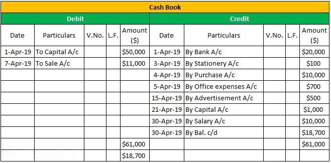

In the world of finance and accounting, bookkeeping, cash books, and algorithmic trading are integral components. Bookkeeping forms the foundation of accurate financial management by ensuring every transaction is recorded methodically. This meticulous recording enhances transparency and accountability, enabling businesses to make informed financial decisions. The cash book plays a pivotal role within this framework, acting as a comprehensive record of all cash inflows and outflows. It functions as both a journal and a ledger, maintaining an ongoing, precise log of cash movements. This capability is crucial for businesses aiming to track cash flow and manage daily finances efficiently.

Meanwhile, algorithmic trading transforms the financial trading landscape by employing sophisticated algorithms to automate trading processes. These algorithms analyze vast datasets to execute trades under optimal conditions, thereby maximizing efficiency and profitability. The reliance on precise accounting data in such systems underscores the interconnectedness of robust bookkeeping and successful trading strategies. As finance evolves, these elements collaborate to streamline operations and enhance decision-making capabilities. Understanding their individual functions and interactions is essential for businesses poised to harness their full potential.



## Table of Contents

## Understanding Financial Bookkeeping

Financial bookkeeping encompasses the systematic process of documenting a company's financial transactions comprehensively and accurately. This function is critical to building an integrated financial framework that supports both strategic planning and routine operational decision-making. Accurate bookkeeping ensures that a business can track its financial performance, comply with statutory accounting regulations, and respond effectively to audits.

The foundation of financial bookkeeping lies in three core components: ledgers, journals, and the supporting documents for each transaction. Ledgers serve as the central repository for all financial data, categorizing expenses, revenues, assets, and liabilities to provide a precise overall picture of an organization’s financial health. Journals, on the other hand, act as preliminary records, capturing transaction details before they are posted to the ledger. Each journal entry records both a credit and a debit, adhering to the double-entry bookkeeping system, which is the standard in most modern accounting practices.

Consider a simple transaction: a business purchasing goods worth $1,000 on credit. The journal entry would record a debit of $1,000 to the inventory account and a credit of $1,000 to the accounts payable, reflecting the increase in assets and liabilities respectively.

The reliability of financial bookkeeping also hinges on the source documents that confirm each transaction's occurrence. These documents—such as invoices, receipts, purchase orders, and bank statements—validate the transactions recorded in journals and ledgers, offering evidence that is indispensable for audits and financial reviews.

Bookkeeping plays an essential role in maintaining compliance with financial reporting standards and regulations. By meticulously recording transactions, businesses can produce accurate financial statements, such as the balance sheet, income statement, and cash flow statement, which collectively present the enterprise's financial position and performance during a specific period.

Moreover, sound financial bookkeeping sets the stage for effective financial management. With clear, accurate records, businesses can engage in meaningful financial analysis, identify trends, make forecasts, and set realistic budgets. This foundational accuracy drives strategic business decisions, supporting long-term growth and success.

In conclusion, financial bookkeeping acts as the backbone of an organization's financial integrity. By ensuring that financial data is both accurate and complete, it empowers businesses to make informed decisions, achieve compliance, and lay a sturdy groundwork for future financial endeavors.

## The Role of Cash Books in Accounting

A cash book is an integral component of accounting that records all cash receipts and payments. Functionally, it operates as both a ledger and a journal, ensuring that every cash transaction is meticulously documented. This dual role facilitates accurate and efficient recording, minimizing the risks of errors that could affect the financial statements of an organization.

Cash [books](/wiki/algo-trading-books) are categorized into three primary formats: single-column, double-column, and triple-column. The single-column cash book focuses solely on cash transactions, making it suitable for small businesses or individuals with straightforward financial activities. It records receipts on the debit side and payments on the credit side, enabling a clear view of available cash at any moment.

The double-column cash book introduces an additional layer by including either bank or discount transactions alongside cash transactions. This dual structure offers a more detailed financial record, allowing businesses to account for non-cash payment methods, such as checks or bank drafts, that are increasingly common in contemporary transactions.

For more comprehensive financial management, the triple-column cash book encompasses columns for cash, bank, and discount transactions. This format provides a holistic view of a company’s financial dealings, ensuring that every transaction type is captured and analyzed, which aids in meticulous cash flow management and strategic financial planning.

Utilizing a cash book allows businesses to keep a daily record of their financial activities, ensuring efficient tracking of cash inflow and outflow. By maintaining an accurate account of daily cash balances, organizations can better predict cash needs and make informed decisions regarding investments, expenditures, and other financial strategies. The meticulous maintenance of a cash book also simplifies the auditing process, as it presents clear and organized records of all cash movements within a business.

## Examples of Cash Book Accounting

The cash book serves as a pivotal tool in maintaining financial records by systematically logging all cash transactions. There are several variants of cash books, each designed to cater to different financial reporting needs. Understanding the distinctions between these types is essential for accurately managing and recording financial transactions.

Single Column Cash Book is often employed by small businesses or individuals with straightforward financial activities. This format is characterized by its simplicity, designed to record only cash transactions. The cash book accounts for each cash receipt and payment and typically features columns for the date, description, and cash amount. This type of bookkeeping is both practical and efficient for entities that primarily operate on a cash basis and do not handle complex transactions.

On the other hand, the Double Column Cash Book provides a more detailed financial overview by incorporating an additional column for either cash or bank transactions. This type of cash book serves those businesses that deal with both cash and banking transactions regularly. The two columns for cash and bank allow businesses to track cash flow and bank dealings concurrently, providing a holistic view of their daily financial activities. This dual focus on cash and bank transactions helps businesses manage their operational finances more effectively.

Finally, the Triple Column Cash Book offers the most comprehensive view by incorporating columns for cash, bank, and discount transactions. This format is particularly useful for larger businesses with a higher [volume](/wiki/volume-trading-strategy) of transactions that also involve frequent discounts. The inclusion of a discount column allows for immediate recording of any trade discounts offered or received. In this way, businesses can reconcile their accounts seamlessly and reflect the true nature of their financial activities. The Triple Column Cash Book's detailed approach supports enhanced financial analysis and strategic decision-making.

In summary, the selection of an appropriate cash book format depends on the complexity and volume of financial transactions a business encounters. Single, double, and triple column cash books each serve specific needs, providing varying levels of detail and clarity in financial reporting.

 to Algorithmic Trading

Algorithmic trading employs the use of automated systems that follow pre-set rules to execute orders precisely and at high speeds. These systems leverage sophisticated algorithms capable of analyzing vast volumes of financial data efficiently. The process involves identifying trading opportunities that fit specific predefined criteria such as timing, price, and quantity. By using algorithms, traders can rapidly process information and make decisions, significantly surpassing the cognitive capabilities and reaction times of human traders.

The primary goal of [algorithmic trading](/wiki/algorithmic-trading) is to enhance trading efficiency and profitability by minimizing human error and emotional bias. This is achieved through the design and implementation of strategies that operate under precise conditions, thus eliminating inconsistencies associated with manual trading. By automating these processes, algorithmic trading enables the execution of complex calculations and decision-making at speeds unattainable by humans.

One common algorithmic trading strategy is statistical [arbitrage](/wiki/arbitrage), which capitalizes on price discrepancies between securities to generate profit. Here, algorithms continuously analyze market data to detect arbitrage opportunities and execute trades instantaneously. High-frequency trading ([HFT](/wiki/high-frequency-trading-strategies)) is another example, where thousands of trades are executed in fractions of a second, benefiting from the smallest price movements. These activities rely on robust technological infrastructure and require continuous refinement of trading algorithms to maintain a competitive edge.

To illustrate, consider a Python-based algorithm designed to trade based on moving averages. This strategy might involve calculating the short-term and long-term moving averages of a stock's price. When the short-term average crosses above the long-term average, a buy signal is triggered; conversely, when it crosses below, a sell signal is initiated. 

Here’s a basic example:

```python
import pandas as pd
import numpy as np

def moving_average_strategy(data, short_window=40, long_window=100):
    signals = pd.DataFrame(index=data.index)
    signals['signal'] = 0.0

    # Create short and long simple moving averages
    signals['short_mavg'] = data['close'].rolling(window=short_window, min_periods=1).mean()
    signals['long_mavg'] = data['close'].rolling(window=long_window, min_periods=1).mean()

    # Create signals
    signals['signal'][short_window:] = np.where(signals['short_mavg'][short_window:] 
                                                  > signals['long_mavg'][short_window:], 1.0, 0.0)   

    # Generate trading orders
    signals['positions'] = signals['signal'].diff()

    return signals

# Example usage
# data would be a DataFrame containing historical stock prices with a 'close' column
signals = moving_average_strategy(data)
```

This example underscores the capability of algorithmic trading to incorporate structured rules, enhancing the objectivity and speed of trading actions.

Algorithmic trading systems continue to evolve, with advancements in technology enabling more complex and adaptive strategies, including [machine learning](/wiki/machine-learning) algorithms that can learn and adjust parameters dynamically based on real-time data. This evolution points to a future where trading decisions are increasingly driven by data analytics and automation, offering enhanced precision and strategic advantage in financial markets.

## Integration of Bookkeeping in Algo Trading

Accurate financial records obtained through meticulous bookkeeping play a crucial role in enhancing the effectiveness of algorithmic trading models. In the financial markets, where decisions need to be made swiftly and accurately, the integrity and precision of data inputs are vital. Bookkeeping systems that are well-maintained ensure that these financial records are comprehensive and error-free, which is essential for the performance of algorithmic trading strategies.

Algorithmic trading relies on algorithms that process vast amounts of financial data to execute trades at optimal conditions. These algorithms require data inputs that are timely and accurate, typically supplied by robust bookkeeping practices. The integration of real-time financial data into algorithmic models allows traders to make immediate decisions based on current market conditions. For instance, variations in cash flows, profit and loss statements, or balance sheets, if accurately captured and recorded, can influence algorithmic trading decisions significantly, allowing for more dynamic and responsive trading strategies.

Moreover, good bookkeeping practices help mitigate risks associated with incorrect or omitted data inputs, which can lead to substantial financial discrepancies when used in algorithmic models. For algorithmic trading to perform efficiently, it is essential that all financial transactions are recorded with precision, and all necessary financial documents are meticulously updated. Inaccuracies or missing data can create significant anomalies in the performance of trading algorithms. By ensuring data integrity, businesses can reduce errors, ultimately protecting themselves from the potential losses associated with faulty trading signals.

In conclusion, the seamless integration of precise bookkeeping with algorithmic trading mechanisms enhances decision-making and risk management in trading operations. Accurate and timely financial data from bookkeeping not only supports robust trading algorithms but also optimizes their performance, contributing to achieving strategic financial objectives.

## Conclusion

The convergence of bookkeeping, cash books, and algorithmic trading highlights the critical importance of maintaining accurate financial data in modern finance. Sound financial bookkeeping serves as the foundation for successful algorithmic trading strategies. Accurate and up-to-date financial records ensure that the algorithms responsible for executing trades have access to reliable data, thereby minimizing the risk of errors and enhancing the decision-making process.

Companies that effectively leverage refined cash book practices stand to optimize their trading algorithms further. By maintaining meticulous records of cash transactions, businesses can improve cash flow management, leading to more informed trading decisions. For instance, precise cash books enable firms to quickly identify [liquidity](/wiki/liquidity-risk-premium) positions, allowing algorithms to [factor](/wiki/factor-investing) in real-time cash availability to execute trades that capitalize on market conditions efficiently.

As the financial landscape continues to evolve, the integration of these domains proves instrumental in enhancing operational efficiency. Advanced algorithmic trading relies increasingly on accurate and comprehensive financial data sourced from diligent bookkeeping practices. This necessitates an ongoing commitment to integrating technological advancements in bookkeeping and trading systems, fostering a seamless flow of information across financial operations.

In summary, the intersection of bookkeeping, cash books, and algorithmic trading underscores the non-negotiable necessity for precise financial data management. This integration not only boosts the accuracy and efficiency of trading but also fortifies the overall financial health and strategic agility of businesses.

## References & Further Reading

[1]: ["Principles of Accounting"](https://openstax.org/details/books/principles-financial-accounting/) by Dr. Larry M. Walther

[2]: Bodie, Z., Kane, A., & Marcus, A. J. (2019). ["Investments"](https://www.mheducation.com/highered/product/investments-bodie-kane/M9781264412662.html). McGraw-Hill Education.

[3]: Hull, J. C. (2017). ["Options, Futures, and Other Derivatives"](https://www.pearson.com/en-us/subject-catalog/p/options-futures-and-other-derivatives/P200000005938/9780136939917). Pearson.

[4]: ["Algorithmic Trading: Winning Strategies and Their Rationale"](https://www.wiley.com/en-us/Algorithmic+Trading%3A+Winning+Strategies+and+Their+Rationale-p-9781118460146) by Ernie Chan

[5]: Pardo, R. (2008). ["The Evaluation and Optimization of Trading Strategies"](https://onlinelibrary.wiley.com/doi/book/10.1002/9781119196969). Wiley.