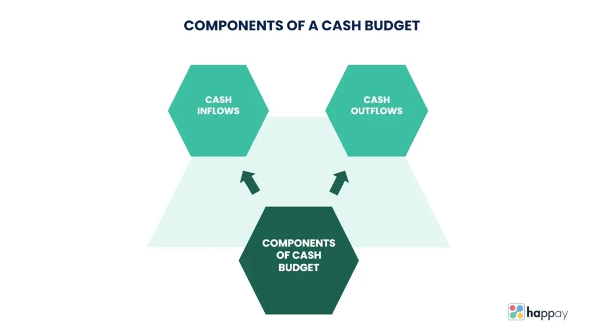

## Table of Contents

## What is a cash budget and why is it important for businesses?

A cash budget is a plan that shows how much money a business expects to receive and spend over a certain time, usually a month or a year. It helps a business keep track of its cash flow, which is the money coming in and going out. By making a cash budget, a business can see if it will have enough money to pay its bills, buy supplies, and keep running smoothly.

Having a cash budget is important for businesses because it helps them avoid running out of money. If a business knows when it will have more money coming in than going out, it can plan better. This can help the business make smart decisions about when to buy things, when to save money, and when to borrow money if needed. A good cash budget can also help a business grow by making sure it always has the money it needs to take advantage of new opportunities.

## What are the main components of a cash budget?

The main components of a cash budget are the cash receipts and the cash payments. Cash receipts are all the money coming into the business. This can include money from sales, loans, investments, or any other sources. It's important for a business to predict how much money it will get from these sources each month or each period.

Cash payments are all the money going out of the business. This includes things like rent, salaries, bills, supplies, and loan payments. A business needs to know how much it will have to pay out each period so it can make sure it has enough money to cover these costs. By comparing the cash receipts and the cash payments, a business can see if it will have a cash surplus or a cash deficit.

Sometimes, a cash budget also includes a section for the beginning and ending cash balance. The beginning cash balance is how much money the business starts with at the beginning of the period. The ending cash balance is what's left after all receipts and payments are accounted for. This helps the business see how its cash position changes over time and plan accordingly.

## How do you differentiate between cash inflows and cash outflows in a cash budget?

Cash inflows in a cash budget are all the money coming into your business. This includes money from selling your products or services, loans you receive, money from investors, or any other sources that add to your cash. When you make a cash budget, you guess how much money you will get from these sources each month or each period. This helps you know how much money you will have to work with.

Cash outflows are all the money going out of your business. This includes things like paying rent, salaries, bills, buying supplies, and making loan payments. In your cash budget, you need to guess how much money you will have to spend on these things each period. By comparing your cash inflows and cash outflows, you can see if you will have more money coming in than going out, or if you might need to find more money to cover your costs.

## What is the process for creating a basic cash budget?

To create a basic cash budget, start by figuring out how much money you expect to come into your business each month. This money can come from selling your products or services, loans, or investments. Write down all these expected cash inflows for each month. For example, if you think you will sell $5,000 worth of products in January, write down $5,000 as your cash inflow for that month. Do this for every month you want to plan for.

Next, list all the money you expect to go out of your business each month. This includes things like rent, salaries, bills, supplies, and loan payments. Write down all these expected cash outflows for each month. For example, if your rent is $1,000 in January, write that down as a cash outflow for that month. Once you have both your inflows and outflows listed, subtract the outflows from the inflows for each month. This will tell you if you will have more money coming in than going out, or if you might need to find more money to cover your costs.

## How can historical data be used to forecast cash flows in a cash budget?

Historical data can help you guess how much money will come in and go out of your business in the future. By looking at past months or years, you can see patterns in your sales, expenses, and other cash movements. For example, if you sold $5,000 worth of products every January for the last three years, you might guess you will sell about the same amount next January. This helps you make a more accurate cash budget because you are using real numbers from the past.

You can also use historical data to see if there are times of the year when you usually have more money coming in or going out. Maybe your business always gets busy in the summer, so you can expect more cash inflows during those months. Or maybe you have big expenses every December, so you can plan for higher cash outflows then. By looking at these patterns, you can make better guesses about your future cash flows and make a cash budget that helps your business stay on track.

## What are some common methods for estimating cash receipts and disbursements?

One way to guess how much money will come into your business is by looking at past records. If you sold $5,000 worth of products last January, you might think you will sell about the same amount next January. This method is called trend analysis. You can also talk to your customers to see if they plan to buy more or less from you in the future. This helps you make a better guess about your future sales.

For guessing how much money will go out of your business, you can also use past records. If you paid $1,000 in rent every month last year, you can guess you will pay the same amount this year. Sometimes, you might know about big expenses coming up, like buying new equipment or paying taxes. You can add these to your guesses about regular expenses like salaries and bills. By using both past records and knowing about future costs, you can make a good guess about your cash outflows.

## How does seasonality affect cash budgeting, and how can it be accounted for?

Seasonality can change how much money comes in and goes out of your business at different times of the year. For example, if you sell ice cream, you might make more money in the summer when it's hot outside. But in the winter, you might not sell as much. This means you need to plan for times when you will have more cash coming in and times when you might have less.

To account for seasonality in your cash budget, you can look at what happened in past years. If you know that your sales go up in the summer, you can guess that they will go up again next summer. You can also save some of the extra money you make in busy times to help you get through slower times. By planning this way, you can make sure you always have enough money to keep your business running smoothly, no matter what time of year it is.

## What role does working capital management play in cash budgeting?

Working capital management is all about making sure your business has enough money to do its day-to-day work. It looks at how much money you have coming in from sales and how much you need to spend on things like buying supplies and paying bills. When you make a cash budget, working capital management helps you plan so that you always have enough cash to keep your business running smoothly. If you don't manage your working capital well, you might run out of money to pay for important things, even if your business is doing well overall.

In a cash budget, working capital management helps you guess how much money you will need for your everyday costs. By looking at how quickly you get paid by customers and how quickly you need to pay your bills, you can plan better. For example, if you know it takes 30 days to get paid by customers but you have to pay your bills in 15 days, you need to make sure you have enough money saved up to cover those bills before the money from sales comes in. Good working capital management in your cash budget helps you avoid cash flow problems and keep your business healthy.

## How can businesses use cash budgets to manage liquidity and solvency?

Businesses can use cash budgets to manage liquidity by making sure they always have enough money to pay their bills and keep running smoothly. By planning how much money will come in and go out each month, a business can see if it will have enough cash on hand to cover its costs. If the cash budget shows that there might not be enough money at certain times, the business can plan ahead. It might decide to borrow money, delay some payments, or find ways to speed up cash coming in from sales. This helps the business stay liquid, meaning it can pay its bills when they are due.

Cash budgets also help businesses manage solvency, which is about being able to pay off all debts over the long term. By looking at the cash budget over several months or a year, a business can see if it will have enough money coming in to pay off loans and other long-term debts. If the cash budget shows that the business might not be able to pay these debts, it can take action early. It might cut costs, find new ways to bring in money, or talk to lenders about changing payment terms. By using the cash budget to plan ahead, a business can stay solvent and avoid financial trouble.

## What are the potential pitfalls and limitations of cash budgeting?

One problem with cash budgeting is that it can be hard to guess how much money will come in and go out. If you don't guess right, your cash budget might not be very helpful. For example, if you think you will sell a lot of products but you don't, you might not have enough money to pay your bills. Another problem is that cash budgets usually only look at cash. They don't show you other important things like how much you owe or how much you own. This means you might think you have enough money when you really don't.

Another limitation is that cash budgets can be a lot of work to make and keep up to date. You need to spend time every month guessing what will happen and then checking to see if you were right. If you don't keep your cash budget up to date, it won't help you plan. Also, cash budgets can't predict everything. Things like a big customer not paying on time or a sudden expense can mess up your plans. So, while cash budgets are helpful, they have their limits and you need to be careful when using them.

## How can advanced tools and software enhance the cash budgeting process?

Advanced tools and software can make cash budgeting easier and more accurate. They can help you quickly put in all your guesses about money coming in and going out. These tools can also use numbers from the past to help you make better guesses about the future. For example, they can look at how much you sold last year and help you guess how much you might sell next year. This saves you a lot of time and makes your guesses more likely to be right.

These tools can also show you different plans for what might happen. If you want to see what would happen if you sold more or less, the software can show you different cash budgets for each situation. This helps you plan better and be ready for different things that might happen. Plus, many of these tools can connect to your bank and other places where your money is, so your cash budget stays up to date without you having to do a lot of work. This makes it easier to keep track of your money and make sure you always have enough to keep your business running smoothly.

## What strategies can be employed to optimize a cash budget for long-term financial planning?

To optimize a cash budget for long-term financial planning, it's important to look at trends and patterns in your business over time. By using historical data, you can see when your business usually has more money coming in and when it has more money going out. This helps you plan for the future by saving extra money during busy times to use during slower times. You can also use this information to make better guesses about future sales and expenses, which makes your cash budget more accurate and helpful for long-term planning. Another strategy is to think about big future costs, like buying new equipment or paying taxes, and include them in your cash budget so you can save up for them over time.

Another way to optimize your cash budget is by using advanced tools and software. These tools can help you make and update your cash budget more easily and quickly. They can also show you different plans for what might happen in the future, so you can see how different choices might affect your cash flow. By using these tools, you can plan better and be ready for different situations. It's also important to keep your cash budget up to date and check it regularly to make sure you are on track with your long-term financial goals. By doing these things, you can make sure your business always has enough money to keep running and growing.

## What is a Cash Budget: Its Definition and Function?

A cash budget is an essential financial management tool that projects cash inflows and outflows over a designated period. It serves as an operational roadmap, enabling both businesses and individuals to gauge their liquidity and ensure they maintain the necessary cash reserves for ongoing operations. By systematically estimating cash movements, individuals and organizations can avoid unexpected deficits and take advantage of surpluses, thereby sustaining financial health.

The primary function of a cash budget is to identify potential financial shortfalls or excesses in advance. This proactive approach aids in the efficient management of cash flows, thereby ensuring solvency. For instance, if projected cash outflows exceed inflows in a particular forecast period, a business might decide to arrange short-term financing or adjust its expense strategy to mitigate the gap. Conversely, if cash inflows are higher than outflows, opportunities such as investments or debt reduction can be explored.

In constructing a cash budget, the process typically begins with the identification of all anticipated cash inflows, such as revenues from sales, interest income, or funding from loans. This is followed by forecasting cash outflows, which might include operational expenses, salaries, material costs, and other financial obligations. The objective is to calculate anticipated net cash flows, which provide the estimated cash balance for the given period. A positive net cash flow indicates excess cash that can be allocated for future growth or unforeseen expenses, while a negative net cash flow necessitates adjustments to safeguard liquidity.

Mathematically, this can be represented as:

$$
\text{Net Cash Flow} = \text{Total Cash Inflows} - \text{Total Cash Outflows}
$$

A balanced and realistic cash budget not only supports informed decision-making but also strengthens strategic planning capabilities, allowing individuals and businesses to navigate their financial futures with greater confidence.

## What are the steps to creating a cash budget?

Creating a cash budget is a critical component of financial management, providing a detailed projection of cash inflows and outflows over a designated period. This process enhances financial planning by forecasting liquidity needs and ensuring resources are available to meet obligations. Here are the essential steps to creating a cash budget:

1. **Identify All Sources of Cash Inflows**: The first step in constructing a cash budget is to identify and estimate the sources from which cash will be received. These may include sales revenue, accounts receivable collections, interest income, dividends, and any other forms of income such as loans or equity financing. Accurate forecasting of cash inflows is vital as it determines the availability of funds for operational needs.

2. **Forecast All Cash Outflows**: Next, project all expected cash outflows. This encompasses a comprehensive range of expenditures such as operating expenses (including rent, utilities, and supplies), payroll, taxes, interest payments, capital expenditures, and any other financial commitments. It is important to consider both fixed and variable costs, ensuring that even irregular expenses are accounted for in the budget.

3. **Calculate Net Cash Flows**: After estimating the total cash inflows and outflows, calculate the net cash flow for each budget period. This involves subtracting total cash outflows from total cash inflows:
$$
   \text{Net Cash Flow} = \text{Total Cash Inflows} - \text{Total Cash Outflows}

$$

   The resultant figure will indicate the cash balance for the budget period. A positive net cash flow suggests liquidity is in a healthy state, whereas a negative figure could indicate potential cash shortages.

4. **Adjust for Discrepancies**: Once a preliminary cash budget is prepared, it is important to review and adjust for any discrepancies between forecasted and actual figures. This might involve updating assumptions about sales forecasts, adjusting expenditures, or finding additional funding sources to cover cash shortfalls.

By systematically following these steps, businesses and individuals can create an effective cash budget that serves as a guiding tool for managing immediate and future financial activities, enabling informed decision-making and fostering financial stability.

## References & Further Reading

[1]: Bergstra, J., Bardenet, R., Bengio, Y., & Kégl, B. (2011). ["Algorithms for Hyper-Parameter Optimization."](https://dl.acm.org/doi/10.5555/2986459.2986743) Advances in Neural Information Processing Systems 24.

[2]: ["Advances in Financial Machine Learning"](https://www.amazon.com/Advances-Financial-Machine-Learning-Marcos/dp/1119482089) by Marcos Lopez de Prado

[3]: ["Evidence-Based Technical Analysis: Applying the Scientific Method and Statistical Inference to Trading Signals"](https://www.amazon.com/Evidence-Based-Technical-Analysis-Scientific-Statistical/dp/0470008741) by David Aronson

[4]: ["Machine Learning for Algorithmic Trading"](https://github.com/stefan-jansen/machine-learning-for-trading) by Stefan Jansen

[5]: ["Quantitative Trading: How to Build Your Own Algorithmic Trading Business"](https://www.amazon.com/Quantitative-Trading-Build-Algorithmic-Business/dp/1119800064) by Ernest P. Chan