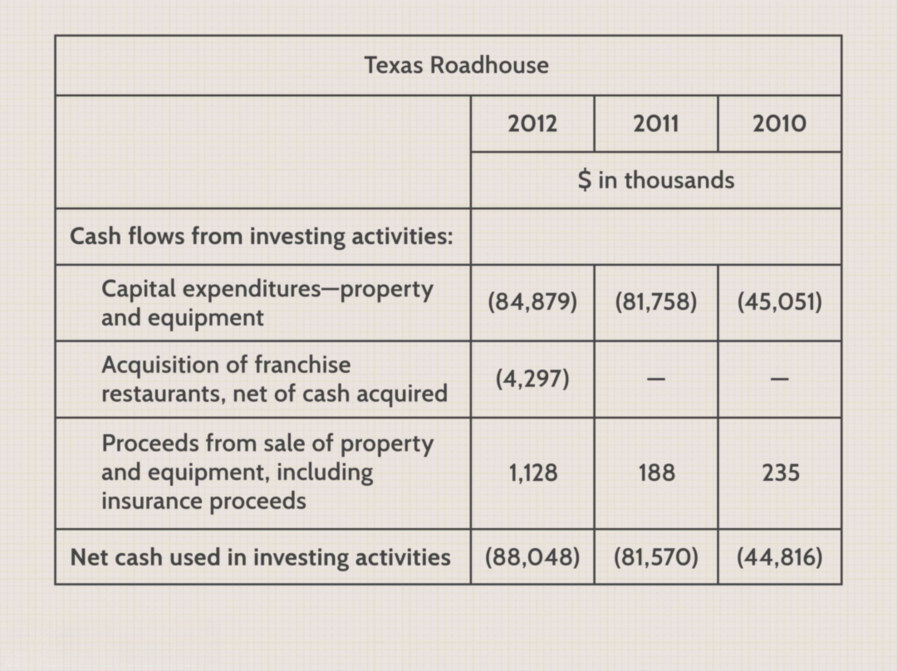

In today's financial markets, the landscape has evolved with the incorporation of sophisticated transactions and trading strategies. Rapid advancements in technology and an increasingly complex global economic environment have driven this evolution, reshaping how financial activities are conducted. Market participants, ranging from large institutional traders to individual investors, are navigating a dynamic environment characterized by electronic trading and data-driven decision-making.

The article aims to explore the intricacies of cash charges, financial transactions, and the role of algorithmic trading in contemporary finance. Cash charges, which represent expenses impacting cash flow, are critical for understanding a firm's financial performance. These charges can arise from various activities, including restructuring, and their management is essential for maintaining financial stability. In contrast, financial transactions, especially in the digital age, are subject to a myriad of costs that can affect profitability if not managed effectively.



Understanding and managing these facets can significantly impact financial outcomes by enabling more informed decision-making and efficient capital allocation. Proper management of cash charges can prevent companies from facing liquidity issues, while effective handling of transaction costs can enhance trading success. Algorithmic trading, which uses automated and sophisticated strategies to execute trades, plays a significant role by potentially lowering costs and increasing efficiency in transactions. This can range from reducing order impact to exploiting favorable market conditions.

Both individual investors and institutional traders can benefit from insights into efficient cost management and strategic execution. By leveraging data analytics and algorithmic strategies, investors and traders can optimize their transactions and improve financial performance. Whether it is through minimizing transaction fees or effectively employing trading algorithms, having a robust understanding of these elements can lead to considerable gains across various financial activities. 

As we proceed, we'll provide examples and elucidate concepts relevant to these topics, illustrating how strategic considerations and technological advancements can shape financial success. Through this comprehensive exploration, readers will gain a deeper understanding of the interplay between costs, trading strategies, and market dynamics in today's financial landscape.

## Table of Contents

## Understanding Cash Charges in Financial Transactions

A cash charge in financial transactions represents a direct impact on a company's earnings due to cash outflows. These charges are often linked to significant restructuring or downsizing activities within a company and are generally considered non-recurring. Such events can include severance payments, asset write-downs, or costs associated with closing facilities.

This distinction between cash and non-cash charges is vital for understanding a company's financial health. Cash charges involve actual expenditure of resources and can immediately affect a company's [liquidity](/wiki/liquidity-risk-premium) position, while non-cash charges, such as depreciation or amortization, are accounting adjustments that do not immediately influence cash flow. For example, a company may report a large cash charge due to restructuring, highlighting a significant cash outflow which can indicate potential liquidity issues, whereas a non-cash charge might reflect changes in asset valuation without directly affecting liquidity.

Companies report these charges on their financial statements, often within the income statement under special items or operating expenses. The presentation of such charges is crucial as they can substantially alter net income figures, affecting investor perspective and share price. For instance, large companies like General Electric have historically reported cash charges during major restructuring efforts, impacting their reported earnings and investor sentiment.

The impact of cash charges on financial performance is significant because they can reduce available capital for operations, investment, or expansion, ultimately affecting the company's growth prospects. Efficient management and strategic planning surrounding impending cash charges are necessary to mitigate their effect on financial stability. When a company anticipates such charges, it may adopt measures like refining operational efficiencies, negotiating debt covenants, or reallocating resources to absorb the financial shock.

Understanding cash charges is paramount for stakeholders who analyze a company's financial health. It not only involves recognizing how these charges are reflected in financial statements but also evaluating their implications for broader financial performance and strategy. A comprehensive understanding of cash charges helps in making informed investment decisions and assessing a company's long-term viability.

## Financial Transactions and Their Costs

Financial transactions encompass a wide range of activities that are essential to the operation of financial markets. These activities incur various costs that directly affect the profitability of trades and investments. Costs associated with financial transactions include transaction fees, service charges, bid-ask spreads, and potential liquidity impacts. Each of these costs represents a drain on the potential gains that might be realized through trading activities.

Transaction fees and service charges are explicit costs that traders pay to brokers or exchanges for executing trades. These could be flat fees per trade, percentage-based fees on the trade value, or a combination of both. For example, a broker might charge a flat fee of $5 per trade or a 0.1% fee on the total trade value, whichever is higher.

Algorithmic trading, which involves using automated algorithms to execute trades, introduces a unique set of cost considerations due to the frequency and [volume](/wiki/volume-trading-strategy) of trades executed. The sheer speed at which algorithmic trades are executed can result in substantial cumulative costs, particularly when transaction fees are charged per trade. Moreover, high-frequency trading can impact market liquidity, leading to further indirect costs.

Addressing these costs to enhance profitability requires sophisticated transaction cost analysis and strategic measures. Transaction Cost Analysis (TCA) evaluates the costs incurred in the execution of trades relative to various benchmarks. By understanding these costs, traders can fine-tune their algorithms to reduce unnecessary trades, thereby lowering transaction fees and minimizing market impact.

Different types of financial charges and their implications on trading profitability can be understood through examples. For instance, the bid-ask spread – the difference between the buying price and the selling price – represents an implicit cost. It affects profitability, especially for traders executing large quantities of trades. Algorithmic trading systems must [factor](/wiki/factor-investing) in these spreads to ensure trades are executed at advantageous prices, minimizing loss from this spread.

Effective cost management strategies using algorithmic tools focus on optimizing the execution of trades. Strategies include implementing volume-weighted average price (VWAP) algorithms, which distribute large orders over a given period to minimize market impact and transaction costs. Algorithms can incorporate market conditions, adjusting the trading pace to capture favorable price movements without incurring unnecessary costs.

Another strategy is the adaptive [market making](/wiki/market-making), where algorithms adjust the bid-ask spread dynamically based on prevailing market [volatility](/wiki/volatility-trading-strategies) and liquidity. By doing so, they attempt to capture the spread in a manner that maximizes profitability while mitigating the risk of adverse price movements.

In conclusion, financial transactions incur costs that influence trading profitability, and [algorithmic trading](/wiki/algorithmic-trading) brings unique cost challenges. Through proper transaction cost analysis and strategic implementation of algorithmic tools, traders can effectively manage these costs, optimizing their financial outcomes.

## Role of Algorithmic Trading in Cost Management

Algorithmic trading, a vital component of modern financial markets, leverages advanced computational technology to enhance efficiency and reduce costs significantly. By automating the execution of trades, algorithms can process large volumes of data at unprecedented speeds, leading to cost management benefits that are otherwise difficult to achieve manually.

One of the key advantages of algorithmic trading is its ability to minimize transaction costs, such as carrying charges and transaction fees, through sophisticated strategies. Carrying charges, which include the costs associated with maintaining a financial position, can be influenced by interest rates and time decay in options trading. Algorithms can incorporate these factors by analyzing real-time data, enabling traders to make informed decisions that mitigate such costs. For instance, consider the equation:

$$
\text{Total Cost} = \text{Fixed Costs} + \sum (\text{Variable Costs per Trade} \times \text{Number of Trades})
$$

By dynamically adjusting the number of trades and optimizing the timing and placement of orders, algorithms can reduce the impact of both fixed and variable transaction costs. This is particularly relevant in high-frequency trading ([HFT](/wiki/high-frequency-trading-strategies)), where the sheer number of transactions makes the efficient management of even small costs crucial for profitability.

Algorithms also improve cost management by utilizing transaction cost analysis (TCA) frameworks. These frameworks help traders understand the cost structure of different market venues and the associated fees of executing trades on those venues. By analyzing historical and real-time data, algorithms can predict the likely impact costs of trades and adjust strategies accordingly to minimize these costs.

To illustrate the efficacy of algorithmic trading, consider a scenario where a trading algorithm adjusts trading frequencies based on current market volatility. High volatility might lead to increased transaction costs due to wider bid-ask spreads, and a well-designed algorithm could reduce trading volume during such periods to lower overall costs.

Python code can be employed to create models that optimize these strategies. For example:

```python
import numpy as np

def optimize_trading_strategy(volatility, fixed_cost, variable_cost_per_trade, max_trades):
    trades = np.arange(1, max_trades + 1)
    total_costs = fixed_cost + (variable_cost_per_trade * trades) * (1 + volatility)
    optimal_trades = trades[np.argmin(total_costs)]
    return optimal_trades, np.min(total_costs)

volatility = 0.05
fixed_cost = 1000
variable_cost_per_trade = 10
max_trades = 100
optimal_trades, min_cost = optimize_trading_strategy(volatility, fixed_cost, variable_cost_per_trade, max_trades)
print(f"Optimal number of trades: {optimal_trades}, Minimum total cost: {min_cost}")
```

This code exemplifies how algorithms can quantitatively identify optimal trading strategies under varying market conditions, emphasizing their role in cost management.

Despite the benefits, algorithmic trading comes with challenges, particularly the balance between high-frequency trading and the risk of accumulating carrying charges. While HFT can exploit short-lived market inefficiencies, it may inadvertently increase exposure to carrying costs if positions are held longer than anticipated due to unforeseen market conditions. Effective algorithms, therefore, are designed to continually re-evaluate their strategies, balancing the trade-off between potential gains from rapid trading and the costs associated with carrying positions.

In summary, algorithmic trading stands out as an essential tool in managing costs associated with financial transactions, offering solutions that are both efficient and adaptable to changing market dynamics. By integrating sophisticated models and leveraging real-time data, algorithms have transformed the landscape of financial markets, allowing traders to maintain a competitive edge.

## Examples of Financial Transactions Impacted by Cash Charges and Algo Trading

Real-world examples provide a compelling insight into how cash charges and algorithmic trading impact financial transactions. Companies often encounter significant cash charges due to restructuring, which entails expenses such as severance pay, asset write-downs, and facility closures. For instance, a multinational corporation facing declining profitability might initiate a restructuring plan, leading to substantial cash charges. These charges, while non-recurring, represent immediate cash outflows impacting the company's cash flow statement and potentially affecting investor perceptions and stock valuation.

Consider the case of General Electric (GE) in recent years, which engaged in extensive restructuring efforts. GE's strategic plan included divesting non-core businesses and simplifying its structure, resulting in considerable cash charges. These charges were reported in its financial statements, with detailed explanations of their impact on earnings and liquidity. By clearly disclosing these charges, companies like GE aim to maintain transparency and retain investor trust amid financial upheavals.

Algorithmic trading plays a pivotal role in managing transaction costs associated with frequent trading activities. High-frequency trading firms often execute thousands of trades daily, incurring substantial transaction fees. The use of sophisticated algorithms helps mitigate these costs by optimizing trade execution. For example, algorithms can execute trades when liquidity is highest, reducing the bid-ask spread and minimizing market impact. A prime example of this strategy is seen in the operations of firms like Virtu Financial, which employs advanced algorithms to analyze market conditions, adjust trading strategies in real-time, and capitalize on minute price discrepancies across global exchanges. This approach not only reduces costs but also enhances trading efficiency, leading to improved profitability.

Moreover, the adaptation of algorithmic strategies can effectively manage the costs associated with large institutional trades. Consider a pension fund attempting to rebalance its portfolio, a complex task involving significant transaction fees. By employing VWAP (Volume-Weighted Average Price) or TWAP (Time-Weighted Average Price) algorithms, these institutions can execute trades over a specified period, achieving better price execution while minimizing market impact and transaction costs. The VWAP algorithm, for example, disperses a large order into numerous smaller orders, aligning with the market's natural trading rhythm to average the trade price around the current market trends.

In conclusion, real-world examples underscore the intricate dynamics of cash charges and algorithmic trading in financial transactions. Companies navigating restructuring challenges must effectively manage cash charges to preserve financial health. Simultaneously, the strategic implementation of algorithmic trading can significantly reduce transaction costs and bolster profitability, demonstrating the critical role of technology in modern financial markets.

## Conclusion

Understanding and managing cash charges and financial transaction costs is paramount to achieving financial success in today's dynamic markets. These costs, whether manifested through restructuring events or embedded within the intricacies of trading activities, wield significant influence over profitability and financial health.

Algorithmic trading emerges as a pivotal tool in navigating these financial challenges. By employing sophisticated algorithms, traders can optimize their strategies to mitigate transaction fees and effectively manage carrying charges. Automated systems enable rapid execution of trades with precision, reducing the human error component and allowing constant adaptation to market conditions. Through this technological advancement, both individual investors and institutional traders can enhance their performance metrics and maintain a competitive edge.

Furthermore, the future of financial transactions is likely to evolve with continued technological integration. Innovations such as [machine learning](/wiki/machine-learning) and [artificial intelligence](/wiki/ai-artificial-intelligence) hold promise in refining algorithmic trading strategies, leading to even more efficient cost management. As trading volumes increase and market conditions grow in complexity, the capacity to adapt swiftly using data-driven insights will be invaluable.

Investors and traders are encouraged to incorporate these strategies into their financial planning. Leveraging algorithmic trading and a keen understanding of transaction costs can significantly bolster profitability. By doing so, market participants can ensure they remain resilient amid the ever-changing landscape of financial markets, safeguarding their positions and capitalizing on emerging opportunities.

## References & Further Reading

[1]: ["Advances in Financial Machine Learning"](https://www.amazon.com/Advances-Financial-Machine-Learning-Marcos/dp/1119482089) by Marcos Lopez de Prado

[2]: ["Quantitative Trading: How to Build Your Own Algorithmic Trading Business"](https://www.amazon.com/Quantitative-Trading-Build-Algorithmic-Business/dp/1119800064) by Ernest P. Chan

[3]: ["Evidence-Based Technical Analysis: Applying the Scientific Method and Statistical Inference to Trading Signals"](https://www.amazon.com/Evidence-Based-Technical-Analysis-Scientific-Statistical/dp/0470008741) by David Aronson

[4]: ["Machine Learning for Algorithmic Trading"](https://github.com/stefan-jansen/machine-learning-for-trading) by Stefan Jansen

[5]: Bergstra, J., Bardenet, R., Bengio, Y., & Kégl, B. (2011). ["Algorithms for Hyper-Parameter Optimization."](https://dl.acm.org/doi/10.5555/2986459.2986743) Advances in Neural Information Processing Systems 24.