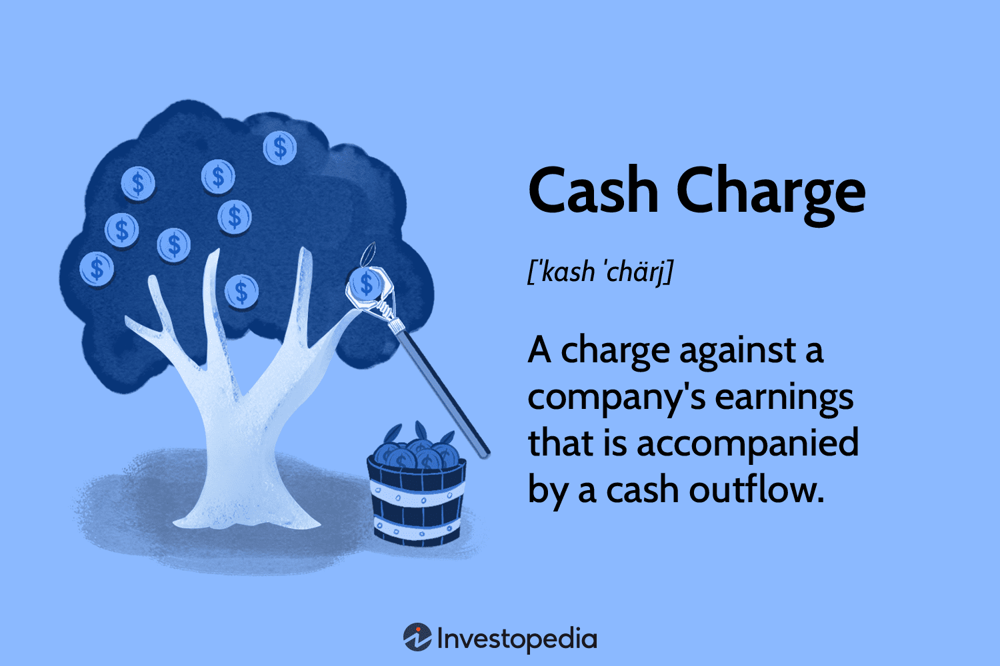

## Table of Contents

## What is a cash charge?

A cash charge is a fee that a business might have to pay when they use cash for certain transactions. This can happen when a business needs to quickly turn a large amount of cash into electronic money or when they deposit cash into their bank account. Banks might charge this fee to cover the costs of handling, counting, and securing the cash.

For example, if a store owner takes in a lot of cash during a busy day and wants to deposit it all at once, the bank might charge a cash charge. This fee helps the bank manage the extra work and security needed to handle large amounts of cash. It's important for business owners to be aware of these charges so they can plan their finances better.

## How does a cash charge work?

A cash charge is a fee that a bank might ask for when a business brings in a lot of cash to deposit. Imagine a store owner who has a busy day and collects a big pile of cash. When they go to the bank to put all that money into their account, the bank might say, "We need to charge you a fee for handling all this cash." This fee helps the bank pay for the extra work they have to do, like counting the money and making sure it's safe.

The amount of the cash charge can change depending on how much cash the business is depositing and the rules of the bank. Sometimes, if the cash amount is really big, the fee might be higher. Banks have to do a lot of work to handle cash, so they use the cash charge to cover those costs. It's a good idea for business owners to know about these fees so they can plan their money better and not be surprised by extra costs.

## What are the benefits of using a cash charge?

Using a cash charge helps banks manage their costs. When a business brings in a lot of cash, the bank has to spend time and money to count it, check if it's real, and keep it safe. By charging a fee, the bank can cover these extra costs. This way, the bank can keep offering services to businesses without losing money on handling cash.

For businesses, knowing about cash charges can help them plan better. If they know they will have to pay a fee for depositing a lot of cash, they can budget for it. This can help them avoid surprises and manage their money more carefully. In the end, understanding cash charges can make it easier for businesses to handle their finances.

## What are the potential drawbacks of cash charges?

Cash charges can be tough for small businesses. When a small store has to pay a fee just to deposit their cash, it can eat into their profits. Imagine a small shop owner who works hard all day and then has to give some of their earnings to the bank just to put their money in the bank. This can make it harder for them to grow their business or even just keep it running smoothly.

Also, cash charges can make people think twice about using cash. If businesses know they will be charged for using cash, they might start to use other ways to pay, like credit cards or electronic payments. This could make it harder for people who prefer using cash, like those who don't have bank accounts or who want to keep their spending private. In the end, cash charges can change how people handle money and might make things more complicated for everyone.

## How can someone set up a cash charge account?

To set up a cash charge account, you need to go to your bank and talk to them about it. Tell them you want to open an account where you can deposit cash, but they might charge you a fee for it. They will explain how much the fee will be and when you have to pay it. You will need to fill out some forms and give them some information about your business, like your business name and address.

Once you have filled out the forms and given the bank all the information they need, they will set up your cash charge account. They might give you a special account number or a card to use when you deposit cash. Remember to ask them any questions you have about the fees and how often you can deposit cash without getting charged extra. This way, you can make sure you understand everything and can plan your money better.

## What are the fees associated with cash charges?

The fees for cash charges can be different depending on the bank and how much cash you are depositing. Usually, the fee is a small percentage of the total cash you bring in. For example, if you deposit $10,000, the bank might charge you 1% of that, which would be $100. The exact amount can change, so it's important to ask your bank what their fees are.

Some banks might also have a minimum fee, so even if you deposit a small amount of cash, you might still have to pay a certain amount. This helps the bank cover the cost of handling any amount of cash. It's a good idea to know these fees before you start using a cash charge account so you can plan your money better and not be surprised by extra costs.

## Can cash charges be used internationally?

Cash charges can be used internationally, but it depends on the bank and the country's rules. If you have a business that deals with cash in different countries, you need to talk to your bank about it. They will tell you if they can handle your cash deposits in other countries and what the fees will be. It's important to understand these fees because they might be different from what you pay in your home country.

Different countries have different rules about handling cash, so the fees can be higher or lower. For example, if you deposit cash in a country where banks have to do a lot of extra work to check the money, the fee might be higher. Always ask your bank about the fees before you start using a cash charge account in another country. This way, you can plan your money better and avoid any surprises.

## How does a cash charge differ from a credit card?

A cash charge and a credit card are two different things. A cash charge is a fee that a bank might ask for when a business deposits a lot of cash. This fee helps the bank pay for the work they have to do, like counting the money and keeping it safe. On the other hand, a credit card is a way for people to borrow money from a bank to buy things. When you use a credit card, you get to spend money now and pay it back later, usually with some extra interest.

The main difference is what they are used for. A cash charge is all about handling cash and the costs that come with it. It's something businesses have to think about when they take their cash to the bank. A credit card, however, is about borrowing money to make purchases. People use credit cards to buy things without using cash, and they have to pay back what they borrowed, plus any interest that adds up. So, while a cash charge helps banks manage cash, a credit card helps people manage their spending and borrowing.

## What security measures are in place for cash charge transactions?

When a business uses a cash charge account, the bank has special ways to keep the money safe. They have to count the money carefully and check if it's real. Banks use machines that can tell if the money is fake, and they have people who watch the cash to make sure no one takes it. They also have strong safes and locked rooms where they keep the cash until it's put into the account.

Sometimes, banks also use cameras and guards to make sure everything is safe. When a business brings in a lot of cash, the bank might have them fill out a special form to keep track of where the money came from. This helps stop people from using the bank to do bad things with money. By having all these security steps, banks can make sure that the cash charge transactions are safe and that the money gets to the right place.

## How do cash charges impact credit scores?

Cash charges do not directly affect your credit score. A cash charge is just a fee that a bank might charge a business for depositing a lot of cash. It's not something that gets reported to credit bureaus, so it won't show up on your credit report.

However, if a business has trouble paying the cash charges and ends up owing money to the bank, this could lead to bigger financial problems. If the business can't pay its bills, it might affect the owner's personal credit if they used their personal credit to guarantee business loans. So, while cash charges themselves don't impact credit scores, the financial stress they might cause could indirectly affect credit if it leads to other unpaid debts.

## What are the latest technological advancements in cash charge systems?

New technology is making cash charge systems better and easier to use. Banks now use special machines that count cash really fast and can tell if any of the money is fake. These machines help banks handle a lot of cash quickly and safely. Some banks also use apps and online systems where businesses can see their cash charge fees and keep track of their deposits without going to the bank.

Another big change is the use of AI and data to make cash charge systems smarter. Banks can now predict how much cash a business might bring in and plan better for it. This helps them set the right fees and make sure they have enough people and machines ready to handle the cash. These new technologies make it easier for businesses to manage their money and for banks to keep everything safe and organized.

## How can businesses integrate cash charge systems into their payment processing?

Businesses can integrate cash charge systems into their payment processing by working closely with their bank. They need to talk to the bank about setting up a cash charge account. The bank will explain how the fees work and what the business needs to do when they bring in cash. The business might need to use special forms or machines that the bank provides to make sure everything is done right. This way, the business can keep track of their cash deposits and know exactly what fees they will have to pay.

Once the cash charge system is set up, businesses can start using it as part of their daily money handling. They can deposit their cash at the bank and the fees will be taken out automatically. Some banks even have apps or online systems where businesses can see their cash charge fees and keep track of their deposits without going to the bank. This makes it easier for businesses to manage their money and plan for the fees they will have to pay.

## What is the role of algorithmic trading in cost management?

Algorithmic trading, a vital component of modern financial markets, leverages advanced computational technology to enhance efficiency and reduce costs significantly. By automating the execution of trades, algorithms can process large volumes of data at unprecedented speeds, leading to cost management benefits that are otherwise difficult to achieve manually.

One of the key advantages of algorithmic trading is its ability to minimize transaction costs, such as carrying charges and transaction fees, through sophisticated strategies. Carrying charges, which include the costs associated with maintaining a financial position, can be influenced by interest rates and time decay in options trading. Algorithms can incorporate these factors by analyzing real-time data, enabling traders to make informed decisions that mitigate such costs. For instance, consider the equation:

$$
\text{Total Cost} = \text{Fixed Costs} + \sum (\text{Variable Costs per Trade} \times \text{Number of Trades})
$$

By dynamically adjusting the number of trades and optimizing the timing and placement of orders, algorithms can reduce the impact of both fixed and variable transaction costs. This is particularly relevant in high-frequency trading ([HFT](/wiki/high-frequency-trading-strategies)), where the sheer number of transactions makes the efficient management of even small costs crucial for profitability.

Algorithms also improve cost management by utilizing transaction cost analysis (TCA) frameworks. These frameworks help traders understand the cost structure of different market venues and the associated fees of executing trades on those venues. By analyzing historical and real-time data, algorithms can predict the likely impact costs of trades and adjust strategies accordingly to minimize these costs.

To illustrate the efficacy of algorithmic trading, consider a scenario where a trading algorithm adjusts trading frequencies based on current market volatility. High volatility might lead to increased transaction costs due to wider bid-ask spreads, and a well-designed algorithm could reduce trading volume during such periods to lower overall costs.

Python code can be employed to create models that optimize these strategies. For example:

```python
import numpy as np

def optimize_trading_strategy(volatility, fixed_cost, variable_cost_per_trade, max_trades):
    trades = np.arange(1, max_trades + 1)
    total_costs = fixed_cost + (variable_cost_per_trade * trades) * (1 + volatility)
    optimal_trades = trades[np.argmin(total_costs)]
    return optimal_trades, np.min(total_costs)

volatility = 0.05
fixed_cost = 1000
variable_cost_per_trade = 10
max_trades = 100
optimal_trades, min_cost = optimize_trading_strategy(volatility, fixed_cost, variable_cost_per_trade, max_trades)
print(f"Optimal number of trades: {optimal_trades}, Minimum total cost: {min_cost}")
```

This code exemplifies how algorithms can quantitatively identify optimal trading strategies under varying market conditions, emphasizing their role in cost management.

Despite the benefits, algorithmic trading comes with challenges, particularly the balance between high-frequency trading and the risk of accumulating carrying charges. While HFT can exploit short-lived market inefficiencies, it may inadvertently increase exposure to carrying costs if positions are held longer than anticipated due to unforeseen market conditions. Effective algorithms, therefore, are designed to continually re-evaluate their strategies, balancing the trade-off between potential gains from rapid trading and the costs associated with carrying positions.

In summary, algorithmic trading stands out as an essential tool in managing costs associated with financial transactions, offering solutions that are both efficient and adaptable to changing market dynamics. By integrating sophisticated models and leveraging real-time data, algorithms have transformed the landscape of financial markets, allowing traders to maintain a competitive edge.

## References & Further Reading

[1]: ["Advances in Financial Machine Learning"](https://www.amazon.com/Advances-Financial-Machine-Learning-Marcos/dp/1119482089) by Marcos Lopez de Prado

[2]: ["Quantitative Trading: How to Build Your Own Algorithmic Trading Business"](https://www.amazon.com/Quantitative-Trading-Build-Algorithmic-Business/dp/1119800064) by Ernest P. Chan

[3]: ["Evidence-Based Technical Analysis: Applying the Scientific Method and Statistical Inference to Trading Signals"](https://www.amazon.com/Evidence-Based-Technical-Analysis-Scientific-Statistical/dp/0470008741) by David Aronson

[4]: ["Machine Learning for Algorithmic Trading"](https://github.com/stefan-jansen/machine-learning-for-trading) by Stefan Jansen

[5]: Bergstra, J., Bardenet, R., Bengio, Y., & Kégl, B. (2011). ["Algorithms for Hyper-Parameter Optimization."](https://dl.acm.org/doi/10.5555/2986459.2986743) Advances in Neural Information Processing Systems 24.