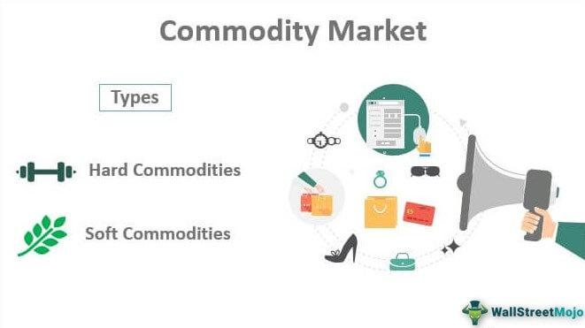

Commodities trading in the cash market involves the physical exchange of tangible assets, such as agricultural products, minerals, metals, and energy resources. This market, also known as the spot market, is characterized by the immediate delivery of goods upon the agreement of a transaction, distinguishing itself from derivatives and futures markets where delivery is deferred. The cash market plays a crucial role in determining benchmark prices for commodities, often influencing futures markets through its immediate pricing mechanism.

Algorithmic trading, often abbreviated as algo trading, has emerged as a transformative force in the financial trading landscape. It involves the use of computer programs and algorithms to automate trading strategies, enabling efficient and precise trade execution. By leveraging predefined criteria based on variables like price, timing, or volume, algo trading minimizes the influence of human emotions on trading decisions, thereby promoting operational efficiency and accuracy. While traditionally prevalent in equity and forex markets, this method is increasingly being applied to commodities markets.

The integration of algorithmic trading with cash market commodities trading holds significant promise for enhancing market performance. Through automation and data-driven strategies, traders can potentially capture fleeting opportunities and optimize decision-making processes in the inherently volatile and dynamic commodities market. This article will examine the fundamentals of cash market commodities trading and the evolution of algorithmic trading, exploring how these concepts converge to create potential leverage for market participants.

## Table of Contents

## Understanding Cash Market in Commodities Trading

The cash market, often referred to as the spot market, is a marketplace where commodities or financial instruments are traded for immediate delivery. This market is characterized by the physical exchange of goods, and it plays a fundamental role in the global commodities ecosystem. Unlike futures markets, where contracts are set for future delivery dates, the cash market involves the buying and selling of tangible assets with the expectation that delivery will occur promptly.

Cash commodities encompass a wide array of tangible goods, including agricultural products like wheat, corn, and soybeans; minerals such as copper and iron ore; various metals including gold and silver; and energy resources like crude oil and natural gas. These commodities are integral to everyday economic activities and serve as essential inputs in industries ranging from manufacturing to energy production.

A primary feature of the cash market is the agreement between buyers and sellers on a present-day price, with the commitment that the commodity will be transferred almost immediately. This immediate exchange underscores the liquidity of these markets as they allow participants to swiftly respond to supply and demand dynamics. Such liquidity ensures that market participants can quickly buy and sell commodities with minimal price impact.

Moreover, the cash market holds significant importance due to its influence on futures markets. Prices established in the cash market often serve as benchmarks for futures contracts. These futures are agreements to buy or sell a commodity at a predetermined future date and price, and they rely on the current cash market price to establish fair market valuations and mitigate risk. The interdependence of the cash and futures markets helps maintain price stability and consistency across trading platforms globally.

The cash market also contributes to price discovery, where the interactions between buyers and sellers help determine the value of commodities based on current supply and demand factors. This continuous price-setting mechanism is essential for producers, consumers, and traders in making informed decisions regarding production, consumption, and investment.

In summary, the cash market is a vital component of commodities trading, providing immediate delivery and serving as a benchmark for futures markets. It facilitates [liquidity](/wiki/liquidity-risk-premium), influences price discovery, and helps stabilize global commodity prices by reflecting real-time supply and demand conditions.

## Algorithmic Trading Overview

Algorithmic trading refers to the utilization of sophisticated computer algorithms to execute trading orders based on a predefined set of criteria, such as price, timing, or [volume](/wiki/volume-trading-strategy). This approach is designed to enhance trade execution by minimizing human intervention, which can often introduce emotional biases into decision-making processes. By relying on systematic, data-driven strategies, [algorithmic trading](/wiki/algorithmic-trading) facilitates smoother market operations and consistent implementation of trading strategies.

The primary advantage of algorithmic trading lies in its ability to increase transaction speed and accuracy. Trades can be executed in milliseconds, far surpassing the speed achievable through manual trading. This swift execution is crucial in markets where price changes can occur within fractions of a second. Moreover, algorithms can rapidly respond to market conditions, capturing fleeting opportunities that might otherwise be missed by human traders.

Beyond speed and precision, algorithmic trading offers potential cost reductions and improved operational efficiency. By automating the trading process, firms can significantly reduce the workload traditionally handled by human traders, thereby lowering payroll expenses and minimizing the risk of human error. Additionally, algorithmic systems can operate continuously without fatigue, allowing for optimal market engagement at all hours.

Algorithmic trading is already a well-established practice in equity and [forex](/wiki/forex-system) markets, where its benefits have been widely recognized. These markets have embraced algorithmic strategies due to their high liquidity and the extensive availability of historical data, which is crucial for [backtesting](/wiki/backtesting) and refining algorithms. Recently, algorithmic trading has begun to gain traction in commodity markets as well. Commodities present unique challenges due to their inherent [volatility](/wiki/volatility-trading-strategies) and market structure, but advancements in technology and data processing are facilitating the integration of algorithmic trading in this domain.

In summary, algorithmic trading promises to transform market dynamics by leveraging computational power to enhance trade execution and efficiency. Its application is broadening beyond traditional markets, as technology advancements continue to push the boundaries of automated trading systems.

## Benefits of Algo Trading in the Commodities Cash Market

Algorithmic trading offers substantial benefits when applied to the commodities cash market. One of the primary advantages is the enhancement of trade speed and accuracy, crucial in capitalizing on fleeting opportunities within the inherently volatile nature of commodities. The automation of trade execution allows systems to operate seamlessly, free from the latency associated with manual trades, thereby optimizing entry and [exit](/wiki/exit-strategy) timing. This swift operation is vital in markets where prices can fluctuate rapidly due to various factors, including geopolitical events, weather conditions, and economic data releases.

By eliminating the necessity for human intervention in routine trading tasks, algo trading systems allow traders to allocate more resources towards strategic decision-making and activities that add value. This transition from manual to automated trading minimizes the cognitive load on traders and enhances their ability to focus on broader market strategies rather than individual transaction details. For example, traders can use algorithmic systems to run simulations and refine their strategies without being bogged down by data entry or transaction monitoring tasks.

Algorithmic systems also excel in their ability to adapt to market dynamics without requiring continuous manual oversight. These systems can analyze real-time market data and adjust trading strategies in response to market conditions, thereby reducing transaction costs. Efficiency gains are realized by minimizing slippage, the difference between the expected price of a trade and the actual price, which can occur in volatile markets.

Moreover, algo trading facilitates the backtesting of trading strategies using historical data, a process that is instrumental in refining and optimizing trading approaches before they are implemented in live markets. By simulating trades under various historical conditions, traders can evaluate the effectiveness of their strategies, assess potential risks, and make necessary adjustments. This iterative process of backtesting and refining contributes significantly to developing robust, resilient trading strategies capable of delivering consistent results in diverse market scenarios.

The integration of these capabilities allows traders to enhance their performance and maintain a competitive edge in the fast-paced commodities market. As technology progresses, the continued evolution and sophistication of algorithmic trading systems are expected to further augment these benefits, offering new avenues for efficiency and profitability in commodities trading.

## Challenges and Considerations in Commodity Algo Trading

Commodities markets present unique challenges for algorithmic trading systems, largely due to the intrinsic characteristics of physical goods and the complexities of their trade dynamics. Factors such as delivery logistics, perishability, and external influencers like weather conditions distinguish commodity trading from other financial markets.

Effective commodity algo trading systems require the integration of diverse data sources. The need to accurately assess supply chain logistics and regional price variances necessitates robust data aggregation and analysis. Moreover, technology investment is crucial in building infrastructure capable of handling large volumes of heterogeneous data. Advanced systems must be equipped to simultaneously process financial signals, meteorological data, transportation schedules, and geopolitical information to optimize trading decisions.

Risk management is a critical component of commodity algo trading. Algorithmic systems, by design, operate at high speeds, executing numerous trades within seconds. This speed, while advantageous, can also compound the impact of errors. An erroneous parameter can lead to significant financial losses, exemplified by the infamous "flash crashes" in various markets. Implementing effective risk management protocols, such as stop-loss mechanisms and real-time anomaly detection, can mitigate these risks.

Continued monitoring and adaptation of trading algorithms are necessary to navigate the dynamic conditions of commodity markets. Factors influencing commodity prices can shift rapidly, driven by geopolitical tensions, sudden changes in weather, or unexpected shifts in supply and demand. To address this, algorithmic systems must be designed to learn and evolve. This can be achieved through [machine learning](/wiki/machine-learning) techniques that allow algorithms to update their predictive models as new data becomes available.

Incorporating these strategies within an algo trading framework offers the potential to mitigate challenges and harness the inherent opportunities within commodity markets. However, traders must remain vigilant to the dynamic nature of these markets and continuously refine their strategies to maintain a competitive edge.

## Future Trends in Commodity Algo Trading

Machine learning (ML) and [artificial intelligence](/wiki/ai-artificial-intelligence) (AI) are poised to significantly advance algorithmic trading within the commodities cash market. By integrating sophisticated algorithms capable of processing vast amounts of data, ML and AI provide traders with enhanced trend identification and predictive capabilities. For example, AI models can assess historical price patterns, weather forecasts, logistical constraints, and geopolitical factors to predict future price movements, offering strategic insights beyond human capability.

The availability of big data and advancements in data processing technologies empower traders to obtain and analyze information faster and more accurately. These technologies allow for real-time data analysis, enabling traders to rapidly adapt to market changes and capitalize on ephemeral trading opportunities. As a result, algorithmic systems can better anticipate market shifts, improving decision-making and operational efficiency.

As more firms integrate AI and ML into their algorithmic trading systems, competition is intensifying. This competitive landscape encourages continuous innovation and evolution of trading strategies, with firms striving to develop more sophisticated models that provide a competitive advantage. This drive for excellence pushes the boundaries of what is technologically achievable, fostering an environment where groundbreaking methodologies emerge.

The continued shift toward algorithmic trading in commodities markets will transform traditional operations. Traders increasingly rely on algorithms not only for execution but also for strategy development and risk management. In the near future, AI and ML could facilitate autonomous trading systems that operate with minimal human intervention, optimizing trades while continuously learning from market behaviors to refine strategies.

In summary, the integration of machine learning and artificial intelligence in commodity algo trading heralds a transformative era, offering significant improvements in predictive analytics and strategic execution. This technological progress necessitates adaptation and innovation, paving the way for an evolving market landscape where both humans and machines collaboratively drive trading success.

## Conclusion

The integration of algorithmic trading within the commodities cash market offers numerous advantages, yet demands careful navigation due to the unique dynamics of this market. This fusion provides heightened speed and precision in executing trades, effectively capitalizing on fleeting market opportunities. However, the inherent complexities of the commodities market, including factors such as delivery logistics, perishability of goods, and external influences like weather conditions, necessitate meticulous attention.

As technology continues to evolve, it presents both opportunities and challenges. Innovations in algorithmic trading, especially through incorporating machine learning and artificial intelligence, afford enhanced predictive capabilities and trend recognition. This technological evolution positions traders to gain a significant competitive edge, but it also necessitates continuous adaptation to stay ahead. A nimble approach to technological advancements, coupled with a robust understanding of market fundamentals, forms the cornerstone of successful trading strategies.

The convergence of human intuition and sophisticated algorithmic solutions is poised to define the future landscape of commodities trading. Traders must adeptly combine their expertise with these cutting-edge tools to navigate the complexities of the market effectively. Maintaining this balance will be crucial to leveraging the full potential of algorithmic trading in the commodities cash market, ultimately transforming operational processes and strategic outlooks in unprecedented ways.

## References & Further Reading

[1]: Geman, H. (2005). ["Commodities and Commodity Derivatives: Modeling and Pricing for Agriculturals, Metals, and Energy."](https://download.e-bookshelf.de/download/0000/5675/90/L-G-0000567590-0015270354.pdf) Wiley Finance.

[2]: Chakraborty, M., & Kearns, M. (2011). ["High-frequency trading and the integrated marketplace."](http://www.eecs.harvard.edu/cs286r/courses/fall12/papers/CK11.pdf) In The Oxford Handbook of Quantitative Asset Management.

[3]: Narang, R. K. (2013). ["Inside the Black Box: A Simple Guide to Quantitative and High Frequency Trading."](https://onlinelibrary.wiley.com/doi/book/10.1002/9781118662717) Wiley, 2nd Edition.

[4]: Hull, J. C. (2018). ["Options, Futures, and Other Derivatives."](https://www.semanticscholar.org/paper/Options%2C-Futures%2C-and-Other-Derivatives-Hull/89bdee500c8623864fc9eb7a471546aa713acc44) Pearson, 10th Edition.

[5]: Tetlock, P. C. (2007). ["Giving Content to Investor Sentiment: The Role of Media in the Stock Market."](https://onlinelibrary.wiley.com/doi/abs/10.1111/j.1540-6261.2007.01232.x) The Review of Financial Studies, 21(2), 867-899.

[6]: Grauer, F. L., & Hakansson, N. H. (1985). ["Commodity prices and futures research."](https://www.semanticscholar.org/paper/Applying-Portfolio-Change-and-Conditional-Measures%3A-Grauer.-Hakansson./8c926c589c93fa82a8d4d7d2bf25135b1263a000) Journal of Finance, 40(5), 1133-1148.