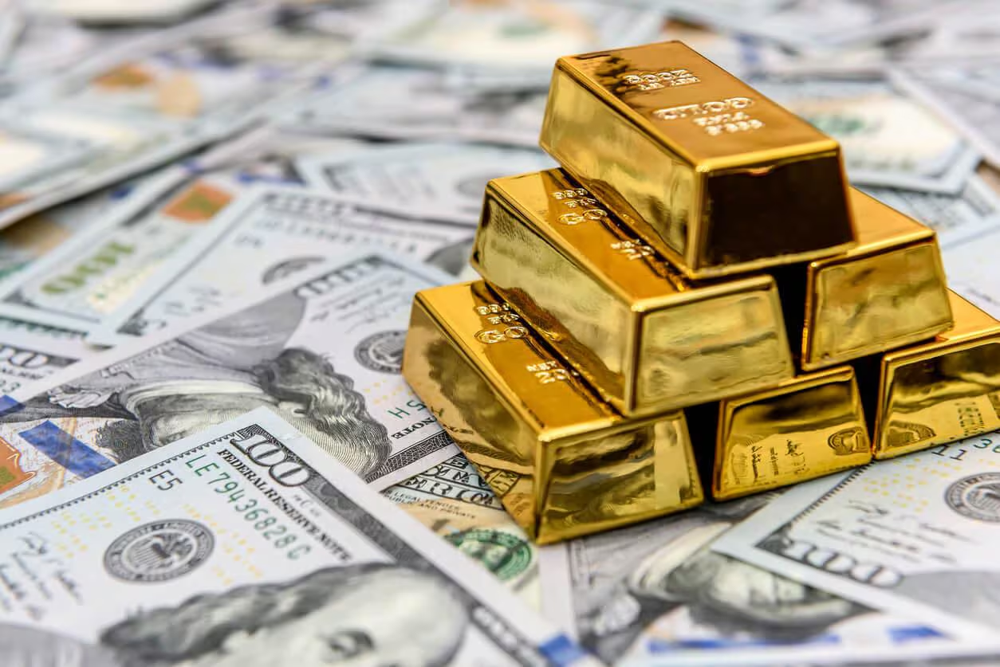

## Table of Contents

## What is a cash commodity?

A cash commodity is a physical good that can be bought and sold for immediate payment. This means that when you buy a cash commodity, you pay for it right away and take it home with you. Examples of cash commodities include things like wheat, gold, oil, and even fruits and vegetables. These are things you can touch and use right after you buy them.

In the world of trading, cash commodities are different from futures contracts. Futures contracts are agreements to buy or sell a commodity at a future date, but with cash commodities, the exchange happens right away. This makes cash commodities important for people who need goods immediately, like farmers who sell their crops or businesses that need raw materials to make their products.

## How does a cash commodity differ from a futures contract?

A cash commodity is something you can buy and touch right away. When you buy a cash commodity, you pay for it immediately and take it home with you. It could be something like wheat, gold, or even apples. The key thing is that you get the item right after you pay for it.

A futures contract is different because it's an agreement to buy or sell something at a later date. Instead of getting the item right away, you're making a promise to trade it in the future. For example, a farmer might agree to sell their wheat in six months, even though they don't have it ready yet. This helps people plan for the future, but they don't get the actual item until the agreed date comes.

So, the main difference is that with a cash commodity, you get the item right away and pay for it immediately. With a futures contract, you're planning to get the item later and you're making an agreement now about what will happen in the future.

## Can you provide examples of common cash commodities?

Cash commodities are things you can buy and take home right away. Some common examples are wheat, corn, and soybeans. Farmers grow these crops and sell them directly to people who need them, like food companies or other farmers. When you buy these, you pay for them right away and you can use them immediately.

Another group of common cash commodities includes metals like gold, silver, and copper. People buy these for different reasons, like making jewelry or using them in electronics. Just like with crops, when you buy these metals, you pay for them and take them with you right away.

Lastly, there are energy products like [crude oil](/wiki/crude-oil) and natural gas. These are used to make fuel and power homes and businesses. When you buy these, you get them right away and pay for them immediately. They are important because they help keep things running every day.

## What are the advantages of trading in cash commodities?

Trading in cash commodities has several advantages. One big advantage is that you get the product right away. When you buy a cash commodity, you pay for it and take it home immediately. This is good for people who need the item right away, like a farmer who needs wheat to feed their animals or a business that needs oil to make fuel.

Another advantage is that trading in cash commodities can be less risky than trading in futures contracts. With cash commodities, you know exactly what you're getting and when you're getting it. There's no waiting or worrying about prices changing in the future. This can make it easier for people to plan and manage their money, especially if they need to use the commodity right away.

## What are the risks associated with cash commodity trading?

Trading in cash commodities can have some risks. One risk is that prices can change quickly. If you buy a cash commodity and its price goes down right after, you might lose money. For example, if you buy wheat and the price drops the next day, you're stuck with wheat that's worth less than what you paid for it. This can be a problem for people who need to sell the commodity to make money.

Another risk is that you have to pay for the commodity right away. This means you need to have enough money on hand when you buy it. If you don't have the money, you can't make the trade. Also, if something happens and you can't sell the commodity as quickly as you thought, you might have to wait to get your money back. This can be tough if you were counting on that money for other things.

## How is the price of a cash commodity determined?

The price of a cash commodity is determined by what people are willing to pay for it right now. This is called the current market price. Many things can affect this price, like how much of the commodity is available and how many people want to buy it. If there's a lot of wheat and not many people want it, the price might go down. But if there's not much wheat and a lot of people need it, the price might go up.

Other things can also change the price of a cash commodity. For example, the weather can affect crops like wheat or corn. If there's a drought and the crops don't grow well, there will be less of them to sell, so the price might go up. Also, big events like wars or new laws can change how much people want to buy or sell a commodity, which can make the price go up or down. It's all about what's happening right now that makes people want to pay more or less for the commodity.

## What role do cash commodities play in the global economy?

Cash commodities are very important in the global economy. They are the things that people and businesses buy and sell every day, like food, metals, and energy. These items help keep the world running. For example, farmers sell their wheat to food companies, who use it to make bread and other foods. Oil companies sell oil to make gasoline for cars and to heat homes. When people buy these cash commodities, they pay for them right away and use them immediately. This helps keep the economy moving because it means businesses can keep making things and people can keep buying what they need.

Cash commodities also help connect different parts of the world. Countries that grow a lot of food, like wheat or corn, can sell it to other countries that need it. This helps countries work together and share resources. It also means that if one country has a bad year and can't grow enough food, they can still get what they need from somewhere else. This makes the global economy more stable and helps everyone have what they need to live and work.

## How can an individual or business start trading in cash commodities?

To start trading in cash commodities, an individual or business needs to understand what they want to buy or sell. For example, if you're a farmer, you might want to sell your wheat or corn. If you're a business, you might need to buy oil or metals for your products. First, you need to find a place where these commodities are traded. This could be a local market, a big exchange like the Chicago Mercantile Exchange, or even online platforms. You'll need to learn how these markets work and what the prices are like.

Once you know where to trade, you need to make sure you have the money to buy the commodities or the commodities to sell. If you're buying, you'll need to pay for the commodity right away. If you're selling, you'll need to have the commodity ready to go. It's also important to keep an eye on the market because prices can change quickly. You might want to talk to other traders or use tools like price charts to help you make good decisions. Starting to trade in cash commodities can be a big step, but with the right information and planning, it can be a good way to get what you need or make money.

## What are the key market factors that influence cash commodity prices?

The price of cash commodities is influenced by many things. One big [factor](/wiki/factor-investing) is how much of the commodity is available. If there's a lot of wheat or oil, the price might go down because there's more than people need. But if there's not much of it, the price might go up because everyone wants it and there's not enough to go around. Another factor is how many people want to buy the commodity. If a lot of people need wheat to make bread, the price might go up because everyone is trying to buy it.

Other things can also change the price of cash commodities. The weather is a big one, especially for crops like wheat or corn. If there's a drought or a flood, it can make it hard for farmers to grow their crops, so there might be less to sell, and the price could go up. Big events like wars or new laws can also affect prices. If a war makes it hard to get oil from one country, the price of oil might go up because it's harder to find. It's all about what's happening right now that makes people want to pay more or less for the commodity.

## How do government regulations impact cash commodity markets?

Government regulations can have a big impact on cash commodity markets. They can change how much of a commodity is available and how much people want to buy it. For example, if the government puts a tax on oil, it might make oil more expensive. This can make people want to buy less oil, which can lower the demand and change the price. Also, if the government sets rules about how much pollution factories can make, it might affect how much coal or oil they use, which can change the prices of these commodities.

Another way government regulations can affect cash commodity markets is by controlling how much of a commodity can be traded. For example, if the government says farmers can only grow a certain amount of wheat, there will be less wheat to sell. This can make the price of wheat go up because there's not enough to go around. Also, if the government puts limits on who can buy or sell certain commodities, like gold or oil, it can change how the market works and affect the prices people have to pay.

## What advanced trading strategies can be used with cash commodities?

One advanced trading strategy for cash commodities is called hedging. This is when you buy or sell a commodity to protect yourself from price changes. For example, if you're a farmer who grows wheat, you might be worried that the price of wheat will go down before you can sell it. To protect yourself, you could sell your wheat right away as a cash commodity, even if you don't need the money yet. This way, you know how much money you'll get, no matter what happens to the price later. Hedging can help you feel safer when trading, but it takes some planning and understanding of the market.

Another strategy is called [arbitrage](/wiki/arbitrage). This is when you buy a commodity in one place where it's cheap and sell it in another place where it's more expensive. For example, if wheat is cheaper in one country than another, you could buy it in the cheaper country and sell it in the more expensive one. This can make you money because you're buying low and selling high. Arbitrage can be tricky because you need to know a lot about different markets and be ready to move quickly, but it can be a good way to make money if you do it right.

## How do technological advancements affect the trading of cash commodities?

Technological advancements have made it much easier to trade cash commodities. Before, people had to go to a physical place, like a market or an exchange, to buy or sell things like wheat or oil. Now, with computers and the internet, you can trade from anywhere. You can use online platforms to see what the prices are and make trades with just a few clicks. This makes it faster and easier to buy and sell commodities, and it helps people from all over the world connect and trade with each other.

Another way technology helps is by giving traders more information. With new tools and software, you can see charts and data that show you what's happening in the market. This can help you make better decisions about when to buy or sell. For example, you can use apps on your phone to keep track of prices and get alerts when they change. This means you can react quickly to what's happening and maybe make more money. Technology has really changed how people trade cash commodities, making it more efficient and open to more people.

## References & Further Reading

[1]: Geman, H. (2005). ["Commodities and Commodity Derivatives: Modeling and Pricing for Agriculturals, Metals, and Energy."](https://download.e-bookshelf.de/download/0000/5675/90/L-G-0000567590-0015270354.pdf) Wiley Finance.

[2]: Chakraborty, M., & Kearns, M. (2011). ["High-frequency trading and the integrated marketplace."](http://www.eecs.harvard.edu/cs286r/courses/fall12/papers/CK11.pdf) In The Oxford Handbook of Quantitative Asset Management.

[3]: Narang, R. K. (2013). ["Inside the Black Box: A Simple Guide to Quantitative and High Frequency Trading."](https://onlinelibrary.wiley.com/doi/book/10.1002/9781118662717) Wiley, 2nd Edition.

[4]: Hull, J. C. (2018). ["Options, Futures, and Other Derivatives."](https://www.semanticscholar.org/paper/Options%2C-Futures%2C-and-Other-Derivatives-Hull/89bdee500c8623864fc9eb7a471546aa713acc44) Pearson, 10th Edition.

[5]: Tetlock, P. C. (2007). ["Giving Content to Investor Sentiment: The Role of Media in the Stock Market."](https://onlinelibrary.wiley.com/doi/abs/10.1111/j.1540-6261.2007.01232.x) The Review of Financial Studies, 21(2), 867-899.

[6]: Grauer, F. L., & Hakansson, N. H. (1985). ["Commodity prices and futures research."](https://www.semanticscholar.org/paper/Applying-Portfolio-Change-and-Conditional-Measures%3A-Grauer.-Hakansson./8c926c589c93fa82a8d4d7d2bf25135b1263a000) Journal of Finance, 40(5), 1133-1148.