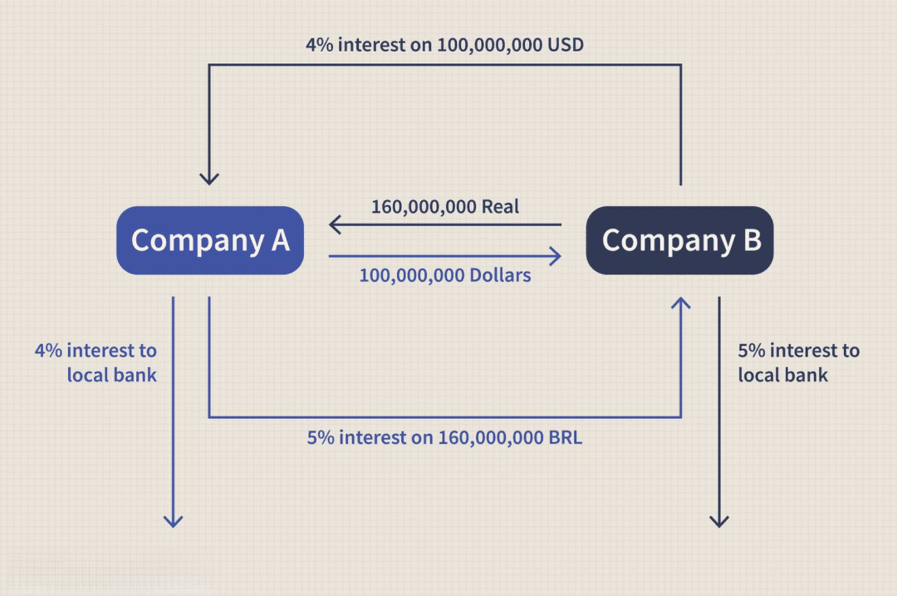

The world of financial agreements is vast and diverse, with each type serving distinct purposes in various sectors. At the core of these agreements are cash contracts and trading agreements, which hold significant positions in commodity markets and investment circles. Cash contracts facilitate immediate transactions involving tangible goods, playing an essential role in industries that rely on the steady supply of raw materials, where prompt delivery is crucial for maintaining production schedules. Concurrently, trading agreements establish clear terms for exchanging financial instruments, ensuring transparency and reducing risk for all parties involved.

In recent years, the emergence of algorithmic trading has reshaped the financial landscape by harnessing the power of technology to execute trades with remarkable speed and accuracy. Algorithmic trading, often referred to as algo trading, utilizes automated and pre-programmed instructions to carry out transactions at high frequencies, minimizing the impact of human error and emotional decision-making. This method has proven to be particularly useful in optimizing the execution of trades, thereby enhancing market efficiency.



This article explores the intricacies of financial agreements, focusing on cash contracts and trading agreements, with a special emphasis on the role of algo trading. By understanding these components, market participants can gain insights into the mechanisms driving modern financial operations and the opportunities presented by technological advancements in trading.

## Table of Contents

## Understanding Financial Agreements

Financial agreements are essential components of economic activity, providing the framework for clear, secure transactions among parties. These agreements vary widely in scope and complexity, encompassing a range of contracts tailored to fulfill specific financial needs.

At the simplest end, financial agreements may involve contracts between small businesses or individuals. These can include straightforward trade agreements, basic loan contracts, or service agreements. The primary purpose of these agreements is to create a legally binding commitment that clarifies the expectations and responsibilities of each party, thereby reducing uncertainty and potential conflicts.

On the other hand, complex financial instruments are often employed by multinational corporations and financial institutions to navigate more sophisticated market environments and investment strategies. Such instruments can include derivatives like options and futures, swaps, and structured financial products. These agreements often involve intricate terms and conditions tailored to hedge risks, optimize tax obligations, or facilitate large-scale capital management.

The basic structure of a financial agreement typically includes several key elements:

1. **Parties Involved**: This specifies who the agreement is between, detailing the rights and responsibilities of each party.

2. **Terms and Conditions**: Clearly outlines the scope of the agreement, including any obligations, timelines, and deliverables. It also specifies conditions under which the agreement may be modified or nullified.

3. **Payment Terms**: Details the financial considerations, such as payment schedules, amounts, and methods. This section may include clauses related to interest rates in loans or penalties for late payments.

4. **Termination Clause**: Defines the conditions under which the agreement may be legally terminated, protecting parties against unforeseen circumstances or breaches of contract.

5. **Dispute Resolution**: Provides mechanisms for resolving any disputes that arise, which may include arbitration or litigation procedures.

The design and effectiveness of financial agreements are crucial for ensuring a stable and predictable economic environment. They are instrumental in fostering trust among parties, enabling large-scale transactions and investments by offering a clear framework for risk management and legal recourse. Properly structured financial agreements help maintain the fluidity and continuity of economic activities, creating a foundation upon which both simple and complex financial operations can thrive.

## What is a Cash Contract?

A cash contract is a specific type of financial arrangement widely utilized in various industries requiring tangible commodities for their production processes. In a cash contract, one party agrees to procure a specific quantity of a commodity at a predetermined date, establishing a clear and binding obligation. Unlike futures contracts, which allow for settlement in cash without necessitating the delivery of the actual commodity, cash contracts mandate the physical delivery of the agreed-upon goods. This characteristic distinguishes cash contracts, ensuring that the buyer receives the exact commodity essential for their operations.

The execution of cash contracts typically occurs in spot markets, where commodities are purchased for immediate delivery. These markets cater to industries like manufacturing and agriculture, which depend on a continuous and reliable supply of raw materials to sustain their production lines. The emphasis on actual delivery rather than financial settlement in cash contracts is crucial for businesses that need to maintain inventory levels and meet production demands consistently.

Given the nature of cash contracts, they are particularly prevalent in sectors requiring precise quantities and quality standards of commodities. For instance, a steel manufacturer may rely on cash contracts to secure iron ore, or a food processing business might use them to acquire crops or livestock. The integration of these contracts into business operations ensures predictability and mitigates risks associated with price [volatility](/wiki/volatility-trading-strategies), thus providing a stable supply chain.

In contrast to standardized futures contracts traded on exchanges, cash contracts often involve over-the-counter (OTC) transactions. OTC markets enable customized agreements tailored to the specific needs of the contracting parties, offering flexibility in terms but inherently posing higher counterparty risks due to the absence of a centralized clearinghouse. This flexibility allows businesses to negotiate terms that align with their unique production schedules and quality specifications, enhancing the utility of cash contracts in commercial activities.

## How Cash Contracts Work

Cash contracts function primarily within spot markets, environments where commodities change hands for immediate delivery. These contracts are vital in industries that depend on timely procurement of raw materials. In manufacturing, for instance, firms secure necessary inputs through cash contracts to maintain uninterrupted production cycles. The immediacy of spot markets allows companies to respond swiftly to fluctuations in demand and supply, optimizing their inventory and production schedules.

In addition to spot markets, over-the-counter (OTC) markets play a crucial role in facilitating cash contracts. OTC markets offer a platform for more customized agreements tailored to the specific needs of the contracting parties. Unlike standardized contracts traded on formal exchanges, OTC cash contracts can be tailored in terms of quantity, quality, and delivery terms. This flexibility, however, comes with increased counterparty risks. Given the absence of an intermediary, the parties involved must conduct rigorous due diligence and establish mutual trust to mitigate potential defaults or disputes.

The choice between spot and OTC markets often hinges on the priorities of the contracting parties—spot markets typically offer better [liquidity](/wiki/liquidity-risk-premium) and faster transactions, while OTC markets provide customized solutions at the expense of higher risk levels. Despite these differences, both markets are integral to the functionality of cash contracts, enabling efficient procurement and distribution of essential commodities across various industries.

## Examples of Cash Contracts

In the world of commodities, cash contracts are essential tools for businesses aiming to secure a reliable supply chain. Take, for example, a coffee manufacturer that relies on a steady influx of high-quality coffee beans to produce its signature blends. To mitigate the risk of price volatility and ensure a consistent supply, the manufacturer may use cash contracts to purchase coffee beans at the current spot price.

By engaging in such contracts, the manufacturer locks in the price for a specific quantity of coffee beans, agreeing on both the price and the date of delivery. This agreement helps the company manage its production costs effectively. Unlike futures contracts, which might settle in cash without actual delivery, cash contracts require the physical delivery of the commodity, aligning more closely with the manufacturer's operational needs.

Furthermore, these contracts allow the manufacturer to predict expenses more accurately and maintain stable pricing for its products, which is crucial for financial planning and customer satisfaction. The coffee manufacturer reduces the risk of sudden price hikes or shortages in the supply chain, ensuring uninterrupted production schedules.

To illustrate, suppose a coffee company agrees to purchase 100,000 pounds of Arabica coffee beans at $1.30 per pound for delivery in one month. By locking in the price and securing the beans, the manufacturer can continue producing its blends without concerns over market fluctuations impacting its supply costs. This certainty aids in budget forecasting and maintaining product availability, which are vital aspects of successful business operations.

## The Role of Trading Agreements

Trading agreements are vital components of the financial landscape, serving as the foundational documents outlining the terms, conditions, and specifications under which financial instruments are bought, sold, or exchanged. These agreements are essential for ensuring that all involved parties, whether individuals, corporations, or financial institutions, have a clear understanding of their obligations, the scope of the contract, and the associated risks.

A critical aspect of a trading agreement is the clarity it provides by defining the roles and responsibilities of the parties involved. This prevents misunderstandings and disputes, as each party agrees to the conditions set forth in the agreement prior to entering the transaction. Furthermore, trading agreements often include detailed provisions on pricing, payment terms, delivery schedules, and contingencies, which play an integral role in creating a transparent and secure trading environment.

The variability of trading agreements is another notable characteristic. These contracts can differ significantly based on several factors, including:

1. **Jurisdiction**: Legal frameworks governing trading agreements can vary widely between different countries. For example, in the United States, the Uniform Commercial Code (UCC) often governs domestic trading agreements, while international agreements may be influenced by the United Nations Convention on Contracts for the International Sale of Goods (CISG).

2. **Industry**: Different industries have specific needs and standards that impact the terms of trading agreements. For instance, agreements in the energy sector might focus on price adjustments based on fluctuating oil prices, whereas those in agriculture might emphasize seasonal delivery terms.

3. **Parties Involved**: The nature and size of the parties involved can also affect the structure of a trading agreement. Large multinational corporations may have more complex agreements involving various financial instruments, derivatives, and risk management strategies compared to smaller companies or individual investors.

By specifying parameters such as transaction limits and authorized trading activities, trading agreements help to mitigate financial risks and enhance market stability. They are pivotal in facilitating efficient market operations, reducing transaction costs, and maintaining investor confidence. When carefully crafted and adhered to, these agreements serve as indispensable tools for governing financial transactions effectively.

## Algo Trading and Its Integration with Contracts

Algorithmic trading, commonly referred to as algo trading, has become an integral aspect of modern financial markets. It involves the use of complex algorithms to automatically execute trading orders based on pre-set criteria such as timing, price, and [volume](/wiki/volume-trading-strategy). The automation provided by algo trading allows traders to execute multiple trades at a speed and volume that would be impossible for humans to achieve manually. 

**Integration with Cash Contracts and Financial Agreements**

Algo trading is particularly advantageous when integrated with cash contracts and other financial agreements due to its ability to optimize transaction execution and reduce human error. Cash contracts, often involving the immediate delivery of a commodity, benefit from the precision and speed of algorithmic systems. When a market participant enters into a cash contract, the need to transact efficiently in the spot market is crucial, especially when dealing with commodities that have price volatility. Algo trading systems can be programmed to scan for favorable market conditions, executing trades at optimal times to secure better pricing and minimize costs.

For instance, an algorithm might be programmed to purchase a commodity when its price falls below a certain threshold or when specific market indicators suggest an upward trend. This not only aids in maintaining the continuity of supply but also in managing price risk more effectively.

**Efficiency and Effectiveness in Trading Agreements**

Beyond cash contracts, algo trading enhances the broader spectrum of trading agreements through its systemic precision. Trading agreements usually outline the terms for buying, selling, and exchanging financial instruments. In this context, algo trading systems ensure that trading conditions stipulated in agreements are adhered to meticulously. These systems can automatically validate transaction compliance with the terms set in contracts, mitigating the risks of breaches and disputes.

Moreover, the integration of algo trading with financial agreements facilitates high-frequency trading ([HFT](/wiki/high-frequency-trading-strategies)), which exploits tiny price discrepancies across different markets or financial instruments. HFT requires rapid processing of vast amounts of market data, which algo trading systems can handle efficiently. By automating the detection and execution of [arbitrage](/wiki/arbitrage) opportunities, algo trading supports the liquidity and stability of financial markets.

**Technical Aspects of Algo Trading**

From a technical standpoint, developing an [algorithmic trading](/wiki/algorithmic-trading) strategy involves writing code that can process market signals and execute trades based on those signals. Here's a simple example of a Python snippet representing an algorithm to execute trades when a moving average crossover is detected:

```python
def moving_average(data, window_size):
    return data.rolling(window=window_size).mean()

def execute_trade(signal):
    if signal == 'buy':
        # code to execute buy order
        pass
    elif signal == 'sell':
        # code to execute sell order
        pass

# Example market data
market_data = fetch_market_data()

# Calculate moving averages
short_ma = moving_average(market_data['price'], 50)
long_ma = moving_average(market_data['price'], 200)

# Determine trading signal
for i in range(1, len(market_data)):
    if short_ma[i] > long_ma[i] and short_ma[i-1] <= long_ma[i-1]:
        execute_trade('buy')
    elif short_ma[i] < long_ma[i] and short_ma[i-1] >= long_ma[i-1]:
        execute_trade('sell')
```

Such algorithms can be tailored to accommodate specific strategies as outlined in a trading agreement. The above code demonstrates a basic strategy using moving averages, but in practice, these algorithms can be far more complex, incorporating various technical indicators and real-time data analysis.

In conclusion, the fusion of algorithmic trading with financial agreements, particularly cash contracts, enhances operational efficiency and precision. As technological advancements continue to evolve, the deployment of algo trading is likely to become even more sophisticated, offering further innovations in contract execution and market stability.

## Conclusion

Understanding the nuances of financial agreements, particularly cash contracts and trading agreements, is essential for participants aiming to succeed in the financial markets. These contracts form the bedrock of many economic transactions, providing the necessary legal framework to ensure parties adhere to agreed terms. As financial markets continue to evolve, algorithmic trading, or algo trading, plays an increasingly significant role in transforming how these agreements are executed.

Algo trading, with its ability to automate and execute trades at high speeds and volumes, offers both opportunities and challenges when integrated with financial agreements. One of the primary opportunities lies in the optimization of trade execution. By leveraging algorithms, traders can minimize human error, reduce transaction costs, and exploit market inefficiencies, thereby enhancing the overall efficiency of the trading process. This integration can significantly impact liquidity provision, price discovery, and risk management, leading to more robust financial systems.

However, the rapid advancement of algo trading also presents challenges. The complexity of these systems requires market participants to be well-versed in both financial markets and the underlying technology, ensuring they can adapt to environments characterized by high volatility and rapid change. Additionally, as algorithms become more sophisticated, regulatory frameworks must evolve to address potential risks, such as market manipulation and systemic failures, thus requiring continuous monitoring and adaptation.

Staying informed and adaptable is crucial for navigating this intricate and ever-changing financial landscape. As technology continues to reshape financial markets, participants must maintain a thorough understanding of financial agreements and their integration with modern trading technologies. By doing so, they can better position themselves to capitalize on emerging opportunities while mitigating risks, ensuring sustainable success in the financial markets.

## References & Further Reading

[1]: Hull, J. C. (2017). ["Options, Futures, and Other Derivatives"](https://www.semanticscholar.org/paper/Options%2C-Futures%2C-and-Other-Derivatives-Hull/89bdee500c8623864fc9eb7a471546aa713acc44). Pearson Education.

[2]: Harris, L. (2002). ["Trading & Exchanges: Market Microstructure for Practitioners"](https://www.amazon.com/Trading-Exchanges-Market-Microstructure-Practitioners/dp/0195144708) Oxford University Press.

[3]: Aldridge, I. (2013). ["High-Frequency Trading: A Practical Guide to Algorithmic Strategies and Trading Systems"](https://onlinelibrary.wiley.com/doi/pdf/10.1002/9781119203803.fmatter) Wiley Finance.

[4]: Mackenzie, D., & Millo, Y. (2003). ["Constructing a Market, Performing Theory: The Historical Sociology of a Financial Derivatives Exchange"](https://www.jstor.org/stable/10.1086/374404). American Journal of Sociology.

[5]: Gomber, P., Arndt, B., Lutat, M., & Uhle, T. (2011). ["High-Frequency Trading"](https://papers.ssrn.com/sol3/papers.cfm?abstract_id=1858626) in "Encyclopedia of Information Science and Technology". Springer.

[6]: Du, X., & Zhang, W. (2010). ["Does a Rising Scalper Ignite Flash Orders?"](https://pubs.rsc.org/en/content/articlelanding/2018/ee/c8ee02656d) Social Science Research Network (SSRN).