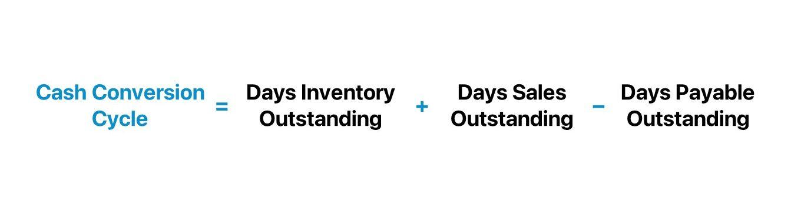

Financial metrics are crucial for evaluating the health and performance of any business. They offer insights into various aspects of an organization's operations and financial stability, guiding decision-makers in formulating strategies for growth and sustainability. Among these metrics, the Cash Conversion Cycle (CCC) emerges as an essential tool to gauge operational efficiency. The CCC provides a comprehensive view of how efficiently a company manages its working capital, focusing on the time it takes to convert inventory into cash. 

Understanding the CCC is not only vital for traditional business operations but also holds significance in algorithmic trading, where real-time decisions are made based on financial indicators. Algorithmic trading uses complex algorithms to make quick and accurate trading decisions, and integrating metrics like CCC can enhance trading strategies by offering insights into a company's liquidity and operational health.

This article explores the interplay between CCC, working capital, and its significance in algorithmic trading. By examining these metrics, businesses can gain insights into their liquidity and overall financial health. Understanding how businesses leverage these metrics can reveal their efficiency in handling cash flows and meeting financial obligations. 

The focus on CCC is further reinforced by its ability to shape financial strategies. It offers a lens through which businesses can view and improve their operational processes. The calculation of CCC involves critical components such as inventory management, accounts receivable, and accounts payable, all of which contribute to a company's cash flow dynamics.

By comprehensively analyzing CCC, businesses can optimize these components, resulting in improved liquidity, reduced costs, and enhanced financial stability. This article aims to provide a detailed understanding of CCC, its calculation, and its role in shaping financial strategies, empowering businesses to achieve sustained growth and profitability.

## Table of Contents

## Understanding the Cash Conversion Cycle (CCC)

The Cash Conversion Cycle (CCC) is a pivotal financial metric that measures the efficiency of a company's cash flow management. It is calculated by evaluating three key components: Days Inventory Outstanding (DIO), Days Sales Outstanding (DSO), and Days Payable Outstanding (DPO).

The formula for calculating the CCC is:

$$
\text{CCC} = \text{DIO} + \text{DSO} - \text{DPO}
$$

Where:

- **Days Inventory Outstanding (DIO)**: This metric reports the average number of days a company takes to sell its entire inventory. A lower DIO suggests faster inventory turnover and better inventory management, indicating efficient operational practices.

- **Days Sales Outstanding (DSO)**: DSO measures the average number of days it takes for a company to collect payment after a sale has been made. A shorter DSO implies effective credit management and a prompt cash collection process, enhancing the company's liquidity position.

- **Days Payable Outstanding (DPO)**: This component reflects the average number of days a company takes to pay its suppliers. A longer DPO indicates that the company retains cash longer, which can be beneficial for liquidity, provided it does not jeopardize supplier relationships.

The CCC essentially captures the entire lifecycle of cash flow from procurement of inventory, conversion into sales, and eventual receipt of cash, less the time taken to pay suppliers. A shorter CCC signifies that the company is swiftly converting its resources into cash, potentially reducing financial strain and improving operational efficiency. Conversely, an extended CCC might expose bottlenecks, indicating prolonged inventory holding periods, delayed customer payments, or slow settlements with suppliers.

Understanding each component and its role in the CCC offers insights into the company's operational management and financial health, enabling stakeholders to identify efficiency improvements and cash management opportunities.

## The Role of Working Capital in Business Operations

Working capital represents the difference between a company’s current assets and current liabilities, serving as a critical measure of financial health. It is fundamental to a company's ability to maintain daily operations, manage short-term financial obligations, and seize growth opportunities. A well-managed working capital ensures that a business has sufficient [liquidity](/wiki/liquidity-risk-premium) to cover its immediate expenses, while also having enough resources to invest in future growth.

The Cash Conversion Cycle (CCC) – a key metric in assessing working capital efficiency – provides valuable insights into how rapidly a business can convert its investments in inventory and accounts receivable into cash. It is calculated using the formula:

$$
\text{CCC} = \text{DIO} + \text{DSO} - \text{DPO}
$$

where:
- **DIO** (Days Inventory Outstanding) measures the average number of days a company takes to sell its inventory.
- **DSO** (Days Sales Outstanding) calculates the average number of days required to collect payment after a sale.
- **DPO** (Days Payable Outstanding) signifies the average number of days a company takes to pay its suppliers.

A shorter CCC indicates that a company can quickly free up cash from its operational processes, thereby enhancing its short-term liquidity position. This rapid turnover allows businesses to reinvest in operations or settle existing debts more efficiently, bolstering financial flexibility and boosting resilience against economic fluctuations.

Effective working capital management involves monitoring and optimizing these metrics to ensure a healthy cash flow. Companies that master this process often experience a significant competitive advantage, as they possess the agility to respond promptly to market opportunities and challenges. This is particularly relevant in industries characterized by rapid changes in demand or supply chain dynamics.

In summary, working capital is not just a measure of a company's current financial health; it is a pivotal component in strategic financial planning. By understanding and improving CCC, businesses can ensure sustained operational efficiency and foster an environment conducive to growth and innovation.

## Cash Conversion Cycle in Different Industries

The Cash Conversion Cycle (CCC) is an essential financial metric that offers insights into a company's efficiency in managing its cash flow, inventory, and receivables. However, its effectiveness and implications can greatly vary across different industries, primarily due to the unique operational practices and market conditions inherent to each sector.

In the retail industry, where inventory turnover is often rapid, the CCC may tend to be shorter. Retailers typically aim to convert their inventory into sales quickly, which minimizes the duration between the outlay of working capital for inventory and the generation of cash from sales. This fast-paced inventory turnover is reflected in a typically lower Days Inventory Outstanding (DIO). Furthermore, retailers often push for quicker payment terms from customers, thus reducing the Days Sales Outstanding (DSO), while often enjoying longer payment terms from suppliers, increasing the Days Payable Outstanding (DPO). These factors collectively contribute to a shorter CCC in the retail sector, which is a critical metric for assessing liquidity and operational efficiency in a highly competitive market.

Conversely, the manufacturing sector often experiences longer CCCs due to the nature of production processes, which may require holding inventory for extended periods. In manufacturing, the production cycle involves procuring raw materials, manufacturing finished goods, and then selling those goods, leading to potentially higher DIO. Moreover, manufacturers may offer extended payment terms to their customers as an incentive, which can increase the DSO. Balancing these lengthy cycles against payment terms from suppliers is crucial for manufacturers. For instance, high-tech manufacturing companies may take longer to sell products due to their complexity, hence impacting their overall CCC.

For example, technology manufacturers, recognized for their sophisticated products and complex supply chains, often have longer CCCs. In contrast, fast-moving consumer goods (FMCG) companies, belonging to the retail sector, typically operate with very short CCCs due to quick inventory turnover and fast-paced sales cycles.

Understanding these industry-specific differences in CCC allows companies to benchmark their performance accurately against peers in their sector. By doing so, firms can identify operational efficiencies or inefficiencies, influencing strategic decisions around inventory management, customer credit policies, and supplier negotiations. These insights are vital for optimizing cash flow management to ensure financial stability and operational success irrespective of industry [volatility](/wiki/volatility-trading-strategies).

Ultimately, recognizing the variability of the CCC across different sectors can guide companies in formulating more effective strategies tailored to their unique operational challenges and opportunities, subsequently enhancing their competitive position in the market.

## Algorithmic Trading and Financial Metrics

Algorithmic trading involves the use of computer algorithms to automate the process of buying and selling stocks, commodities, or other financial instruments. These algorithms rely heavily on real-time financial data to make informed decisions and execute trades at optimal moments. Among the financial metrics utilized in [algorithmic trading](/wiki/algorithmic-trading), the Cash Conversion Cycle (CCC) offers valuable insights into a company’s operational efficiency and liquidity position.

The CCC is instrumental in predicting cash flow trends, which can significantly affect a company’s stock performance and, consequently, trading strategies. By evaluating the CCC, traders can assess how efficiently a company manages its working capital, providing clues to the company's financial health. A shorter CCC typically indicates better cash flow management, suggesting that the company can quickly turn resources into cash. In contrast, a longer CCC might highlight potential inefficiencies, possibly affecting the company's ability to reinvest or pay off short-term obligations.

The integration of CCC with other financial indicators can enhance trading models. For example, combining CCC with profitability ratios and market sentiment indicators can provide a comprehensive view of a company’s condition, allowing algorithms to adjust trading strategies dynamically. These multi-faceted analyses enable algorithms to detect and exploit market inefficiencies, potentially increasing trading profits.

In practice, algorithmic systems process vast datasets, comparing CCC values across sectors or historical periods to identify trends. For instance, an algorithm might be programmed to prioritize trades in companies with significantly improving CCCs, signaling enhanced operational efficiency—a potential predictor of stock price appreciation. Conversely, widening CCCs might trigger selling signals if they suggest deteriorating cash management.

Moreover, the ability to adapt trading models in real-time based on changes in financial metrics like CCC is a cornerstone of profitable algorithmic strategies. As market conditions fluctuate, algorithms can be optimized to re-evaluate the weight given to CCC in relation to other performance indicators, ensuring resilience in both stable and volatile market environments.

Programming languages such as Python facilitate the implementation of such sophisticated algorithmic trading strategies. For instance, Python libraries like Pandas can handle extensive financial data processing, while [machine learning](/wiki/machine-learning) frameworks like Scikit-learn or TensorFlow allow the development of predictive models that incorporate CCC and other financial metrics.

In conclusion, a nuanced understanding of how CCC interacts with broader financial indicators is crucial for developing robust algorithmic trading strategies. Mastery of these relationships enables traders to create algorithms capable of achieving superior returns by harnessing comprehensive and dynamic financial insights.

## Strategies to Optimize the Cash Conversion Cycle

Improving the Cash Conversion Cycle (CCC) is pivotal for enhancing a company's operational efficiency and financial health. Companies can employ various strategies to reduce the duration it takes to convert investments in inventory and accounts receivable into cash. Key approaches include optimizing inventory levels, accelerating receivables collection, and negotiating favorable payment terms with suppliers.

### Optimizing Inventory Levels

One effective strategy is to implement just-in-time (JIT) inventory management. JIT aims to minimize inventory costs by synchronizing production schedules with demand, thereby reducing the Days Inventory Outstanding (DIO). By keeping inventory levels lean, companies minimize holding costs and reduce the risk of obsolescence.

**Example:** Dell Technologies employs a JIT model to maintain minimal inventory levels, allowing it to adapt quickly to changes in consumer demand and technological advancements. This approach has enabled Dell to maintain a competitive edge in the computer industry.

### Speeding Up Receivables Collection

To shorten the Days Sales Outstanding (DSO), businesses can streamline their receivables processes. Strategies include offering early payment discounts to customers or implementing automated invoicing systems to reduce delays in billing.

**Example:** A company offering a 2% discount for payments made within ten days of invoicing (instead of the standard 30 days) can incentivize quicker payment. This not only reduces DSO but also improves cash flow predictability.

### Negotiating Favorable Payment Terms

Enhancing Days Payable Outstanding (DPO) can be achieved by negotiating extended payment terms with suppliers without incurring penalties. This approach allows companies to retain cash longer, thereby optimizing working capital.

**Example:** A manufacturing firm might negotiate net-60 payment terms with its suppliers while maintaining net-30 terms with its customers. This increases the time available to use cash for operational needs or investment opportunities.

### Implementing Advanced Technologies

Leveraging technology, such as enterprise resource planning (ERP) systems, can offer insights into cash flow patterns and facilitate optimal inventory and receivables management. These systems provide real-time data analytics, helping businesses make informed decisions quickly.

### Real-World Financial Benefits

Improved CCC can lead to significant financial advantages. Businesses may experience enhanced liquidity, which reduces the need for external financing and its associated costs. Additionally, stronger supplier and customer relationships can result from quicker payment cycles and increased trust.

Overall, strategic management of the CCC not only boosts working capital efficiency but also enhances the company's agility to capitalize on market opportunities.

## Conclusion

A comprehensive grasp of the Cash Conversion Cycle (CCC) is essential for maintaining operational efficiency and financial health in businesses. By focusing on refining their CCC, companies can enhance liquidity, facilitating smoother operations and improving relations with both suppliers and customers. This improvement reduces the time it takes to convert resources into cash, which is critical for sustaining daily operations and funding future growth opportunities.

Furthermore, integrating financial metrics like CCC into algorithmic trading offers competitive benefits in rapidly changing markets. The real-time analysis of CCC can provide traders with insights into a company’s cash flow health, thereby enabling more informed trading decisions. Algorithmic models that incorporate CCC can predict cash flow trends, which is crucial for optimizing trading strategies.

For companies that prioritize the strategic management of their CCC, the potential for sustained growth and profitability increases significantly. Effective management leads to greater business agility, allowing organizations to adapt quickly to market changes while maintaining strong financial positions. Such strategic focus not only enhances working capital management but also paves the way for long-term success in competitive marketplaces.

## References & Further Reading

[1]: Gitman, L. J., & Zutter, C. J. (2012). "Principles of Managerial Finance." Pearson Prentice Hall.

[2]: ["The Cash Conversion Cycle and Corporate Liquidity"](https://www.investopedia.com/articles/06/cashconversioncycle.asp) by Celine Werle.

[3]: ["The Cash Conversion Cycle Across Industries"](https://run.unl.pt/bitstream/10362/11731/1/Costa.B_2014.pdf) by Joe Castellano. Harvard Business Review.

[4]: ["Algorithmic Trading and DMA: An Introduction to Direct Access Trading Strategies"](https://www.amazon.com/Algorithmic-Trading-DMA-introduction-strategies/dp/0956399207) by Barry Johnson.

[5]: ["Investments"](https://www.nerdwallet.com/article/investing/the-best-investments-right-now) by Zvi Bodie, Alex Kane, and Alan J. Marcus.

[6]: ["Corporate Finance: A Focused Approach"](https://www.amazon.com/Corporate-Finance-Approach-Michael-Ehrhardt/dp/1305637100) by Michael C. Ehrhardt and Eugene F. Brigham.

[7]: ["Python for Finance: Mastering Data-Driven Finance"](https://books.google.com/books/about/Python_for_Finance.html?id=2qd9DwAAQBAJ) by Yves Hilpisch.