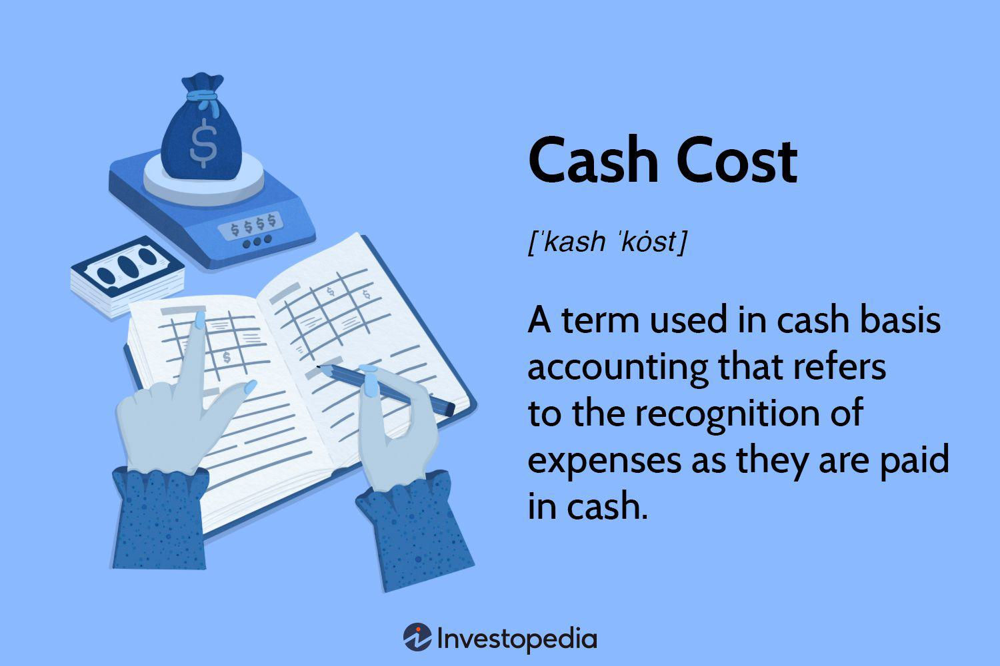

Understanding the interconnected aspects of finance—namely cash cost, cost management, financial analysis, and algorithmic trading—has become an imperative in today's rapidly evolving financial landscape. These elements represent vital nodes in a complex network that, when properly aligned, create significant opportunities to maximize efficiency and profit while minimizing expenses. The seamless integration of these financial components facilitates a more nuanced approach to navigating modern financial markets, enabling firms to leverage key insights for strategic advantage. 

Cash cost, as a fundamental component, reflects the actual outflow of cash during transactions and operations, offering a transparent view of liquidity and immediate financial standing. Effective cost management practices, on the other hand, ensure that resources are allocated efficiently, preventing waste and enhancing profitability. By utilizing sophisticated financial analysis tools and techniques—such as ratio analysis and cash flow analysis—businesses can gain deeper insights into their financial health, identifying both strengths and vulnerabilities.



Moreover, the advent of algorithmic trading marks a significant evolution in financial strategy, where computerized systems execute trades at a speed and precision that surpass traditional methods. By employing algorithms based on predefined criteria, traders can enhance their efficiency, mitigate risks, and capitalize on market opportunities with unprecedented speed.

This article investigates into these crucial components, providing a comprehensive view of their definitions, applications, and interconnections. We will explore how each aspect contributes to forming a holistic strategy for financial management and trading, with an emphasis on optimizing transactions and implementing data-driven decision-making. Understanding the interplay between these elements is fundamental for achieving financial success in a landscape characterized by rapid changes and technological advancements.

## Table of Contents

## Cash Cost and Its Importance in Financial Analysis

Cash cost is a fundamental concept in cash basis accounting, where expenses are recognized when they are paid, rather than when they are incurred. This approach contrasts sharply with the accrual accounting system, which recognizes expenses as they are incurred, regardless of the payment date. Cash cost accounting provides a straightforward view of a company's cash flow situation, offering a more accurate reflection of available cash at any given time. This clarity is particularly advantageous for small businesses, which may not have extensive resources to manage complex accounts receivable and payable systems.

In small business accounting, utilizing cash cost offers several advantages. It simplifies bookkeeping by directly correlating financial transactions with cash movement, making it easier to track and manage the business finances. This simplicity can be particularly beneficial for sole proprietors and small enterprises where liquid cash management is crucial for operations and strategic planning. Moreover, cash cost accounting can help mitigate the risk of "phantom income," which occurs when businesses show a profit under accrual accounting but face cash shortages due to uncollected receivables. By recognizing only actual cash transactions, businesses can align their financial reporting more closely with their cash-based financial realities.

However, the reliance on cash cost may understate expenses for businesses with significant credit transactions. For example, a company purchasing goods on credit would not report these expenses until payment is made, despite having the liability. This can lead to discrepancies in financial reporting, particularly in terms of liabilities and profitability. Thus, businesses must weigh the benefits of accurate cash flow representation against the potential for understating expenses and liabilities, particularly when substantial credit transactions are involved.

Understanding cash cost's role in financial analysis also has implications for tax liabilities. Under the cash basis, businesses may be able to defer recognizing income until it is actually received, thereby potentially reducing tax liabilities in a given period. While this can be beneficial for short-term financial planning, it requires careful monitoring to ensure compliance with applicable tax regulations.

In summary, cash cost accounting provides a streamlined approach to managing financial transactions through a clear focus on actual cash flow. While beneficial for small businesses and advantageous in managing phantom income situations, it requires careful consideration of the potential impact on financial reporting and tax liabilities. Adopting cash cost accounting as part of a broader financial management strategy can provide businesses with greater control over their cash position and facilitate informed financial decision-making.

## Cost Management Practices for Enhanced Profitability

Effective cost management involves a systematic approach to controlling and reducing business expenses in order to optimize profitability and enhance operational efficiency. Implementing effective cost management requires strategic planning and a comprehensive understanding of an organization's financial activities. Key techniques in cost management include budget control, cost center analysis, and the breakdown of overheads, which are fundamental to ensuring sustainable financial growth.

**Budget Control**  
Budget control is essential for maintaining financial discipline. It involves creating financial plans that guide spending and investments, ensuring that expenses do not exceed budgetary provisions. With budget control, organizations can allocate resources efficiently, identify potential cost overruns early, and make necessary adjustments to stay on track. By monitoring budget variances—differences between projected and actual expenditures—management can take proactive measures to align their financial outflows with strategic objectives.

**Cost Center Analysis**  
Cost center analysis allows businesses to evaluate the financial performance of different divisions or units within the organization. A cost center is a department or segment whose expenses can be specifically tracked and managed. By analyzing cost centers, businesses can identify the areas that are overutilizing resources and assess their contribution to the overall profitability. This analysis helps in making informed decisions about resource allocation and cost-cutting measures, ensuring that each unit operates efficiently and supports the organization's financial goals.

**Breaking Down Overheads**  
Overheads, or indirect costs, include expenses not directly tied to a specific product or service, such as rent, utilities, and administrative salaries. Breaking down these overheads into finer components allows businesses to pinpoint areas for cost savings. Detailed overhead analysis can uncover inefficiencies in expense management, enabling businesses to optimize their operations for better financial outcomes. 

**Strategic Role in Planning and Decision-Making**  
Cost management plays a critical role in strategic planning and decision-making. Organizations rely on accurate cost data to forecast financial performance, plan for future investments, and determine pricing strategies. By understanding the cost implications of various business activities, managers can make informed decisions that align with their strategic objectives, ensuring long-term financial stability.

**Enhancing Long-Term Financial Growth**  
Mastering cost management practices positions businesses to leverage financial insights for strategic improvements. By continuously evaluating and refining cost structures, organizations can reduce waste, improve efficiencies, and increase profitability. Effective cost management allows businesses to remain competitive by adapting to market changes and economic fluctuations, ensuring sustained financial growth. 

In summary, strategic cost management is a cornerstone of efficient financial operation and long-term success. Techniques such as budget control, cost center analysis, and overhead breakdown empower businesses to manage expenses effectively, contributing to enhanced profitability and strategic growth.

## Financial Analysis: Tools and Techniques

Financial analysis is essential for evaluating the economic performance and potential of businesses. It involves systematic evaluation through various tools and techniques, creating a foundation for sound investment decisions.

### Key Methods of Financial Analysis

#### Ratio Analysis

Ratio analysis is a quantitative method of obtaining insight into a company's [liquidity](/wiki/liquidity-risk-premium), operational efficiency, profitability, and solvency by comparing its financial figures. Key ratios include:

1. **Liquidity Ratios**: Measure a company's ability to meet short-term obligations. Common ratios include the current ratio and quick ratio.
   - Current Ratio = Current Assets / Current Liabilities
   - Quick Ratio = (Current Assets - Inventory) / Current Liabilities

2. **Profitability Ratios**: Assess a company’s ability to generate profit. Examples include net profit margin and return on equity (ROE).
   - Net Profit Margin = Net Income / Revenue
   - Return on Equity (ROE) = Net Income / Shareholder’s Equity

3. **Solvency Ratios**: Evaluate long-term stability, indicating the firm's capacity to meet its long-term debts. The debt to equity ratio is an example.
   - Debt to Equity Ratio = Total Debt / Shareholder’s Equity

#### Trend Analysis

Trend analysis involves examining financial data over successive periods to identify patterns or trends that provide insights into a company's growth and performance trajectory. This technique is instrumental in forecasting and strategic planning. It often involves the use of visual aids such as line graphs or bar charts to illustrate financial metrics over time.

#### Cash Flow Analysis

Cash flow analysis evaluates the inflow and outflow of cash to understand a company's liquidity and operational efficiency. It divides cash flow into three main categories:

1. **Operating Activities**: Cash generated from regular business operations.
2. **Investing Activities**: Cash used for or generated from investments in assets.
3. **Financing Activities**: Cash related to debt, equity, and dividends.

The statement of cash flows offers a detailed view of how cash is utilized, highlighting potential cash shortages and providing insights into financial health.

### Supporting Strategic Decisions

Effective financial analysis supports strategic decision-making in cost management and cash flow optimization by:

- **Enhancing Cost Efficiency**: Identifying areas where costs can be curtailed or optimized.
- **Identifying Investment Opportunities**: Analyzing financial metrics to discern viable investment ventures.
- **Risk Management**: Using financial ratios and trends to foresee potential risks and preparing mitigation strategies.

Strong financial analysis practices enable organizations to set realistic financial goals, improve decision-making processes, and deploy resources more effectively to maximize profitability and ensure sustainable growth.

## The Role of Algorithmic Trading in Modern Finance

Algorithmic trading represents a transformative process in modern financial markets, leveraging sophisticated computerized systems to execute trades according to sets of predefined criteria. This method enhances both speed and efficiency, making it a staple among institutional traders and increasingly popular with retail investors. The appeal of [algorithmic trading](/wiki/algorithmic-trading) lies not only in its ability to process large volumes of data swiftly but also in its capacity to make impartial and data-driven decisions, reducing the emotional biases often associated with manual trading.

Central to the success of algorithmic trading is an understanding of transaction costs, which are pivotal in determining overall profitability. These costs encompass a range of expenses, including brokerage fees, bid-ask spreads, and market impacts such as slippage. Identifying and minimizing these costs is crucial for traders seeking to optimize their strategies. 

Several factors influence transaction costs in algorithmic trading:

1. **Market Liquidity**: The ease with which an asset can be bought or sold without affecting its price is critical. High liquidity generally results in lower costs and better execution prices, while low liquidity can lead to higher transaction costs due to larger spreads and greater slippage.

2. **Order Size**: Large orders can significantly affect market prices, especially in less liquid markets. Splitting orders into smaller tranches can help manage and reduce the impact costs, permitting better price realization over time.

3. **Trading Frequency**: Frequent trading activities can compound transaction costs, hence requiring a careful balance between capitalizing on market movements and cost efficiency.

To address these challenges, several strategies are employed in algorithmic trading:

- **Smart Order Routing (SOR)**: This technique involves using algorithms to find the most favorable conditions and executions across different market venues, thereby minimizing transaction costs. 

- **Optimal Execution Algorithms**: Algorithms like Volume Weighted Average Price (VWAP) and Time Weighted Average Price (TWAP) are designed to execute large orders while minimizing market impact and price deviations.

- **Transaction Cost Analysis (TCA)**: This involves using statistical models and historical data to evaluate and improve trading performance by understanding factors that affect transaction costs.

- **Execution Algorithms**:
   ```python
   def VWAP(prices, volumes):
       total_volume = sum(volumes)
       sum_product_price_vol = sum(price * volume for price, volume in zip(prices, volumes))
       return sum_product_price_vol / total_volume
   ```

Advanced algorithms can integrate [machine learning](/wiki/machine-learning) and real-time data processing to further refine these strategies, adapting dynamically to market conditions. As financial markets continue to evolve, the role of algorithmic trading will undoubtedly expand, with ongoing developments in computational power and data analytics enhancing its efficacy and accessibility.

## Optimizing Transaction Costs in Algorithmic Trading

Transaction costs in algorithmic trading, encompassing brokerage fees, market spreads, and slippage, are critical factors that significantly influence strategy performance. Minimizing these costs not only enhances profitability but also aligns with optimizing trading strategies.

Order execution is a pivotal aspect where cost reduction can be achieved. Smart order routing (SOR) systems play a crucial role, as they dynamically select the most efficient path for trade execution. By analyzing real-time market conditions, SOR can minimize costs by choosing venues with the best prices and lowest fees. Additionally, negotiating brokerage fees is another important strategy. Traders can leverage their trading [volume](/wiki/volume-trading-strategy) or seek alternatives that offer lower fees, thus directly reducing operational costs.

Advanced trading algorithms offer substantial advantages by minimizing slippage and market impact. These algorithms optimize the timing and size of trades to avoid significant price movements that could unfavorably affect the execution price. One example is implementing volume-weighted average price (VWAP) strategies, which aim to execute orders in line with the market's average price during a specified time frame, thereby reducing market impact.

Managing transaction costs also involves the use of tools such as Transaction Cost Analysis (TCA). TCA provides metrics and insights into the trading process, identifying inefficiencies and opportunities for improvement. It involves analyzing historical data to assess the effectiveness of trade executions, measuring performance against benchmarks like VWAP or implementation shortfall. By understanding these metrics, traders can refine their strategies to enhance trade efficiency and optimize costs.

Incorporating these practices into algorithmic trading can effectively reduce transaction costs. As technology advances and markets evolve, continual analysis and adaptation of these strategies are essential for maintaining competitive advantage and ensuring financial success.

## Conclusion

Integrating cash cost management, financial analysis, and algorithmic trading strategies plays a crucial role in achieving financial success in today's dynamic financial landscape. Each component offers distinct advantages that collectively enhance a business's ability to optimize costs and refine trading strategies. Cash cost management ensures accurate tracking and control of expenses, which is fundamental in maintaining healthy cash flows and mitigating the risk of phantom income. By aligning expenses with cash availability, businesses can make informed financial decisions that contribute to long-term sustainability.

Financial analysis remains the backbone of effective decision-making in finance. Utilizing tools such as ratio analysis and cash flow analysis provides insights into operational efficiency and potential investment opportunities. By consistently analyzing financial statements, organizations can pinpoint areas of improvement and effectively manage risks. This strategic approach facilitates informed business choices, directly impacting cost management and optimizing financial resources.

Algorithmic trading stands as a transformative element in modern finance, offering unparalleled speed and precision in executing trades. By employing sophisticated algorithms, traders can minimize transaction costs—comprising brokerage fees, market spreads, and slippage—that directly affect profitability. Through techniques like smart order routing and the use of advanced algorithms, traders can achieve cost-effective and efficient trade execution, thereby maintaining a competitive edge.

In an ever-changing financial environment, continual learning and adaptation are indispensable. Mastering cash cost management, financial analysis, and algorithmic trading not only provides a strategic advantage but is also essential for maintaining relevance and achieving sustained financial success. Businesses and traders that embrace these tools demonstrate resilience and adaptability, crucial characteristics for thriving in the complex world of modern finance.

## References & Further Reading

[1]: ["Advances in Financial Machine Learning"](https://www.amazon.com/Advances-Financial-Machine-Learning-Marcos/dp/1119482089) by Marcos Lopez de Prado

[2]: ["Evidence-Based Technical Analysis: Applying the Scientific Method and Statistical Inference to Trading Signals"](https://www.amazon.com/Evidence-Based-Technical-Analysis-Scientific-Statistical/dp/0470008741) by David Aronson

[3]: ["Machine Learning for Algorithmic Trading"](https://github.com/stefan-jansen/machine-learning-for-trading) by Stefan Jansen

[4]: ["Quantitative Trading: How to Build Your Own Algorithmic Trading Business"](https://www.amazon.com/Quantitative-Trading-Build-Algorithmic-Business/dp/1119800064) by Ernest P. Chan

[5]: Grinold, R. C., & Kahn, R. N. (2000). ["Active Portfolio Management: A Quantitative Approach for Producing Superior Returns and Controlling Risk."](https://www.amazon.com/Active-Portfolio-Management-Quantitative-Controlling/dp/0070248826) McGraw-Hill.

[6]: Hull, J. C. (2015). ["Options, Futures, and Other Derivatives"](https://www.semanticscholar.org/paper/Options%2C-Futures%2C-and-Other-Derivatives-Hull/89bdee500c8623864fc9eb7a471546aa713acc44) (9th ed.). Pearson.

[7]: Fabozzi, F. J. (2008). ["Handbook of Finance, Volume I: Financial Markets and Instruments"](https://download.e-bookshelf.de/download/0000/5719/88/L-G-0000571988-0015243212.pdf). Wiley.