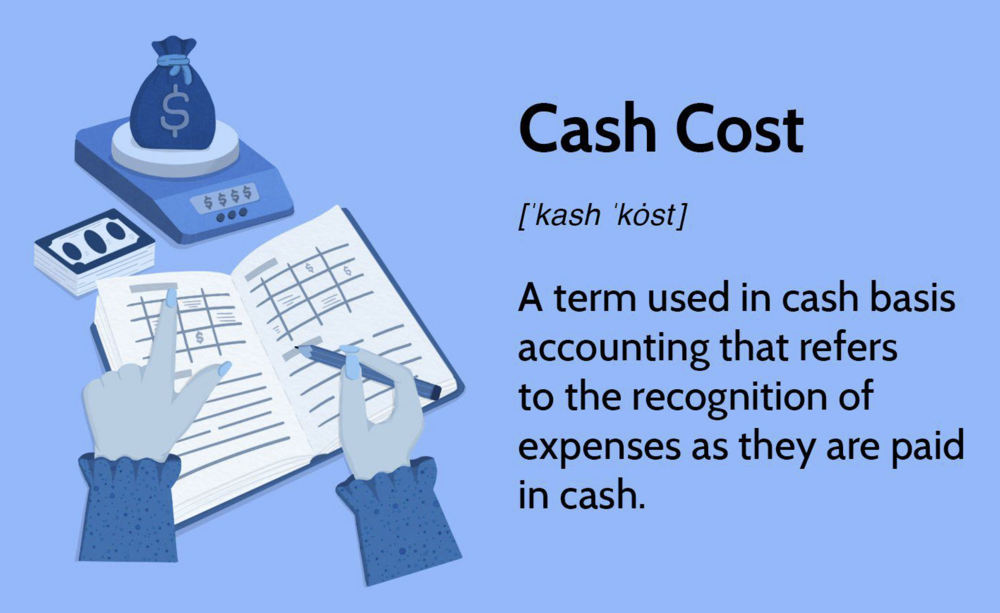

## Table of Contents

## What is cash cost?

Cash cost is the amount of money a business spends on things that it needs to run every day. This includes things like buying materials, paying workers, and keeping the lights on. It's important because it shows how much cash is going out of the business to keep it running smoothly.

Understanding cash cost helps business owners know if they are making enough money to cover these daily expenses. If the cash cost is too high compared to the money coming in, the business might struggle. By keeping an eye on cash costs, a business can make smart choices about where to spend money and how to save it.

## How is cash cost calculated?

To calculate cash cost, you add up all the money a business spends on things it needs every day. This includes costs like buying raw materials, paying salaries to employees, utility bills, and any other regular expenses that require cash. You look at all these costs over a certain period, like a month or a year, and add them together.

Once you have the total of these daily expenses, you have the cash cost. This number helps you see how much money the business is using just to keep going. It's important because it shows if the business is making enough money to cover these costs. If the cash coming in is less than the cash cost, the business might need to find ways to cut expenses or increase income.

## Why is cash cost important for businesses?

Cash cost is important for businesses because it tells them how much money they need every day to keep running. This includes money spent on things like buying materials, paying workers, and keeping the lights on. By knowing the cash cost, a business can see if it is making enough money to cover these daily expenses. If the cash coming in is less than the cash cost, the business might have trouble staying open.

Understanding cash cost also helps businesses make smart decisions. If the cash cost is too high, the business might need to find ways to spend less money or make more money. This could mean looking for cheaper materials, cutting back on some expenses, or finding new ways to bring in more cash. By keeping an eye on cash costs, a business can plan better and stay healthy financially.

## What are the benefits of using cash cost in financial analysis?

Using cash cost in financial analysis helps businesses see how much money they need every day to keep going. It shows if they are making enough money to cover these daily expenses. If a business knows its cash cost, it can tell if it is in good financial health or if it needs to make changes. This is really important because it helps them avoid running out of money and having to close down.

Cash cost also helps businesses make smart decisions about where to spend their money. If the cash cost is too high, they might need to find cheaper ways to do things or cut back on some expenses. By keeping track of cash costs, a business can plan better and make sure it has enough money to keep running smoothly. This way, they can focus on growing and making more money in the future.

## Can you explain the difference between cash cost and non-cash cost?

Cash cost is the money a business spends every day to keep running. This includes things like buying materials, paying workers, and paying for utilities. It's all the money that goes out of the business to keep it going. If a business knows its cash cost, it can see if it's making enough money to cover these expenses. This is important because it helps the business stay open and avoid running out of money.

Non-cash cost, on the other hand, is the cost of things that don't need actual money to be paid right away. These are costs like depreciation, where the value of things like machines or buildings goes down over time. Another example is amortization, which is similar but for things like patents or software. Even though no cash is going out the door right now, these costs still matter because they show how much the business's assets are worth and how they're changing over time.

## How does cash cost affect a company's cash flow?

Cash cost directly affects a company's cash flow because it shows how much money is going out every day to keep the business running. This includes money spent on things like buying materials, paying workers, and paying for utilities. If a company's cash cost is high, it means more money is going out, which can make the cash flow tight. If the cash coming in from sales is not enough to cover these costs, the company might run out of money and struggle to stay open.

On the other hand, if a company can keep its cash cost low, it helps improve the cash flow. When less money is going out, more money stays in the business. This gives the company more cash to use for other things, like growing the business or saving for the future. By keeping an eye on cash costs and managing them well, a company can make sure it always has enough money to keep running smoothly.

## What are the drawbacks of focusing solely on cash cost?

Focusing only on cash cost can make a business miss other important things. For example, it doesn't look at non-cash costs like depreciation, which are important for understanding the true cost of running the business. If a company only worries about cash cost, it might not see how its machines or buildings are getting older and losing value. This can lead to surprises later when these costs catch up.

Also, focusing just on cash cost might make a business cut back too much on things that are important for the future. For example, it might stop spending on research and development or training for employees, which are not daily costs but are crucial for growing and staying competitive. By only looking at cash cost, a business might save money now but hurt its chances of doing well in the long run.

## How can cash cost be used in budgeting and financial planning?

Cash cost is a key part of budgeting and financial planning because it shows how much money a business needs every day to keep running. By knowing the cash cost, a business can make a budget that makes sure there's enough money coming in to cover these daily expenses. This helps the business plan how to spend its money wisely. For example, if the cash cost is high, the business might decide to look for cheaper materials or ways to save on other expenses. This way, the business can keep its cash flow healthy and avoid running out of money.

In financial planning, understanding cash cost helps a business look ahead and make smart decisions. If the cash cost is expected to go up in the future, the business might plan to increase prices or find new ways to bring in more money. On the other hand, if the cash cost is going down, the business might have extra money to invest in growing or improving the business. By keeping track of cash costs and planning around them, a business can stay financially strong and ready for whatever comes next.

## What industries typically use cash cost as a key metric?

Many industries use cash cost as a key metric, especially those where daily expenses are a big part of their business. For example, manufacturing companies often look at cash cost to see how much money they spend on raw materials, labor, and utilities every day. This helps them know if they are making enough money to cover these costs and keep their factories running smoothly. Mining companies also use cash cost a lot. They need to know how much it costs to dig up minerals and metals each day to see if their operations are profitable.

Retail and service industries also find cash cost very useful. Retail stores need to track the money they spend on inventory, employee wages, and store operations to make sure they are making enough sales to cover these costs. In the service industry, like restaurants or hotels, cash cost helps them understand their daily expenses for food, staff, and utilities. By keeping an eye on cash cost, businesses in these industries can make smart decisions about pricing, cost-cutting, and how to keep their cash flow healthy.

## How does cash cost impact investment decisions?

Cash cost plays a big role in investment decisions because it shows how much money a business needs every day to keep going. If a business knows its cash cost, it can see if it has enough money left over to invest in new projects or equipment. For example, if the cash cost is low, the business might have extra money to buy a new machine that can help it make more products. But if the cash cost is high, the business might need to think twice about spending money on new investments because it might not have enough cash to cover both the daily expenses and the new investment.

When deciding where to invest, a business also needs to think about how the investment will affect its cash cost in the future. If a new machine can help the business save money on materials or labor, it might lower the cash cost over time. This can make the investment a good choice because it not only helps the business grow but also makes it more financially stable. On the other hand, if an investment will increase the cash cost without bringing in more money, the business might decide it's not worth it. By looking at cash cost, a business can make smart choices about where to put its money to help it grow and stay healthy.

## What are some advanced methods for optimizing cash cost?

One advanced way to optimize cash cost is by using technology to keep track of expenses in real time. Businesses can use software that watches how much money they spend every day on things like buying materials, paying workers, and keeping the lights on. This helps them see quickly if costs are going up and find ways to spend less money. For example, they might find cheaper suppliers for materials or use automation to do some jobs instead of hiring more people. By keeping a close eye on cash costs with technology, businesses can make smart choices to keep their money flowing smoothly.

Another way to optimize cash cost is by using data to predict future costs. Businesses can look at past spending to see patterns and guess how much they will need to spend in the future. This helps them plan better and make sure they have enough money to cover daily expenses. They might decide to buy materials in bulk when prices are low or change how they do things to save money. By using data to plan ahead, businesses can keep their cash costs under control and avoid surprises that could hurt their cash flow.

## Can you discuss case studies where cash cost management led to significant business outcomes?

One great example of how managing cash costs can change a business comes from a big car company. This company noticed that their cash costs were too high because they were spending a lot on parts from different suppliers. They decided to find a new way to buy parts that would save money. They started buying parts in bulk from fewer suppliers and worked with these suppliers to get better prices. By doing this, they cut their cash costs a lot. This meant they had more money to spend on making better cars and growing their business. It helped them stay strong even when the car market was tough.

Another example is from a chain of restaurants. They were struggling because their cash costs were too high, mostly because of food waste and high labor costs. They used technology to track how much food they were using and throwing away each day. They found ways to order just the right amount of food and trained their staff to use ingredients more carefully. They also looked at how many workers they needed at different times of the day and changed their schedules to save money. By managing their cash costs better, they were able to make more profit and open new restaurants. This showed how important it is to keep an eye on daily expenses to keep a business healthy and growing.

## References & Further Reading

[1]: ["Advances in Financial Machine Learning"](https://www.amazon.com/Advances-Financial-Machine-Learning-Marcos/dp/1119482089) by Marcos Lopez de Prado

[2]: ["Evidence-Based Technical Analysis: Applying the Scientific Method and Statistical Inference to Trading Signals"](https://www.amazon.com/Evidence-Based-Technical-Analysis-Scientific-Statistical/dp/0470008741) by David Aronson

[3]: ["Machine Learning for Algorithmic Trading"](https://github.com/stefan-jansen/machine-learning-for-trading) by Stefan Jansen

[4]: ["Quantitative Trading: How to Build Your Own Algorithmic Trading Business"](https://www.amazon.com/Quantitative-Trading-Build-Algorithmic-Business/dp/1119800064) by Ernest P. Chan

[5]: Grinold, R. C., & Kahn, R. N. (2000). ["Active Portfolio Management: A Quantitative Approach for Producing Superior Returns and Controlling Risk."](https://www.amazon.com/Active-Portfolio-Management-Quantitative-Controlling/dp/0070248826) McGraw-Hill.

[6]: Hull, J. C. (2015). ["Options, Futures, and Other Derivatives"](https://www.semanticscholar.org/paper/Options%2C-Futures%2C-and-Other-Derivatives-Hull/89bdee500c8623864fc9eb7a471546aa713acc44) (9th ed.). Pearson.

[7]: Fabozzi, F. J. (2008). ["Handbook of Finance, Volume I: Financial Markets and Instruments"](https://download.e-bookshelf.de/download/0000/5719/88/L-G-0000571988-0015243212.pdf). Wiley.