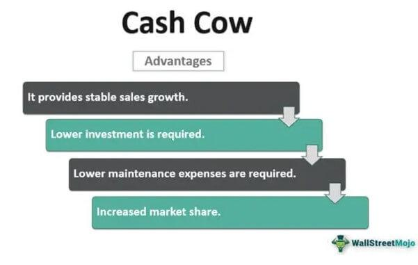

Investments play a pivotal role in driving business growth and economic development by allocating resources towards future returns. By channeling funds into productive uses, investments fuel innovation, expansion, and sustainability, ultimately contributing to increased profitability and shareholder value. The myriad types of investments available today offer varied opportunities to cater to diverse investor goals and risk appetites.

In the business lexicon, a 'cash cow' is a term used to describe a segment of business that consistently generates substantial income with relatively little investment. This concept finds its origins in the Boston Consulting Group (BCG) matrix, where cash cows signify businesses with high market share in an industry characterized by low growth. They typically exhibit stable revenue streams, making them reliable choices for investors seeking consistent returns. Notable examples of cash cow businesses include legacy tech companies and established consumer brands that, despite a saturated market, continue to produce steady profits.

Algo trading, short for algorithmic trading, represents a modern frontier in investment techniques. It involves the use of computer algorithms to execute trades at speeds and frequencies far beyond human capabilities. These systems are programmed to observe market trends and make trading decisions based on pre-set criteria. The appeal of algo trading lies in its potential for high returns by capitalizing on market efficiencies and reducing emotional biases inherent in traditional trading methods.

Both cash cow businesses and algo trading exemplify distinct yet promising investment opportunities. While the former provides stability and predictability, the latter offers excitement and potential high yields through technological advancements. As we continue, we will explore these and other investment types, illustrating how they can be strategically utilized to enhance financial growth and stability.

## Table of Contents

## Understanding Different Investment Types

Investment types are fundamental categories of financial assets that individuals and institutions can allocate capital to for potential returns. These types of investments provide varying levels of risk and return and are critical in wealth accumulation and preservation. Diversification, a strategy of spreading investments across various asset types, is essential in mitigating risk and optimizing returns, as it reduces reliance on a single asset class and smoothens out the volatility of an investment portfolio.

### Stocks

Stocks, or equities, represent ownership in a corporation. Investors participate in the company's profits through dividends and capital appreciation as the company's value increases. The return profile of stocks can be high but comes with equally high [volatility](/wiki/volatility-trading-strategies) and risk, as stock prices can fluctuate significantly due to market conditions and company performance. Industries commonly associated with investments in stocks include technology, healthcare, finance, and consumer goods.

### Bonds

Bonds are debt securities issued by governments, municipalities, or corporations to raise capital. Investors in bonds are essentially lending money to the issuer in exchange for periodic interest payments and the return of principal at the bond's maturity. Bonds typically offer lower returns compared to stocks but with lower risk, making them a more stable investment option. They are suitable for conservative investors seeking fixed income. Government bonds, corporate bonds, and municipal bonds are primary examples, with industries like utilities and transportation often issuing bonds to fund infrastructure projects.

### Real Estate

Real estate investments involve purchasing property, either residential or commercial, to generate rental income or capitalize on appreciation. Real estate can provide a steady income stream and acts as a hedge against inflation due to the tangible nature of property assets. The risk and return profile can vary widely depending on location, market conditions, and property management. Real estate investment trusts (REITs) are a popular way for individuals to invest in real estate without managing properties directly, providing exposure to industries such as retail, healthcare, and hospitality.

### Alternative Investments

Alternative investments encompass a broad category of assets outside the traditional stocks, bonds, and cash. These include commodities, private equity, hedge funds, cryptocurrencies, and art. Alternative investments can offer diversification due to their low correlation with traditional asset classes, potentially enhancing portfolio performance in volatile markets. However, they often [carry](/wiki/carry-trading) higher risk and require specialized knowledge to manage effectively. Industries associated with alternative investments include technology for venture capital, natural resources for commodities, and digital sectors for cryptocurrencies.

### Aligning Investments with Goals and Risk Tolerance

Aligning investment types with an investor's goals and risk tolerance is crucial for developing a successful investment strategy. Growth-oriented investors with high risk tolerance might prioritize equities and alternatives for higher potential returns. In contrast, conservative investors may lean towards bonds and real estate for stability and income. It's vital to assess individual financial goals, time horizons, and comfort with risk, as these factors significantly influence the choice of investment types and the overall asset allocation strategy.

In conclusion, understanding the different types of investments and their risk-return profiles allows investors to make informed decisions that align with their financial objectives and risk appetite. Through diversification and careful consideration of personal investment goals, individuals can effectively build and manage a balanced portfolio.

## Cash Cow Businesses: A Reliable Investment

A 'cash cow' business is a term derived from the Boston Consulting Group (BCG) matrix—a strategic tool that helps companies allocate resources and understand their business units. In this matrix, a cash cow is characterized by a high market share in a market exhibiting low growth. These businesses generate steady and substantial cash flows that exceed the amount of cash needed to maintain the business, as the market is mature and companies need to reinvest minimally to sustain operations. 

### Characteristics of Cash Cow Businesses

Cash cow businesses are distinguished by their reliable financial performance and market stability. Their high market share results from established brand loyalty and operational efficiencies that create barriers for potential competitors. Furthermore, these businesses typically operate in mature markets where growth has plateaued, thus requiring minimal capital investment to maintain market position. For investors, this translates to consistent dividends, and potentially reinvestment into other segments of the business.

### Examples of Cash Cow Businesses

Notable examples of cash cow businesses are often found among legacy tech companies and long-established consumer brands. Companies like Microsoft with its Windows operating system and Office suite, or Apple with its hardware products, particularly exemplify cash cow characteristics by continuously generating substantial cash with limited market growth. Procter & Gamble's household products and Coca-Cola's beverage offerings are also typical examples, where mature product lines dominate their respective markets.

### Benefits of Investing in Cash Cow Businesses

Investing in cash cow businesses offers several advantages. The steady cash flows they produce provide a reliable income stream for investors, often in the form of high dividends. Additionally, these businesses typically exhibit low volatility since they operate in established markets with stable demand. This financial stability makes them attractive to conservative investors seeking to preserve capital and gain moderate returns without significant risk exposure.

### Potential Challenges and Considerations

Despite the attractions, there are challenges and considerations for investing in cash cow businesses. The primary risk is the potential for market saturation and obsolescence, particularly if the business fails to innovate or adapt to market trends. For instance, technological advancements can quickly render existing products obsolete—relevant in the tech industry. Moreover, because these businesses operate in low-growth markets, the potential for share price appreciation is limited compared to companies in burgeoning sectors. Investors must therefore balance the appeal of stability against the risk of stagnation and ensure these investments align with long-term financial goals.

In conclusion, cash cow businesses present a reliable investment opportunity through their high market share and low growth dynamics, generating steady cash flows with minimal investment requirements. While they promise low volatility and consistent returns, investors should remain vigilant about industry changes and potential disruptions impacting these mature market leaders.

## Algo Trading: The Cutting-Edge Investment

Algorithmic trading, commonly known as algo trading, is a significant innovation in modern financial markets. It involves the use of automated software systems to execute trades at speeds and frequencies that are impossible for human traders. By employing pre-set algorithms, these systems can process vast amounts of market data and execute orders based on defined criteria, such as timing, price, or quantity, thereby optimizing trade execution.

The primary advantage of algo trading is its speed and efficiency. Automated systems can analyze multiple market variables and execute trades in milliseconds, far surpassing human capabilities. This speed allows traders to capitalize on short-lived trading opportunities with precision, often minimizing potential losses. Additionally, by removing human emotions from the trading equation, [algorithmic trading](/wiki/algorithmic-trading) reduces biases related to fear, greed, and overthinking, which can negatively impact decision-making.

Successful examples of algo traders and firms illustrate the transformative potential of this approach. Renowned trading firms like Renaissance Technologies and Citadel have leveraged complex algorithms to consistently outperform traditional trading strategies. These firms integrate advanced mathematical models and large-scale data analytics to refine their trading algorithms continuously.

Despite its benefits, algorithmic trading presents several risks and technical challenges. One key concern is the possibility of system failures, which can lead to significant financial losses if not properly managed. Moreover, the reliance on complex models and real-time data analysis requires substantial computational power and sophisticated infrastructures. Another risk involves market manipulation practices, such as spoofing, which can disrupt market stability. Furthermore, while eliminating emotional biases, algo trading can inadvertently generate systematic errors if the underlying model is flawed or the market conditions change unexpectedly.

As a result, algorithmic trading requires robust risk management protocols and continuous monitoring to ensure its efficiency and security. Firms investing in algo trading need to balance the pursuit of cutting-edge performance with the implementation of safeguards to mitigate potential drawbacks.

## Comparing Cash Cow Businesses and Algo Trading

Cash cow businesses and algorithmic trading represent contrasting investment approaches, each with distinct attributes that attract different types of investors. Cash cow businesses are known for their stability and predictability, characterized by steady cash flows and low volatility due to their established market presence and high market share in low-growth sectors. In contrast, algorithmic trading is dynamic, relying on automated systems to execute trades with speed and precision, driven by complex algorithms that assess large volumes of data in real-time.

### Stability vs. Dynamism

Investors seeking stable and predictable returns often prefer cash cow businesses. These businesses, typically leading within mature industries, generate consistent profits regardless of market conditions. This makes them ideal for conservative investors or those with a lower risk tolerance, such as retirees or those nearing retirement, who prioritize capital preservation over aggressive growth.

Conversely, algorithmic trading appeals to investors comfortable with higher risk and who seek to capitalize on short-term market inefficiencies. The dynamism of algo trading can yield significant returns in volatile markets, but it also requires a high tolerance for risk and a robust understanding of trading technologies and market conditions. Active traders and hedge funds are typically drawn to this approach due to its potential for quick gains, provided they can effectively manage the associated risks.

### Combining Strategies for Portfolio Balance

Diversifying by integrating cash cow businesses and algorithmic trading into a single portfolio can provide a balanced investment strategy. The stability of cash cow investments can offset the volatility of algorithmic trading, offering a hedge against market downturns. By allocating a portion of the portfolio to each strategy, investors can enjoy the dual benefits: steady cash flows from cash cow businesses and higher returns from algo trading's agility.

For example, a diversified portfolio might allocate 60% of assets to cash cow businesses for stability and 40% to algo trading for growth. Adjustments can be made based on market conditions and the investor’s financial goals, ensuring flexibility in strategy deployment.

### Impact of Market Changes

Market conditions significantly affect the efficacy of these investment types. During economic downturns, cash cow businesses often remain resilient due to their established customer bases and essential product offerings, maintaining shareholder value. However, during periods of rapid technological advancement or in highly volatile market phases, algorithmic trading may outperform traditional investments by capitalizing on fleeting market opportunities that manual trading could miss.

Investors should monitor macroeconomic indicators, industry trends, and regulatory environments to adapt their strategies accordingly, ensuring their investment portfolios remain robust against external shifts.

### Strategies for Switching or Blending Investments

Investors looking to switch between or blend cash cow and algorithmic trading investments can adopt several strategies. Diversification is key; investors should periodically reassess asset allocation based on market outlooks and individual performance metrics. Additionally, employing a 'core-satellite' approach—where cash cow businesses form the core of the portfolio and algo trading constitutes the satellite—can provide a stable foundation while allowing for opportunistic trading.

Investors might also implement a dynamic asset allocation strategy, adjusting their portfolio based on market cycles. For example, increasing exposure to algo trading during bullish, volatile markets and shifting back to cash cow businesses during bearish, more stable periods can optimize returns while managing risk effectively.

In conclusion, while cash cow businesses offer steadiness and reliability, algorithmic trading introduces an element of dynamism and potential for higher returns. Combining both can lead to a well-rounded investment strategy capable of navigating the complexities of modern financial markets.

## Conclusion

In conclusion, the exploration of various investment types highlights the importance of diversification to mitigate risks and enhance returns. Cash cow businesses offer investors stability and predictable cash flows, making them an attractive option for long-term investment. On the other hand, algorithmic trading represents a cutting-edge approach to modern investments, harnessing technology to achieve speed, efficiency, and reduced emotional biases in trading decisions.

Diversifying investments across these areas can provide a balanced portfolio that benefits from the security of cash cow businesses while exploiting the dynamic opportunities presented by algorithmic trading. Such a strategy can help investors achieve their financial goals while managing risk effectively.

As markets evolve, the potential for both cash cow businesses and algorithmic trading remains promising. Cash cows continue to provide steady growth, especially in sectors with consistent consumer demand. Meanwhile, technological advancements and increased computational power have made algorithmic trading more accessible and likely to play an increasingly dominant role in future investment strategies.

Investors are encouraged to consider their investment objectives and risk tolerance thoughtfully when deciding on their strategies. Personalized investment decisions, tailored to individual needs and market conditions, can significantly enhance the probability of achieving desired financial outcomes. Seeking further information or professional financial advice is recommended to navigate these opportunities effectively and to make informed decisions that align with specific financial goals.

## References & Further Reading

[1]: ["The Boston Consulting Group on Strategy: Classic Concepts and New Perspectives"](https://www.amazon.com/Boston-Consulting-Group-Strategy-Perspectives/dp/0471757225) by Carl W. Stern and Michael S. Deimler.

[2]: ["Stocks for the Long Run: The Definitive Guide to Financial Market Returns & Long-Term Investment Strategies"](https://www.amazon.com/Stocks-Long-Run-Definitive-Investment/dp/0071800514) by Jeremy J. Siegel.

[3]: ["Fixed Income Analysis"](https://en.wikipedia.org/wiki/Fixed_income_analysis) by Barbara S. Petitt.

[4]: ["Real Estate Investing For Dummies"](https://www.amazon.com/Real-Estate-Investing-Dummies-4th/dp/B082XG51VY) by Eric Tyson and Robert S. Griswold.

[5]: ["Alternative Investments: CAIA Level I"](https://www.wiley.com/en-us/Alternative+Investments:+CAIA+Level+I,+4th+Edition-p-9781119604150) by Donald R. Chambers, Keith H. Black, and CAIA Association.

[6]: ["Algorithmic Trading: Winning Strategies and Their Rationale"](https://onlinelibrary.wiley.com/doi/pdf/10.1002/9781118676998.fmatter) by Ernest P. Chan.

[7]: Burghardt, G., & Walls, B. (2011). ["What do we know about algorithmic trading."](https://onlinelibrary.wiley.com/doi/book/10.1002/9781118531600) Journal of Trading.