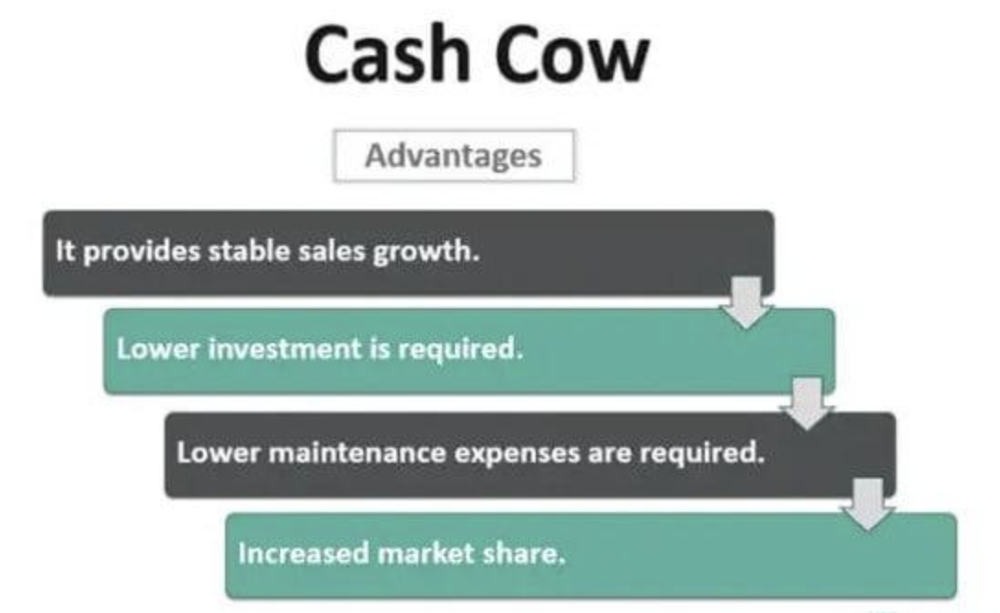

## Table of Contents

## What is a cash cow in business terminology?

A cash cow in business terminology is a product or part of a business that makes a lot of money with little effort. It is usually something that has been around for a while and is well-known. Companies like these products because they bring in steady money without needing much new investment.

For example, think of a popular soft drink that has been sold for many years. It doesn't need much advertising anymore because everyone knows it. The company can keep selling it and making money from it without having to spend a lot to keep it going. This is what makes it a cash cow.

## How does a cash cow differ from other types of business units in the BCG matrix?

In the BCG matrix, a cash cow is different from other types of business units because it has a high market share in a market that is not growing much. This means the product or business unit is already popular and well-established, but the overall market isn't expanding. Because of this, cash cows generate a lot of money with little need for new investment. They are like steady income sources for the company.

On the other hand, other types of business units in the BCG matrix include stars, question marks, and dogs. Stars have a high market share in a fast-growing market, which means they need a lot of investment to keep growing but can also bring in a lot of money. Question marks have a low market share in a fast-growing market, so they need investment to see if they can become stars or if they should be dropped. Dogs have a low market share in a slow-growing market, which usually means they don't bring in much money and might be a drain on resources. Each type needs different strategies and investments compared to a cash cow.

## Can you provide examples of companies that are considered cash cows?

Coca-Cola is a good example of a cash cow. They have been selling their famous soft drink for a long time, and it is known all over the world. They don't need to spend a lot of money on new ads because everyone already knows their product. This means they can keep making a lot of money from it without much effort.

Another example is Microsoft's Windows operating system. It has been around for a long time and is used by many people and businesses. Microsoft doesn't need to spend a lot to keep it going because it's already so popular. They can keep [earning](/wiki/earning-announcement) money from it while using that money to invest in other projects.

## What are the characteristics that define a cash cow?

A cash cow is a product or a part of a business that makes a lot of money without needing much effort or new money to be put into it. It usually has been around for a while and is very popular. Because it is well-known, the company doesn't need to spend a lot on advertising or making changes to keep it going. This means the cash cow keeps bringing in steady money for the company.

The main thing about a cash cow is that it has a big share of the market, but the market itself is not growing much. This is different from other products that might need a lot of new money to keep growing or to become popular. A cash cow is like a reliable source of income for the company, allowing them to use the money they make from it to invest in other areas or new projects.

## How can a business identify if it has a cash cow product or division?

A business can tell if it has a cash cow by looking at how much money the product or division makes compared to how much it costs to keep it going. If the product has been around for a long time and is very popular, but the market it's in isn't growing much, it's likely a cash cow. This means the business is making a lot of money from it without needing to spend a lot on new ads or changes.

Another way to spot a cash cow is by checking if the product has a big share of the market. If a lot of people buy it and it's well-known, but the business doesn't need to put in a lot of new money to keep it going, that's a good sign. The money the cash cow makes can be used to help other parts of the business or to try new projects, making it a valuable part of the company.

## What strategies should a company employ to maintain its cash cow status?

To keep a product as a cash cow, a company needs to keep its costs low. This means not spending too much on new ads or big changes to the product. Since the product is already well-known and popular, the company can focus on making sure it keeps working well and stays reliable. Keeping the price right is also important. If the price is too high, people might stop buying it, but if it's too low, the company won't make enough money. Finding the right balance helps keep the cash cow making money without needing a lot of new spending.

Another important thing is to watch the market closely. Even though the market isn't growing fast, it can still change. The company needs to make sure the product stays what people want and need. Sometimes, small updates or new versions can help keep people interested without costing too much. Also, the money the cash cow makes can be used to invest in other parts of the business. This way, the company can grow in other areas while still making money from the cash cow.

## How does a cash cow contribute to the overall financial health of a company?

A cash cow helps a company stay financially healthy by making a lot of money without needing much new spending. This is good because the money the cash cow makes can be used to pay for other parts of the business that might need more money to grow or improve. It's like having a steady income that helps keep the company strong and able to handle costs and investments.

Also, having a cash cow means a company can take more risks with new projects. They can use the money from the cash cow to try new things without worrying as much about losing money. This can help the company grow and stay competitive. In simple terms, a cash cow keeps money coming in and helps the company stay stable and ready for new opportunities.

## What are the risks associated with relying too heavily on a cash cow?

Relying too much on a cash cow can be risky. If something goes wrong with the cash cow, like people stop buying it or a new competitor comes along, the company could lose a lot of money. Since the cash cow makes a big part of the company's income, any problem with it can hurt the whole business. It's like putting all your eggs in one basket; if the basket breaks, you lose everything.

Another risk is that the company might not pay enough attention to other parts of the business. If they focus too much on the cash cow, they might miss out on new opportunities or not put enough effort into growing other products. This can make the company weaker over time because they're not building up other areas that could help if the cash cow starts to fail. It's important for a company to keep a balance and not depend too much on just one thing.

## How can a cash cow be used to fund other areas of a business?

A cash cow can be used to fund other parts of a business by using the money it makes to invest in new projects or improve existing ones. Since a cash cow brings in a lot of money without needing much new spending, the company can take some of that money and use it to start new products or services. This helps the business grow and try new things without having to borrow money or use up all their savings.

Another way to use a cash cow to fund other areas is by helping parts of the business that are not doing as well. If there's a product that needs more money to become popular or to fix problems, the money from the cash cow can be used to support it. This way, the company can keep trying to make all parts of the business better and stronger, using the steady income from the cash cow to help out where it's needed.

## What steps should a company take if its cash cow starts to decline?

If a company's cash cow starts to decline, the first thing they should do is figure out why it's happening. They need to look at things like if people are buying less, if there are new competitors, or if the market is changing. Once they know the reason, they can start to fix it. For example, if people are buying less because they think the product is old, the company might need to make some small changes or updates to make it feel new again.

Another important step is to not depend too much on the cash cow. The company should have been using the money from the cash cow to grow other parts of the business. If they did this, they can rely on those other parts to help out while they work on fixing the cash cow. If they didn't, they need to start doing that now. They might need to put more money into new products or services to make sure the company keeps making money even if the cash cow keeps declining.

It's also a good idea to think about how to use what they learned from the cash cow to make other products successful. Maybe there are things they did right with the cash cow that they can do with other products. By using these lessons, the company can try to create new cash cows or at least keep the business strong while they work on turning things around with the declining one.

## How do market changes affect the status of a cash cow?

Market changes can really shake things up for a cash cow. If a new competitor comes along with a better or cheaper product, people might start buying that instead. Or, if people's tastes change and they want something different, the cash cow might not be as popular anymore. For example, if a new technology comes out that makes an old product seem outdated, the cash cow could lose its spot in the market. These changes can make the cash cow stop being a reliable source of money for the company.

To keep a cash cow going strong, a company needs to watch the market closely and be ready to make changes. If they see that people are starting to like something new, they might need to update their product or find a way to make it fit with the new trends. Sometimes, a small change or a new version can help keep the cash cow making money. But if the market changes too much, the company might need to start looking for a new cash cow to take its place.

## Can a startup or a new product ever be considered a cash cow, and if so, under what conditions?

It's rare for a startup or a new product to be considered a cash cow right away. A cash cow is usually something that has been around for a while and is very popular. It makes a lot of money without needing much new spending. A new product or a startup usually needs a lot of money and effort to become popular and start making money. So, it's hard for them to be cash cows from the start.

But, if a new product becomes very popular very quickly and the market it's in isn't growing much, it could become a cash cow. For example, if a startup makes a new app that everyone loves and it's in a market that is already big but not growing, it might start making a lot of money without needing much more spending. In this case, the new product could be seen as a cash cow because it brings in steady money with little effort.

## References & Further Reading

[1]: ["The Boston Consulting Group on Strategy: Classic Concepts and New Perspectives"](https://www.amazon.com/Boston-Consulting-Group-Strategy-Perspectives/dp/0471757225) by Carl W. Stern and Michael S. Deimler.

[2]: ["Stocks for the Long Run: The Definitive Guide to Financial Market Returns & Long-Term Investment Strategies"](https://www.amazon.com/Stocks-Long-Run-Definitive-Investment/dp/0071800514) by Jeremy J. Siegel.

[3]: ["Fixed Income Analysis"](https://en.wikipedia.org/wiki/Fixed_income_analysis) by Barbara S. Petitt.

[4]: ["Real Estate Investing For Dummies"](https://www.amazon.com/Real-Estate-Investing-Dummies-4th/dp/B082XG51VY) by Eric Tyson and Robert S. Griswold.

[5]: ["Alternative Investments: CAIA Level I"](https://www.wiley.com/en-us/Alternative+Investments:+CAIA+Level+I,+4th+Edition-p-9781119604150) by Donald R. Chambers, Keith H. Black, and CAIA Association.

[6]: ["Algorithmic Trading: Winning Strategies and Their Rationale"](https://onlinelibrary.wiley.com/doi/pdf/10.1002/9781118676998.fmatter) by Ernest P. Chan.

[7]: Burghardt, G., & Walls, B. (2011). ["What do we know about algorithmic trading."](https://onlinelibrary.wiley.com/doi/book/10.1002/9781118531600) Journal of Trading.