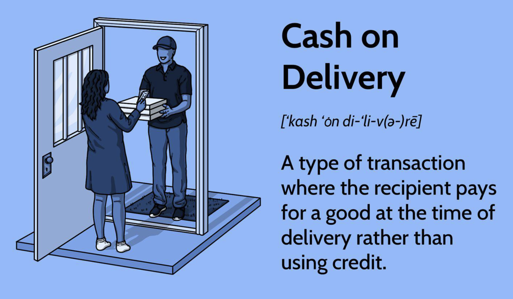

## Table of Contents

## What is cash delivery?

Cash delivery is when you pay for something and get it right away. It's like buying something at a store with cash. You give the money to the seller, and they give you the product immediately. This way, you don't have to wait for the item to be shipped or delivered later.

This method is common in many places, especially where people prefer to see and touch the product before buying. It's also useful when you need something quickly and don't want to deal with online shopping or waiting for delivery. However, you need to have enough cash with you, which can sometimes be a problem if you don't carry a lot of money around.

## How does the process of cash delivery work?

When you want to buy something using cash delivery, you first find the item you want to buy. This could be at a store, a market, or even from someone selling things on the street. Once you've picked out what you want, you tell the seller you're going to pay with cash. You then take out the right amount of money from your wallet or pocket and hand it over to the seller.

After you give the seller the cash, they will check to make sure it's the correct amount. If everything is okay, the seller will then give you the item you bought. This happens right away, so you can walk away with your new purchase in hand. It's a simple and quick way to buy things without waiting or using a credit card.

## What are some common examples of cash delivery services?

One common example of cash delivery is buying things at a local store or market. You go to the store, pick out what you want, like a shirt or some groceries, and then you pay for it with cash right there. The person at the store takes your money, gives you any change if needed, and hands you your items. It's quick and easy, and you can take your things home right away.

Another example is buying from street vendors or at a farmer's market. You might see someone selling fruits, vegetables, or even handmade crafts on the street. You choose what you want, give them the cash, and they give you the product immediately. This way, you get fresh items and support local sellers without any waiting or online hassle.

## Who typically uses cash delivery services?

People who like to buy things right away often use cash delivery services. This includes folks who go shopping at local stores or markets. They want to pick out what they need and take it home without waiting. It's also good for people who don't have credit cards or don't like to use them. They can just use the money they have in their pockets.

Another group that uses cash delivery a lot is people who buy from street vendors or at farmer's markets. These buyers enjoy getting fresh food and unique items directly from sellers. It's a quick way to support local businesses and get what you need without any delays. Plus, it's simple and doesn't need any special technology, so anyone can do it.

## What are the advantages of using cash delivery?

One big advantage of using cash delivery is that it's quick and easy. When you buy something with cash, you get it right away. You don't have to wait for it to be shipped or delivered later. This is great if you need something urgently or just want to take your purchase home with you immediately. Plus, you can see and touch the item before you buy it, which helps you make sure it's exactly what you want.

Another advantage is that it's simple and doesn't need any special technology. Anyone can use cash to buy things, even if they don't have a credit card or a smartphone. This makes it a good choice for everyone, no matter their age or tech skills. It also helps support local businesses and street vendors because you're buying directly from them, which can be good for the community.

## What are the potential disadvantages of cash delivery?

One downside of using cash delivery is that you need to have enough cash with you. If you don't [carry](/wiki/carry-trading) a lot of money around, it can be hard to buy things this way. Also, if you lose your cash, you can't get it back like you can with a credit card. It's a big problem if you drop your money or someone steals it.

Another problem is that it's harder to keep track of your spending with cash. When you use a card, you can see all your purchases in one place. But with cash, you might forget how much you've spent. This can make it tough to stick to a budget. Plus, if you're buying from someone you don't know well, there's a risk they might not give you a good product or might even trick you.

## How does cash delivery compare to other payment methods?

Cash delivery is different from other payment methods like credit cards or online payments. When you use cash, you pay for something and get it right away. You don't need any special technology, so it's easy for everyone to use. But you have to carry enough money with you, and if you lose it, it's gone for good. With credit cards or online payments, you can buy things even if you don't have cash on you. These methods also let you keep track of your spending easily, which helps with budgeting.

On the other hand, credit cards and online payments can take longer to get your items. You might have to wait for them to be shipped or delivered. Sometimes, you need to set up accounts or use special apps, which can be hard if you're not good with technology. Cash delivery is quick and simple, but it doesn't give you the same protections as other methods. If you buy something that's not good or if someone tricks you, it's harder to get your money back with cash.

## What security measures are in place for cash delivery?

When you use cash delivery, there aren't many special security measures in place like you might find with credit cards or online payments. The main thing is to be careful with your money. Keep your cash safe and don't show it around too much. If you're buying from someone you don't know well, try to meet in a busy place where other people are around. This can help keep you safe and make sure the seller doesn't try to trick you.

Another way to stay safe is to check your items before you hand over the cash. Make sure what you're buying is what you want and that it works okay. If you're buying something expensive, it's a good idea to have someone with you. They can help make sure everything goes smoothly. Remember, once you give away your cash, it's hard to get it back if something goes wrong, so always be careful.

## How has technology impacted cash delivery services?

Technology has changed cash delivery services in some ways. Even though cash delivery is still about handing over money and getting an item right away, technology has made it easier to find places where you can use cash. For example, apps and websites can show you where local markets or stores are. They can also tell you if a seller is trustworthy. This helps you feel more sure about where you're spending your money.

But technology hasn't changed the basic idea of cash delivery much. You still need to have cash with you to use it. Also, technology can't help you if you lose your money or if someone tricks you. So, while tech can make finding places to use cash easier, it doesn't add the same kind of safety or tracking that you get with credit cards or online payments. Cash delivery stays simple and quick, but it also stays a bit riskier.

## What are the legal and regulatory considerations for cash delivery?

When you use cash delivery, there are some rules you need to follow. Different places have different laws about how much cash you can carry around. For example, if you're buying something really expensive, you might need to fill out some forms to show where the money came from. This is to stop people from doing bad things with a lot of cash, like hiding money they got from crimes. Sellers also have to follow rules about taking cash. They might need to report big cash payments to the government to make sure everything is legal.

Another thing to think about is taxes. When you buy something with cash, you still have to pay taxes on it. The seller needs to keep track of the money they get and report it correctly. If they don't, they could get in trouble. Also, some places have rules about giving receipts for cash sales. This helps keep everything honest and makes sure the right amount of taxes gets paid. So, even though cash delivery seems simple, there are still some legal things you need to know about.

## How can businesses optimize their use of cash delivery services?

Businesses can make cash delivery work better by keeping their cash safe. They can use strong boxes or safes to store money and make sure only certain people can get to it. This helps stop people from stealing money. Also, businesses can train their workers to check cash carefully. This way, they can spot fake money and make sure they get the right amount. By doing these things, businesses can keep their cash safe and make sure they don't lose money.

Another way businesses can do well with cash delivery is by making it easy for customers. They can set up their stores so people can pay quickly and leave with their things right away. Having enough change on hand is also important so customers don't have to wait. Plus, businesses can use signs or tell customers about any rules they need to follow when paying with cash. This makes everything go smoothly and keeps both the business and the customers happy.

## What future trends might affect the cash delivery industry?

In the future, fewer people might use cash delivery because more people are using digital payments. Things like credit cards, mobile apps, and online shopping are getting more popular. This means businesses might use cash delivery less because it's easier and safer to use digital methods. Also, governments might make new rules about cash to stop crime. This could make it harder for people to use cash delivery the way they do now.

But cash delivery won't go away completely. Some people will always like using cash because it's simple and quick. Small businesses and street vendors might keep using cash delivery because it's easy for them and their customers. Technology might help make cash delivery safer, like using apps to check if money is real or to keep track of cash sales. So, while digital payments might grow, cash delivery will still be important for many people.

## References & Further Reading

[1]: Chlistalla, M., & Dietz, M. (2012). ["Algorithmic Trading and Its Implications on Capital Markets."](https://wp0.vanderbilt.edu/lawreview/wp-content/uploads/sites/278/2015/11/How-Algorithmic-Trading-Undermines-Efficiency-in-Capital-Markets.pdf) Deutsche Bank Research.

[2]: Domowitz, I., & Steil, B. (1999). ["Automation, Trading Costs, and the Structure of the Trading Services Industry."](https://www.nomurafoundation.or.jp/en/wordpress/wp-content/uploads/2014/09/19971011_Ian_Domowitz_-_Benn_Steil.pdf) Brookings-Wharton Papers on Financial Services.

[3]: Gomber, P., Arndt, B., Lutat, M., & Uhle, T. (2011). ["High-frequency trading."](https://papers.ssrn.com/sol3/papers.cfm?abstract_id=1858626) Business & Information Systems Engineering.

[4]: Hull, J. (2017). ["Options, Futures, and Other Derivatives."](https://books.google.com/books/about/Options_Futures_and_Other_Derivatives_eB.html?id=2iopDwAAQBAJ) Pearson.

[5]: Hendershott, T., Jones, C., & Menkveld, A. (2011). ["Does Algorithmic Trading Improve Liquidity?"](https://onlinelibrary.wiley.com/doi/full/10.1111/j.1540-6261.2010.01624.x) The Review of Financial Studies.

[6]: Aldridge, I. (2009). ["High-Frequency Trading: A Practical Guide to Algorithmic Strategies and Trading Systems."](https://www.amazon.com/High-Frequency-Trading-Practical-Algorithmic-Strategies/dp/1118343506) Wiley.