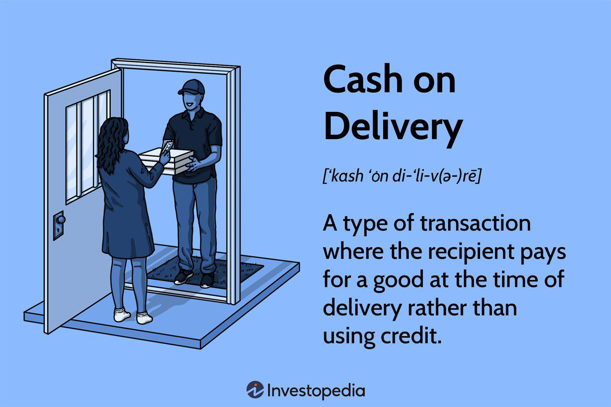

In the dynamic world of financial transactions, technologies such as cash delivery and algorithmic trading have significantly transformed the landscape. These methods have introduced new efficiencies and opportunities, reshaping how markets operate and how financial strategies are executed. This article explores the pros and cons of these financial mechanisms, providing insights for investors and financial professionals. By understanding the advantages and drawbacks of both cash delivery and algo trading, stakeholders can make more informed decisions, ultimately enhancing their ability to navigate the financial markets effectively.

Cash delivery, also known as cash settlement, is used primarily in derivative contracts like futures and options. It enables the settlement of these contracts in cash rather than requiring the physical exchange of the underlying asset. This approach streamlines the settlement process, making it more accessible for traders to hedge against price fluctuations or engage in speculative activities. Conversely, algorithmic trading utilizes computer algorithms to execute trades automatically based on predefined conditions, significantly reducing the time and potential errors associated with manual trading.



This discussion covers how these methods integrate within the broader scope of financial transactions, assessing their impact on market liquidity, speed of execution, and investor behavior. Understanding these elements is crucial for professionals seeking to optimize their trading strategies and manage risks in an increasingly automated market environment. Let's begin with a deeper understanding of cash delivery and explore its implications for the financial ecosystem.

## Table of Contents

## Understanding Cash Delivery in Financial Transactions

Cash delivery, also referred to as cash settlement, stands as a fundamental method within financial markets, particularly in the derivatives and foreign exchange (forex) markets. This approach to settlement does not necessitate the exchange of the underlying physical asset at the contract's expiration. Instead, it resolves the contract by requiring the party with a loss position to pay the difference in value to the party with a gain position. This process streamlines trading by focusing purely on the financial outcome rather than the logistics of asset transfer.

In the context of futures and options contracts, cash settlement provides a mechanism that allows investors and traders to engage in hedging and speculative activities without the constraints of physical delivery. Futures contracts typically obligate the parties to either purchase or sell an asset at a predetermined price at a specified future date. However, with cash settlement, these contracts are settled by the difference between the contract price and the market price at expiration.

For instance, consider a futures contract based on a stock index. Upon reaching the contract's expiration, instead of the physical transfer of all the stocks within the index from seller to buyer, participants simply exchange cash equivalent to the difference between the agreed contract value and the actual market value. This simplicity is crucial in markets where physical delivery may be impractical or cost-prohibitive.

Options contracts, too, may utilize cash settlement, especially in index options where physical delivery is not feasible. These contracts give the holder the right, but not the obligation, to buy or sell an asset at a set price before a specified date. When settled in cash, the option's value is determined by the market price of the underlying asset at expiration minus the strike price, for call options, or vice versa, for put options.

The method of cash settlement is advantageous in sectors where it enhances [liquidity](/wiki/liquidity-risk-premium) and flexibility, allowing participants to effectively hedge against market [volatility](/wiki/volatility-trading-strategies) without the encumbrance of managing the underlying assets. However, understanding cash delivery extends beyond its mechanical operations; it requires a comprehension of the strategic roles these contracts serve, balancing risk and opportunity within a diverse array of market conditions.

## Pros of Cash Delivery

Cash delivery, or cash settlement, offers several advantages, making it a preferred method in financial markets, especially in futures and options trading. One of its primary benefits is cost-effectiveness. By eliminating the need for physical delivery of the underlying asset, it reduces the logistical costs and complexities associated with transporting and storing these assets. This efficiency decreases transaction costs for both buyers and sellers, enhancing overall market efficiency.

Furthermore, cash delivery simplifies the settlement process. Traditional settlement methods require intricate logistics to ensure the actual delivery of assets, potentially extending the timeline and complexity of transactions. In contrast, cash settlement is executed via monetary transactions, where the difference in the contract price is exchanged, thus streamlining the entire process. This simplification facilitates quicker execution of transactions, which is particularly advantageous in dynamic markets where time is of the essence.

Additionally, this method increases market liquidity. Cash settlement allows the trading of assets that are not easily deliverable physically, such as stock indexes or certain commodities that might be impractical to deliver. As a result, traders and investors have broader opportunities to engage in markets without being constrained by the physical limitations of asset delivery, promoting more active participation and increasing trading [volume](/wiki/volume-trading-strategy).

Investors also benefit from cash delivery as it enables them to hedge against price fluctuations without the necessity of owning the underlying physical asset. This aspect is particularly valuable for speculators and hedgers who aim to manage risk or profit from price movements without the intention to acquire the asset itself. For instance, an investor anticipating a price increase in an index can take a position without dealing with the complexities and costs of asset ownership, thereby focusing solely on the financial aspect of trading.

Overall, the advantages of cash delivery—cost-effectiveness, simplification of settlements, enhanced liquidity, and hedging flexibility—make it an attractive choice in financial markets.

## Cons of Cash Delivery

Cash delivery can present several drawbacks that investors must carefully consider. One significant issue is the possibility of leaving investors unhedged at the expiration of a contract. In traditional futures contracts, physical delivery ensures that the contracted asset is exchanged, thus providing a natural hedge for market participants who might rely on the physical asset. However, with cash delivery, this physical exchange does not occur, potentially exposing traders to the risk and volatility of the market upon contract expiration.

Traders using cash settlement must proactively manage their positions to remain hedged, which often involves closing or rolling over existing contracts as they near expiration. This requirement can lead to operational burdens and increased transaction costs. The process of rolling over involves selling the expiring contract and buying a new contract with a later expiration, which may not always guarantee equivalent market conditions or pricing, thus introducing additional risk and complexity.

Moreover, there is a tangible risk that the hedges initially put in place may not be effectively offset when using cash settlement. For instance, market conditions might change so dramatically during the contract's lifetime that the cash settlement received does not adequately cover the potential losses incurred by the positions needing protection. This misalignment may occur due to sudden market shifts, changes in interest rates, or unforeseen geopolitical events.

The efficiency and convenience of cash settlement can sometimes lead to overreliance on these mechanisms. Financial instruments settled in cash might appeal to speculators and investors who prefer simpler transactions without dealing with the logistics of asset storage or delivery. While this approach can enhance market activity, it also increases speculative trading, which might destabilize markets or lead to bubbles due to excessive participation from non-hedging entities.

In summary, while cash delivery offers benefits in terms of liquidity and ease, these advantages come at the expense of added risks that necessitate active management strategies and may encourage speculative behaviors that impact market stability.

## Exploring Algorithmic Trading

Algorithmic trading, commonly referred to as algo trading, employs computer-based algorithms to automatically execute buy and sell orders in financial markets based on pre-defined criteria. These criteria can be as straightforward as a specific price or more sophisticated, involving various market conditions and data parameters. 

One of the primary advantages of algo trading is the minimization of human errors. By automating the trading process, it reduces the emotional and psychological pressures that can lead to poor decision-making. This automation ensures trades are executed at optimal times, leading to enhanced execution speed, accuracy, and efficiency. Algo trading systems can process market data and place orders at a pace much faster than a human trader, allowing for the capitalization on even minor market inefficiencies.

The strategies used in [algorithmic trading](/wiki/algorithmic-trading) vary widely, encompassing both simple and complex models. Basic strategies may involve transactional rules, such as executing a trade when a stock drops to a certain price. On the other hand, more sophisticated strategies rely on complex data-driven models, including statistical [arbitrage](/wiki/arbitrage), [machine learning](/wiki/machine-learning), and pattern recognition. These advanced models can analyze vast amounts of historical and real-time data to determine optimal trading opportunities.

Algo trading proves particularly beneficial in high-frequency trading ([HFT](/wiki/high-frequency-trading-strategies)) environments. HFT involves executing a large number of orders at extremely high speeds, often within fractions of a second. In such settings, latency — the delay before a transfer of data begins following an instruction for its transfer — is a critical [factor](/wiki/factor-investing). Reducing latency enhances the capability to execute orders faster than competitors, securing an advantageous position in the market.

In summation, algorithmic trading leverages technology to improve the trading process by enhancing speed, accuracy, and efficiency while offering a range of strategies from simple to complex. Its utility is most pronounced in high-frequency trading environments where speed and precision drive profitability.

## Pros of Algorithmic Trading

Algorithmic trading, often referred to as algo trading, provides a range of benefits that have reshaped modern financial markets. A prime advantage is the increased speed and accuracy in executing trades. By leveraging pre-defined and automated strategies, algo trading systems can execute orders in fractions of a second, significantly faster than possible with human intervention. This rapid execution helps to capitalize on market opportunities swiftly and efficiently, minimizing latency and reducing slippage, which is the difference between the expected price of a trade and the actual price at which the trade is executed.

Another significant benefit of algorithmic trading is its ability to minimize the impact of human emotions on trading decisions. Human traders are susceptible to emotional influences such as fear and greed, which can lead to irrational decision-making and erratic trading behavior. Algorithmic systems, conversely, operate purely based on predefined rules and data, ensuring consistency and rationality in trading practices. This objectivity enhances decision-making processes, leading to potentially more stable and profitable trading outcomes.

The ability to backtest strategies on historical data represents another advantage of algorithmic trading. Traders can apply their algorithms to past market data to evaluate the effectiveness and viability of their trading strategies. This process allows traders to refine and optimize their models for better performance before deploying them in live markets. Backtesting helps in identifying potential flaws in algorithms and assessing the risk-return profile of the trading strategy. Traders can employ Python or other programming languages to build and test their algorithms. A simple example in Python might look like:

```python
import pandas as pd

# Load historical market data
data = pd.read_csv('historical_data.csv')

# Define a simple strategy: Moving average crossover
short_window = 40
long_window = 100

# Calculate moving averages
data['Short_MA'] = data['Close'].rolling(window=short_window, min_periods=1).mean()
data['Long_MA'] = data['Close'].rolling(window=long_window, min_periods=1).mean()

# Signal generation
data['Signal'] = 0
data['Signal'][short_window:] = np.where(data['Short_MA'][short_window:] > data['Long_MA'][short_window:], 1, 0)

# Generate trading positions
data['Position'] = data['Signal'].diff()
```

Finally, algorithmic trading contributes to higher trading volumes and liquidity in the market. Automated systems can handle large quantities of transactions at speeds and efficiencies unattainable by human traders. This increased trading activity supports deeper markets, where there is a higher volume of buy and sell orders, contributing to more stable pricing mechanisms and reduced bid-ask spreads. In a liquid market, traders benefit from easier entry and [exit](/wiki/exit-strategy) from positions, reducing the risk of price manipulation and enhancing overall market efficiency.

## Cons of Algorithmic Trading

Algorithmic trading, while transformative, presents several challenges. A primary concern is its significant dependence on technology. Trading systems are highly reliant on robust and reliable technological infrastructure to function effectively. Technological failures, such as hardware malfunctions, software bugs, or connectivity issues, can lead to substantial trading errors, disrupting markets and potentially resulting in financial losses.

Market instability is another critical drawback, with "flash crashes" serving as stark evidence. These are extremely rapid falloffs in stock prices, typically followed by a quick recovery, often triggered or exacerbated by algo trading systems reacting to market data. An infamous example is the flash crash of May 6, 2010, where the Dow Jones Industrial Average plunged about 1,000 points within minutes, partly due to the rapid execution of erroneous trades by algorithmic systems. Such incidents underscore the potential for algo trading to contribute to market volatility.

The initial costs associated with developing algorithmic trading systems are another concern. Building these systems requires significant investment in technology infrastructure, including high-performance computing systems and sophisticated software solutions. Additionally, expertise in financial markets and quantitative strategies, often necessitating hiring skilled professionals, can make implementation prohibitively expensive for smaller firms.

Furthermore, there's a risk of over-reliance on automated systems, which might overshadow human judgment. While algo trading minimizes the emotional biases of human traders, it also removes the nuanced understanding and strategic thinking that experienced traders bring. Automated systems can be rigid, adhering strictly to their pre-defined criteria, and may not adapt to unprecedented market conditions as agilely as human traders could.

These factors highlight the imperative need for comprehensive risk management strategies and continuous monitoring, ensuring that despite the automation, human oversight remains integral to prevent and mitigate potential issues.

## Intersection of Cash Delivery and Algo Trading

Both cash delivery and algorithmic trading play pivotal roles in fostering a more streamlined and efficient financial market. Cash delivery, as a settlement mechanism, simplifies the transaction process by negating the need for the physical exchange of the underlying asset, instead settling contracts through cash payments. This inherent simplicity aids in quicker resolutions, reduces transaction costs, and enhances liquidity, particularly in markets involving non-physical underlying assets, such as indices.

Conversely, algorithmic trading leverages advanced algorithms to enhance the speed, accuracy, and efficiency of trade executions. By automating the trading process, algo trading minimizes human error and emotional decision-making, enabling precise, high-frequency trades that contribute significantly to market liquidity and volume.

However, the integration and synergy of cash delivery and algo trading are not without challenges. Traders and investors must carefully consider the cost-efficiency of cash delivery, which, while simplifying settlements, may leave positions unhedged as contract expiration nears. This necessitates strategic planning, such as rolling over or closing positions, to maintain hedging effectiveness. Algorithmic trading, characterized by its precision, also demands technological reliability. Any system failures can lead to market disruptions, exemplified by occurrences like flash crashes.

Understanding how these methodologies complement each other involves recognizing that the simplicity of cash delivery, which streamlines the end of a transaction lifecycle, can be well-matched with the sophisticated execution capabilities of algorithmic trading at the onset. Balancing these elements presents opportunities for innovation in financial transactions. For instance, strategies combining cash delivery in long-term contract settlements with algorithmic approaches for short-term trading can optimize both cost and execution precision, potentially leading to enhanced market resilience and new investment strategies.

By leveraging the strengths of both methods, investors can explore innovative approaches that balance cost-efficiency and precision, navigating the complexities of modern financial markets effectively.

## The Future of Financial Transactions

The landscape of financial transactions is rapidly advancing with the integration of cutting-edge technology. These advancements have the potential to address current drawbacks in both cash delivery and algorithmic trading. For instance, the reliance on technology in algo trading, which poses risks of system failures, and the hedging risks inherent to cash delivery could be significantly mitigated by emerging technologies like [artificial intelligence](/wiki/ai-artificial-intelligence) (AI) and blockchain. These technologies are capable of enhancing reliability through better error detection and prevention mechanisms, thus reducing vulnerabilities.

Innovative developments in financial technology promise more efficient, transparent, and accessible systems. AI algorithms, for instance, could be designed to autonomously manage and adapt hedging strategies in cash delivery, adjusting to market trends with minimal human intervention. This capability can improve risk management and ensure that investors are adequately hedged. Blockchain technology, known for secure and transparent transaction processing, could transform how cash settlements are performed by providing immutable records and enhancing trust among market participants.

As these technologies evolve, stakeholders, including investors, traders, and financial institutions, must remain vigilant of both regulatory and technological changes. Compliance with new regulations, which may arise as jurisdictions adjust to incorporate these technologies, is crucial. Adopting a proactive monitoring strategy for regulatory updates helps financial entities navigate the complexities of global finance effectively.

Moreover, stakeholders should consider investing in education and training programs to ensure that their teams are well-equipped to harness new advancements. Implementing sandbox environments for testing innovative solutions can aid in understanding the potential impacts on existing systems without risking operational stability.

In summary, the future of financial transactions promises to be more resilient, with continuous innovations addressing existing limitations. By staying informed and adaptive to these changes, financial market participants can optimize these tools for improved efficiency and new opportunities.

## Conclusion

Cash delivery and algorithmic trading present distinct advantages and challenges within the financial market, each offering unique strategic leverage for participants. Cash delivery simplifies the settlement process, eliminating the necessity for physical asset transfer, thereby reducing transaction costs and expediting trade execution. On the other hand, algorithmic trading offers unparalleled speed and precision in trade execution, driven by sophisticated algorithms that minimize human errors.

Understanding the pros and cons of each approach is crucial for informed decision-making. For instance, cash delivery enables investors to efficiently hedge against price fluctuations without physically holding underlying assets, but it may leave them unprotected upon contract expiration unless positions are closed or rolled over. Conversely, algorithmic trading, while beneficial in enhancing market liquidity and enabling high-frequency trading, depends heavily on technological infrastructure. This dependency could lead to potential failures and market instability if not managed correctly, as seen in isolated cases of "flash crashes."

As the financial trading environment continues to evolve, balancing technological efficiency with strategic flexibility is pivotal. The integration of cash delivery and algorithmic trading allows stakeholders to optimize transaction processes, thus bolstering market resilience. Investors, traders, and financial institutions must remain adaptable, integrating these tools to unlock new opportunities in dynamic market conditions. This adaptability will involve continuous monitoring of technological advancements and regulatory changes, ensuring that these mechanisms are deployed effectively to capitalize on their strengths while mitigating associated risks.

## References & Further Reading

[1]: Chlistalla, M., & Dietz, M. (2012). ["Algorithmic Trading and Its Implications on Capital Markets."](https://wp0.vanderbilt.edu/lawreview/wp-content/uploads/sites/278/2015/11/How-Algorithmic-Trading-Undermines-Efficiency-in-Capital-Markets.pdf) Deutsche Bank Research.

[2]: Domowitz, I., & Steil, B. (1999). ["Automation, Trading Costs, and the Structure of the Trading Services Industry."](https://www.nomurafoundation.or.jp/en/wordpress/wp-content/uploads/2014/09/19971011_Ian_Domowitz_-_Benn_Steil.pdf) Brookings-Wharton Papers on Financial Services.

[3]: Gomber, P., Arndt, B., Lutat, M., & Uhle, T. (2011). ["High-frequency trading."](https://papers.ssrn.com/sol3/papers.cfm?abstract_id=1858626) Business & Information Systems Engineering.

[4]: Hull, J. (2017). ["Options, Futures, and Other Derivatives."](https://books.google.com/books/about/Options_Futures_and_Other_Derivatives_eB.html?id=2iopDwAAQBAJ) Pearson.

[5]: Hendershott, T., Jones, C., & Menkveld, A. (2011). ["Does Algorithmic Trading Improve Liquidity?"](https://onlinelibrary.wiley.com/doi/full/10.1111/j.1540-6261.2010.01624.x) The Review of Financial Studies.

[6]: Aldridge, I. (2009). ["High-Frequency Trading: A Practical Guide to Algorithmic Strategies and Trading Systems."](https://www.amazon.com/High-Frequency-Trading-Practical-Algorithmic-Strategies/dp/1118343506) Wiley.