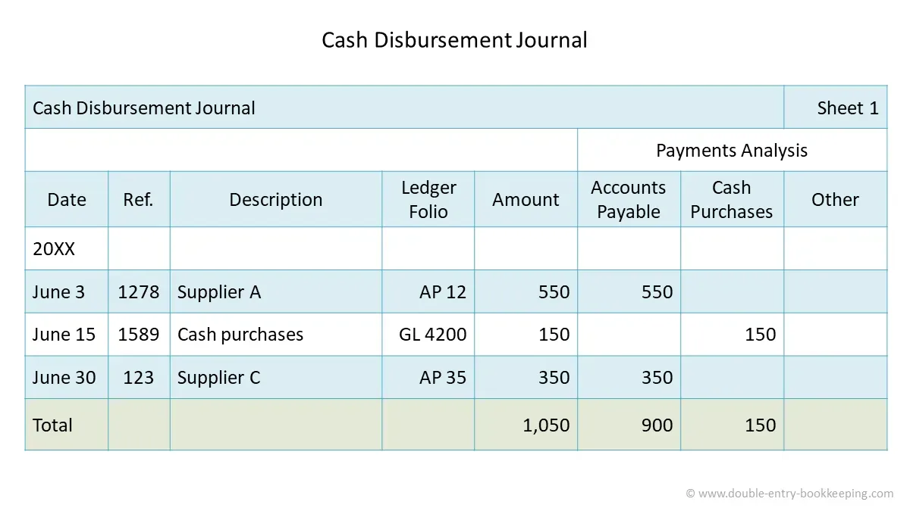

## Table of Contents

## What is a cash disbursement journal?

A cash disbursement journal is a special type of accounting record where a business writes down all the money it pays out. It's like a diary for money going out of the company. This journal helps keep track of payments made to suppliers, employees, and for other expenses. By using this journal, a business can easily see where its money is going and make sure all payments are recorded correctly.

The cash disbursement journal usually has columns for the date of the payment, who the payment was made to, the amount of money paid, and what the payment was for. Sometimes, it also includes a column for the account number that the payment affects. This helps the business organize its records and makes it easier to find information later. Keeping a good cash disbursement journal is important for managing money well and for preparing financial statements at the end of the year.

## Why is a cash disbursement journal important for a business?

A cash disbursement journal is really important for a business because it helps keep track of all the money that goes out. When a business pays for things like supplies, employee salaries, or other expenses, it writes these payments down in the cash disbursement journal. This way, the business can see exactly where its money is going and make sure no payments are missed or forgotten. It's like having a clear map of where all the money is spent, which is crucial for managing finances well.

Also, having a cash disbursement journal makes it easier for a business to prepare its financial statements at the end of the year. When it's time to see how the business did financially, all the information about payments is already organized in the journal. This makes the process of creating reports much simpler and less time-consuming. Plus, if there's ever a question about a payment, the business can quickly look back at the journal to find the details. This helps keep everything transparent and accurate.

## How does a cash disbursement journal differ from a cash receipts journal?

A cash disbursement journal and a cash receipts journal are both important tools for a business, but they serve different purposes. A cash disbursement journal is used to record all the money that goes out of the business. This includes payments to suppliers, employee salaries, and other expenses. It helps the business keep track of where its money is being spent, ensuring that all outgoing transactions are properly documented and accounted for.

On the other hand, a cash receipts journal records all the money that comes into the business. This includes sales revenue, payments from customers, and any other income the business receives. By using a cash receipts journal, a business can see how much money is coming in and from where, which is crucial for understanding its financial health and planning for the future.

Both journals are essential for maintaining accurate financial records, but they focus on different aspects of the business's cash flow. The cash disbursement journal helps manage expenses, while the cash receipts journal helps track income. Together, they provide a complete picture of the business's financial transactions, making it easier to create financial statements and manage the business effectively.

## What are the typical columns found in a cash disbursement journal?

A cash disbursement journal usually has several columns to keep track of money going out of a business. The first column is for the date when the payment was made. Next, there's a column for the name of the person or company that received the payment. Then, there's a column for the amount of money paid, which is often split into two parts: one for the total amount and another for any discounts or special terms. There's also a column for a brief description of what the payment was for, so everyone knows why the money was spent.

Another important column is for the account number that the payment affects. This helps the business organize its records and makes it easier to find information later. Sometimes, there might be additional columns for things like check numbers if the payment was made by check, or for any other details the business finds helpful. All these columns together make sure that every payment is recorded clearly and completely, helping the business keep good track of its spending.

## How do you record transactions in a cash disbursement journal?

When you want to record a transaction in a cash disbursement journal, you start by writing down the date of the payment in the first column. Then, in the next column, you put the name of the person or company that received the money. After that, you write the amount of money paid in the amount column. If there's a discount or special terms, you note that too. You also add a short description of what the payment was for, so it's clear why the money was spent. Finally, you include the account number that the payment affects, which helps keep everything organized.

Sometimes, you might need to add more details, like the check number if the payment was made by check. By filling out all these columns carefully, you make sure that every payment is recorded properly. This helps the business keep a clear record of where its money is going, making it easier to manage finances and prepare financial statements at the end of the year.

## Can you explain the process of reconciling a cash disbursement journal with bank statements?

Reconciling a cash disbursement journal with bank statements means making sure that the money going out of the business, as recorded in the journal, matches what the bank says. You start by looking at the bank statement and comparing it to the cash disbursement journal. You check each payment listed in the journal to see if it's also on the bank statement. If a payment is in the journal but not on the bank statement, it might be because the check hasn't been cashed yet. These are called outstanding checks. You make a note of these and keep them in mind for the next reconciliation.

Next, you look for any payments on the bank statement that aren't in the cash disbursement journal. These could be bank fees or other charges that the business didn't know about yet. You add these to the journal to make sure everything is recorded. Once you've gone through all the payments, you add up the totals from both the journal and the bank statement. If they match after accounting for outstanding checks and any new charges, then the reconciliation is complete. If they don't match, you need to go back and find where the mistake is, making sure all payments are correctly recorded in the journal.

## What are common errors to watch out for when maintaining a cash disbursement journal?

When keeping a cash disbursement journal, it's important to watch out for mistakes that can mess up the records. One common error is writing down the wrong amount for a payment. This can happen if someone is not careful or if there's a typo. Another mistake is forgetting to record a payment at all. This can lead to big problems because the business won't know where its money is going. Also, putting the payment in the wrong account can confuse things, making it hard to see what expenses the business has.

Another thing to be careful about is mixing up the dates. If a payment is recorded on the wrong date, it can make the financial records look wrong. Sometimes, people forget to include important details like the name of the person or company that received the payment, or what the payment was for. This can make it hard to understand the records later. Lastly, not checking the journal against the bank statement regularly can lead to missing errors or not catching payments that were made but not recorded. Keeping an eye out for these common mistakes can help keep the cash disbursement journal accurate and useful for the business.

## How can software tools enhance the management of a cash disbursement journal?

Software tools can make managing a cash disbursement journal much easier and more accurate. They automatically record payments as soon as they happen, so there's less chance of missing a payment or writing down the wrong amount. These tools can also sort payments into different accounts and categories without you having to do it by hand. This means you can see where your money is going more clearly and quickly. Plus, many software programs can connect directly to your bank, so your journal stays up-to-date without you having to enter everything yourself.

Another big advantage of using software for your cash disbursement journal is that it helps you find and fix mistakes faster. The software can check your records against your bank statement and point out any differences, like payments that are in your journal but not on the bank statement yet. It also makes it easier to create reports and financial statements because all the information is already organized and ready to go. This saves a lot of time and helps you keep better track of your business's money.

## What internal controls should be implemented to safeguard the cash disbursement process?

To keep the cash disbursement process safe, businesses should use a few important controls. One key control is separating duties. This means different people should handle different parts of the payment process. For example, one person might approve payments, another person writes the checks, and a third person signs them. This makes it harder for anyone to steal money because they can't do everything themselves. Another important control is to always check and approve payments before they go out. This means someone should look over each payment to make sure it's correct and needed before the money leaves the business.

Another control to use is to keep a close eye on the cash disbursement journal. Regular checks, like comparing the journal to bank statements, help catch any mistakes or suspicious activities early. Also, setting limits on how much money can be spent without special approval can prevent big losses. For example, any payment over a certain amount might need a manager's okay. Using software tools can also help by keeping records accurate and making it easier to spot problems. All these controls together help protect the business's money and make sure it's spent wisely.

## How does a cash disbursement journal integrate with other accounting records like the general ledger?

A cash disbursement journal is like a helper to the general ledger, which is the main book that keeps track of all the money a business has. When a payment is recorded in the cash disbursement journal, it's also put into the general ledger. This helps keep everything in one place and makes sure the business knows exactly how much money it has left. The journal gives details about each payment, like who got the money and why, and then this information goes into the right accounts in the general ledger. This way, the general ledger stays up-to-date and accurate, showing a clear picture of the business's finances.

To make sure everything matches up, businesses often use a process called posting. This is when the amounts from the cash disbursement journal are added to the general ledger. For example, if the business paid for office supplies, that payment would be recorded in the cash disbursement journal and then posted to both the cash account and the office supplies expense account in the general ledger. By doing this regularly, the business can keep its records organized and make sure all the money going out is accounted for properly. This helps with making financial statements and planning for the future.

## What are advanced techniques for analyzing data from a cash disbursement journal to improve financial management?

One advanced technique for analyzing data from a cash disbursement journal is to use trend analysis. This means looking at the payments over time to see if there are any patterns or changes. For example, if the business is spending more on supplies each month, this could show that costs are going up or that the business is growing. By spotting these trends early, the business can plan better for the future, maybe by finding cheaper suppliers or budgeting more money for expenses. Using software tools can make trend analysis easier because they can quickly show graphs and charts that help see these patterns.

Another technique is to use ratio analysis, which compares different numbers from the cash disbursement journal to see how the business is doing. For example, you can look at the ratio of payments to sales to see if the business is spending too much compared to how much money it's making. This can help find areas where the business might be able to save money. Also, by comparing these ratios over time or with other businesses in the same industry, the business can see if it's doing better or worse than expected. Both trend analysis and ratio analysis help the business understand its spending better and make smarter financial decisions.

## How can businesses use cash disbursement journal data for strategic decision-making and forecasting?

Businesses can use the data from their cash disbursement journal to make smart decisions and plan for the future. By looking at the journal, they can see where they're spending money and how much. This helps them understand if they're spending too much in certain areas, like on supplies or employee salaries. If they see that costs are going up, they might decide to find cheaper suppliers or cut back on some expenses. This kind of analysis helps them use their money more wisely and make decisions that keep the business strong.

The cash disbursement journal also helps with forecasting, which means predicting what will happen in the future. By looking at past payments, businesses can guess how much they'll need to spend in the coming months or years. For example, if they know that they spend more on supplies during certain times of the year, they can plan to have enough money ready. This helps them avoid running out of cash and makes sure they can keep running smoothly. Using the journal for forecasting helps businesses be prepared and make plans that lead to success.

## What is the relationship between Algo Trading and Financial Records?

Algorithmic trading, commonly referred to as algo trading, is a method of executing trades by leveraging automated and quantitative models. This methodology is designed to capitalize on financial market opportunities with speed and precision beyond human capability. Algo trading systems execute trades based on a pre-defined set of rules, which might include timing, price, quantity, or any mathematical model. 

Such systems are typically applied in environments where large volumes are traded, such as stock exchanges, commodities markets, and more recently, [cryptocurrency](/wiki/cryptocurrency) platforms. The efficiency of these systems lies in their ability to process myriad data inputs to identify patterns and execute trades swiftly.

A foundational element of algo trading is the requirement for precise and comprehensive financial records. Accurate historical data forms the basis upon which trading algorithms are constructed and refined. The datasets used often encompass everything from asset prices, trading volumes, and [order book](/wiki/order-book-trading-strategies) information to more granular financial indices and news data.

Consider a basic model for an algo trading system where the predicted future price of an asset $P(t+1)$ is derived using historical prices $P(t)$. A simple moving average crossover strategy can be defined as:

$$
\text{If } SMA_{short}(t) > SMA_{long}(t): \text{BUY}
$$
$$
\text{If } SMA_{short}(t) < SMA_{long}(t): \text{SELL}
$$

where $SMA_{short}(t)$ and $SMA_{long}(t)$ are the short-term and long-term moving averages at time $t$. The efficacy of this algorithm hinges on the quality of the historical price data used for calculating the moving averages.

Python, a popular programming language for developing algo trading systems due to its extensive libraries and frameworks, offers tools such as Pandas for data manipulation and NumPy for mathematical operations. A simple code snippet to calculate moving averages using Python might look like this:

```python
import pandas as pd

# Load historical price data
data = pd.read_csv('historical_prices.csv')

# Calculate moving averages
data['SMA_short'] = data['Price'].rolling(window=20).mean()
data['SMA_long'] = data['Price'].rolling(window=50).mean()

# Define trade signals
data['Signal'] = 0
data['Signal'][data['SMA_short'] > data['SMA_long']] = 1
data['Signal'][data['SMA_short'] < data['SMA_long']] = -1
```

The reliance on precise data records extends beyond just price and [volume](/wiki/volume-trading-strategy) metrics. Financial records like those encapsulated in cash disbursement journals can offer insights into broader economic conditions and corporate financial health, which are pivotal for developing more nuanced and context-aware trading algorithms. Effective algo trading strategies utilize comprehensive data — both quantitative and qualitative — to enhance their predictive power and adaptability in real-time market conditions.

Thus, maintaining accurate and detailed financial records is not only significant for compliance and reporting but also forms the backbone of robust [algorithmic trading](/wiki/algorithmic-trading) strategies, ultimately contributing to more sophisticated and profitable trading outcomes.

## References & Further Reading

[1]: Mathieu, M. A., & Adams, P. B. (2019). ["Accounting Information Systems."](https://www.pearson.com/en-us/subject-catalog/p/accounting-information-systems/P200000007724/9780134475639) McGraw-Hill Education.

[2]: Lopez de Prado, M. (2018). ["Advances in Financial Machine Learning."](https://www.amazon.com/Advances-Financial-Machine-Learning-Marcos/dp/1119482089) Wiley.

[3]: Aronson, D. R. (2007). ["Evidence-Based Technical Analysis: Applying the Scientific Method and Statistical Inference to Trading Signals."](https://onlinelibrary.wiley.com/doi/book/10.1002/9781118268315) Wiley.

[4]: Jansen, S. (2020). ["Machine Learning for Algorithmic Trading: Predictive Models to Extract Signals from Market and Alternative Data for Systematic Trading Strategies."](https://www.amazon.com/Machine-Learning-Algorithmic-Trading-alternative/dp/1839217715) Packt Publishing.

[5]: Chan, E. P. (2009). ["Quantitative Trading: How to Build Your Own Algorithmic Trading Business."](https://github.com/ftvision/quant_trading_echan_book) Wiley.

[6]: Brealey, R. A., Myers, S. C., & Allen, F. (2019). ["Principles of Corporate Finance."](https://www.mheducation.com/highered/product/Principles-of-Corporate-Finance-Brealey.html) McGraw-Hill Education.