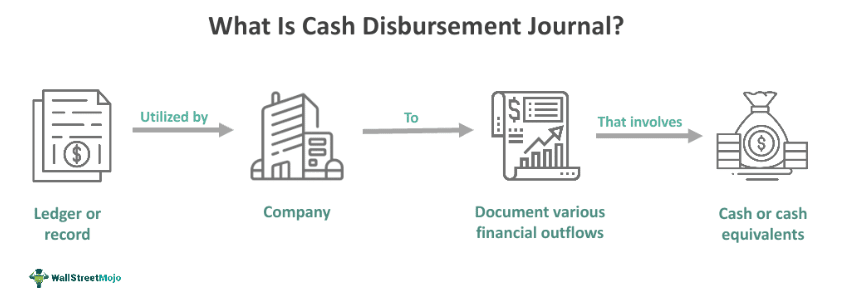

In the dynamic world of finance, efficient record-keeping and accurate financial reporting are crucial for strategic decision-making. These practices ensure that businesses can make informed choices, manage assets effectively, and comply with regulatory standards. One essential record-keeping tool is the cash disbursement journal, a vital component in accounting and financial management. Cash disbursement journals track all outgoing payments made by a business, providing a detailed account of each transaction, including the date, amount, and purpose.

The precision and reliability of these records foster transparency, enabling companies to maintain financial integrity and streamline their operations. Additionally, cash disbursement journals serve as a foundational element before transactions are posted to the general ledger, thereby ensuring continuity and accuracy in financial statement preparation.



Moreover, the role of cash disbursement journals extends beyond traditional bookkeeping. They intersect significantly with modern automated trading systems, often referred to as algorithmic or algo trading. In these high-paced trading environments, precise financial records such as cash disbursement journals are invaluable. They provide the historical data necessary for developing effective trading algorithms, which rely on pattern recognition and data analysis to execute trades based on predefined criteria.

In integrating cash disbursement records with algo trading systems, businesses can refine trading strategies and enhance predictive models. This integration amplifies the sophistication and effectiveness of algorithmic trading solutions, thus supporting strategic decision-making not only at the operational level but also in high-tech financial markets. By leveraging both traditional and technological advancements, companies can optimize both their financial record management and trading performance.

## Table of Contents

## Understanding Cash Disbursement Journals

A cash disbursement journal is a specialized accounting record utilized to track all cash payments made by a business, functioning as an integral part of a company's financial documentation. This journal offers a detailed record of all disbursements, cataloging essential information such as the date of payment, the amount disbursed, the recipient (payee), and the specific purpose underlying each payment. By maintaining such detailed entries, a cash disbursement journal plays a crucial role in ensuring both transparency and accuracy in financial statements. It serves as an intermediary step before transactions are ultimately recorded in the general ledger.

Accurately documenting financial transactions is foundational to effective financial management. Cash disbursement journals support this aim by laying a clear audit trail which aids in the review and validation of a company's cash outflows. This aspect of record-keeping is not only significant for internal auditing purposes but also ensures that organizations can maintain compliance with external regulations and standards.

Moreover, organizing and maintaining detailed financial records in the form of a cash disbursement journal permits businesses to reconcile cash flows efficiently. Such reconciliation is pivotal as it involves matching recorded disbursements with actual cash outlays, thereby identifying discrepancies promptly. This systematic approach to record-keeping enhances accountability and helps safeguard against fraudulent activities.

In modern accounting practices, these journals form a fundamental component of financial reporting systems. The transition from manual to digital accounting frameworks has facilitated the process of maintaining these journals, allowing for rapid entry, easy retrieval, and real-time updates of financial disbursement data. Consequently, businesses can benefit from improved financial oversight and more dynamic financial analysis capabilities. These enhancements underline the importance of cash disbursement journals as instruments for accurate financial record-keeping and reporting.

## The Structure and Elements of a Cash Disbursement Journal

A cash disbursement journal serves as a comprehensive record that tracks all cash payments made by a business. Its structure is typically organized into several columns, each dedicated to capturing specific details of a transaction. Commonly, these columns include the transaction date, transaction reference, and a description of the payment. Additionally, the ledger folio column is used to reference the corresponding entry in the general ledger, providing a clear audit trail for financial verification.

The payment amount column is crucial as it documents the exact cash outflow for each transaction. Furthermore, cash disbursement journals categorize expenses into various groups, such as accounts payable and taxes, to ensure that financial statements are accurately prepared and expenses are appropriately classified. This classification aids in better financial analysis and reporting.

One of the essential features of cash disbursement journals is their flexibility. Businesses can tailor these journals to meet unique accounting needs, adding specific columns as necessary. For example, a company may choose to include a column for discounts received to track any reductions on payments made, reflecting cost-saving initiatives. Similarly, additional expense categories can be created to capture particular types of expenditures that are significant to the business, enhancing the granularity of financial reporting.

The adaptability of cash disbursement journals is vital for businesses that operate in diverse industries or those with complex financial processes. By customizing these journals, companies can better manage their financial data, streamline reconciliation processes, and support efficient financial decision-making.

## Cash Management and Financial Records

Cash disbursement journals are instrumental in the management of cash, offering a detailed view into the company's cash flow and helping to identify trends in expenditures. These journals record every cash payment made by a business, capturing information on the date, amount, payee, and purpose of each transaction. By systematically organizing this data, businesses gain a clearer understanding of their spending patterns and financial commitments. 

Analyzing data from cash disbursement journals allows businesses to pinpoint areas of high expenditure, facilitating more informed decision-making concerning budget allocation and cost control. For example, if a particular expense category consistently shows a rising trend, businesses can investigate further to determine if the increase is justified or if corrective measures are necessary to contain costs.

Further, cash disbursement journals aid in forecasting potential future outflows by providing historical expenditure data, thus allowing businesses to allocate resources effectively. This is crucial for maintaining [liquidity](/wiki/liquidity-risk-premium), ensuring that sufficient cash reserves are available to meet upcoming obligations, and preventing cash shortages that could disrupt operations.

Incorporating technology, many accountants and financial managers now use software tools to automate the analysis of cash disbursement data. These tools may use algorithms to streamline the identification of spending patterns. For instance, a simple Python script can be employed to visualize trends or predict future cash outflows using techniques from data analysis and predictive modeling:

```python
import pandas as pd
import matplotlib.pyplot as plt

# Loading data from a cash disbursement journal
data = pd.read_csv('cash_disbursement_journal.csv')

# Plotting expenditure trends over time for analysis
plt.figure(figsize=(10, 5))
plt.plot(data['date'], data['amount'], marker='o')
plt.title('Trend of Cash Disbursements Over Time')
plt.xlabel('Date')
plt.ylabel('Amount')
plt.grid(True)
plt.show()
```

Using insights from these analyses, companies can develop strategic plans that align their financial activities with broader business objectives, optimizing both operational efficiency and financial stability.

## Leveraging Technology: Automating Cash Disbursement Processes

With the development of sophisticated accounting software, managing cash disbursement journals has progressed from manual entry to automated processes. These technological advancements significantly improve the accuracy of financial records by minimizing human errors associated with manual data entry. Software such as QuickBooks, SAP, and Oracle Financial Services offers features that automatically record cash payments, categorize expenses, and update ledgers in real time.

Automated systems not only enhance the precision of financial data but also save considerable time, freeing up resources that can be allocated to more strategic tasks. For instance, an automated cash disbursement process can instantly generate reports, allowing for quicker access to financial insights vital for decision-making. This efficiency ensures that businesses maintain accurate financial records without the labor-intensive processes traditionally required.

Moreover, integrating cash disbursement data into comprehensive financial management systems ensures seamless synchronization between different accounting functions. This integration facilitates a holistic view of a company's financial health, enabling more informed budget allocation and cost control decisions. Technology platforms often employ cloud-based systems, providing the added benefit of data accessibility and security, which are crucial for modern enterprises.

The transition towards automated cash disbursement systems exemplifies how technology redefines traditional accounting methods by providing streamlined workflows and robust data management capabilities. As businesses continue to seek efficient financial solutions, leveraging these automated systems becomes indispensable for maintaining competitive advantage and operational excellence.

## Algo Trading and Financial Records

Algorithmic trading, commonly referred to as algo trading, is a method of executing trades by leveraging automated and quantitative models. This methodology is designed to capitalize on financial market opportunities with speed and precision beyond human capability. Algo trading systems execute trades based on a pre-defined set of rules, which might include timing, price, quantity, or any mathematical model. 

Such systems are typically applied in environments where large volumes are traded, such as stock exchanges, commodities markets, and more recently, [cryptocurrency](/wiki/cryptocurrency) platforms. The efficiency of these systems lies in their ability to process myriad data inputs to identify patterns and execute trades swiftly.

A foundational element of algo trading is the requirement for precise and comprehensive financial records. Accurate historical data forms the basis upon which trading algorithms are constructed and refined. The datasets used often encompass everything from asset prices, trading volumes, and [order book](/wiki/order-book-trading-strategies) information to more granular financial indices and news data.

Consider a basic model for an algo trading system where the predicted future price of an asset $P(t+1)$ is derived using historical prices $P(t)$. A simple moving average crossover strategy can be defined as:

$$
\text{If } SMA_{short}(t) > SMA_{long}(t): \text{BUY}
$$
$$
\text{If } SMA_{short}(t) < SMA_{long}(t): \text{SELL}
$$

where $SMA_{short}(t)$ and $SMA_{long}(t)$ are the short-term and long-term moving averages at time $t$. The efficacy of this algorithm hinges on the quality of the historical price data used for calculating the moving averages.

Python, a popular programming language for developing algo trading systems due to its extensive libraries and frameworks, offers tools such as Pandas for data manipulation and NumPy for mathematical operations. A simple code snippet to calculate moving averages using Python might look like this:

```python
import pandas as pd

# Load historical price data
data = pd.read_csv('historical_prices.csv')

# Calculate moving averages
data['SMA_short'] = data['Price'].rolling(window=20).mean()
data['SMA_long'] = data['Price'].rolling(window=50).mean()

# Define trade signals
data['Signal'] = 0
data['Signal'][data['SMA_short'] > data['SMA_long']] = 1
data['Signal'][data['SMA_short'] < data['SMA_long']] = -1
```

The reliance on precise data records extends beyond just price and [volume](/wiki/volume-trading-strategy) metrics. Financial records like those encapsulated in cash disbursement journals can offer insights into broader economic conditions and corporate financial health, which are pivotal for developing more nuanced and context-aware trading algorithms. Effective algo trading strategies utilize comprehensive data — both quantitative and qualitative — to enhance their predictive power and adaptability in real-time market conditions.

Thus, maintaining accurate and detailed financial records is not only significant for compliance and reporting but also forms the backbone of robust [algorithmic trading](/wiki/algorithmic-trading) strategies, ultimately contributing to more sophisticated and profitable trading outcomes.

## Integrating Cash Disbursement Journals with Algo Trading Systems

Algorithmic trading systems, commonly known as algo trading, operate by leveraging historical data to make automated and strategic trade decisions. This reliance on precise data presents an opportunity for integrating cash disbursement journals into these systems. Such integration offers valuable insights into transaction patterns and cash flow dynamics, which are critical for developing robust trading algorithms.

Cash disbursement journals provide detailed records of cash outflows, encompassing the date, payee, amount, and purpose of each transaction. This data can be pivotal in identifying recurring payment cycles, seasonal cash flow trends, and expenditure spikes, which can be crucial for algo trading systems to consider. For instance, patterns in cash disbursement can indicate periods of increased liquidity needs, influencing trading strategies that require optimal cash flow management.

Integrating cash disbursement journals with algo trading not only helps in refining existing trading strategies but also in enhancing the predictive capabilities of trading models. With rich financial records, [machine learning](/wiki/machine-learning) algorithms can be trained to recognize intricate patterns and predict future market movements with greater precision. For instance, a [neural network](/wiki/neural-network) model could be designed to take cash disbursement data as part of its feature set, analyzing how these cash movements correlate with market conditions to forecast potential trading opportunities.

A simple example in Python could illustrate how such integration might work:

```python
import pandas as pd
from sklearn.model_selection import train_test_split
from sklearn.ensemble import RandomForestRegressor

# Load cash disbursement data
data = pd.read_csv('cash_disbursement.csv')

# Assume 'Market_Condition' is a feature indicating market factors, 'Cash_Outflow' is from the journals
features = data[['Market_Condition', 'Cash_Outflow']]
target = data['Future_Trade_Decision']

# Split the data for training and testing
X_train, X_test, y_train, y_test = train_test_split(features, target, test_size=0.3, random_state=42)

# Initialize and train the model
model = RandomForestRegressor(n_estimators=100, random_state=42)
model.fit(X_train, y_train)

# Predict future trading decisions
predictions = model.predict(X_test)
```

In this framework, the `Cash_Outflow` feature derived from cash disbursement journals is used alongside market conditions to predict trading decisions. Such integrative approaches can lead to more sophisticated algo trading solutions, capable of adapting to the complex dynamics of financial markets.

By embedding financial record-keeping within algo trading systems, businesses not only improve operational transparency but also leverage actionable insights for better strategic outcomes. As technology evolves, the continuous enhancement of these integrations will likely yield even more effective and nuanced trading algorithms.

## Conclusion

Maintaining accurate cash disbursement records is essential in ensuring effective financial management and plays a crucial role in enhancing algorithmic trading strategies. These records provide detailed insights into cash flows and expenditure trends, serving as indispensable tools for decision-making and strategic planning. By meticulously tracking each transaction, businesses can uphold financial transparency and accuracy, foundational elements in compiling reliable financial statements and reports.

The integration of modern technology, such as accounting software, into the management of cash disbursement records, offers substantial advantages. Automated systems reduce manual errors, accelerate data processing, and facilitate the seamless incorporation of financial records into broader financial management systems. This elevates the overall operational efficiency, allowing organizations to respond swiftly to financial challenges and opportunities.

Incorporating these accurate financial records into algorithmic trading systems underscores the significance of detailed historical data in optimizing trading outcomes. Algorithmic trading relies heavily on precise data inputs to craft effective trading strategies and predictive models. The insights drawn from cash disbursement records can improve the accuracy and reliability of these models, refining trading strategies and enhancing the responsiveness and effectiveness of trades executed.

Therefore, businesses that leverage technology to automate and integrate their financial records are better positioned to optimize both their financial operations and trading outcomes. By enhancing accuracy and utilizing comprehensive data insights, organizations can achieve superior strategic alignment and foster sustained growth in a competitive financial landscape.

## References & Further Reading

[1]: Mathieu, M. A., & Adams, P. B. (2019). ["Accounting Information Systems."](https://www.pearson.com/en-us/subject-catalog/p/accounting-information-systems/P200000007724/9780134475639) McGraw-Hill Education.

[2]: Lopez de Prado, M. (2018). ["Advances in Financial Machine Learning."](https://www.amazon.com/Advances-Financial-Machine-Learning-Marcos/dp/1119482089) Wiley.

[3]: Aronson, D. R. (2007). ["Evidence-Based Technical Analysis: Applying the Scientific Method and Statistical Inference to Trading Signals."](https://onlinelibrary.wiley.com/doi/book/10.1002/9781118268315) Wiley.

[4]: Jansen, S. (2020). ["Machine Learning for Algorithmic Trading: Predictive Models to Extract Signals from Market and Alternative Data for Systematic Trading Strategies."](https://www.amazon.com/Machine-Learning-Algorithmic-Trading-alternative/dp/1839217715) Packt Publishing.

[5]: Chan, E. P. (2009). ["Quantitative Trading: How to Build Your Own Algorithmic Trading Business."](https://github.com/ftvision/quant_trading_echan_book) Wiley.

[6]: Brealey, R. A., Myers, S. C., & Allen, F. (2019). ["Principles of Corporate Finance."](https://www.mheducation.com/highered/product/Principles-of-Corporate-Finance-Brealey.html) McGraw-Hill Education.