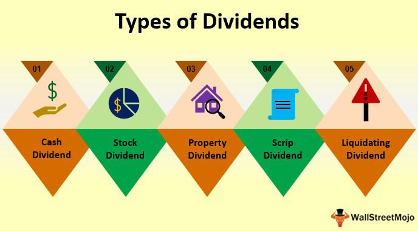

Dividends represent a critical component of investment returns, acting as a distribution of a corporation's earnings to its shareholders. They are pivotal in shaping an investor's income generation strategy. Among the types of dividends, cash and stock dividends stand paramount. Cash dividends involve direct monetary payments to shareholders, typically distributed from a company's profits. Conversely, stock dividends offer additional shares of the corporation instead of cash, providing a means for companies to reward shareholders without affecting cash reserves.

Algorithmic trading, or algo trading, has emerged as a consequential element in modern finance, leveraging computer algorithms to execute trades rapidly and efficiently. This approach is highly relevant today, given its capacity to process immense volumes of data, react swiftly to market conditions, and implement complex trading strategies that might be impossible manually.



Understanding the differences between cash and stock dividends is crucial for making informed trading decisions, especially in an algo trading context. Each type of dividend has unique implications for investment strategies, tax considerations, and effects on a company's stock price. For algorithmic traders, recognizing how these dividends impact market dynamics is imperative to optimize trading algorithms and maximize returns.

This article aims to analyze cash dividends, stock dividends, and their distinct impacts on trading strategies, particularly in algorithmic trading. By comprehending these components, investors and traders can enhance their decision-making process and potentially increase their portfolio's performance.

## Table of Contents

## What is a Cash Dividend?

A cash dividend is a distribution of a portion of a company's earnings, issued as a payment to its shareholders. This form of dividend is typically paid in cash and represents a direct return on investment for the shareholders, providing them with tangible income derived from the company's profit. Cash dividends are generally issued by well-established companies with a steady revenue stream, and they are particularly attractive to investors seeking regular income.

The process of issuing cash dividends involves several key dates, which are critical for determining who is eligible to receive the dividend. The first is the declaration date, on which the company's board of directors announces the dividend payment, specifying the amount per share and the dates involved in the process. Following this, the record date is set; this is the deadline by which an investor must be recorded on the company’s [books](/wiki/algo-trading-books) as a shareholder to receive the dividend. The ex-dividend date, which typically occurs one business day before the record date, is important for buyers and sellers of the stock, as those purchasing shares on or after this date are not entitled to receive the declared dividend.

Tax implications are a significant consideration for recipients of cash dividends. In many jurisdictions, cash dividends are treated as taxable income, which can reduce the net gain realized by shareholders. The exact tax treatment can vary depending on factors such as the shareholder's tax bracket and whether the dividend is classified as qualified or non-qualified, affecting the rate at which it is taxed.

Cash dividends also have an immediate impact on stock prices. When a cash dividend is declared, there is often an adjustment in the stock price, typically equivalent to the dividend amount, on the ex-dividend date. This is because the dividend reduces the company's assets and, subsequently, its equity per share. Thus, investors might notice that the stock price decreases by roughly the dividend amount on the ex-dividend date.

Several companies are renowned for regularly distributing cash dividends to their shareholders. Blue-chip companies like Procter & Gamble, Johnson & Johnson, and Coca-Cola are commonly cited examples, known for their consistent and reliable dividend payments. These companies often appeal to income-focused investors or those seeking a combination of income and growth, as they offer a predictable stream of dividend income along with the potential for capital appreciation.

## What is a Stock Dividend?

A stock dividend is a distribution of additional shares by a corporation to its existing shareholders, without the exchange of cash. Unlike cash dividends, which provide a direct form of income, stock dividends increase the shareholders' number of shares proportionally to their current holdings. This form of dividend does not immediately impact the cash flow or [liquidity](/wiki/liquidity-risk-premium) of the shareholder but rather impacts the number of shares owned.

### Mechanics of Stock Dividends

Stock dividends involve the distribution of additional shares, determined as a percentage of existing shares. For instance, a 10% stock dividend implies that a shareholder who owns 100 shares would receive an additional 10 shares, thus totaling 110 shares. This increase, while augmenting the share count, does not alter the total value of the holdings immediately, as the market adjusts the stock price to account for the increased number of shares.

Mathematically, if $P$ is the pre-dividend share price, $n$ is the number of additional shares received per 100 shares owned (the dividend rate in percentage), and $Q$ is the original quantity of shares, the new adjusted share price $P'$ can be approximated by:

$$
P' = \frac{P \times Q}{Q + \frac{n \times Q}{100}}
$$

### Tax Treatment of Stock Dividends

Stock dividends are typically not taxable at the time of distribution, as they do not constitute an actual cash gain. In many jurisdictions, they are treated differently from cash dividends for tax purposes; generally, no immediate tax is levied until the shareholder sells the shares, at which point capital gains tax may apply. However, shareholders should remain aware of specific conditions under which tax may apply, as tax laws can vary significantly based on jurisdiction.

### Impact on Share Price and Shareholder Value

Stock dividends do not directly affect shareholder value in monetary terms; instead, they redistribute the existing value over a larger share count. Following a stock dividend, the market price per share usually decreases proportionally to the dividend rate to reflect the increased number of shares. Consequently, the overall market capitalization of the company remains unchanged immediately after the dividend. Despite this, some companies may use stock dividends to signal growth potential, especially if they retain earnings for reinvestment rather than direct cash distribution.

### Situations Favoring Stock Dividends

Companies may prefer issuing stock dividends over cash dividends under several circumstances:

1. **Cash Preservation**: Businesses may opt for stock dividends to conserve cash for reinvestment or operational needs, especially if cash liquidity is needed for capital projects or R&D.

2. **Market Signaling**: Stock dividends can signal company confidence in future growth, potentially stimulating investor optimism and long-term investment.

3. **Managing Stock Price**: By distributing shares, companies can moderate a high share price, making the stock more accessible to retail investors.

4. **Reinvestment Opportunities**: Firms with potential high-return projects may choose to invest retained earnings into growth areas rather than distributing cash dividends, aligning with a long-term growth strategy.

In summary, stock dividends are a strategic tool utilized by companies to manage financial and market positioning, offering distinct advantages while carrying implications for shareholder value and market perception. Understanding these dynamics is crucial for making informed investment decisions within varied economic and market conditions.

## Comparing Cash and Stock Dividends

Cash and stock dividends are two fundamental forms of payout that investors receive from companies. Each type of dividend has unique characteristics that can influence investment strategy and portfolio management.

**High-level comparison between cash and stock dividends**

Cash dividends refer to the distribution of profits in the form of cash to shareholders. They represent a direct transfer of wealth from the company to the investor, which can be immediately reinvested or used for personal expenses. Stock dividends, on the other hand, involve issuing additional shares to shareholders, increasing the total number of shares they own without affecting their proportional stake in the company. Both forms have specific advantages and disadvantages.

**Advantages and disadvantages of cash dividends for different types of investors**

Cash dividends provide immediate income, making them attractive for income-focused investors, such as retirees, who rely on regular income streams for expenses. These dividends tend to signal company stability and profitability, often associated with established firms with consistent earnings. However, cash dividends are subject to taxation upon receipt, which can diminish net returns, especially in higher tax brackets.

Conversely, growth-focused investors may find cash dividends less appealing since reinvesting cash takes additional effort and transaction costs may apply. Cash retention by the company could offer more substantial long-term growth opportunities if reinvested into business expansion or innovative projects.

**Pros and cons of stock dividends and their appeal in specific market conditions**

Stock dividends increase the number of shares owned by investors, which can be advantageous during market uptrends as they can grow in value. They allow investors to benefit from compounding without incurring immediate tax liabilities, as stock dividends are typically not taxed until the shares are sold. This feature makes them appealing in markets with anticipated growth or when the investor's tax situation suggests deferring income recognition.

However, stock dividends might dilute earnings per share (EPS) in the short term, potentially negatively impacting share price perception. For companies, issuing stock dividends may indicate a lack of sufficient cash flow to distribute profits, which could concern certain investors about the company's financial health.

**Impact on investor strategy and portfolio management**

Cash dividends provide liquidity and flexibility, enabling investors to allocate resources according to prevailing market opportunities or personal needs. They suit strategies emphasizing income generation and lower [volatility](/wiki/volatility-trading-strategies).

Stock dividends cater to growth-oriented strategies, facilitating automatic reinvestment and compounding without immediate cash outflow. This can be advantageous for long-term portfolios seeking capital appreciation. Portfolio management involving stock dividends might focus more on company growth potential and less on immediate cash returns.

**Use cases for preferring one type of dividend over the other**

Investors may prefer cash dividends when they prioritize stable income, require liquidity, or reside in lower tax brackets where taxation of dividends is less punitive. Situations like retirement or a need for consistent cash flow from investments typically favor cash dividends.

Stock dividends are preferable when investors seek to increase their equity stake without immediate tax consequences and are optimistic about future company growth. Growth-phase companies or emerging markets where reinvestment prospects are high might see more stock dividend issuance. Tax-sensitive investors might also lean towards stock dividends to manage taxable income levels judiciously.

In summary, the choice between cash and stock dividends hinges on individual investor preferences, financial goals, tax considerations, and market conditions. Assessing the unique benefits and drawbacks of each can significantly influence investment decisions and overall portfolio performance.

## Algorithmic Trading: Impact of Dividends

Algorithmic trading refers to the use of computer programs and algorithms to execute trades at high speed and [volume](/wiki/volume-trading-strategy), often with minimal human intervention. It is a cornerstone of modern trading systems and significantly impacts stock markets by improving liquidity, narrowing spreads, and enhancing market efficiency.

Dividends, whether cash or stock, can substantially influence [algorithmic trading](/wiki/algorithmic-trading) strategies. Cash dividends are periodic payments made to shareholders, while stock dividends involve the issuance of additional shares. These corporate actions prompt traders to recalibrate their strategies to account for the resulting changes in stock prices and volumes.

### Influence of Dividends on Algorithmic Trading Strategies

Dividends can cause significant price adjustments in the stock market. Algorithms designed to capitalize on such changes use historical data and statistical models to anticipate price movements. For example, as a stock approaches its ex-dividend date, a common pattern is the decline in its price by approximately the dividend amount, although this is not always guaranteed due to market speculation and other external factors. Algorithmic strategies could exploit this by executing trades that capitalize on the mean-reversion or [momentum](/wiki/momentum) observed during the ex-dividend period.

### Analyzing Market Reactions to Dividend Announcements

Algorithmic trading systems extensively analyze market reactions to dividend announcements by monitoring financial news and social media feeds, employing Natural Language Processing (NLP) to gauge sentiment and predict stock price movements. Algorithms can detect changes in trading volumes and volatility, providing insights into market sentiment preceding or succeeding dividend announcements. Implementing [machine learning](/wiki/machine-learning) techniques enhances the predictive power of these algorithms.

```python
# Simple Python example to simulate trading based on dividend information
from datetime import datetime, timedelta

class Stock:
    def __init__(self, symbol, current_price):
        self.symbol = symbol
        self.current_price = current_price
        self.ex_dividend_date = None
        self.dividend_amount = 0

    def update_dividend(self, ex_dividend_date, dividend_amount):
        self.ex_dividend_date = ex_dividend_date
        self.dividend_amount = dividend_amount

def simulate_trading(stock, current_date):
    if current_date >= stock.ex_dividend_date:
        expected_price_change = stock.current_price - stock.dividend_amount
        return expected_price_change
    return stock.current_price

# Example of using the Stock class
apple_stock = Stock('AAPL', 150)
apple_stock.update_dividend(datetime.now() + timedelta(days=7), 2)

new_price = simulate_trading(apple_stock, datetime.now() + timedelta(days=8))
print(f"Expected Price After Ex-Dividend: {new_price}")
```

### Challenges and Opportunities in Trading Strategies

Dividends present both challenges and opportunities for algo traders. One challenge is the requirement for precise timing to optimize trades around dividend events; premature or delayed actions can lead to suboptimal outcomes. There's also the computational complexity involved in processing large datasets for dividends across numerous stocks simultaneously. On the opportunity side, dividend-related trading can generate substantial returns due to the predictable nature of price movements around these events. Traders employing a blend of machine learning, predictive analytics, and quantitative research often gain an edge in leveraging dividend data effectively.

### Case Studies: Algorithmic Trading in Dividend Strategies

Case studies highlight successful integration of algorithmic trading in dividend strategies. One notable example is the strategy of dividend capture, where algorithms assist in purchasing shares before the ex-dividend date and selling them afterward, thus retaining the dividend. This strategy requires sophisticated algorithms to identify target stocks, assess market conditions, and precisely execute trades. Another case involves the use of statistical [arbitrage](/wiki/arbitrage) and machine learning models to exploit price discrepancies initiated by the market's over- or under-reaction to dividend announcements. 

In summary, the integration of dividends into algorithmic trading strategies offers traders a robust toolset to enhance portfolio performance. The rapid execution, data analysis capabilities, and strategic adaptability of algorithmic trading make it an invaluable asset for navigating the impacts of dividends in dynamic financial markets.

## Special Considerations in Dividend Investing

Dividend reinvestment plans (DRIPs) play a crucial role in the compounding of investment returns. These plans allow investors to reinvest their cash dividends into additional shares of the same stock, rather than receiving the dividend as cash. This process can enhance long-term growth by leveraging the power of compounding, where investors earn returns not just on their initial investment but also on the accumulated dividends. For example, if an investor holds shares in a company that offers a 5% dividend yield, reinvesting those dividends can significantly increase the total return over time compared to merely receiving the dividends in cash.

Dividend policies are instrumental in evaluating company stability. Companies that consistently pay dividends are often perceived as financially stable and committed to returning value to shareholders. The regularity and growth of dividends can signal a company's confidence in its future earnings. Therefore, investors often look at a company’s dividend history and policies as indicators of its long-term viability. A stable or growing dividend policy is generally seen as a positive signal by the market and potential investors.

Dividend cuts and suspensions have significant market impacts and can affect investor sentiment. A dividend cut, where a company reduces the amount it pays out as dividends, typically indicates potential trouble or decreased future earnings. Such actions may result in decreased stock prices as investors adjust their valuations of the company. Similarly, dividend suspensions, where distributions are temporarily halted, can lead to market uncertainty and a reevaluation of company prospects. Investors may interpret these moves as red flags, prompting them to reassess their investment strategies concerning the affected stock.

Dividend yield and payout ratios are crucial metrics in investment decisions. The dividend yield, calculated as the annual dividend divided by the stock price, provides insight into the income-generating potential of an investment. A higher yield may be attractive to income-focused investors, but it is also important to consider the sustainability of the dividend. The payout ratio, which is the proportion of earnings paid out as dividends, allows investors to gauge whether a company is retaining enough earnings for growth or is potentially overstretching its financial resources. An excessively high payout ratio could imply that a company is at risk of cutting dividends in the future if earnings do not grow.

Special dividends refer to non-recurring distributions to shareholders, often resulting from extraordinary events such as asset sales or windfall profits. These dividends can result in temporary market impacts, as investors may react to the influx of cash by adjusting their positions. While special dividends can be enticing, they should not be viewed as indicative of a company’s regular earnings strength or dividend policy. Investors need to distinguish between regular and special dividends when assessing long-term expectations for dividend income.

Overall, these considerations are essential for investors seeking to maximize returns and optimize the risk-reward balance in their portfolios. Understanding how dividend reinvestment, policies, cuts, and special dividends affect investments can aid in making informed decisions that align with financial goals.

## Conclusion

Cash and stock dividends are both pivotal elements in the investment landscape. Each has unique characteristics and implications for investors. Cash dividends offer a tangible return, providing a steady income stream, which can be particularly attractive to income-focused investors. These distributions can be utilized for immediate expenditure, reinvestment, or as a buffer during market volatility, thus playing a crucial role in achieving specific financial objectives.

On the other hand, stock dividends represent a different strategic edge by offering investors additional shares, which can lead to enhanced long-term growth potential. This can be especially beneficial in a portfolio focusing on capital appreciation, as investors gain more shares without the immediate tax burden typically associated with cash dividends. The main advantage of stock dividends lies in their capacity to align the interests of shareholders with the long-term growth goals of the company.

Strategic dividend planning is essential in the realm of algorithmic trading. Algorithms can be tailored to detect dividend declaration patterns, leading to efficient exploitation of market-moving announcements. Incorporating dividend information into algorithmic trading strategies can offer significant competitive advantages, as algorithms can swiftly react to dividend announcements, optimizing trading outcomes.

From a broader investment strategy perspective, the integration of dividends should be approached with a tailored investment philosophy. Investors must consider their financial goals, risk tolerance, and tax situations. Balancing between cash and stock dividends according to these personal parameters enhances not only income generation but also overall portfolio performance.

Further exploration and education in dividend investing and algorithmic trading are encouraged for those aiming to deepen their understanding and sharpen their investment strategies. As markets evolve, ongoing research will provide investors with refined methods to capitalize on dividend opportunities, ensuring they remain informed and agile in a dynamic financial environment.

## FAQs

### FAQs

**What are dividends and why are they important?**

Dividends are distributions of a portion of a company's earnings to its shareholders. Companies typically pay dividends to reward investors for their trust and investment in the business. Dividends play a crucial role in providing a steady income to investors, especially those seeking consistent cash flows, such as retirees. Additionally, dividends can serve as an indicator of a company's financial health, signaling its stability and profitability to the market.

**How do cash dividends differ from stock dividends?**

Cash dividends are payments made to shareholders in the form of cash. Typically, they are distributed on a per-share basis, meaning each share of stock receives a predetermined dividend amount. In contrast, stock dividends involve the distribution of additional shares to shareholders instead of cash. Consequently, stock dividends increase the number of shares owned but do not provide immediate liquidity like cash dividends. The choice between cash and stock dividends depends on the company's financial strategy and its shareholders' preferences.

**What are the tax considerations for different types of dividends?**

The taxation of dividends can differ based on the type of dividend and the shareholder's tax jurisdiction. Cash dividends are generally considered taxable income in the year they are received. In some countries, qualified dividends may benefit from lower tax rates compared to ordinary income. Stock dividends, on the other hand, typically do not incur immediate tax charges since no cash income is received at the time of distribution. However, tax liabilities may arise when the additional shares are sold. It's crucial for investors to understand their specific tax obligations to optimize their dividend income.

**Which companies typically issue dividends?**

Companies that generate substantial, stable cash flows and consistent profits are more likely to issue dividends. These often include large, established companies, known as "blue-chip" stocks, such as Procter & Gamble, Johnson & Johnson, and Coca-Cola. Sectors like utilities, consumer goods, and telecommunications are also traditional dividend payers. Conversely, high-growth technology companies might retain profits to reinvest in the business rather than pay dividends.

**How does algorithmic trading interact with dividend announcements?**

Algorithmic trading refers to using automated, pre-programmed trading instructions to execute trades at optimal speeds and frequencies. Dividend announcements can significantly influence stock prices and trading volumes, creating opportunities for algorithmic strategies to exploit price movements. By incorporating data on dividend declarations, record dates, and ex-dividend dates, algorithmic traders can design strategies to capitalize on anticipated market reactions. For example, algorithms might predict temporary price drops on ex-dividend dates and adjust trades accordingly to maximize gains or minimize losses.

## References & Further Reading

[1]: ["Advances in Financial Machine Learning"](https://www.amazon.com/Advances-Financial-Machine-Learning-Marcos/dp/1119482089) by Marcos Lopez de Prado

[2]: Elton, E. J., Gruber, M. J., Brown, S. J., & Goetzmann, W. N. (2014). ["Modern Portfolio Theory and Investment Analysis."](https://books.google.com/books/about/Modern_Portfolio_Theory_and_Investment_A.html?id=181CEAAAQBAJ) Wiley.

[3]: ["Machine Learning for Algorithmic Trading - Second Edition"](https://www.oreilly.com/library/view/machine-learning-for/9781839217715/) by Stefan Jansen

[4]: Kale, J.R., & Noe, T.H. (1990). ["Dividends, Uncertainty, and Underwriting Costs under Asymmetric Information."](https://onlinelibrary.wiley.com/doi/abs/10.1111/j.1475-6803.1990.tb00631.x) Journal of Financial Economics, 29(1), 91-106.

[5]: Lintner, J. (1956). ["Distribution of Incomes of Corporations Among Dividends, Retained Earnings, and Taxes."](https://www.semanticscholar.org/paper/DISTRIBUTION-OF-INCOMES-OF-CORPORATIONS-AMONG-AND-Lintner/143efffe75d830c56a943b1098016341e2f17c3c) American Economic Review, 46(2), 97-113.

[6]: ["The Intelligent Investor: The Definitive Book on Value Investing."](https://www.amazon.com/Intelligent-Investor-3rd-Ed/dp/0063356724) by Benjamin Graham

[7]: ["Quantitative Trading: How to Build Your Own Algorithmic Trading Business"](https://github.com/LucindaYa/quant-resources/blob/master/Quantitative%20Trading%20How%20to%20Build%20Your%20Own%20Algorithmic%20Trading%20Business.pdf) by Ernest P. Chan

[8]: Williams, J.B. (1938). ["The Theory of Investment Value."](https://archive.org/details/in.ernet.dli.2015.225177) Harvard University Press.