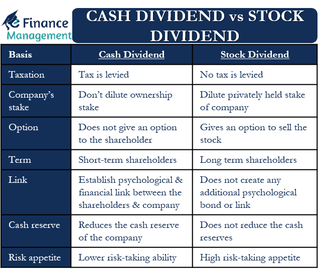

## Table of Contents

## What is a cash dividend?

A cash dividend is money that a company pays to its shareholders. When a company makes a profit, it can choose to share some of that profit with the people who own its stock. This payment is usually made every three months and is based on how many shares a person owns. The amount each share gets is decided by the company's board of directors.

Shareholders like cash dividends because it gives them extra money without having to sell their shares. It's like getting a bonus just for owning part of the company. However, not all companies pay dividends. Some, especially newer or fast-growing companies, might decide to use all their profits to grow the business instead of paying out dividends.

## What is a stock dividend?

A stock dividend is when a company gives its shareholders more shares instead of cash. If you own stock in a company and they declare a stock dividend, you'll get additional shares based on how many you already own. For example, if a company offers a 10% stock dividend and you own 100 shares, you'll get 10 more shares.

Stock dividends are different from cash dividends because they don't give you money right away. Instead, they increase the number of shares you own. This can be good because it means you own a bigger piece of the company without spending more money. But remember, the value of each share might go down a little bit after a stock dividend because there are more shares out there.

## How are cash dividends paid to shareholders?

When a company decides to pay a cash dividend, it sets a date called the "declaration date." On this day, the company's board of directors announces how much the dividend will be and when it will be paid. After the declaration date, there's a "record date," which is when the company looks at its list of shareholders to see who gets the dividend. You need to own the stock before the record date to get the dividend.

Then comes the "payment date," which is when the company actually sends the money to the shareholders. This can be done in different ways. Usually, the money goes straight into the shareholder's bank account if they have set up direct deposit. If not, the company might send a check in the mail. The whole process from declaration to payment can take a few weeks, but it gives shareholders a nice bonus for owning the stock.

## How are stock dividends distributed to shareholders?

When a company decides to give a stock dividend, it picks a date called the "declaration date." On this day, the company tells everyone that it will give out more shares. The company also decides how many extra shares each shareholder will get. This is usually a percentage of the shares they already own. For example, if the company offers a 5% stock dividend, and you own 100 shares, you'll get 5 more shares.

After the declaration date, there's another important date called the "record date." This is when the company checks its list to see who owns the stock. If you own the stock before the record date, you'll get the extra shares. Once the record date passes, the company will give out the new shares on the "payment date." On this day, the new shares are added to your account. You don't have to do anything; the company does it all for you.

## What are the tax implications of receiving cash dividends?

When you get cash dividends, you usually have to pay taxes on them. The money you get from dividends is seen as income by the government, so you'll need to report it on your tax return. The tax rate you pay on dividends can be different depending on your total income and the type of dividends. There are two main types of dividends for tax purposes: qualified and non-qualified. Qualified dividends are taxed at a lower rate, similar to long-term capital gains, while non-qualified dividends are taxed at your regular income tax rate.

To figure out if your dividends are qualified or non-qualified, you need to look at how long you've owned the stock and the company's status. Usually, you need to have held the stock for more than 60 days during a certain period around the ex-dividend date to get the lower tax rate on qualified dividends. If you're not sure about the tax rules or how to report your dividends, it's a good idea to talk to a tax professional. They can help you understand what you owe and make sure you're following the tax laws correctly.

## What are the tax implications of receiving stock dividends?

When you get stock dividends, you usually don't have to pay taxes right away. This is because stock dividends are seen as more shares of the same thing you already own, not as new income. But, the total value of your shares might go up, so when you sell those shares later, you might have to pay capital gains tax on the profit you make.

The tax you pay on the profit from selling the shares depends on how long you held onto them. If you sell the shares less than a year after getting them, you'll pay a short-term capital gains tax, which is the same as your regular income tax rate. If you hold the shares for more than a year before selling, you'll pay a long-term capital gains tax, which is usually lower. So, it's smart to keep track of when you get stock dividends and when you sell them to figure out your taxes correctly.

## How do cash dividends affect a company's financial statements?

When a company decides to pay cash dividends, it affects its financial statements right away. On the balance sheet, the company's cash goes down because it's paying out money to shareholders. At the same time, the company's retained earnings, which is the part of the profits it keeps, also goes down. This makes sense because the company is giving some of its profits back to the people who own its stock. So, both the asset side (cash) and the equity side (retained earnings) of the balance sheet decrease by the same amount.

On the income statement, cash dividends don't show up as an expense. That's because dividends are not a cost of doing business; they're a way of sharing profits with shareholders. But, the company does have to report the total amount of dividends it paid out in a section called the statement of retained earnings or the statement of shareholders' equity. This statement shows how the company's profits are being used, either kept in the business or paid out to shareholders. So, while cash dividends don't directly affect the income statement, they do change how much profit the company keeps and reports in its equity section.

## How do stock dividends affect a company's financial statements?

When a company gives out stock dividends, it affects the financial statements differently than cash dividends. On the balance sheet, the total value of the company's stock goes up because more shares are being given out. But, the company doesn't lose any cash, so the cash amount stays the same. The retained earnings, which is the part of the profits the company keeps, goes down by the value of the stock dividends. This is because the company is giving some of its profits back to shareholders, but in the form of more shares instead of cash. So, the equity part of the balance sheet changes, but the total equity stays the same because the increase in stock value matches the decrease in retained earnings.

On the income statement, stock dividends don't show up as an expense, just like cash dividends. They are not a cost of doing business, but a way to share profits with shareholders. However, the company does report the total value of the stock dividends in the statement of retained earnings or the statement of shareholders' equity. This statement shows how the company's profits are being used, either kept in the business or given back to shareholders. So, while stock dividends don't directly affect the income statement, they do change how much profit the company keeps and reports in its equity section.

## What are the advantages of issuing cash dividends over stock dividends?

Issuing cash dividends has some clear benefits for both the company and its shareholders. For shareholders, getting cash dividends means they receive actual money that they can use right away. This can be important for people who rely on dividend income, like retirees. It's like getting a regular paycheck just for owning the company's stock. For the company, paying cash dividends can show that it is financially healthy and making good profits. It can make the company look stable and reliable, which might attract more investors who like steady income from their investments.

Another advantage of cash dividends over stock dividends is that they can boost the stock's value. When a company pays out cash, it often means it has extra money after taking care of its needs. This can make investors feel more confident about the company's future, which might drive up the stock price. On the other hand, stock dividends don't give shareholders immediate money, and they can sometimes make the stock price drop a bit because more shares are out there. So, cash dividends can be a better choice for a company that wants to keep its shareholders happy and its stock price strong.

## What are the advantages of issuing stock dividends over cash dividends?

Issuing stock dividends can be a smart move for a company that wants to keep its cash. When a company gives out stock dividends, it doesn't have to pay out any money. This means the company can keep its cash to use for other things, like growing the business or paying off debts. For shareholders, getting more shares can be good too. It means they own a bigger piece of the company without spending more money. This can be especially helpful for people who believe in the company's future and want to hold onto their investment for a long time.

Another advantage of stock dividends is that they can make shareholders feel good about the company. When a company gives out more shares, it's like saying, "We believe in our future, and we want you to have more of it." This can make shareholders more loyal and less likely to sell their shares. Plus, stock dividends can help keep the stock price stable. When a company pays cash dividends, the stock price might drop a bit because the company is losing cash. But with stock dividends, the total value of the company stays the same, so the stock price doesn't usually change much right away.

## How do companies decide whether to issue cash or stock dividends?

When a company is thinking about giving dividends, it looks at its money situation and what its shareholders might want. If the company has a lot of cash and wants to show it's doing well, it might choose to give cash dividends. This makes shareholders happy because they get real money they can use right away. It also makes the company look good to investors who like to get regular payments from their stocks. But if the company doesn't have much cash, or if it wants to keep the money to grow the business, it might pick stock dividends instead. This way, the company keeps its cash but still gives something to shareholders.

The decision also depends on what the company thinks its shareholders want. Some shareholders, like people who are retired, might really need the money from cash dividends. Other shareholders might be happy with more shares because they believe the company will do well in the future. The company's leaders, called the board of directors, think about all these things. They want to make sure they're doing what's best for the company and its owners. So, they look at how much cash they have, what they plan to do with it, and what kind of dividends their shareholders would like most.

## What impact do cash and stock dividends have on a company's stock price?

When a company pays cash dividends, it can affect the stock price in a few ways. If the company is doing well and has enough cash to pay dividends, it can make investors feel more confident about the company's future. This confidence can make the stock price go up because more people want to buy the stock. But, on the day the dividend is paid, the stock price might drop a little bit. This happens because the company is giving away some of its cash, so the stock's value goes down by the amount of the dividend. Still, over time, regular cash dividends can make the stock more attractive to investors who like getting regular income, which can help keep the stock price stable or even grow it.

Stock dividends can have a different effect on the stock price. When a company gives out more shares instead of cash, the total value of the company stays the same, but the value of each share might go down a bit. This is because there are more shares out there, so each one is worth a smaller piece of the company. But, stock dividends can also make shareholders feel good about the company's future because it shows the company believes in itself. This can make the stock price stay steady or even go up a little if more people want to buy the stock because they think the company will do well. So, while stock dividends might cause a small drop in the stock price right away, they can help keep the price stable over time if investors stay confident in the company.

## What is a Stock Dividend?

A stock dividend is a distribution of additional shares by a corporation to its existing shareholders, without the exchange of cash. Unlike cash dividends, which provide a direct form of income, stock dividends increase the shareholders' number of shares proportionally to their current holdings. This form of dividend does not immediately impact the cash flow or [liquidity](/wiki/liquidity-risk-premium) of the shareholder but rather impacts the number of shares owned.

### Mechanics of Stock Dividends

Stock dividends involve the distribution of additional shares, determined as a percentage of existing shares. For instance, a 10% stock dividend implies that a shareholder who owns 100 shares would receive an additional 10 shares, thus totaling 110 shares. This increase, while augmenting the share count, does not alter the total value of the holdings immediately, as the market adjusts the stock price to account for the increased number of shares.

Mathematically, if $P$ is the pre-dividend share price, $n$ is the number of additional shares received per 100 shares owned (the dividend rate in percentage), and $Q$ is the original quantity of shares, the new adjusted share price $P'$ can be approximated by:

$$
P' = \frac{P \times Q}{Q + \frac{n \times Q}{100}}
$$

### Tax Treatment of Stock Dividends

Stock dividends are typically not taxable at the time of distribution, as they do not constitute an actual cash gain. In many jurisdictions, they are treated differently from cash dividends for tax purposes; generally, no immediate tax is levied until the shareholder sells the shares, at which point capital gains tax may apply. However, shareholders should remain aware of specific conditions under which tax may apply, as tax laws can vary significantly based on jurisdiction.

### Impact on Share Price and Shareholder Value

Stock dividends do not directly affect shareholder value in monetary terms; instead, they redistribute the existing value over a larger share count. Following a stock dividend, the market price per share usually decreases proportionally to the dividend rate to reflect the increased number of shares. Consequently, the overall market capitalization of the company remains unchanged immediately after the dividend. Despite this, some companies may use stock dividends to signal growth potential, especially if they retain earnings for reinvestment rather than direct cash distribution.

### Situations Favoring Stock Dividends

Companies may prefer issuing stock dividends over cash dividends under several circumstances:

1. **Cash Preservation**: Businesses may opt for stock dividends to conserve cash for reinvestment or operational needs, especially if cash liquidity is needed for capital projects or R&D.

2. **Market Signaling**: Stock dividends can signal company confidence in future growth, potentially stimulating investor optimism and long-term investment.

3. **Managing Stock Price**: By distributing shares, companies can moderate a high share price, making the stock more accessible to retail investors.

4. **Reinvestment Opportunities**: Firms with potential high-return projects may choose to invest retained earnings into growth areas rather than distributing cash dividends, aligning with a long-term growth strategy.

In summary, stock dividends are a strategic tool utilized by companies to manage financial and market positioning, offering distinct advantages while carrying implications for shareholder value and market perception. Understanding these dynamics is crucial for making informed investment decisions within varied economic and market conditions.

## References & Further Reading

[1]: ["Advances in Financial Machine Learning"](https://www.amazon.com/Advances-Financial-Machine-Learning-Marcos/dp/1119482089) by Marcos Lopez de Prado

[2]: Elton, E. J., Gruber, M. J., Brown, S. J., & Goetzmann, W. N. (2014). ["Modern Portfolio Theory and Investment Analysis."](https://books.google.com/books/about/Modern_Portfolio_Theory_and_Investment_A.html?id=181CEAAAQBAJ) Wiley.

[3]: ["Machine Learning for Algorithmic Trading - Second Edition"](https://www.oreilly.com/library/view/machine-learning-for/9781839217715/) by Stefan Jansen

[4]: Kale, J.R., & Noe, T.H. (1990). ["Dividends, Uncertainty, and Underwriting Costs under Asymmetric Information."](https://onlinelibrary.wiley.com/doi/abs/10.1111/j.1475-6803.1990.tb00631.x) Journal of Financial Economics, 29(1), 91-106.

[5]: Lintner, J. (1956). ["Distribution of Incomes of Corporations Among Dividends, Retained Earnings, and Taxes."](https://www.semanticscholar.org/paper/DISTRIBUTION-OF-INCOMES-OF-CORPORATIONS-AMONG-AND-Lintner/143efffe75d830c56a943b1098016341e2f17c3c) American Economic Review, 46(2), 97-113.

[6]: ["The Intelligent Investor: The Definitive Book on Value Investing."](https://www.amazon.com/Intelligent-Investor-3rd-Ed/dp/0063356724) by Benjamin Graham

[7]: ["Quantitative Trading: How to Build Your Own Algorithmic Trading Business"](https://github.com/LucindaYa/quant-resources/blob/master/Quantitative%20Trading%20How%20to%20Build%20Your%20Own%20Algorithmic%20Trading%20Business.pdf) by Ernest P. Chan

[8]: Williams, J.B. (1938). ["The Theory of Investment Value."](https://archive.org/details/in.ernet.dli.2015.225177) Harvard University Press.