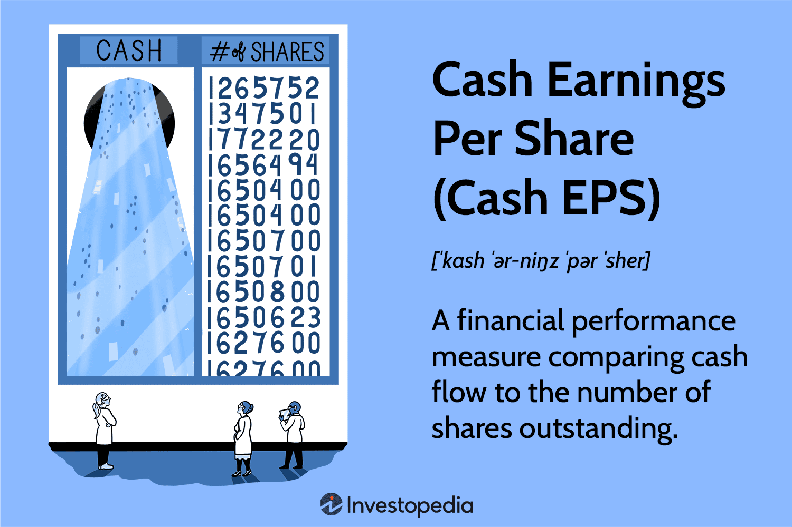

## Table of Contents

## What is Cash Earnings Per Share (Cash EPS)?

Cash Earnings Per Share (Cash EPS) is a financial measure that shows how much cash a company is generating per share of its stock. It's calculated by taking the company's cash flow from operations and dividing it by the number of outstanding shares. This measure is important because it gives investors a clearer picture of the company's ability to generate cash, which is crucial for paying dividends, buying back shares, or investing in growth.

Unlike traditional earnings per share, which can be affected by non-cash items like depreciation and amortization, Cash EPS focuses solely on the cash that the business is bringing in. This makes it a more reliable indicator of a company's financial health, especially for businesses with significant non-cash expenses. Investors often look at Cash EPS to get a better understanding of a company's true profitability and its capacity to sustain and grow its operations.

## How is Cash EPS different from traditional Earnings Per Share (EPS)?

Cash EPS and traditional EPS are two ways to measure a company's earnings, but they look at different things. Traditional EPS is calculated by taking the company's net income and dividing it by the number of shares. This number can include a lot of things that don't involve actual cash, like depreciation or changes in accounting rules. So, traditional EPS can sometimes give a picture of earnings that isn't fully based on real money coming in.

On the other hand, Cash EPS focuses only on the cash that a company makes from its operations. It's calculated by taking the cash flow from operations and dividing it by the number of shares. This means Cash EPS shows how much real money the company is generating per share, which can be more useful for understanding how well a company can pay dividends, buy back shares, or invest in new projects. Because it's based on cash flow, Cash EPS can give a clearer view of a company's financial health and ability to handle its cash needs.

## What are the components needed to calculate Cash EPS?

To calculate Cash EPS, you need two main things: the company's cash flow from operations and the number of shares it has. Cash flow from operations is the amount of money a company makes from its regular business activities. You can find this number on the company's cash flow statement. The number of shares is how many pieces of the company are owned by people or other companies. This number can be found on the company's balance sheet or in its financial reports.

Once you have these two numbers, you divide the cash flow from operations by the number of shares. This gives you the Cash EPS, which tells you how much cash the company is making for each share of stock. This number is useful because it shows how much real money the company is bringing in, which is important for things like paying dividends or investing in new projects. It's different from regular EPS because it focuses only on cash, not on other things like depreciation or accounting changes.

## How do you calculate Cash EPS step by step?

To calculate Cash EPS, first find the company's cash flow from operations. This number shows how much money the company made from its regular business activities. You can find it on the cash flow statement in the company's financial reports. Next, you need to know the number of shares the company has. This is the total number of pieces of the company that people or other companies own. You can find this number on the company's balance sheet or in its financial reports.

Once you have these two numbers, you divide the cash flow from operations by the number of shares. This gives you the Cash EPS. For example, if a company's cash flow from operations is $10 million and it has 5 million shares, you divide $10 million by 5 million to get a Cash EPS of $2 per share. This number tells you how much cash the company is making for each share of stock, which is useful for understanding how well the company can pay dividends or invest in new projects.

## Why is Cash EPS considered a more reliable metric than EPS in some cases?

Cash EPS is considered more reliable than EPS in some cases because it focuses only on the actual cash that a company makes from its regular business activities. EPS can be affected by things like depreciation, which is a way of spreading out the cost of big purchases over time, and other accounting rules that don't involve real money. These things can make EPS look different from the actual cash the company is bringing in. By looking at Cash EPS, investors get a clearer picture of how much real money the company is making, which is important for deciding if the company can pay dividends, buy back shares, or invest in new projects.

Another reason Cash EPS is seen as more reliable is that it helps show a company's true financial health. Some companies might have high EPS because of non-cash items, but if they're not bringing in enough actual cash, they might struggle to keep their business running smoothly. Cash EPS gives a better idea of whether a company has enough money to cover its expenses and grow. This makes it a valuable tool for investors who want to understand a company's ability to generate and use cash effectively.

## What are the advantages of using Cash EPS for investors?

Using Cash EPS helps investors see how much real money a company is making from its regular business activities. This is important because it shows if the company can pay dividends, buy back its own shares, or invest in new projects. Unlike traditional EPS, which can be affected by things like depreciation that don't involve actual cash, Cash EPS focuses only on the cash coming in. This gives investors a clearer picture of the company's ability to handle its cash needs and sustain its operations.

Another advantage of using Cash EPS is that it can show a company's true financial health. Some companies might have high EPS because of non-cash items, but if they're not bringing in enough actual cash, they might struggle to keep their business running smoothly. By looking at Cash EPS, investors can see if a company has enough money to cover its expenses and grow. This makes it easier for investors to decide if a company is a good investment based on its ability to generate and use cash effectively.

## Can you provide an example of how Cash EPS is calculated using a real company's data?

Let's use Apple Inc. as an example to show how to calculate Cash EPS. For the fiscal year ending September 2022, Apple reported a cash flow from operations of about $122.2 billion. This number shows how much money Apple made from its regular business activities during that year. To find out how much cash Apple made per share, we also need to know the number of shares Apple had. At the end of that fiscal year, Apple had around 16.2 billion shares outstanding.

To calculate Apple's Cash EPS, we divide the cash flow from operations by the number of shares. So, we take $122.2 billion and divide it by 16.2 billion shares. This gives us a Cash EPS of about $7.54 per share. This number tells us that for every share of Apple stock, the company generated $7.54 in cash from its operations during that year. This is useful for investors because it shows how much real money Apple is making, which can help them decide if the company is a good investment.

## How does Cash EPS help in assessing a company's financial health?

Cash EPS helps investors see how much real money a company is making from its regular business activities. This number shows if the company can pay dividends, buy back its own shares, or invest in new projects. Unlike traditional EPS, which can be affected by things like depreciation that don't involve actual cash, Cash EPS focuses only on the cash coming in. This gives investors a clearer picture of the company's ability to handle its cash needs and sustain its operations.

By looking at Cash EPS, investors can also see a company's true financial health. Some companies might have high EPS because of non-cash items, but if they're not bringing in enough actual cash, they might struggle to keep their business running smoothly. Cash EPS helps investors understand if a company has enough money to cover its expenses and grow. This makes it easier for investors to decide if a company is a good investment based on its ability to generate and use cash effectively.

## What are the limitations or potential drawbacks of using Cash EPS?

Cash EPS can be useful, but it also has some limitations. One big problem is that it doesn't show the whole picture of a company's financial health. Cash EPS only looks at the money coming in from regular business activities, but it doesn't consider other important things like how much the company owes or how much it spends on big purchases like new equipment. So, while Cash EPS can tell you how much cash a company is making, it might not show if the company is spending too much or if it has a lot of debt.

Another limitation of Cash EPS is that it can be affected by changes in working capital. For example, if a company delays paying its bills to make its cash flow look better, the Cash EPS might go up even though the company's overall financial health hasn't really improved. This means that investors need to look at other financial measures along with Cash EPS to get a complete understanding of a company's situation. Relying only on Cash EPS could lead to a misleading view of the company's ability to generate and use cash effectively.

## How does Cash EPS relate to other financial ratios and metrics?

Cash EPS is closely related to other financial ratios and metrics, helping investors get a fuller picture of a company's financial health. One important connection is with the Price to Cash Flow (P/CF) ratio. This ratio shows how much investors are willing to pay for each dollar of cash flow the company generates. To find the P/CF ratio, you divide the company's stock price by its Cash EPS. A lower P/CF ratio might mean the stock is a good deal, while a higher one could mean it's expensive. By looking at Cash EPS alongside the P/CF ratio, investors can better understand if a company's stock price makes sense given its cash generation.

Another key relationship is between Cash EPS and Free Cash Flow (FCF). Free Cash Flow is the money a company has left after it pays for its regular business activities and capital expenses like new equipment. To find FCF, you start with the cash flow from operations, which is what you use to calculate Cash EPS, and then subtract capital expenditures. FCF shows how much cash a company can use for things like paying dividends or buying back shares. By comparing Cash EPS to FCF, investors can see if a company is spending too much on big purchases or if it's generating enough cash to support its growth and shareholder returns.

## What trends in Cash EPS should investors look for to make informed decisions?

Investors should look for trends in a company's Cash EPS to see if it's growing over time. If the Cash EPS keeps going up, it means the company is making more cash from its regular business activities. This is a good sign because it shows the company is getting better at making money and might be able to pay bigger dividends or invest in new projects. On the other hand, if the Cash EPS is going down, it could mean the company is having trouble making money or is spending too much. This might make investors worried about the company's future.

Another important trend to watch is how Cash EPS compares to the company's stock price. If the Cash EPS is growing but the stock price isn't keeping up, the stock might be a good deal. Investors can use this information to decide if it's a good time to buy the stock. Also, looking at how Cash EPS changes over different economic times can tell investors if the company is stable. If the Cash EPS stays strong even during tough times, it shows the company can handle challenges well. This kind of trend can help investors feel more confident about the company's long-term health.

## How can Cash EPS be used in conjunction with other financial analysis tools for a comprehensive evaluation?

Cash EPS is a great tool to use with other financial analysis tools to get a full picture of a company's health. For example, when you look at Cash EPS along with the Price to Cash Flow (P/CF) ratio, you can see if a company's stock is a good deal. The P/CF ratio shows how much investors are willing to pay for each dollar of cash flow the company makes. If the Cash EPS is growing and the P/CF ratio is low, it might mean the stock is undervalued, making it a good time to buy. Also, by comparing Cash EPS to Free Cash Flow (FCF), you can see if the company has enough money left after its expenses to pay dividends or invest in new projects. This helps investors understand if the company is using its cash well.

Another way to use Cash EPS in a bigger analysis is by looking at trends over time and comparing it with other financial metrics like earnings growth or debt levels. If Cash EPS is going up steadily, it's a good sign that the company is getting better at making money. But if you also see that the company's debt is going down or its earnings are growing, it makes the picture even stronger. Investors can also use Cash EPS to check the company's performance during different economic times. If Cash EPS stays strong even when the economy is struggling, it shows the company is stable and can handle tough times. By using Cash EPS with these other tools, investors can make smarter decisions about whether to buy, hold, or sell a company's stock.

## What is Cash Earnings Per Share (Cash EPS)?

Cash Earnings Per Share (Cash EPS) is a financial metric that measures the cash flow generated for each share by a company's operations. It differs from traditional Earnings Per Share (EPS), which is based on net income and often includes non-cash components such as depreciation and amortization. By focusing solely on cash flows, Cash EPS provides a purer insight into a company's ability to generate cash from its core business activities.

This metric is calculated by dividing the Operating Cash Flow by the Diluted Shares Outstanding. Operating Cash Flow is found on the Cash Flow Statement and captures the cash generated by the company's operating activities, excluding investing and financing activities. This straightforward calculation formula is given by:

$$
\text{Cash EPS} = \frac{\text{Operating Cash Flow}}{\text{Diluted Shares Outstanding}}
$$

Cash EPS is particularly valuable as it eliminates the non-cash earnings adjustments that can obscure a company's true operational effectiveness. By stripping away these non-cash components, it provides a clearer picture of how effectively a company is converting its revenue into actual cash, which is crucial for funding operations, paying dividends, or reinvesting in the business.

A high Cash EPS signals robust cash generation capabilities, strong financial health, and operational efficiency. Companies with higher Cash EPS are better positioned to withstand economic downturns or invest in growth opportunities without needing external financing, making them attractive to investors and stakeholders who prioritize financial stability and efficient cash management.

## How do you calculate Cash EPS?

The calculation of Cash Earnings Per Share (Cash EPS) is essential for understanding a company's efficiency in generating cash from its operations. The formula is:

$$
\text{Cash EPS} = \frac{\text{Operating Cash Flow}}{\text{Diluted Shares Outstanding}}
$$

1. **Operating Cash Flow**: This figure is obtained from the company's Cash Flow Statement. It represents the cash generated or used by a company’s operational activities during a specific period. Unlike net income, operating cash flow emphasizes cash transactions, thus providing a true measure of a company’s ability to maintain and expand its operations through internally generated cash.

2. **Diluted Shares Outstanding**: This incorporates all shares that are currently outstanding plus any potential shares from convertible securities, such as convertible bonds and stock options. By considering diluted shares, the calculation accounts for potential future dilution, thus offering a conservative viewpoint on cash flow on a per-share basis.

By focusing on cash flows rather than accounting profits, Cash EPS provides an unambiguous view of a company's cash-generating prowess, mitigating the impact of accounting choices like depreciation or amortization.

## What is the difference between Cash EPS and Traditional EPS?

Traditional Earnings Per Share (EPS) is derived from a company's net income divided by the number of shares outstanding. This measure includes non-cash expenses like depreciation and amortization, which can impact the resultant EPS figure, sometimes leading to discrepancies in reflecting a company's actual financial health. The formula for traditional EPS is:

$$
\text{EPS} = \frac{\text{Net Income}}{\text{Shares Outstanding}}
$$

Cash Earnings Per Share (Cash EPS), on the other hand, is calculated using cash flow from operations rather than net income, thereby focusing on the real cash generated by business operations. This approach excludes non-cash items, aiming to provide a more accurate depiction of a company's ability to generate cash and thus its financial performance. The formula for Cash EPS is:

$$
\text{Cash EPS} = \frac{\text{Operating Cash Flow}}{\text{Diluted Shares Outstanding}}
$$

The primary advantage of Cash EPS over traditional EPS is its focus on actual cash flows, which offers a potentially more conservative perspective on a company’s profitability. By avoiding the distortions caused by accounting policies and non-cash charges, Cash EPS provides investors with a clearer picture of a company's operational effectiveness.

For investors seeking greater transparency, Cash EPS is preferred over traditional EPS as it minimizes the risk of accounting manipulations that can occur with net income. Moreover, companies often engage in various accounting tactics to adjust net income figures through depreciation, amortization, or other non-cash elements. These practices can obscure a company’s true financial situation, making Cash EPS a useful alternative for those prioritizing cash flow certainty and operational efficiency in their investment evaluations.

## References & Further Reading

[1]: "Cash Flow Analysis and Forecasting: The Definitive Guide to Understanding and Using Published Cash Flow Data" by Timothy Jury

[2]: "Financial Modeling and Valuation: A Practical Guide to Investment Banking and Private Equity" by Paul Pignataro

[3]: "Algorithmic Trading: Winning Strategies and Their Rationale" by Ernie Chan

[4]: "Python for Finance: Mastering Data-Driven Finance" by Yves Hilpisch

[5]: Barker, R. (2001). "Determining Value: Valuation Models and Financial Statements." Financial Management Series

[6]: "Principles of Corporate Finance" by Richard A. Brealey, Stewart C. Myers, and Franklin Allen