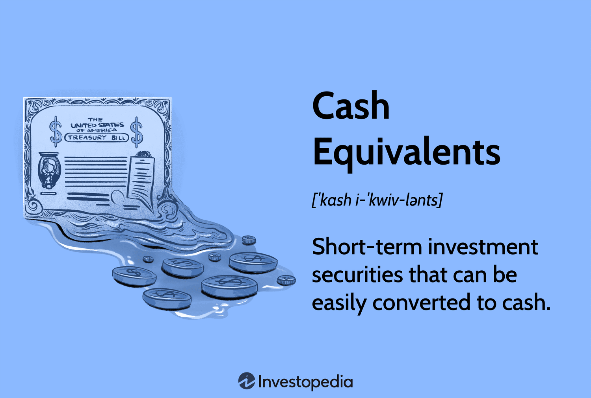

## Table of Contents

## What are cash equivalents?

Cash equivalents are things that are almost as good as cash. They are safe investments that can be turned into cash quickly, usually within three months. Examples include money market funds, treasury bills, and short-term government bonds. These are considered very safe because they have a low risk of losing value.

Businesses and people use cash equivalents to keep their money safe while still being able to use it when they need to. For example, a company might keep some of its money in a money market fund. This way, the money is earning a little interest, but the company can still use it to pay bills or buy things if they need to. Cash equivalents are important because they help keep money secure and available.

## Why are cash equivalents important for businesses?

Cash equivalents are important for businesses because they help keep money safe and easy to use. Imagine a business needs to pay for something quickly, like a sudden repair or to buy more supplies. If all their money was tied up in long-term investments, they might not be able to get it out fast enough. But with cash equivalents, like money market funds or treasury bills, they can turn these into cash in just a few days. This means the business can keep running smoothly without worrying about money being stuck somewhere.

Also, cash equivalents are a safe place to keep money that the business might need soon. They are less risky than other investments because they don't lose value easily. This is good for a business because it means they can keep their money secure while still earning a little bit of interest. It's like having a backup plan; the business knows it can get to its money quickly if something unexpected happens. This helps the business stay stable and ready for anything.

## What are the common types of cash equivalents?

Cash equivalents are things that are almost as good as cash. They are safe and can be turned into cash quickly, usually within three months. The most common type of cash equivalent is a money market fund. This is where people and businesses put their money into a fund that invests in safe, short-term things like government bonds or certificates of deposit. Money market funds are easy to get money out of if you need it fast.

Another common cash equivalent is treasury bills, which are short-term loans to the government. They are very safe because they are backed by the government, and you can sell them quickly if you need cash. Another type is commercial paper, which is like a short-term loan to a company. These are also safe because only big, trustworthy companies use them. Lastly, short-term government bonds are also cash equivalents. These are loans to the government that last less than a year and can be sold easily.

These types of cash equivalents help businesses and people keep their money safe and ready to use. They are important because they let you earn a little interest while still being able to get your money quickly if you need it. This makes them a good choice for anyone who wants to keep their money secure but also easy to use.

## How do cash equivalents differ from cash?

Cash equivalents and cash are very similar, but they are not exactly the same. Cash is money that you can use right away. It's the money in your wallet, your checking account, or any money you can spend immediately. Cash equivalents, on the other hand, are things that can be turned into cash very quickly, usually within three months. They are safe investments like money market funds, treasury bills, and short-term government bonds.

The main difference between cash and cash equivalents is how quickly you can use them. With cash, you can spend it right away. But with cash equivalents, you need to turn them into cash first, which takes a little time. However, this time is usually very short, so cash equivalents are almost as good as cash. They are important because they let you keep your money safe and earning a little interest while still being able to use it when you need to.

## What are the key features of cash equivalents?

Cash equivalents are safe investments that can be turned into cash quickly, usually within three months. They are important because they let you keep your money secure while still being able to use it when you need to. Examples of cash equivalents include money market funds, treasury bills, and short-term government bonds. These investments are considered very safe because they have a low risk of losing value.

The key feature of cash equivalents is their liquidity. This means you can turn them into cash fast if you need to. This is helpful for businesses and people who want to keep their money safe but also need to be able to use it quickly. Another important feature is their safety. Cash equivalents are less risky than other investments because they don't lose value easily. This makes them a good choice for anyone who wants to keep their money secure and ready to use.

## How are cash equivalents reported on financial statements?

Cash equivalents are shown on a company's balance sheet under the section called "Cash and Cash Equivalents." This part of the balance sheet adds up all the money the company has in cash and things that can be turned into cash quickly, like money market funds and treasury bills. By putting cash and cash equivalents together, the balance sheet shows how much money the company can use right away or very soon.

When a company buys or sells cash equivalents, these transactions are also shown on the cash flow statement. The cash flow statement keeps track of where the company's money comes from and where it goes. If the company buys a treasury bill, for example, it would be listed under "Cash Flows from Investing Activities." This helps people who look at the financial statements understand how the company is using its money and how much cash it has available.

## What are the criteria for an investment to be considered a cash equivalent?

For an investment to be considered a cash equivalent, it must be very safe and easy to turn into cash. This means the investment should have a low risk of losing value and should be able to be sold or turned into cash within three months. The idea is that cash equivalents are almost as good as having cash in your pocket because you can use them quickly if you need to.

Common examples of investments that meet these criteria are money market funds, treasury bills, and short-term government bonds. These are safe because they are usually backed by the government or other reliable institutions. They are also easy to sell or redeem, which makes them useful for businesses and people who need to keep their money secure but still accessible.

## How do companies manage their cash equivalents?

Companies manage their cash equivalents by keeping a close eye on how much money they have and how quickly they might need to use it. They put some of their money into safe investments like money market funds, treasury bills, and short-term government bonds. These investments are easy to turn into cash if the company needs money fast. Companies choose these investments because they are safe and won't lose value easily. By doing this, companies make sure they have enough money ready to use for things like paying bills, buying supplies, or dealing with unexpected costs.

To keep track of their cash equivalents, companies use financial statements like the balance sheet and cash flow statement. On the balance sheet, they add up all their cash and cash equivalents to show how much money they can use right away. On the cash flow statement, they show when they buy or sell these investments. This helps them see how their money is moving in and out of the company. By managing their cash equivalents carefully, companies can stay financially stable and be ready for whatever comes their way.

## What are the risks associated with holding cash equivalents?

Even though cash equivalents are very safe, they still have some risks. One risk is that the value of cash equivalents can go down a little bit because of changes in interest rates. For example, if interest rates go up, the value of a treasury bill might go down a bit. Another risk is that inflation can make the money you have in cash equivalents worth less over time. If prices go up faster than the interest you earn, your money won't buy as much in the future.

Another thing to think about is that cash equivalents usually don't earn as much money as other investments. If a company keeps too much money in cash equivalents, it might miss out on making more money with other investments like stocks or long-term bonds. This is called opportunity cost. Companies need to find a balance between keeping their money safe and using it to grow their business. By understanding these risks, companies can make smart choices about how to manage their money.

## How do cash equivalents impact liquidity and financial stability?

Cash equivalents help a company stay liquid and financially stable. Liquidity means having enough money to pay for things quickly. When a company has money in cash equivalents like money market funds or treasury bills, it can turn these into cash fast if it needs to. This is important because it means the company can pay its bills, buy supplies, or handle unexpected costs without waiting a long time to get money out of other investments. This quick access to cash helps the company keep running smoothly and avoid money problems.

Having cash equivalents also helps a company stay financially stable. These investments are safe and don't lose value easily, so the company's money stays secure. By keeping some money in cash equivalents, the company can have a safety net. This safety net means the company can deal with surprises without having to sell other investments at a bad time or borrow money at high interest rates. This stability helps the company plan for the future and grow in a healthy way.

## What are some advanced strategies for optimizing cash equivalents?

Companies can use a strategy called laddering to optimize their cash equivalents. Laddering means they buy different cash equivalents that mature at different times. For example, a company might buy some treasury bills that mature in one month, some in two months, and some in three months. This way, they always have money coming back to them, which they can use or reinvest. It helps them keep their money working for them while still having cash available when they need it. This strategy can help companies balance the need for liquidity with earning a little interest.

Another strategy is to use a sweep account. A sweep account automatically moves extra money from a company's checking account into a money market fund at the end of each day. This way, the company can earn interest on money that would otherwise just sit in the checking account. When the company needs the money, it can be swept back into the checking account. This helps the company make the most of its cash without having to think about it every day. Using these strategies can help companies keep their money safe, earn a little interest, and stay ready for anything that comes up.

## How do regulations affect the classification and management of cash equivalents?

Regulations play a big role in how companies classify and manage their cash equivalents. Different countries have rules about what can be considered a cash equivalent. For example, in the United States, the Financial Accounting Standards Board (FASB) says that cash equivalents are short-term, highly liquid investments that can be turned into cash within three months. Companies have to follow these rules when they report their cash and cash equivalents on their financial statements. If they don't, they could get in trouble with the government or their investors.

Regulations also affect how companies manage their cash equivalents. Banks and financial institutions have rules they must follow when they offer products like money market funds or treasury bills. These rules are there to make sure that these investments are safe and easy to use. Companies need to keep up with these regulations to make sure their money stays secure and they can use it when they need to. By following the rules, companies can make sure they are managing their cash equivalents in a way that keeps their money safe and helps them stay financially stable.

## What is the understanding of financial assets liquidity?

Liquidity refers to the ease with which an asset can be converted into cash without causing a significant impact on its market price. Assets considered highly liquid, such as stocks of large public companies or government bonds, can be sold quickly and with minimal effect on their value. Conversely, low liquidity is indicative of difficulties encountered when trying to buy or sell an asset without affecting its price, often seen in assets like real estate or shares of smaller companies.

In financial markets, [liquidity](/wiki/liquidity-risk-premium) plays a crucial role in ensuring smooth and efficient transactions. High liquidity contributes to price stability, as it allows for the quick execution of trades without causing drastic price changes. This stability is vital for both individual investors and institutions, as it reduces the risk associated with sharp market movements. In liquid markets, the presence of more buyers and sellers generally narrows the bid-ask spread, thereby enhancing trading efficiency.

To assess a company's liquidity position, various liquidity ratios are utilized. These ratios provide insights into a company's ability to meet its short-term obligations using its most liquid assets. Two commonly used ratios in this context are the current ratio and the quick ratio.

The current ratio is calculated as follows:

$$
\text{Current Ratio} = \frac{\text{Current Assets}}{\text{Current Liabilities}}
$$

This ratio offers a general measure of liquidity by comparing a company's current assets to its current liabilities, indicating the extent to which the company can cover its short-term debts with its short-term assets.

The quick ratio, also known as the acid-test ratio, is a more stringent measure of liquidity, as it excludes inventory from current assets. The formula for the quick ratio is:

$$
\text{Quick Ratio} = \frac{\text{Current Assets} - \text{Inventory}}{\text{Current Liabilities}}
$$

By excluding inventory, the quick ratio provides a clearer picture of the company's ability to meet its immediate obligations without relying on the sale of inventory, which may be less liquid than other current assets.

Understanding and managing liquidity is vital for financial stability and operational efficiency, as it directly influences a company's ability to maintain solvency, attract investment, and achieve sustainable growth.

## References & Further Reading

[1]: ["Advances in Financial Machine Learning"](https://www.amazon.com/Advances-Financial-Machine-Learning-Marcos/dp/1119482089) by Marcos Lopez de Prado

[2]: ["Evidence-Based Technical Analysis: Applying the Scientific Method and Statistical Inference to Trading Signals"](https://books.google.com/books/about/Evidence_Based_Technical_Analysis.html?id=MeoJAQAAMAAJ) by David Aronson

[3]: ["Machine Learning for Algorithmic Trading"](https://github.com/stefan-jansen/machine-learning-for-trading) by Stefan Jansen

[4]: ["Quantitative Trading: How to Build Your Own Algorithmic Trading Business"](https://www.amazon.com/Quantitative-Trading-Build-Algorithmic-Business/dp/1119800064) by Ernest P. Chan

[5]: Harris, L. (2003). ["Trading and Exchanges: Market Microstructure for Practitioners"](https://academic.oup.com/book/52292) Oxford University Press.

[6]: Fabozzi, F. J., Modigliani, F., & Jones, F. J. (2012). ["Foundations of Financial Markets and Institutions"](https://www.amazon.com/Foundations-Financial-Markets-Institutions-International/dp/1292021772) Pearson.