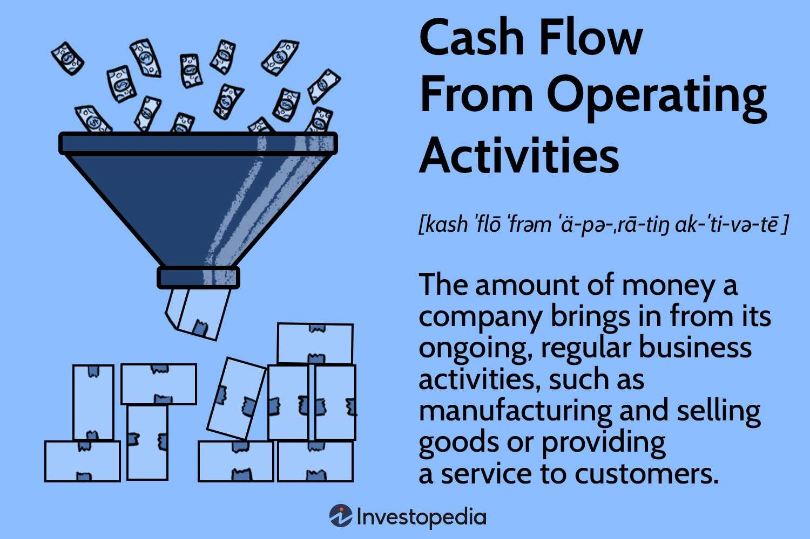

## Table of Contents

## What is cash flow in the context of business operations?

Cash flow in business operations refers to the movement of money in and out of a company. It's like tracking how much cash comes into the business from sales or other sources, and how much goes out for expenses like rent, salaries, and supplies. Positive cash flow means more money is coming in than going out, which is good for the business. Negative cash flow means the opposite, and it can lead to financial troubles if it continues for too long.

Understanding cash flow is important because it shows whether a business can pay its bills on time and keep running smoothly. If a business has good cash flow, it can invest in new projects, pay back loans, and maybe even give money back to its owners or shareholders. But if cash flow is bad, the business might struggle to buy what it needs or pay its workers, which can cause big problems. Keeping an eye on cash flow helps business owners make smart decisions about spending and saving.

## How do operating activities affect cash flow?

Operating activities are the main things a business does every day to make money, like selling products or services. These activities directly affect cash flow because they involve both bringing in money and spending it. When a business sells something, it gets cash from customers, which increases the cash flow. On the other hand, when the business pays for things like materials, employee salaries, or rent, it spends cash, which decreases the cash flow. So, the overall effect of operating activities on cash flow depends on how much money the business earns compared to how much it spends.

If a business earns more from its operating activities than it spends, it will have a positive cash flow. This means the business has extra money to use for other things, like paying off debts or investing in new projects. But if the business spends more than it earns, it will have a negative cash flow. This can be a problem because the business might not have enough money to cover its costs, and it might need to borrow money or find other ways to get cash. Keeping track of how operating activities affect cash flow helps business owners understand their financial health and make better decisions.

## What are some common examples of cash inflows from operating activities?

Cash inflows from operating activities are the money a business gets from its everyday work. The most common way a business gets cash is by selling its products or services to customers. When a customer pays for something, the money goes into the business's cash flow. This can happen right away if the customer pays with cash or a card, or it might happen later if the customer buys on credit and pays later.

Another way a business can get cash from operating activities is through interest or dividends. If a business has money in a bank account that earns interest, or if it owns part of another company that pays dividends, this money counts as cash inflow. These are smaller but still important parts of how a business makes money day to day. Keeping track of all these cash inflows helps the business know how much money it has to work with.

## What are some common examples of cash outflows from operating activities?

Cash outflows from operating activities are the money a business spends to keep running every day. One of the biggest ways a business spends money is on paying its employees. When a business pays salaries or wages, that money goes out of the business's cash flow. Another common way a business spends money is on buying things it needs to make its products or provide its services. This could be raw materials, supplies, or inventory. When the business pays for these things, it's another cash outflow.

Besides paying employees and buying supplies, a business also spends money on other regular costs. For example, rent for a store or office, utilities like electricity and water, and insurance are all common cash outflows. If a business sells on credit, it might also have to spend money to collect payments from customers who haven't paid yet. All these expenses add up and affect how much cash the business has left over after it earns money from its sales.

## How is cash flow from operations calculated?

Cash flow from operations is figured out by looking at how much money comes in and goes out from the daily work of a business. You start with the money the business makes from selling things, which is called net income. Then, you add back any costs that didn't actually use cash, like depreciation. Depreciation is when a business spreads out the cost of big things like machines over time, but it doesn't take cash out of the business right away. You also add or subtract changes in things like inventory, accounts receivable (money customers owe), and accounts payable (money the business owes).

After making these adjustments, you get the cash flow from operations. This number shows if the business is making more money than it's spending on its day-to-day work. If the number is positive, it means the business has extra cash from its operations. If it's negative, the business is spending more cash than it's bringing in, which can be a problem. Knowing this helps business owners see if they need to change how they spend money or find other ways to get cash.

## Why is it important to distinguish between operating, investing, and financing cash flows?

It's important to tell the difference between operating, investing, and financing cash flows because each one tells us something different about how a business is doing. Operating cash flow shows the money coming in and going out from the everyday work of the business, like selling products or paying for supplies. This is important because it tells us if the business can make enough money from its main work to keep going. If the operating cash flow is good, the business is probably doing well. If it's not, the business might have problems paying its bills.

Investing and financing cash flows are also important but for different reasons. Investing cash flow is about money spent on things like buying new machines or selling old ones. It helps us see if the business is growing or shrinking. Financing cash flow is about money coming in from loans or money going out to pay back loans or give money to owners. This tells us how the business is getting money from outside and how it's using it. By looking at all three types of cash flow together, we can get a full picture of the business's health and make better decisions about its future.

## How can a company improve its cash flow from operations?

A company can improve its cash flow from operations by first making sure it gets paid faster. This means the company should try to get customers to pay as soon as they buy something. If the company lets customers buy on credit, it should have a good system to remind them to pay on time. Another way to get paid faster is by offering discounts for early payments. This can encourage customers to pay sooner, which means more cash comes into the business quickly.

Another way to improve cash flow is by spending less money on daily costs. The company can look at all its expenses and see if there are ways to save money. For example, it might find cheaper suppliers for materials or negotiate better deals on rent or utilities. The company can also try to use its inventory more efficiently, so it doesn't have too much stuff sitting around that costs money to store. By managing expenses carefully, the company can keep more cash in its pocket, which helps improve its cash flow from operations.

## What are the differences between the direct and indirect methods of reporting cash flow from operations?

The direct and indirect methods are two ways to report cash flow from operations on a company's cash flow statement. The direct method shows the actual cash received and paid out for different operating activities. For example, it lists the cash from sales, cash paid to suppliers, and cash paid for salaries. This method gives a clear picture of where the cash is coming from and going to, which can be helpful for understanding the business's day-to-day money movements. However, it can be more work to put together because the company needs to track all these cash transactions carefully.

The indirect method, on the other hand, starts with the company's net income and makes adjustments to figure out the cash flow from operations. It adds back non-cash expenses like depreciation and makes changes for things like increases or decreases in inventory, accounts receivable, and accounts payable. This method is often easier to use because it starts with numbers that are already on the income statement and balance sheet. While it might not show the exact cash movements as clearly as the direct method, it still gives a good idea of the cash flow from operations and is more commonly used because it's simpler to prepare.

## How does working capital management impact cash flow from operations?

Working capital management is all about managing the money a business uses every day to keep running. It includes things like inventory, money customers owe (accounts receivable), and money the business owes to others (accounts payable). If a business manages its working capital well, it can have a big positive impact on its cash flow from operations. For example, if the business can sell its inventory quickly and get paid by customers fast, more cash will come into the business. On the other hand, if the business pays its bills to suppliers slowly, it can keep more cash in the business for a longer time. Good working capital management means the business has enough cash to cover its daily costs and can even have extra cash to use for other things.

If a business does not manage its working capital well, it can hurt its cash flow from operations. For instance, if the business has too much money tied up in inventory that isn't selling, or if it takes too long to collect money from customers, the business might not have enough cash to pay its bills on time. Also, if the business pays its suppliers too quickly, it might run out of cash before it gets paid by its own customers. Poor working capital management can lead to a situation where the business struggles to keep up with its day-to-day money needs, which can cause big problems for its cash flow from operations.

## What are the key indicators of strong cash flow from operations?

Strong cash flow from operations means a business is doing well at making money from its everyday work. A key sign of this is when the business has a lot more cash coming in from sales than it's spending on things like supplies, employee pay, and other daily costs. If the business can quickly turn its products or services into cash, that's another good sign. Also, if customers pay their bills on time, the business will have more cash coming in, which helps keep the cash flow strong.

Another important indicator is how well the business manages its working capital. This means having just the right amount of inventory, not too much and not too little, so the business can sell it quickly and get cash. It also means getting money from customers fast and paying suppliers in a way that keeps cash in the business for as long as possible without causing problems. When a business does these things well, it usually has a strong cash flow from operations, which is a good sign for its overall health and future.

## How do seasonal variations affect cash flow from operations, and how can they be managed?

Seasonal variations can really change how much money a business makes and spends at different times of the year. For example, a store that sells swimsuits might make a lot more money in the summer than in the winter. This means their cash flow from operations could be much higher in some months and lower in others. If a business doesn't plan for these changes, it might run out of cash during the slow times, which can cause big problems.

To manage seasonal variations, a business needs to plan ahead. One way to do this is by saving some of the extra money made during the busy times to use during the slower times. Another way is by borrowing money to help cover costs when sales are down. The business can also try to even out its cash flow by offering different products or services that sell better at different times of the year. By thinking ahead and making smart plans, a business can keep its cash flow strong all year long.

## What advanced analytical techniques can be used to forecast future cash flows from operations?

To forecast future cash flows from operations, businesses can use advanced analytical techniques like regression analysis. This method looks at past data to find patterns and predict how much money will come in and go out in the future. By studying things like sales, costs, and how quickly customers pay, regression analysis can help a business see what might happen next. It's like using math to make smart guesses about the future, which helps the business plan better and avoid surprises.

Another technique is time series analysis, which focuses on how cash flows change over time. This method looks at trends, seasonal changes, and other patterns in the data to make predictions. For example, if a business knows that sales go up every summer, time series analysis can help it figure out how much more money to expect and when. By understanding these patterns, the business can prepare for busy and slow times, making sure it always has enough cash to keep running smoothly.

## What is the importance of understanding financial statements and operating activities?

Financial statements are pivotal tools that provide comprehensive insights into a company's financial health. At the core, these documents consist of three primary components: the balance sheet, the income statement, and the cash flow statement. Each of these documents plays a distinct role in painting a complete picture of a company's financial status and operations.

The balance sheet offers a snapshot of a company's financial position at a specific point in time. It lists assets, liabilities, and shareholders' equity, providing investors with an overview of what the company owns and owes. The fundamental equation underpinning the balance sheet is:

$$
\text{Assets} = \text{Liabilities} + \text{Shareholders' Equity}
$$

The income statement, or profit and loss statement, details the company's revenues and expenses over a period, showcasing its ability to generate profit from its operational activities. This statement is crucial for understanding a company's efficiency in managing its costs and maximizing its income.

The cash flow statement provides a detailed analysis of cash inflows and outflows from operating, investing, and financing activities during a specific period. It is divided into three sections: operating activities, investing activities, and financing activities. The operating activities section is particularly important as it reflects the core business processes that generate revenue. This section adjusts net income for changes in working capital and non-cash items, helping investors understand how much cash is generated from the company's regular business operations.

Operating activities include transactions that affect net income, such as:

- Receipts from sales of goods and services.
- Payments to suppliers and employees.
- Interest payments and receipts.
- Tax payments.

Investors and traders analyze the cash flow from operating activities to assess a company's operational efficiency and its ability to maintain positive cash flow over time. Positive cash flow indicates that a company can sustain its operations without needing to secure external financing. Conversely, consistent negative cash flow might suggest potential [liquidity](/wiki/liquidity-risk-premium) issues, warranting further investigation.

Analyzing these components requires a blend of quantitative and qualitative assessment. Investors evaluate trends in revenue, profitability, and cash generation capabilities. For instance, a company might show growing revenues on its income statement while its cash flow statement reveals a declining trend in operating cash flow, suggesting possible issues in cash management or rising expenses that need addressing.

Python provides tools to analyze financial statements programmatically. For example, pandas and numpy can be used to manipulate financial data, generating insights and identifying trends. Here's a simple Python snippet demonstrating how these libraries can be used to calculate and analyze the operating cash flow ratio from financial data:

```python
import pandas as pd

# Example data for demonstration purposes
data = {
    'Net_Income': [50000, 53000, 55000],
    'Depreciation': [10000, 12000, 11000],
    'Changes_in_Working_Capital': [-5000, 2000, -3000]
}

df = pd.DataFrame(data)

df['Operating_Cash_Flow'] = df['Net_Income'] + df['Depreciation'] + df['Changes_in_Working_Capital']

print(df)
```

In conclusion, financial statements, especially the cash flow statement, are critical for investors and traders seeking to evaluate a company's financial health and operational performance. Understanding and utilizing these documents enables individuals to make informed decisions regarding investment opportunities and trading strategies.

## References & Further Reading

[1]: [Bergstra, J., Bardenet, R., Bengio, Y., & Kégl, B. (2011). "Algorithms for Hyper-Parameter Optimization."](https://papers.nips.cc/paper/4443-algorithms-for-hyper-parameter-optimization) Advances in Neural Information Processing Systems 24.

[2]: ["Advances in Financial Machine Learning"](https://www.amazon.com/Advances-Financial-Machine-Learning-Marcos/dp/1119482089) by Marcos Lopez de Prado

[3]: ["Evidence-Based Technical Analysis: Applying the Scientific Method and Statistical Inference to Trading Signals"](https://www.amazon.com/Evidence-Based-Technical-Analysis-Scientific-Statistical/dp/0470008741) by David Aronson

[4]: ["Machine Learning for Algorithmic Trading"](https://github.com/PacktPublishing/Machine-Learning-for-Algorithmic-Trading-Second-Edition) by Stefan Jansen

[5]: ["Quantitative Trading: How to Build Your Own Algorithmic Trading Business"](https://books.google.com/books/about/Quantitative_Trading.html?id=j70yEAAAQBAJ) by Ernest P. Chan