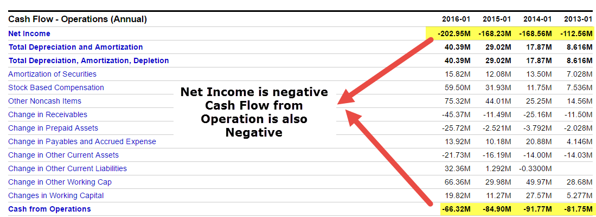

In today's complex financial landscape, understanding financial statements and cash flow is crucial for any investor or company executive. These elements provide critical insights into a company's financial health, operations, and future potential. Financial statements, including the balance sheet, income statement, and cash flow statement, serve as comprehensive tools for assessing a company's economic condition. Among these, the cash flow statement is particularly important as it highlights the cash generated from operating activities, which are the core business processes that drive revenue.

Operating activities are central to a company's financial activities and constitute a key component of its cash flow statement. They represent the daily business transactions that directly affect a company's ability to generate cash. This encompasses revenue-generating processes such as sales of goods and services, as well as expenditures on operating costs like salaries, rent, and utilities. The cash flow from operating activities can provide insights into a company's operational efficiency and liquidity, serving as a crucial indicator of financial stability and operational success.



In parallel with these traditional analytical tools, algorithmic trading, or algo trading, has emerged as a significant force in modern financial markets. Characterized by the use of computer algorithms to automate trading strategies, algo trading can execute orders at speeds and frequencies that are impossible for human traders. By leveraging sophisticated algorithms that analyze financial data, algo trading aims to maximize trading efficiency and profitability.

This article explores the intersection of operating activities and cash flow analysis with algorithmic trading. It delves into the reasons why these financial components are essential for developing effective algo trading strategies. The importance of financial statements in making informed trading decisions and how cash flow can impact these strategies will be thoroughly examined. By integrating insights from operating activities and cash flow analysis into algorithmic models, traders can potentially enhance their trading performance and make more informed decisions in the ever-evolving financial market.

## Table of Contents

## Understanding Financial Statements and Operating Activities

Financial statements are pivotal tools that provide comprehensive insights into a company's financial health. At the core, these documents consist of three primary components: the balance sheet, the income statement, and the cash flow statement. Each of these documents plays a distinct role in painting a complete picture of a company's financial status and operations.

The balance sheet offers a snapshot of a company's financial position at a specific point in time. It lists assets, liabilities, and shareholders' equity, providing investors with an overview of what the company owns and owes. The fundamental equation underpinning the balance sheet is:

$$
\text{Assets} = \text{Liabilities} + \text{Shareholders' Equity}
$$

The income statement, or profit and loss statement, details the company's revenues and expenses over a period, showcasing its ability to generate profit from its operational activities. This statement is crucial for understanding a company's efficiency in managing its costs and maximizing its income.

The cash flow statement provides a detailed analysis of cash inflows and outflows from operating, investing, and financing activities during a specific period. It is divided into three sections: operating activities, investing activities, and financing activities. The operating activities section is particularly important as it reflects the core business processes that generate revenue. This section adjusts net income for changes in working capital and non-cash items, helping investors understand how much cash is generated from the company's regular business operations.

Operating activities include transactions that affect net income, such as:

- Receipts from sales of goods and services.
- Payments to suppliers and employees.
- Interest payments and receipts.
- Tax payments.

Investors and traders analyze the cash flow from operating activities to assess a company's operational efficiency and its ability to maintain positive cash flow over time. Positive cash flow indicates that a company can sustain its operations without needing to secure external financing. Conversely, consistent negative cash flow might suggest potential [liquidity](/wiki/liquidity-risk-premium) issues, warranting further investigation.

Analyzing these components requires a blend of quantitative and qualitative assessment. Investors evaluate trends in revenue, profitability, and cash generation capabilities. For instance, a company might show growing revenues on its income statement while its cash flow statement reveals a declining trend in operating cash flow, suggesting possible issues in cash management or rising expenses that need addressing.

Python provides tools to analyze financial statements programmatically. For example, pandas and numpy can be used to manipulate financial data, generating insights and identifying trends. Here's a simple Python snippet demonstrating how these libraries can be used to calculate and analyze the operating cash flow ratio from financial data:

```python
import pandas as pd

# Example data for demonstration purposes
data = {
    'Net_Income': [50000, 53000, 55000],
    'Depreciation': [10000, 12000, 11000],
    'Changes_in_Working_Capital': [-5000, 2000, -3000]
}

df = pd.DataFrame(data)

df['Operating_Cash_Flow'] = df['Net_Income'] + df['Depreciation'] + df['Changes_in_Working_Capital']

print(df)
```

In conclusion, financial statements, especially the cash flow statement, are critical for investors and traders seeking to evaluate a company's financial health and operational performance. Understanding and utilizing these documents enables individuals to make informed decisions regarding investment opportunities and trading strategies.

## Cash Flow Analysis in Trading Strategies

Cash flow serves as a vital measure of a company's financial liquidity and overall health, providing insight into its ability to generate cash necessary for meeting operational expenses, investing in growth opportunities, and meeting debt obligations. For traders and investors, cash flow analysis is a strategic tool employed to forecast future cash flows and assess associated financial risks. There are two primary methods for analyzing cash flow: the direct and indirect methods, each with distinct implications for trading.

The direct method involves detailing actual cash transactions, primarily focusing on inflows and outflows from operating activities. This approach provides a granular view of a company’s cash flow by tracking individual cash receipts and payments, such as cash received from customers or cash paid to suppliers. Traders using this method gain detailed insights into the liquidity stemming directly from the company’s core operations, enabling precise predictions of immediate market behavior. For example, a sustained increase in cash inflows compared to outflows might indicate operational efficiency and financial stability, potentially signaling a buying opportunity for traders.

Conversely, the indirect method starts with net income and adjusts for non-cash transactions, changes in working capital, and other factors to derive the cash flow from operating activities. This method effectively links the income statement to the cash flow statement by accounting for transactions that affect reported earnings but do not directly impact cash. Traders utilizing the indirect method can assess how much a company's accounting practices, such as depreciation or changes in accounts receivable, affect the actual cash generated. Understanding these adjustments helps traders and investors anticipate potential discrepancies between reported earnings and actual cash flow, enabling more informed decision-making and risk assessment.

Understanding cash flow movements, particularly those related to operating activities, aids traders in predicting market trends. For example, a company consistently generating substantial positive cash flow from operations is likely to maintain financial health, sustaining investment and repaying debts without needing additional capital. Such a scenario often attracts investors, leading to increased demand for its stocks, and potentially driving up its market price.

Incorporating cash flow analysis into trading strategies allows market participants to address potential mismatches between reported profitability and actual cash liquidity. It enhances the analytical framework for forecasting market trends, mitigating increased market risk, and capitalizing on potential trading opportunities based on a company’s financial practices and liquidity trends.

## The Rise of Algorithmic Trading

Algorithmic trading has transformed the financial landscape by enabling the execution of trades at speeds and efficiencies that exceed human capabilities. At its core, [algorithmic trading](/wiki/algorithmic-trading) employs computer algorithms to automate decision-making processes, utilizing a broad spectrum of data to optimize trading strategies. This approach capitalizes on financial data, analytical models, and computation power to make split-second decisions, often resulting in improved trading outcomes and market liquidity.

The integration of financial data, particularly insights from cash flow analysis, is central to developing robust algorithmic trading models. These models rely on detailed financial statements to assess a company's financial health, with cash flow data playing a crucial role. Cash flow from operating activities provides an indication of the funds generated or consumed by a company's core business operations, offering valuable signals for trading algorithms. By analyzing patterns in cash flow, traders can identify trends and anomalies that may impact stock prices or trading volumes.

In constructing algorithmic models, algo traders utilize various components of financial statements. For instance, the cash flow statement helps in tracking the liquidity and solvency of a company, which are vital metrics when predicting market movements. Given the dynamic nature of financial markets, incorporating real-time financial data into algorithmic models allows for continuous adjustments, thus enhancing the adaptability and responsiveness of trading strategies.

To illustrate, consider a simplistic algorithm that leverages net cash flow from operating activities. Suppose a trader wants to define trading signals based on quarterly cash flow improvements. The algorithm may be designed as follows:

```python
def trading_signal(cash_flow_prev, cash_flow_current):
    if cash_flow_current > cash_flow_prev:
        return "buy"
    elif cash_flow_current < cash_flow_prev:
        return "sell"
    else:
        return "hold"
```

In this example, the algorithm evaluates changes in operating cash flow between two periods. An increase might trigger a buy signal, suggesting improved business performance, while a decrease might hint at potential issues, signaling a sell posture. Although simplistic, such models can be expanded with additional variables like market conditions or historical data to enhance predictive accuracy.

Overall, the rise of algorithmic trading has underscored the importance of financial data, with cash flow analysis serving as a pivotal tool for developing sophisticated trading algorithms. As technology and data accessibility continue to advance, the capacity to leverage detailed financial insights will prove increasingly vital for traders aiming to maintain a competitive edge in modern financial markets.

## Integrating Cash Flow Insights into Algo Trading Strategies

Integrating cash flow data into algorithmic trading strategies enhances decision-making by providing quantitative insights into a company's financial health. Cash flow trends can reveal significant shifts in liquidity, indicating potential trading opportunities or risks. When cash flow from operating activities increases, it often signals robust business performance, possibly influencing a positive market response. Conversely, declining cash flows may indicate financial distress, triggering negative market sentiment.

Algorithmic traders increasingly use these insights to craft precise trading algorithms. For example, by incorporating cash flow metrics into models, traders can develop strategies that account for liquidity fluctuations, directly impacting stock valuations. To illustrate, a trader might enhance a predictive model by adding a variable for "operating cash flow variability," aiming to predict stock price movements based on shifts in cash flow trends.

Consider a Python example that uses a simple regression model incorporating cash flow data to predict future stock prices:

```python
import pandas as pd
from sklearn.model_selection import train_test_split
from sklearn.linear_model import LinearRegression

# Sample dataset with stock prices and cash flow data
data = pd.DataFrame({
    'cash_flow_op': [500, 450, 600, 550, 700],  # Cash flow from operations
    'stock_price': [10, 9.5, 11, 10.5, 12]      # Corresponding stock prices
})

X = data[['cash_flow_op']]
y = data['stock_price']

X_train, X_test, y_train, y_test = train_test_split(X, y, test_size=0.2, random_state=42)

model = LinearRegression()
model.fit(X_train, y_train)

predictions = model.predict(X_test)
print("Predicted stock prices:", predictions)
```

This code provides a basic framework where cash flow data is used as a predictive feature for stock prices, demonstrating the potential of integrating such insights into algorithmic models.

Case studies highlight this approach's efficacy, such as a strategy leveraging cash flow analysis during earnings seasons. Traders monitoring cash flow trends ahead of earnings reports can preemptively adjust their positions, aligning with expected outcomes. By integrating these insights, algorithmic strategies benefit from real-time financial statement analysis, particularly focusing on operating activities, enhancing their capacity to forecast and capitalize on market movements effectively.

## Challenges and Considerations

In the ever-evolving domain of algorithmic trading, cash flow analysis stands as a crucial pillar. However, this utility is often accompanied by a series of challenges that traders and developers must navigate adeptly. One of the primary challenges is the interpretation of complex financial data inherent in financial statements. The nuanced details within these statements require sophisticated methodologies to distill actionable insights. This becomes particularly pertinent when such data is translated into algorithmic models.

Another significant challenge lies in the [volatility](/wiki/volatility-trading-strategies) of financial markets. Market conditions can shift rapidly, influenced by global events, policy changes, and economic indicators, all of which can impact cash flow projections and consequently, trading algorithms. Algorithms reliant on historical cash flow data may encounter limitations if the market dynamics differ markedly from those in the training data. This necessitates continuous model evaluation and recalibration to align algorithms with current market realities.

Data accuracy and timeliness are critical factors that further complicate the use of financial statement data in algo trading algorithms. Accurate data is imperative to make reliable predictions, yet financial data is subject to revisions and restatements. Moreover, the timeliness of data acquisition can impact decision-making processes. A delay in receiving updated financial statements can result in suboptimal trading decisions, underscoring the need for high-frequency data feeds and real-time data processing capabilities.

Algorithm updates are an ongoing requirement to respond to market changes. A static algorithm may quickly become obsolete in a dynamic market, highlighting the importance of iterative updates to maintain its efficacy. Implementing [machine learning](/wiki/machine-learning) models that can self-adjust based on new data inputs is one approach to manage this need for agility.

Balancing quantitative data analysis with qualitative market insights adds another layer of complexity to algorithm development. While quantitative data offers objective metrics, qualitative factors such as market sentiment, geopolitical events, and management decisions often play a pivotal role in market movements. Integrating these qualitative elements into quant-driven algorithms can enhance model robustness and provide a more holistic trading strategy.

In summary, while cash flow analysis serves as a valuable foundation for algorithmic trading, it requires a comprehensive approach to surmount the challenges of data interpretation, market volatility, data accuracy, and the integration of qualitative insights.

## Conclusion

Understanding and effectively leveraging financial statements, especially the cash flow from operating activities, plays a pivotal role in the realm of successful algorithmic trading. As algorithms automate and optimize trading decisions based on financial data, integrating accurate cash flow insights becomes increasingly critical. These insights help traders form a clearer picture of a company’s liquidity and operational efficiency, which are integral for forecasting market conditions and tailoring strategies accordingly.

Algorithmic traders enhance their strategies by utilizing cash flow data to make more informed predictions about market movements. By analyzing these cash flows, they can identify trends and patterns that may signal profitable trading opportunities or warn of potential risks. This approach not only refines trading models but also optimizes trading outcomes, enhancing both the speed and accuracy of trades in today’s rapid-paced financial environment.

The fusion of traditional financial analysis with modern algo trading techniques offers significant advantages. Traditional analysis provides a deep understanding of company fundamentals through financial statements, while algorithmic techniques apply this understanding to execute speedy and informed trades. The ability for algorithms to process and react to financial data in real-time furthers traders’ capacity to capitalize on market efficiencies. 

In this ever-evolving financial market, it is imperative for traders and investors to remain informed and adaptable. Constantly absorbing new trends and technological advancements allows them to maximize opportunities and mitigate risks effectively. This adaptability ensures that trading strategies remain robust in the face of fluctuating market dynamics and regulatory changes.

As algorithmic trading continues to grow, a solid understanding of cash flow and financial statements remains indispensable. The insights derived from financial data not only empower traders to improve their models but also instill confidence in their trading decisions. This comprehension underscores the importance of integrating meticulous financial analysis within technologically driven trading environments for sustained success.

## References & Further Reading

[1]: [Bergstra, J., Bardenet, R., Bengio, Y., & Kégl, B. (2011). "Algorithms for Hyper-Parameter Optimization."](https://papers.nips.cc/paper/4443-algorithms-for-hyper-parameter-optimization) Advances in Neural Information Processing Systems 24.

[2]: ["Advances in Financial Machine Learning"](https://www.amazon.com/Advances-Financial-Machine-Learning-Marcos/dp/1119482089) by Marcos Lopez de Prado

[3]: ["Evidence-Based Technical Analysis: Applying the Scientific Method and Statistical Inference to Trading Signals"](https://www.amazon.com/Evidence-Based-Technical-Analysis-Scientific-Statistical/dp/0470008741) by David Aronson

[4]: ["Machine Learning for Algorithmic Trading"](https://github.com/PacktPublishing/Machine-Learning-for-Algorithmic-Trading-Second-Edition) by Stefan Jansen

[5]: ["Quantitative Trading: How to Build Your Own Algorithmic Trading Business"](https://books.google.com/books/about/Quantitative_Trading.html?id=j70yEAAAQBAJ) by Ernest P. Chan