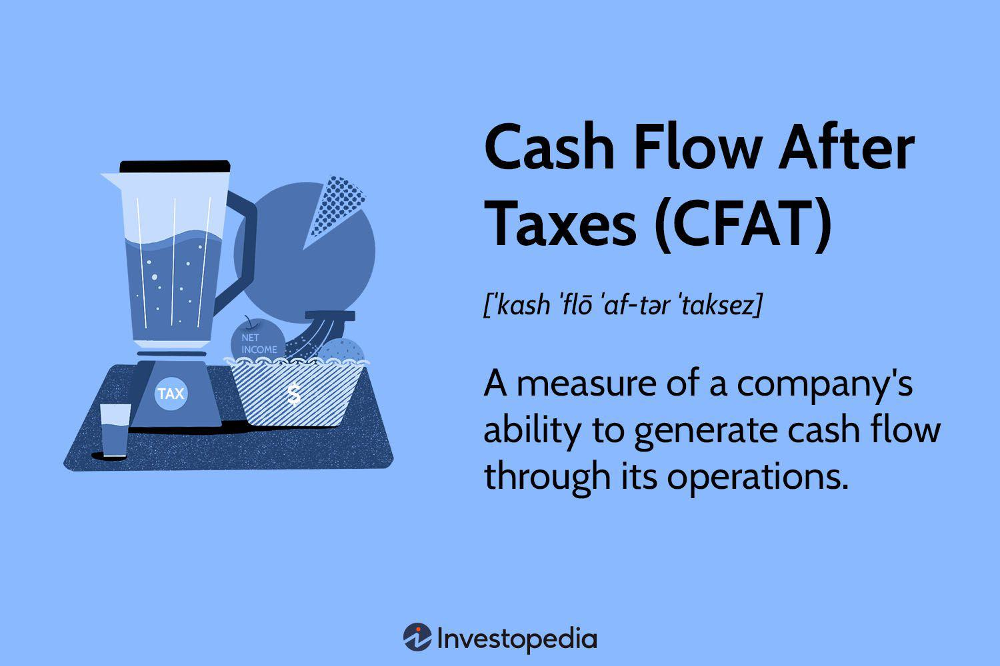

Cash flow after taxes (CFAT) is a crucial metric in financial analysis that represents the net cash a company generates after accounting for tax liabilities. It offers a clearer picture of a company's financial health by evaluating the real cash generated from operations after settling taxes. Calculating CFAT involves adjusting net income by adding back non-cash expenses such as depreciation, while subtracting taxes paid. This metric is vital for understanding a company’s ability to sustain operations, invest in growth, and meet obligations. Analysts and investors often use CFAT to gauge the actual cash-generating efficiency of a business beyond just profit figures.

As financial markets evolve, algorithmic trading has gained prominence due to its ability to process vast amounts of data at high speeds. Algorithmic trading involves using pre-set rules and methods executed through computer programs to make trading decisions. Its growing importance lies in its advantages of speed, precision, and the ability to execute complex strategies in real-time. This has become a cornerstone in modern financial markets, with algorithms handling a significant portion of trades executed globally.

The intersection of CFAT and algorithmic trading offers a new dimension to investment strategies. Integrating cash flow metrics into trading algorithms can enhance decision-making processes, allowing traders to consider the financial health of companies in their trading strategies. This article focuses on exploring this connection, aiming to unravel how CFAT can influence and potentially improve the outcomes of algorithmic trading strategies.

The objective of this article is to understand the impact of CFAT on decision-making within the context of algorithmic trading. By analyzing how CFAT can be incorporated into algorithms, traders and financial analysts can optimize their strategies, balancing financial metrics with trading efficiencies.

The article is structured as follows: it starts by providing a detailed understanding of CFAT and its calculation. It then discusses the role of CFAT in financial analysis, followed by an overview of algorithmic trading and its benefits. The core part of the article examines how CFAT can be leveraged in algorithmic trading strategies, exploring real-world examples and potential challenges. Finally, it concludes with an analysis of future trends and developments in the integration of CFAT into trading algorithms.

## Table of Contents

## Understanding Cash Flow After Taxes (CFAT)

Cash Flow After Taxes (CFAT) is a financial metric that represents the amount of cash generated by a company's operations after accounting for tax payments. CFAT serves as a critical indicator of a company’s financial health and ability to sustain its operations over the long term. 

### Definition and Calculation

CFAT essentially measures the cash retained by a company from its operating activities once all tax obligations have been met. The formula to calculate CFAT is generally expressed as:

$$
\text{CFAT} = \text{Net Income} + \text{Depreciation} - \text{Taxes Paid}
$$

- **Net Income**: This is the profit a company makes after deducting all expenses, including operating costs, interest, and taxes, from total revenue.
- **Depreciation**: Since depreciation is a non-cash expense, it is added back to the net income. It allocates the cost of tangible assets over their useful lives and provides a more accurate reflection of business expenses in financial reporting.
- **Taxes Paid**: These are the actual cash outflows for tax obligations, which need to be subtracted to reflect the net cash available after taxes.

### Importance of CFAT

The primary importance of CFAT lies in its ability to evaluate the sustainability of a company’s operations. By focusing on cash flow rather than accounting profits, CFAT provides a clearer view of a company’s [liquidity](/wiki/liquidity-risk-premium) and potential for growth and expansion. High CFAT indicates that a company has sufficient cash to reinvest in its business, pay dividends, or reduce debt, which is crucial for maintaining financial stability and competitive advantage.

For instance, a positive and substantial CFAT allows a company to navigate financial challenges, support continuous operations, and invest in new opportunities without the need for external financing. It also signals a company's creditworthiness to lenders and investors.

### Scenarios for CFAT Analysis

CFAT analysis becomes particularly crucial for investors and financial analysts in various scenarios:

1. **Investment Evaluation**: Investors use CFAT to assess the cash-generating ability of companies, which is a vital consideration in evaluating potential investment opportunities. It helps in determining the company's valuation and future profitability prospects.

2. **Comparative Analysis**: Analysts perform cross-sectional and temporal CFAT analyses to compare the financial health of companies within the same industry or over different fiscal periods. This aids in identifying operational efficiencies or discrepancies.

3. **Risk Assessment**: By examining CFAT, analysts can identify potential red flags in a company’s cash flow that may indicate financial instability or liquidity issues, despite seemingly positive net income figures.

4. **Strategic Decision Making**: Companies utilize CFAT data to make informed strategic decisions, such as capacity expansion, cost management, and optimization of tax strategies.

Understanding CFAT is integral to comprehensively assessing a company's financial performance and long-term viability, thus serving as a key metric for stakeholders aiming to make insightful financial analyses and decisions.

## Financial Analysis Using CFAT

Cash Flow After Taxes (CFAT) is vital for assessing company performance within financial analysis. Its significance arises from its ability to provide a clear picture of a company's operational efficiency and financial stability by accounting for after-tax cash flows. Unlike net income, which includes non-cash items, CFAT focuses strictly on cash movements, offering a genuine reflection of a company's liquidity and capacity to fund operations, pay debt, and invest in growth.

**Interpreting CFAT Metrics**

Interpreting CFAT requires analyzing it in conjunction with other financial indicators. CFAT can be effectively compared to capital expenditures (CapEx) to assess free cash flow (FCF), which indicates the amount of cash a company can generate after laying out money to maintain or expand its asset base. The formula for FCF is:

$$
\text{FCF} = \text{CFAT} - \text{CapEx}
$$

This metric is crucial for investors seeking to understand a company's ability to generate additional revenue and return value to shareholders. Additionally, CFAT can be compared to net income to gauge the tax efficiency and operational cash flow generation capability of the enterprise.

**CFAT in Strategic Decision-Making and Risk Assessment**

CFAT plays a crucial role in strategic decision-making, risk assessment, and investment analysis. For instance, higher CFAT figures indicate robust cash generation, which can support strategic initiatives such as mergers and acquisitions (M&A), research and development (R&D), and market expansion. A positive trend in CFAT can also signal to investors that a company is managing its tax liabilities effectively, preserving more cash for reinvestment.

In terms of risk assessment, CFAT is a key indicator in credit analysis. It helps in determining a company's ability to meet its debts and other obligations. Lenders and investors often look at CFAT when evaluating the risk profile of a company, as it offers insight into financial resilience under various tax scenarios and economic conditions.

**Industries and Examples**

Certain industries, particularly those involving high CapEx such as manufacturing and utilities, heavily rely on CFAT for financial analysis. For instance, utility companies often use CFAT to ensure they can continue operations and fund infrastructural projects amidst heavy tax burdens and regulatory requirements.

A real-world example is the technology sector, where companies like Apple Inc. are known for maintaining high levels of CFAT. Apple's strong CFAT has enabled it to invest heavily in innovation while providing significant returns to shareholders in the form of dividends and share buybacks, highlighting CFAT's role in sustaining long-term corporate strategies and investor confidence.

In conclusion, CFAT stands as a prominent indicator in financial analysis due to its ability to reveal genuine cash positions; aiding in strategic planning, risk management, and investment evaluation across various industries.

 to Algorithmic Trading

Algorithmic trading, often referred to as algo trading, involves the use of computer algorithms to automate trading decisions in financial markets. These algorithms are programmed to execute trades based on pre-defined criteria such as timing, price, or quantity, thus eliminating the need for human intervention. By leveraging computational power and sophisticated mathematical models, [algorithmic trading](/wiki/algorithmic-trading) aims to identify optimal trading opportunities with speed and precision that are unattainable through manual trading.

Technological advancements have played a pivotal role in the growth of algorithmic trading. High-frequency trading ([HFT](/wiki/high-frequency-trading-strategies)), a subset of algorithmic trading, operates at exceptionally high speeds, capitalizing on minute price discrepancies that may exist for only fractions of a second. The development of fast and reliable communication networks, such as fiber optics and microwave transmission systems, has significantly contributed to the capabilities of HFT. Moreover, advancements in processor speeds and improvements in [machine learning](/wiki/machine-learning) and [artificial intelligence](/wiki/ai-artificial-intelligence) (AI) have further enhanced the decision-making processes within trading algorithms.

The key benefits of algorithmic trading are speed, accuracy, and efficiency. Algorithms can process complex calculations in milliseconds and execute trades faster than any human trader, often minimizing the impact of price slippage. Accuracy is improved as algorithms adhere strictly to preset trading strategies, reducing the risk of human errors and emotional decision-making. Efficiency arises from the ability to manage vast volumes of data and execute trades simultaneously across multiple markets and exchanges.

Various strategies are employed in algorithmic trading, each designed to exploit different market conditions and objectives. Some of the common strategies include:

1. **Trend Following**: These algorithms are designed to identify and capitalize on market trends by analyzing historical data patterns and price movements. They typically involve technical indicators such as moving averages or momentum oscillators.

2. **Arbitrage**: Algorithms in this category seek to exploit price discrepancies between correlated securities or between the same security listed on different exchanges. This can include statistical arbitrage, where patterns are identified through statistical methods.

3. **Market Making**: This strategy involves placing simultaneous buy and sell limit orders to profit from the bid-ask spread. Market-making algorithms provide liquidity to the market and earn a profit from the difference between the buying and selling prices.

4. **Mean Reversion**: These algorithms are based on the belief that prices will revert to their historical averages over time. They analyze deviations from the average and execute trades when prices are deemed to be overbought or oversold.

5. **Machine Learning-Based Strategies**: These involve using AI and machine learning techniques to predict future price movements based on historical data and other input variables. Machine learning models can adapt to new data, improving their accuracy over time.

In conclusion, algorithmic trading has transformed the landscape of modern financial markets by offering unparalleled speed, accuracy, and efficiency. The continuous evolution of technology and computational algorithms ensures that algorithmic trading will remain an integral part of the financial industry, continually adapting to new data sources and analytical methods.

## The Role of CFAT in Algo Trading Strategies

Cash Flow After Taxes (CFAT) can be a valuable component in algorithmic trading strategies, as it provides a clear picture of a company's financial health by reflecting net operational cash flows after accounting for taxes. This figure can be integrated into trading algorithms to enhance decision-making quality and improve predictive accuracy.

**Integration of CFAT into Algorithmic Trading Strategies**

Integrating CFAT into algorithmic trading can be achieved by inputting this metric as a financial health indicator to algorithms that assess company performance and predict stock price movements. An algorithm might combine CFAT with other financial metrics, such as return on equity (ROE) and earnings before interest and taxes (EBIT), to enhance the model's robustness in evaluating a company's sustainability and profitability.

**Advantages of Using CFAT in Trading Algorithms**

1. **Informed Decision-Making**: Including CFAT data helps traders understand whether a company's operational cash flow is sufficient to cover tax liabilities, providing an insight into the company’s ability to generate free cash flow.

2. **Improved Risk Assessment**: By incorporating tax-adjusted cash flow figures, algorithms can better assess the financial resilience of companies during times of economic uncertainty, thus refining risk management models.

3. **Predictive Accuracy**: CFAT improves the predictive capability of algorithms by offering a comprehensive view of a firm's financial condition, aiding in distinguishing sustainable companies from those masking poor performance through non-operational means.

**Examples and Case Studies**

While specific case studies focusing exclusively on CFAT’s impact on algo trading are limited, general approaches can demonstrate its potential benefits. For instance, quantitative hedge funds often use net operating cash flow measurements adjusted for tax impacts as part of their [fundamental analysis](/wiki/fundamental-analysis) frameworks. This enables them to detect undervalued stocks and anticipate market fades, particularly in industries where cash flow cyclicality significantly impacts valuation, such as energy or capital-intensive manufacturing.

**Challenges and Limitations**

1. **Data Quality**: Accurate incorporation of CFAT into trading algorithms requires high-quality, timely financial data. Inconsistencies or delays in financial reporting can distort CFAT calculations, leading to erroneous trading signals.

2. **Market Volatility**: Algorithms must account for the impact of rapid market changes or macroeconomic events on cash flow predictions, which might not always be directly related to a company's operational performance.

3. **Regulatory Constraints**: Changes in tax laws can affect CFAT calculations dramatically, necessitating algorithms to adapt quickly to ensure continued accuracy and relevance.

4. **Over-Reliance**: Over-dependence on CFAT as a solitary metric may overlook other critical aspects of financial health, such as capital structure or liquidity, potentially skewing trading strategies.

In conclusion, while CFAT can significantly enrich algorithmic trading strategies, its integration requires careful consideration of data quality, market conditions, and overarching economic factors to fully leverage its potential benefits.

## Challenges and Considerations

Aligning Cash Flow After Taxes (CFAT) data with real-time trading algorithms presents a unique set of challenges that necessitates careful consideration and strategic planning.

One of the primary challenges is ensuring the availability of high-quality data. CFAT is derived from a company's financial statements, specifically focusing on net income, depreciation, and tax payments. These components traditionally undergo revisions and adjustments before being finalized, possibly affecting the CFAT values used in trading models. Thus, traders and financial analysts need accurate, up-to-date financial data to make informed decisions. Inaccuracies or delays in data can lead to suboptimal trading actions. Developing robust analytical models capable of processing such dynamic data inputs is essential for maintaining the integrity of trading algorithms.

Market [volatility](/wiki/volatility-trading-strategies) further complicates the integration of CFAT data into trading algorithms. Volatile market conditions may cause significant fluctuations in cash flows, impacting CFAT metrics. Algorithms relying heavily on CFAT need to account for these fluctuations to avoid making poor trading decisions. Volatility often demands real-time adjustments and recalibrations of algorithms, which can complicate their implementation and maintenance.

Regulatory changes can also influence the effective use of CFAT in algorithmic trading. Amendments to tax laws, accounting standards, or financial reporting requirements can impact the calculation of CFAT. Such regulatory shifts necessitate continual updates to the algorithms and models employed in trading, ensuring compliance and accuracy.

An over-reliance on CFAT in trading decisions can also pose risks. CFAT is a vital financial metric, but it may not account for all elements relevant to a company's financial health or market circumstances. Relying solely on CFAT may neglect other indicators such as earnings before interest, taxes, depreciation, and amortization (EBITDA), return on equity (ROE), or market sentiment factors that could significantly impact trading outcomes.

Therefore, integrating CFAT into algorithmic trading requires balancing its insights with other financial indicators and metrics. Real-time trading algorithms should be equipped with mechanisms to adjust for data inaccuracies, market volatility, and regulatory updates while ensuring a comprehensive evaluation of financial health beyond just CFAT.

## Future Trends in CFAT and Algo Trading

Algorithmic trading, characterized by automated, rule-based decision-making processes, is increasingly relying on intricate financial metrics like Cash Flow After Taxes (CFAT) to refine strategies. As the financial landscape evolves, several trends and innovations are poised to enhance the integration of CFAT in trading algorithms.

### Emerging Technologies and Innovations

The rise of machine learning and artificial intelligence (AI) is transforming how financial data is analyzed and utilized in trading strategies. These technologies enable the processing of vast amounts of real-time data, which can include CFAT information, to identify patterns and opportunities that are not immediately visible through traditional analysis. Machine learning algorithms can be trained to recognize the impact of CFAT on stock price movements, enabling more nuanced strategies that capitalize on subtle market signals.

Additionally, advancements in natural language processing (NLP) allow traders to parse financial reports and news articles, extracting relevant CFAT data and other financial indicators that inform trading decisions. This automated extraction and analysis streamline the incorporation of CFAT into algorithmic models, enhancing their predictive accuracy.

The utilization of cloud computing and big data analytics also facilitates the handling of large volumes of CFAT data. These technologies provide scalable computing resources, enabling real-time processing and analysis, which is crucial for the dynamic nature of algorithmic trading.

### Potential Shifts in Regulatory Landscapes

As algorithmic trading practices gain complexity, regulatory bodies are increasingly scrutinizing how financial metrics, such as CFAT, are used. There is potential for new regulations that aim to ensure transparency and fairness in the use of financial data within trading algorithms. These regulations may mandate more comprehensive disclosure of how CFAT data impacts trading decisions, and set standards for data accuracy and quality.

Moreover, there is a growing emphasis on the ethical use of AI in financial markets, which might lead to regulations governing the integration of automated systems that utilize CFAT. Algorithmic trading firms will need to adapt to these changes by implementing compliance measures and ensuring their algorithms adhere to emerging standards.

### New Data Sources and Analytical Techniques

The future of CFAT in algorithmic trading will likely involve the integration of [alternative data](/wiki/best-alternative-data) sources. These include satellite imagery, social media sentiment analysis, and IoT sensor data, which can provide supplementary insights into a company's operations and financial health. For instance, satellite data can offer real-time insights into manufacturing outputs, providing context for CFAT figures.

Furthermore, advanced analytical techniques, such as [deep learning](/wiki/deep-learning), can uncover complex relationships between CFAT and other financial metrics. These techniques can model nonlinear interactions and produce trading signals that are more robust to market fluctuations. Similarly, the use of ensemble methods, which combine multiple predictive models, can enhance the reliability of forecasts that incorporate CFAT data.

In conclusion, the confluence of technological innovations, evolving regulatory frameworks, and new data sources is driving the future integration of CFAT into algorithmic trading strategies. These developments promise to enhance the sophistication and effectiveness of trading algorithms, while also necessitating careful consideration of ethical and regulatory implications. As financial markets continue to advance, the role of CFAT in algo trading is set to become increasingly significant, offering traders new avenues for optimizing their strategies.

## Conclusion

In analyzing cash flow after taxes (CFAT) within the context of algorithmic trading, this article underscores the multifaceted benefits and certain challenges associated with incorporating CFAT into trading strategies. CFAT provides a comprehensive measure of a company's financial health, which can significantly enhance the precision and effectiveness of algorithmic trading by offering insights rooted in a company's actual cash movements post-tax obligations.

One of the central benefits of integrating CFAT into algo trading lies in its ability to provide nuanced insights into a company’s operational sustainability, which is instrumental in refining trading algorithms. This financial metric aids in differentiating between companies with similar earnings but differing cash flow health, thus facilitating more informed trading decisions. However, challenges persist, primarily in ensuring the alignment of CFAT, which is fundamentally a backward-looking metric, with the forward-oriented nature of trading algorithms. This requires robust models that can dynamically integrate CFAT with other real-time data inputs.

Financial analysts and traders are encouraged to incorporate CFAT insights into their trading models to optimize decision-making processes. The inclusion of such a metric allows for a more comprehensive assessment, potentially offering a competitive edge by highlighting undervalued opportunities or risk exposures.

Looking forward, as financial landscapes continue to evolve, the role of metrics such as CFAT in trading strategies is expected to grow. Advancements in technology, including machine learning and big data analytics, hold promise for enhancing CFAT analysis, thereby empowering trading strategies with more detailed and actionable insights. Furthermore, possible shifts in regulatory landscapes might also influence how CFAT is utilized, underscoring the necessity for continuous adaptation of financial analysis practices in trading.

## References & Further Reading

[1]: Bergstra, J., Bardenet, R., Bengio, Y., & Kégl, B. (2011). ["Algorithms for Hyper-Parameter Optimization."](https://dl.acm.org/doi/10.5555/2986459.2986743) Advances in Neural Information Processing Systems 24.

[2]: ["Advances in Financial Machine Learning"](https://www.amazon.com/Advances-Financial-Machine-Learning-Marcos/dp/1119482089) by Marcos Lopez de Prado

[3]: ["Evidence-Based Technical Analysis: Applying the Scientific Method and Statistical Inference to Trading Signals"](https://www.amazon.com/Evidence-Based-Technical-Analysis-Scientific-Statistical/dp/0470008741) by David Aronson

[4]: ["Machine Learning for Algorithmic Trading"](https://github.com/stefan-jansen/machine-learning-for-trading) by Stefan Jansen

[5]: ["Quantitative Trading: How to Build Your Own Algorithmic Trading Business"](https://www.amazon.com/Quantitative-Trading-Build-Algorithmic-Business/dp/1119800064) by Ernest P. Chan