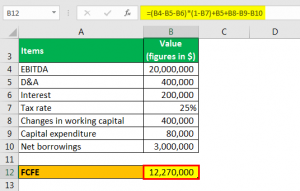

In the rapidly evolving world of finance, understanding key terms and concepts is crucial for investors, analysts, and business leaders alike. The financial ecosystem is characterized by its dynamic nature, where metrics such as Earnings Before Interest, Taxes, Depreciation, and Amortization (EBITDA) and cash flow play essential roles in determining a company's financial health and operational efficiency. These metrics serve as foundational tools for evaluating the profitability and liquidity of a business, thereby guiding strategic decision-making processes.

This article aims to demystify the relationship between EBITDA, cash flow, and financial strategies within the spectrum of algorithmic trading. As algorithmic trading becomes increasingly prevalent in modern finance, the need to leverage financial data for automated decision-making has never been more pronounced. By understanding how these financial metrics are interlinked, stakeholders can make more informed decisions regarding investment strategies and risk management.



Algorithmic trading, which involves using computer algorithms to execute financial transactions at high speeds, often depends on real-time data provided by metrics like EBITDA and cash flow. This integration allows for timely exploitation of market opportunities, enhancing both risk management and profitability. Through an exploration of these concepts, the article will highlight the significance of marrying traditional financial analysis with advanced technological tools.

Ultimately, the goal is to provide a comprehensive understanding of these concepts to better navigate the complexities of the financial markets. By mastering the balance between essential financial metrics and algorithmic trading strategies, financial professionals can enhance their ability to make strategic decisions and achieve sustainable success in a competitive financial landscape.

## Table of Contents

## Understanding EBITDA: A Financial Performance Indicator

EBITDA, or Earnings Before Interest, Taxes, Depreciation, and Amortization, is a widely used financial metric that measures a company's financial performance by focusing on its core operations. It excludes factors related to the company's capital structure and tax environment, thus providing a clearer view of operational profitability.

To calculate EBITDA, we add back interest, taxes, depreciation, and amortization expenses to the net income:

$$
EBITDA = \text{Net Income} + \text{Interest} + \text{Taxes} + \text{Depreciation} + \text{Amortization}
$$

This approach standardizes the evaluation process, particularly when comparing companies across the same industry. By isolating operating performance, it allows analysts and investors to better understand a company's operational efficiency irrespective of its tax jurisdiction, financial leverage, or asset base.

The advantages of EBITDA include its simplicity and focus on operational profitability. Unlike net income, which can be influenced by non-operational factors, EBITDA provides a purer metric of a company's core business activities. This can make it easier to compare companies that operate globally or that might have different financing or tax strategies.

However, EBITDA is not without flaws. It may obscure critical financial details by ignoring capital expenditures, changes in working capital, and other cash flow considerations. Companies with significant debt or capital expenditure needs might look financially healthier than they actually are when evaluated solely through EBITDA. This can be misleading, as it does not reflect the cash available for reinvestment in the business or for paying down debt.

Despite these limitations, EBITDA remains a popular tool for analysts when assessing companies with similar profiles or when conducting preliminary financial health checks. By serving as a proxy for operating cash flow, albeit imperfect, EBITDA helps in evaluating operational performance without the distortions created by varying capital structures and tax strategies. This makes it valuable in mergers and acquisitions, where understanding operational value is crucial, and when assessing companies in capital-intensive industries where depreciation and amortization can significantly impact profit figures.

In summary, while EBITDA is a useful metric for assessing a company's operational performance, it should be used alongside other financial metrics to gain a comprehensive understanding of a company's financial health. Balancing EBITDA with cash flow analysis and other indicators can lead to more informed investment decisions.

## Cash Flow: The Lifeblood of Business Operations

Cash flow is a fundamental aspect of business operations, representing the net amount of cash that flows in and out of a company. It is crucial for maintaining [liquidity](/wiki/liquidity-risk-premium) and ensuring that a business can meet its financial obligations timely. Unlike Earnings Before Interest, Taxes, Depreciation, and Amortization (EBITDA), which provides an abstract measure of profitability by excluding several non-cash expenses, cash flow offers a more explicit representation of a company's financial health by capturing real cash transactions.

There are three primary types of cash flow: operating, investing, and financing. Each plays a distinct role in evaluating a company's financial stability. Operating cash flow refers to the cash generated from a company's regular business operations. This metric is vital as it indicates whether a company can generate sufficient cash to maintain and grow its operations without resorting to external financing. It is calculated as:

$$
\text{Operating Cash Flow} = \text{Net Income} + \text{Non-Cash Expenses} - \text{Changes in Working Capital}
$$

Investing cash flow relates to cash used and received from the company's investment activities, including purchasing and selling assets such as property, equipment, or marketable securities. Negative cash flow in this category might suggest significant capital investment, which could be a positive indicator of future growth, while positive cash flow could imply asset sales.

Financing cash flow encompasses the cash transactions related to raising capital and returning capital to shareholders. This type includes actions like issuing or repurchasing stocks and bonds and paying dividends. Positive financing cash flow might suggest that a company is raising funds to support growth, while negative cash flow could imply returning value to shareholders or paying down debt.

Effective cash flow management is essential for business sustainability as it involves monitoring, analyzing, and optimizing cash inflows and outflows to ensure continued liquidity. Companies leverage cash flow data to develop strategies that support sustainable growth. For instance, maintaining a stable operating cash flow can help in forecasting long-term profitability and resource allocation.

Optimizing cash flow management involves managing payment terms, invoicing processes, and investment activities to align with a company's strategic goals. Efficient cash flow management helps businesses avoid liquidity crises, reduces the cost of capital, and enhances the company's ability to invest in growth opportunities.

In summary, recognizing the importance of cash flow goes beyond tracking liquidity; it involves strategic financial management to sustain business growth and stability. Understanding and effectively managing different components of cash flow enables businesses to make informed decisions, ensuring that they can navigate through various financial cycles and market conditions.

## Algorithmic Trading: Integrating Financial Metrics

Algorithmic trading is a method of executing orders using automated, pre-programmed strategies. It leverages computer algorithms to transact in financial markets at speeds and volumes that surpass human capabilities. These systems are driven by models that consider various financial metrics, including Earnings Before Interest, Taxes, Depreciation, and Amortization (EBITDA) and cash flow, to gauge market conditions and optimize trading activities.

**Mechanics of Algorithmic Trading**

Algorithmic trading operates on a set of well-defined algorithms that process financial data and execute trades based on predetermined criteria. These algorithms can assess vast amounts of market data in real-time, enabling traders to act on small price discrepancies or market inefficiencies. By employing statistical models and quantitative analysis, [algorithmic trading](/wiki/algorithmic-trading) systems can forecast price movements and execute trades with precise timing.

A typical algorithm might involve retrieving live market data, running a model to predict future prices, and placing trade orders when certain conditions are met. For example, traders might use moving averages or more complex indicators like Bollinger Bands to make decisions. Python, a popular programming language for financial analysis, is often used for developing these algorithms due to its robust data-handling capabilities. Here is a simple Python example for a moving average crossover strategy:

```python
import pandas as pd

def moving_average_crossover(data, short_window=40, long_window=100):
    data['short_ma'] = data['Close'].rolling(window=short_window, min_periods=1, center=False).mean()
    data['long_ma'] = data['Close'].rolling(window=long_window, min_periods=1, center=False).mean()

    data['signal'] = 0
    data['signal'][short_window:] = np.where(data['short_ma'][short_window:] > data['long_ma'][short_window:], 1, -1)

    data['positions'] = data['signal'].diff()
    return data

# Example usage
# data should be a DataFrame with a 'Close' column
# result = moving_average_crossover(data)
```

**Influence and Integration of Financial Metrics**

Algorithmic trading has a significant influence on modern financial markets, accounting for a large portion of daily trading volumes. It utilizes financial metrics such as EBITDA and cash flow not only for analyzing a company's operational efficiency but also for making informed trading decisions. These metrics serve as indicators of a company's valuation and liquidity position, which are critical in designing trading strategies that minimize risk and maximize profits.

EBITDA, for example, is used to compare the profitability of different companies within the same sector, providing a normalized view that is independent of tax regimes and capital structures. Cash flow, on the other hand, offers insights into the actual liquidity available, highlighting the company's ability to sustain operations and manage short-term obligations.

**Risk Management and Profitability**

Algorithmic trading strategies are designed to manage risk while optimizing returns. By incorporating financial metrics into trading algorithms, traders can set thresholds that trigger automated responses to mitigate potential losses. For instance, an algorithm might be programmed to sell a stock if the free cash flow indicates deteriorating liquidity conditions.

Furthermore, algorithmic trading systems continuously monitor and adjust to real-time market dynamics, enabling them to capitalize on emerging opportunities efficiently. This capability not only enhances profitability but also ensures alignment with evolving market trends.

In conclusion, integrating financial metrics such as EBITDA and cash flow into algorithmic trading exemplifies the fusion of [fundamental analysis](/wiki/fundamental-analysis) with advanced technology. This approach enhances decision-making processes, allowing traders to execute strategies that are both intelligent and adaptive to market conditions.

## The Intersection of EBITDA, Cash Flow, and Algorithmic Trading

The intersection of EBITDA, cash flow, and algorithmic trading is pivotal for understanding the dynamics of modern financial markets. Algorithmic trading utilizes sophisticated computer algorithms to execute trades at speeds and frequencies that are unachievable by human traders. These algorithms often incorporate financial metrics such as EBITDA (Earnings Before Interest, Taxes, Depreciation, and Amortization) and cash flow to assess the viability and attractiveness of investment opportunities.

EBITDA serves as a performance indicator by providing insights into a company's operating profitability, making it a valuable metric for algorithms that aim to forecast future performance trends. For instance, a stable or increasing EBITDA might signal a well-performing company, worthy of investment. On the other hand, cash flow analysis offers a clear picture of the liquidity and financial stability of an organization. Algorithms analyzing cash flow movements can detect patterns indicating financial distress or growth potential, which can be exploited for strategic trades.

Integrating these financial metrics allows algorithmic trading systems to make real-time, data-driven decisions. For example, a trading algorithm might flag a company with a high EBITDA but negative cash flow as potentially over-leveraged, influencing a sell decision. Conversely, positive cash flow, combined with healthy EBITDA, might trigger a buy decision, signaling operational efficiency and financial robustness.

While the benefits of algorithmic trading are substantial, there are several challenges and ethical considerations. Algorithms react instantaneously to changes in financial metrics, which can lead to market instability during rapid fluctuations if risk management strategies are not appropriately implemented. Furthermore, the reliance on historical data makes algorithms susceptible to anomalies and black swan events, which can lead to substantial financial losses.

Ethically, algorithmic trading raises concerns about fairness and market manipulation, as not all investors have access to the same technology or information. The use of such technology also necessitates the development of stringent oversight mechanisms to ensure that the deployment of algorithms adheres to regulatory standards and ethical norms.

In summary, the synthesis of EBITDA, cash flow, and algorithmic trading allows for enhanced decision-making capabilities within the financial markets. By leveraging these financial metrics, algorithmic systems provide a competitive advantage in identifying investment opportunities. However, to harness these benefits safely, it is essential to incorporate robust risk management strategies and ethical oversight to mitigate potential drawbacks and market disruptions.

## Conclusion

EBITDA, cash flow, and algorithmic trading are pivotal components in today's financial landscape, each playing a unique role in analyzing and executing investment strategies. The integration of traditional financial metrics like EBITDA and cash flow with technologies used in algorithmic trading provides significant opportunities and challenges for financial stakeholders. Traditional metrics such as EBITDA give valuable insights into a company's operational profitability by excluding external influences such as interest, taxes, depreciation, and amortization. Cash flow, on the other hand, offers an accurate representation of the actual liquidity available to a business, which is essential for maintaining operational stability and meeting immediate obligations.

Algorithmic trading, characterized by its ability to process vast amounts of financial data swiftly, leverages these metrics to identify profitable trading opportunities and optimize risk management strategies. These systems utilize sophisticated algorithms to process changes in financial metrics, which allows for rapid adjustments to trading strategies.

As markets evolve, it is crucial for individuals and businesses involved in finance to remain informed about these concepts. A comprehensive understanding of EBITDA, cash flow, and algorithmic trading enables more effective utilization of these tools, contributing to informed decision-making and strategic planning. The harmonious integration of financial analysis and algorithmic trading technologies can result in considerable competitive advantages, essential for sustainable success in the financial markets. Ultimately, mastering the balance between foundational financial analysis and technological innovations will be key in capitalizing on these opportunities.

## References & Further Reading

[1]: Bergstra, J., Bardenet, R., Bengio, Y., & Kégl, B. (2011). ["Algorithms for Hyper-Parameter Optimization."](https://dl.acm.org/doi/10.5555/2986459.2986743) Advances in Neural Information Processing Systems 24.

[2]: ["Advances in Financial Machine Learning"](https://books.google.com/books/about/Advances_in_Financial_Machine_Learning.html?id=oU9KDwAAQBAJ) by Marcos Lopez de Prado

[3]: ["Evidence-Based Technical Analysis: Applying the Scientific Method and Statistical Inference to Trading Signals"](https://www.amazon.com/Evidence-Based-Technical-Analysis-Scientific-Statistical/dp/0470008741) by David Aronson

[4]: ["Machine Learning for Algorithmic Trading"](https://github.com/stefan-jansen/machine-learning-for-trading) by Stefan Jansen

[5]: ["Quantitative Trading: How to Build Your Own Algorithmic Trading Business"](https://books.google.com/books/about/Quantitative_Trading.html?id=j70yEAAAQBAJ) by Ernest P. Chan