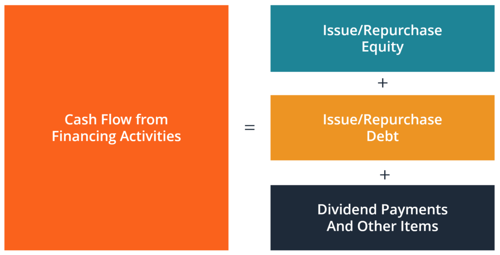

## Table of Contents

## What is cash flow from financing activities?

Cash flow from financing activities is the section of a company's cash flow statement that shows the net cash flows related to activities that affect the company's equity and debt. This includes transactions like issuing or buying back shares, paying dividends, and borrowing or repaying loans. It helps investors see how a company is funding its operations and growth, and how it's managing its capital structure.

For example, if a company issues new shares, it will show as a positive cash flow because the company is receiving money. On the other hand, if the company pays dividends or repays a loan, it will show as a negative cash flow because money is going out. By looking at this part of the cash flow statement, you can understand whether a company is raising money to grow or returning money to its investors.

## Why is it important to understand cash flow from financing activities?

Understanding cash flow from financing activities is important because it shows how a company manages its money in terms of borrowing, paying back loans, issuing stocks, and paying dividends. This part of the cash flow statement tells you if the company is getting money from investors or lenders, or if it's giving money back to them. By looking at this, you can see if the company is trying to grow by getting more money or if it's stable and returning money to its shareholders.

This information is crucial for investors because it helps them decide if the company is a good investment. If a company is always borrowing money, it might be risky because it has to pay back those loans. On the other hand, if a company is paying dividends regularly, it might be seen as more stable and less risky. Knowing how a company handles its financing can give you a better picture of its financial health and future plans.

## What are the common components of cash flow from financing activities?

Cash flow from financing activities includes money coming in and going out related to how a company manages its finances. The main parts are borrowing money and paying back loans. When a company takes out a loan, it gets money, so this shows up as a positive number in the cash flow statement. When it pays back the loan, it loses money, so this shows up as a negative number.

Another big part is the company's stock. If a company sells new shares to investors, it gets money, so this is also a positive number. But if the company buys back its own shares, it spends money, and this is a negative number. Paying dividends to shareholders is also included here. When a company pays dividends, it's giving money to its investors, so this is another negative number in the cash flow statement.

Understanding these parts helps people see if a company is trying to grow by getting more money or if it's returning money to its investors. It's important because it shows the financial health of the company and how it's planning for the future.

## How do you calculate cash flow from financing activities?

To calculate cash flow from financing activities, you need to look at all the money that comes in and goes out related to how a company manages its money. This includes money from borrowing, like when a company takes out a loan, and money from selling new shares to investors. These are positive numbers because the company is getting money. You add up all these positive numbers to find the total money coming in from financing activities.

On the other hand, you also need to look at money going out, like when a company pays back a loan or buys back its own shares. Paying dividends to shareholders is another example of money going out. These are negative numbers because the company is spending money. You add up all these negative numbers to find the total money going out from financing activities. To get the final cash flow from financing activities, you subtract the total money going out from the total money coming in. If the result is positive, it means the company got more money from financing activities than it spent. If it's negative, it means the company spent more money on financing activities than it got.

## Can you provide a basic formula for calculating cash flow from financing activities?

To calculate cash flow from financing activities, you need to add up all the money that comes into the company from financing sources and subtract all the money that goes out for financing activities. Money coming in includes things like taking out loans and selling new shares to investors. These are positive numbers because the company is getting money. Money going out includes paying back loans, buying back shares, and paying dividends to shareholders. These are negative numbers because the company is spending money.

The basic formula for cash flow from financing activities is: Cash Flow from Financing Activities = (Money In from Financing) - (Money Out for Financing). For example, if a company gets $100,000 from a new loan and $50,000 from selling new shares, that's $150,000 coming in. If it pays back $30,000 on a loan, buys back $20,000 worth of shares, and pays $10,000 in dividends, that's $60,000 going out. So, the cash flow from financing activities would be $150,000 - $60,000 = $90,000. This positive number means the company got more money from financing than it spent.

## What are examples of cash inflows in financing activities?

Cash inflows in financing activities happen when a company gets money from sources that help it manage its finances. One common way is when a company takes out a loan. For example, if a business needs money to grow, it might borrow from a bank. When the bank gives the company the loan money, this shows up as a cash inflow in the company's cash flow statement. Another way is when a company sells new shares to investors. If a company wants to raise money, it can sell parts of itself, called shares, to people who want to invest. When investors buy these shares, the money they pay goes into the company's cash flow as an inflow.

Another example of a cash inflow in financing activities is when a company issues bonds. Bonds are like IOUs that the company sells to investors, promising to pay them back with interest later. When investors buy these bonds, the money they pay for them becomes a cash inflow for the company. All these examples show how a company can get money from financing activities, which helps it grow or manage its operations.

## What are examples of cash outflows in financing activities?

Cash outflows in financing activities happen when a company spends money on things that affect its finances. One common example is when a company pays back a loan. If a business borrowed money from a bank, it has to pay it back later. When the company makes these payments, the money going out shows up as a cash outflow in its cash flow statement. Another example is when a company buys back its own shares. If a company has extra money and wants to reduce the number of shares it has, it can buy them back from investors. This spending also shows up as a cash outflow.

Paying dividends to shareholders is another example of a cash outflow in financing activities. When a company makes a profit, it can choose to share some of that money with its investors by paying them dividends. When the company sends this money to its shareholders, it becomes a cash outflow. All these examples show how a company can spend money on financing activities, which can affect its overall financial health and how it manages its money.

## How does issuing debt affect cash flow from financing activities?

When a company issues debt, like taking out a loan or selling bonds, it gets money. This money coming in is called a cash inflow in the financing activities section of the cash flow statement. It's a good thing for the company because it means they have more money to use for growing their business or paying for other things they need. For example, if a company borrows $1 million from a bank, that $1 million will show up as a positive number in the cash flow from financing activities.

On the other hand, when the company has to pay back the debt, it's a cash outflow. This means money is going out of the company, which shows up as a negative number in the cash flow statement. If the company pays back part of the loan or the interest on it, that money going out will be part of the cash flow from financing activities. So, issuing debt can increase cash flow when the money comes in, but it can also decrease it when the company has to pay it back.

## How does repurchasing company stock impact cash flow from financing activities?

When a company buys back its own stock, it's called a stock repurchase or share buyback. This action means the company is spending money to get its shares back from investors. When this happens, it shows up as a cash outflow in the financing activities part of the cash flow statement. This is because the money used to buy back the shares is going out of the company. For example, if a company spends $50,000 to buy back its shares, that $50,000 will be a negative number in the cash flow from financing activities.

Buying back shares can affect the company's cash flow in a big way. If a company uses a lot of money to buy back its stock, it might have less cash available for other things like growing the business or paying bills. This can be important for investors to know because it shows how the company is choosing to spend its money. If the cash outflow from buying back shares is big, it could mean the company has less money to use for other important activities.

## What role do dividends play in the calculation of cash flow from financing activities?

When a company pays dividends, it's giving money to its shareholders as a reward for owning part of the company. This payment is a cash outflow in the financing activities section of the cash flow statement. It means money is going out of the company, so it's shown as a negative number. For example, if a company pays $10,000 in dividends, that $10,000 will be subtracted from the total cash flow from financing activities.

Paying dividends can affect how much cash a company has left for other things. If a company pays out a lot of money in dividends, it might have less money to use for growing the business or paying off debts. This is important for investors to know because it shows how the company is choosing to use its money. A big cash outflow from dividends could mean the company has less money for other important activities.

## How can changes in financing activities reflect on a company's financial strategy?

Changes in financing activities can tell us a lot about a company's financial strategy. If a company is borrowing more money or selling new shares, it might be trying to grow. This means they need more money to do things like start new projects, buy new equipment, or expand their business. When a company gets money from loans or selling shares, it shows up as a positive number in the cash flow from financing activities. This can be a sign that the company is planning to invest in its future and believes it can make more money by growing.

On the other hand, if a company is paying back loans, buying back its own shares, or paying dividends, it might be trying to return money to its investors or reduce its debt. These actions show up as negative numbers in the cash flow from financing activities. A company doing this might be more focused on stability and giving money back to shareholders instead of growing. By looking at these changes, investors can understand if the company is trying to grow, stay stable, or maybe even cut back on its operations.

## What are advanced techniques for analyzing cash flow from financing activities for investment decisions?

One advanced technique for analyzing cash flow from financing activities is to look at trends over time. By comparing several years of cash flow statements, investors can see if a company is consistently borrowing more money, which might mean it's trying to grow quickly. Or, if a company is paying back more loans and buying back shares, it might be focusing on returning money to investors and becoming more stable. This trend analysis can help investors predict what the company might do next and decide if it fits with their investment goals.

Another technique is to compare a company's cash flow from financing activities with other companies in the same industry. This can show if a company is using more or less debt than its competitors, which might affect how risky it is to invest in that company. For example, if a company is borrowing a lot more than others in its industry, it might be taking on more risk to grow faster. Investors can use this information to see if the company's strategy matches their own risk tolerance and investment strategy.

A third technique involves looking at the company's overall financial health by combining cash flow from financing activities with cash flow from operating and investing activities. This gives a complete picture of how the company is managing its money. If a company is using a lot of cash from financing to cover operating losses, it might be a sign of financial trouble. On the other hand, if the company is using financing cash to invest in new projects that could lead to future growth, it might be a good sign for long-term investors. By understanding these connections, investors can make more informed decisions about whether to invest in the company.

## What makes financial calculations the backbone of informed decisions?

Financial calculations serve as the cornerstone for making informed decisions in the business world. They provide a systematic way to evaluate a company's performance and potential, influencing risk assessment, capital budgeting, and investment strategies.

Key financial metrics, such as Net Present Value (NPV), Internal Rate of Return (IRR), and cash flow forecasts, are integral to understanding and predicting a company's economic health. 

**Net Present Value (NPV)**

Net Present Value is a crucial metric that helps in determining the profitability of an investment. It represents the difference between the present value of cash inflows and the present value of cash outflows over a period of time. The formula for NPV is:

$$
\text{NPV} = \sum_{t=0}^{n} \frac{R_t}{(1+i)^t} - C_0
$$

Where:
- $R_t$ = Net cash inflow during the period t
- $i$ = Discount rate or the required rate of return
- $t$ = Time period
- $C_0$ = Initial investment cost

A positive NPV indicates that the projected earnings (in present dollars) exceed the anticipated costs, thus making it a beneficial investment.

**Internal Rate of Return (IRR)**

The Internal Rate of Return is used to evaluate the attractiveness of a project or investment. It is the discount rate that makes the net present value of all cash flows from a particular project equal to zero. Calculating IRR involves solving the equation:

$$
0 = \sum_{t=0}^{n} \frac{R_t}{(1+\text{IRR})^t} - C_0
$$

IRR provides an implicit measure of the project's rate of growth potential. A higher IRR above the company's required rate of return signifies a more desirable investment.

**Cash Flow Forecasts**

Cash flow forecasts predict a company's future financial position by estimating incoming and outgoing cash flows over a specific period. They form an essential aspect of financial planning, aligning with a company's operational, investing, and financing activities. Accurate forecasting assists executives in maintaining [liquidity](/wiki/liquidity-risk-premium), planning for contingencies, and facilitating informed strategic decisions.

These financial calculations collectively aid in assessing risk by estimating potential returns and appraising potential fluctuations in investment value. They serve as a foundation for capital budgeting decisions, where businesses evaluate and prioritize potential investments or expenditures to achieve long-term growth. Furthermore, effective use of these metrics enables better investment strategies by highlighting opportunities that align with company objectives while mitigating risks.

Thus, a strong grasp of financial calculations is indispensable for executives and financial managers aiming to steer their companies toward sustained economic success.

## What is the understanding of financing activities in cash flow?

Financing activities are integral to understanding the cash flow dynamics within a company, as they encompass transactions that cause changes to the company's equity and borrowings. These activities are reflected in the cash flow statement, providing crucial insights into a firm's financial strategy and health.

**Cash Inflows and Outflows**

Financing activities generate cash inflows and outflows, impacting a company's liquidity. Cash inflows occur when a company raises capital by issuing equity or taking on debt. For instance, issuing new shares brings in cash from investors, increasing equity. Conversely, cash outflows are associated with repurchasing stock, repaying debt, or paying dividends to shareholders. These outflows reduce available cash but typically aim to optimize the company's capital structure or return value to shareholders.

The equation for net cash flow from financing activities can be simplified as:

$$
\text{Net Cash Flow from Financing Activities} = \text{Cash Inflows} - \text{Cash Outflows}
$$

**Issuing Equity and Repurchasing Stock**

Issuing equity involves offering new shares to investors, a strategy often used to raise capital without incurring debt. This strategy increases cash flow but dilutes existing shareholders' ownership. On the other hand, stock repurchases, where a company buys back its shares, decrease cash flow. This maneuver can signal management's confidence in the company's value and often increases earnings per share by reducing the number of shares outstanding.

**Debt Transactions**

Borrowing funds injects cash into the business but increases liabilities, impacting future cash flow due to interest and principal repayments. Conversely, repaying debt reduces cash reserves in the short term but decreases future financial obligations, improving long-term financial health.

**Strategic Implications**

Understanding financing activities is crucial for assessing a company's strategy and financial stability. Companies may opt for equity financing to fuel growth without increasing leverage, or they might choose debt financing to capitalize on tax advantages, since interest payments are typically tax-deductible. The strategic mix of equity and debt financing helps optimize the capital structure, balancing the cost of capital with financial risk.

**Real-world Examples**

Companies like Apple Inc. routinely engage in stock repurchases, utilizing excess cash to buy back shares. This move often indicates strong financial health and signals confidence to investors. Alternatively, firms like Tesla Inc. have historically issued new shares to raise capital for expansion initiatives, leveraging equity financing to support growth without significant debt burdens.

Real-world examples illustrate the various approaches companies take to manage their financing activities effectively. By maintaining a balanced approach to equity and debt, firms can ensure sufficient liquidity while optimizing their capital structure to achieve strategic objectives.

## References & Further Reading

[1]: ["Advances in Financial Machine Learning"](https://github.com/FIONA-Youkyung/Financial_Engineering/blob/master/Advances_in_Financial_Machine_Learning_Marcos_Lopez_de_Prado.pdf) by Marcos Lopez de Prado

[2]: ["Quantitative Trading: How to Build Your Own Algorithmic Trading Business"](https://www.amazon.com/Quantitative-Trading-Build-Algorithmic-Business/dp/1119800064) by Ernest P. Chan

[3]: ["Machine Learning for Algorithmic Trading"](https://github.com/stefan-jansen/machine-learning-for-trading) by Stefan Jansen

[4]: ["Evidence-Based Technical Analysis: Applying the Scientific Method and Statistical Inference to Trading Signals"](https://www.amazon.com/Evidence-Based-Technical-Analysis-Scientific-Statistical/dp/0470008741) by David Aronson

[5]: Bergstra, J., Bardenet, R., Bengio, Y., & Kégl, B. (2011). ["Algorithms for Hyper-Parameter Optimization."](https://dl.acm.org/doi/10.5555/2986459.2986743) Advances in Neural Information Processing Systems 24.