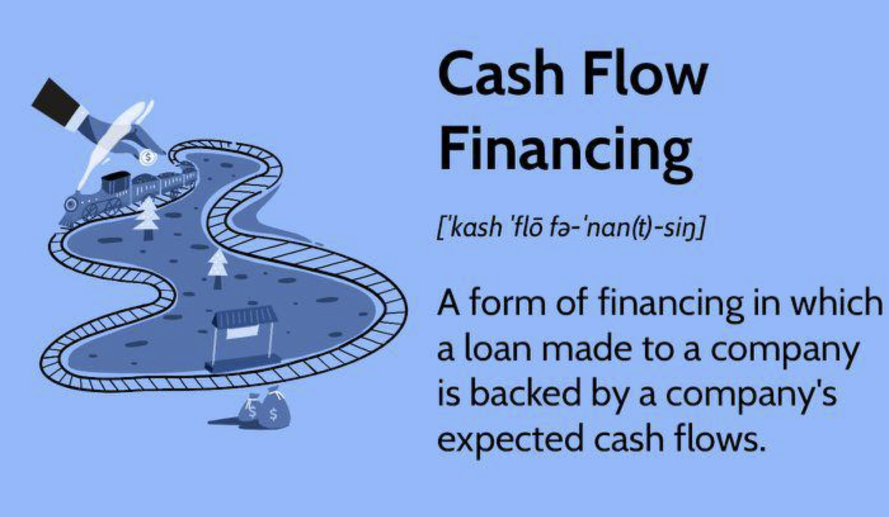

## Table of Contents

## What is cash flow financing?

Cash flow financing is a way for businesses to borrow money based on the money they expect to receive in the future. Instead of using physical assets like equipment or property as collateral, businesses use their expected cash inflows, such as money from sales or invoices, to secure the loan. This type of financing is particularly useful for companies that have strong sales but need immediate funds to cover expenses like payroll or inventory purchases.

This financing method can be a good option for businesses that are growing quickly and need extra cash to keep up with their expansion. However, it's important for businesses to accurately predict their future cash flows because if they can't repay the loan, it could lead to financial trouble. Lenders will often look at a company's past cash flow records and future projections to decide if they are a good candidate for cash flow financing.

## How does cash flow financing work?

Cash flow financing works by letting businesses borrow money based on the money they expect to get in the future. Instead of using things like machines or buildings to get a loan, businesses use the money they think they will make from selling things or getting paid for invoices. This kind of loan is good for businesses that have a lot of sales but need money right away to pay for things like workers' salaries or to buy more products to sell.

When a business wants to use cash flow financing, they talk to a lender and show them their past money records and their plans for the future. The lender looks at this information to see if the business can pay back the loan. If everything looks good, the lender gives the business the money they need. It's important for the business to guess their future money correctly because if they can't pay back the loan, it can cause big problems.

## What are the different types of cash flow financing?

There are a few main types of cash flow financing that businesses can use. One type is invoice financing, where a business borrows money against the invoices they have sent to customers but haven't been paid yet. The lender gives the business a part of the invoice amount right away, and when the customer pays the invoice, the lender takes their fee and gives the rest of the money to the business. Another type is merchant cash advances, where a business gets a lump sum of money in exchange for a part of their future credit card sales. The lender takes a small percentage of the business's daily credit card sales until the advance is paid back, plus fees.

Another type of cash flow financing is a business line of credit. This is like a credit card for a business, where they can borrow money up to a certain limit and only pay interest on the amount they use. The business can keep borrowing and paying back as they need, which is good for managing cash flow. Lastly, there are short-term loans, which businesses can use to cover immediate expenses and pay back within a short time, usually less than a year. These loans are based on the business's cash flow and can help them manage their money until they get more sales or payments.

## Who can benefit from cash flow financing?

Cash flow financing can be really helpful for small businesses that are growing fast. These businesses might have a lot of orders coming in, but they need money right away to buy more products or pay their workers. By using cash flow financing, they can get the money they need without having to wait for their customers to pay their invoices. This can help them keep up with their growth and take on more orders without worrying about running out of money.

Another group that can benefit from cash flow financing is businesses that have seasonal sales. For example, a store that sells a lot of things during the holidays might need extra money to buy inventory before the busy season starts. Cash flow financing can give them the money they need to get ready for the rush, and then they can pay it back when they start making more sales. This way, they can make the most of their busy times without having to worry about money.

## What are the advantages of using cash flow financing?

Cash flow financing is a big help for businesses that are growing fast. It lets them get money quickly without having to wait for customers to pay their bills. This means they can buy more products or pay their workers right away, which helps them keep up with their growth. It's like having a safety net that lets them take on more orders and grow their business without worrying about running out of money.

Another good thing about cash flow financing is that it's flexible. Businesses can use it when they need it and pay it back when they start making more money. This is really helpful for businesses that have busy times during the year, like a store that sells a lot during the holidays. They can get the money they need to buy more stuff before the busy season starts, and then pay it back when they start making more sales. It's a way to make the most of their busy times without having to worry about money.

## What are the potential risks associated with cash flow financing?

One big risk of cash flow financing is that businesses might not be able to pay back the money they borrowed. If a business guesses wrong about how much money they will make in the future, they might not have enough to pay back the loan. This can lead to big problems, like having to pay extra fees or even going out of business. Lenders might also take a part of the business's money to pay back the loan, which can make it hard for the business to keep running smoothly.

Another risk is that cash flow financing can be expensive. Lenders might charge high fees or interest rates because they are taking a bigger risk by lending money based on future earnings instead of solid assets. This means that the business might end up paying a lot more than they borrowed, which can eat into their profits. It's important for businesses to carefully look at all the costs and make sure they can handle them before they decide to use cash flow financing.

## How does cash flow financing compare to other financing options?

Cash flow financing is different from other types of financing because it uses a business's future money to get a loan, not things like machines or buildings. This can be a good choice for businesses that have a lot of sales but need money right away. Other types of financing, like asset-based loans, use things like equipment or property to get a loan. These loans can be good for businesses that have a lot of valuable stuff but might not have as much money coming in right now. 

Another type of financing is equity financing, where a business gets money by selling part of the company to investors. This can be a good choice for businesses that need a lot of money to grow but don't want to take on debt. With cash flow financing, the business doesn't have to give up any ownership, but they do have to pay back the loan with interest. Each type of financing has its own pros and cons, so businesses need to think carefully about which one is best for them based on their situation and goals.

## What criteria do businesses need to meet to qualify for cash flow financing?

To qualify for cash flow financing, businesses usually need to show that they have a steady flow of money coming in. Lenders look at the business's past money records to see if they have been making good sales and getting paid on time. They also want to see plans for the future to make sure the business will keep making money. If a business can show that they have been doing well and will keep doing well, they are more likely to get approved for cash flow financing.

Another important thing lenders look at is the business's credit history. They want to make sure the business has a good track record of paying back loans on time. If a business has a good credit score and has paid back other loans without problems, it makes it easier for them to get cash flow financing. Lenders might also look at the business's overall financial health to see if they can handle the loan payments along with their other expenses.

## How can a business apply for cash flow financing?

To apply for cash flow financing, a business first needs to find a lender that offers this type of loan. They can look online or ask other business owners for recommendations. Once they find a lender, they should get in touch and ask about the application process. The lender will usually ask for some information about the business, like past money records, future sales plans, and maybe even a business plan. It's important for the business to gather all this information and make sure it's clear and easy to understand.

After the business sends in their application, the lender will look at it to see if they qualify for the loan. They will check the business's past money records to see if they have been making good sales and getting paid on time. They will also look at the business's plans for the future to make sure they will keep making money. If everything looks good, the lender will approve the loan and give the business the money they need. The business then needs to make sure they can pay back the loan on time to avoid any problems.

## What are the key financial metrics lenders look at for cash flow financing?

When a business wants to get cash flow financing, lenders look at a few important numbers to see if the business can pay back the loan. One big number they look at is the business's past cash flow. They want to see if the business has been making good sales and getting paid on time. Another important number is the business's future cash flow projections. Lenders want to make sure the business will keep making money so they can pay back the loan.

Lenders also look at the business's debt-to-income ratio. This number shows how much money the business makes compared to how much they owe. If the business has a lot of debt and not much income, it might be hard for them to pay back the loan. Another key number is the business's credit score. A good credit score shows that the business has a history of paying back loans on time, which makes lenders more likely to approve the loan.

## How can cash flow financing be used to improve business operations?

Cash flow financing can help businesses run better by giving them the money they need to buy more products or pay their workers on time. When a business has a lot of orders coming in, they might need extra money to keep up with the demand. By using cash flow financing, they can get this money quickly without having to wait for their customers to pay their bills. This means they can keep their shelves full and their workers happy, which helps them serve more customers and grow their business.

Another way cash flow financing can improve business operations is by helping businesses manage their money during busy times. For example, a store that sells a lot during the holidays might need extra money to buy inventory before the rush starts. Cash flow financing can give them the money they need to get ready for the busy season, and then they can pay it back when they start making more sales. This way, they can make the most of their busy times without having to worry about running out of money, which helps them run their business more smoothly.

## What are the advanced strategies for optimizing cash flow financing?

One advanced strategy for optimizing cash flow financing is to use it to take advantage of early payment discounts from suppliers. If a business can get a discount for paying their bills early, they can use cash flow financing to get the money they need to do this. This can save them money in the long run and help them build better relationships with their suppliers. Another way to optimize cash flow financing is by using it to invest in marketing or new product development. By getting extra money to spend on these things, a business can attract more customers and increase their sales, which can help them pay back the loan and grow their business at the same time.

Another strategy is to carefully manage the timing of cash flow financing. Businesses can use it to cover short-term gaps in their cash flow, like during slow months or while waiting for big payments to come in. By planning ahead and using cash flow financing at the right times, businesses can keep their operations running smoothly without running into money problems. It's also important for businesses to keep a close eye on their cash flow projections and adjust their financing as needed. This way, they can make sure they always have enough money to cover their expenses and take advantage of new opportunities.

## References & Further Reading

[1]: ["Advances in Financial Machine Learning"](https://www.amazon.com/Advances-Financial-Machine-Learning-Marcos/dp/1119482089) by Marcos Lopez de Prado

[2]: ["Machine Learning for Algorithmic Trading"](https://github.com/stefan-jansen/machine-learning-for-trading) by Stefan Jansen

[3]: ["Quantitative Trading: How to Build Your Own Algorithmic Trading Business"](https://www.amazon.com/Quantitative-Trading-Build-Algorithmic-Business/dp/1119800064) by Ernest P. Chan

[4]: ["Evidence-Based Technical Analysis: Applying the Scientific Method and Statistical Inference to Trading Signals"](https://www.amazon.com/Evidence-Based-Technical-Analysis-Scientific-Statistical/dp/0470008741) by David Aronson

[5]: Hull, J. C. (2012). ["Options, Futures, and Other Derivatives"](https://www.semanticscholar.org/paper/Options%2C-Futures%2C-and-Other-Derivatives-Hull/89bdee500c8623864fc9eb7a471546aa713acc44) (9th ed.). Pearson.

[6]: Fabozzi, F. J., & Peterson Drake, P. (2009). ["Finance: Capital Markets, Financial Management, and Investment Management"](https://books.google.com/books/about/Finance.html?id=mUBsAwAAQBAJ). Wiley.