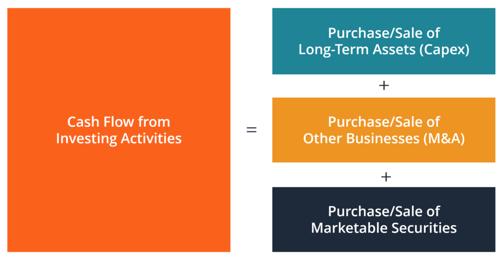

## Table of Contents

## What is cash flow from investing activities?

Cash flow from investing activities is the section of a company's cash flow statement that shows how much money the company has spent on or received from its investments. This includes buying or selling long-term assets like buildings, equipment, or investments in other companies. It also covers loans made to other entities and the cash received from the sale of these assets or the repayment of loans.

This part of the cash flow statement is important because it shows how a company is managing its investments to grow or maintain its business. If a company is spending a lot of money on new equipment or buying other businesses, it might mean they are trying to expand. On the other hand, if they are selling off assets, it could mean they are trying to raise cash quickly. Understanding this section helps investors see if the company is investing wisely for future growth or just trying to keep things running.

## Why is it important to track cash flow from investing activities?

Tracking cash flow from investing activities is important because it shows how a company is using its money to grow or maintain its business. When a company spends money on things like new equipment, buildings, or buying other companies, it's trying to invest in its future. By looking at this part of the cash flow statement, you can see if the company is putting its money into good investments that could help it grow bigger and stronger.

On the other hand, if a company is selling off its assets or getting money back from loans it made, it might be trying to raise cash quickly. This could be a sign that the company needs money right away, which might not be a good thing. By keeping an eye on the cash flow from investing activities, investors and managers can tell if the company is making smart choices with its money or if it's just trying to stay afloat. This helps everyone understand the company's health and future plans better.

## What are common examples of cash inflows from investing activities?

Cash inflows from investing activities are the money a company gets from selling things it owns, like buildings, machines, or even other businesses. When a company decides to sell a big piece of equipment it no longer needs, the money it gets from that sale is a cash inflow. Another example is when a company sells a building or a piece of land. The money from these sales goes into the company's cash flow statement under investing activities.

Another common source of cash inflow is when a company gets money back from loans it made to others. If a company lent money to another business and that business pays it back, that money coming back to the company is also considered a cash inflow from investing activities. These inflows show how a company can turn its investments into cash, which can be important for understanding the company's financial health.

## What are common examples of cash outflows from investing activities?

Cash outflows from investing activities are when a company spends money on things that will help it grow or keep running in the future. A common example is when a company buys new machines or equipment. These are big purchases that can cost a lot of money, but they help the company make more products or work better. Another example is when a company buys a building or land. This is also a big expense, but it gives the company a place to work or store things.

Another type of cash outflow happens when a company buys stocks or bonds from other companies. This is like investing in another business, hoping it will grow and make money. Sometimes, a company also gives loans to other businesses or people. The money going out for these loans is another example of a cash outflow. All these outflows show how a company is using its money to try to build a stronger future, even if it means spending a lot now.

## How do you calculate cash flow from investing activities?

To calculate cash flow from investing activities, you need to look at all the money coming in and going out from the company's investments. Start by adding up all the money the company got from selling things like buildings, equipment, or stocks in other companies. This is the cash inflow. Then, add up all the money the company spent on buying new equipment, buildings, or investing in other businesses. This is the cash outflow. To find the total cash flow from investing activities, subtract the total cash outflows from the total cash inflows.

For example, if a company sold a piece of equipment for $50,000 and got $10,000 back from a loan it made, the total cash inflow would be $60,000. If the same company bought new machinery for $30,000 and invested $20,000 in another business, the total cash outflow would be $50,000. To calculate the cash flow from investing activities, you would subtract the outflows from the inflows: $60,000 - $50,000 = $10,000. So, the cash flow from investing activities would be a positive $10,000, showing that the company got more money from its investments than it spent.

## Where is cash flow from investing activities reported in financial statements?

Cash flow from investing activities is reported in the company's cash flow statement. This statement is one of the main financial statements that shows how a company gets and uses its money. It is divided into three parts: operating activities, investing activities, and financing activities. The investing activities part shows all the money the company got or spent on things like buildings, equipment, or investments in other companies.

Looking at the cash flow from investing activities helps people see if the company is spending money to grow or if it's selling things to get cash. For example, if a company is buying new machines, it's spending money to get better at making things. If it's selling old buildings, it's getting money back. This part of the cash flow statement is important because it tells you about the company's plans for the future and how it's using its money to make those plans happen.

## What does a negative cash flow from investing activities indicate?

A negative cash flow from investing activities means a company is spending more money on investments than it is getting back from selling things. This often happens when a company is buying new equipment, buildings, or investing in other businesses. It's like when you spend money to buy a new bike or computer; you're hoping it will help you in the future, but right now, you're spending more than you're getting.

Seeing a negative cash flow from investing activities isn't always bad. It can show that a company is trying to grow and get better. But if the company keeps spending a lot without getting any money back, it might run out of cash. So, it's important to look at the whole picture and see if the company is making smart choices with its money.

## How can a company improve its cash flow from investing activities?

A company can improve its cash flow from investing activities by being smart about what it buys and sells. If a company is spending a lot of money on new equipment or buildings, it should make sure these things will help the business grow. For example, buying a new machine that makes things faster can be a good investment. The company should also think about selling things it doesn't need anymore. If there's an old building or piece of equipment that isn't being used, selling it can bring in cash.

Another way to improve cash flow from investing activities is by being careful with investments in other businesses. Instead of putting all its money into one big investment, a company can spread its money around to different places. This way, if one investment doesn't work out, the company won't lose everything. Also, if the company has given loans to other businesses, it should try to get that money back quickly. This can help bring in more cash and improve the overall cash flow from investing activities.

## What are the differences between cash flow from investing activities and cash flow from operating activities?

Cash flow from investing activities and cash flow from operating activities are two different parts of a company's cash flow statement. Cash flow from investing activities shows how much money a company spends or gets from buying and selling things like buildings, machines, or stocks in other companies. It's all about the big investments a company makes to grow or keep running. When a company buys a new machine, it's spending money on an investment, which is part of this section. If it sells an old building, the money it gets back is also part of this section.

On the other hand, cash flow from operating activities shows the money a company makes or spends from its day-to-day business. This includes things like selling products or services, paying employees, or buying supplies. It's like looking at the money coming in and going out from the regular work the company does. For example, if a company sells a lot of its products, the money it gets from those sales is part of the operating activities. If it pays its workers, that money going out is also part of this section. The big difference is that operating activities focus on the daily business, while investing activities focus on big investments for the future.

## How do changes in cash flow from investing activities impact a company's financial health?

Changes in cash flow from investing activities can tell us a lot about a company's financial health. If a company is spending a lot of money on new machines or buildings, it might mean they're trying to grow bigger and better. This can be good if the new stuff helps them make more money later. But if they're spending too much and not getting any money back, they could run out of cash. That's not good because they might not have enough money to keep the business running smoothly.

On the other hand, if a company is selling a lot of its things like old buildings or equipment, it might be trying to get cash quickly. This can be a sign that they need money right away, which might mean they're in trouble. But if they're selling things they don't need anymore and using that money wisely, it can help them stay healthy. So, it's important to look at why the cash flow from investing activities is changing to understand if the company is making smart choices or if there might be problems.

## What are some advanced strategies for managing cash flow from investing activities?

One advanced strategy for managing cash flow from investing activities is to carefully time and plan investments. Instead of spending all their money at once on big purchases like new machines or buildings, a company can spread out these investments over time. This helps them keep enough cash on hand for other needs. They can also look for the best times to buy or sell assets, like waiting for the right market conditions to get the best price. By doing this, they can make sure they're not spending too much at once and that they're getting the most out of their investments.

Another strategy is to diversify their investments. Instead of putting all their money into one big project or one type of asset, a company can invest in different things. This way, if one investment doesn't work out, they won't lose everything. They can also use the money from selling one asset to buy another, keeping the cash flowing. This helps them manage their cash flow better because they're not relying on just one thing to bring in money. By spreading out their investments, they can keep their cash flow stable and be ready for any surprises.

## How do analysts use cash flow from investing activities to assess a company's long-term investment strategy?

Analysts use cash flow from investing activities to understand a company's long-term investment strategy by looking at how the company is spending its money on things like new equipment, buildings, or other businesses. If a company is spending a lot of money on new machines or buying other companies, it might mean they are trying to grow and expand. Analysts can see if these investments are smart choices by checking if the company is buying things that will help them make more money in the future. They also look at how much money the company is getting back from selling old assets. If a company is selling a lot of things, it might mean they need cash quickly, which could be a sign of trouble.

Another way analysts use this information is to see if the company is managing its cash well. If a company is spending too much money on investments without getting any money back, it could run out of cash. This is not good because the company might not have enough money to keep running. On the other hand, if a company is selling things they don't need and using that money wisely, it can help them stay healthy. By looking at the cash flow from investing activities, analysts can tell if the company is making smart choices with its money and if their long-term investment strategy is working.

## What is Understanding Cash Flow from Investing Activities?

Cash flow from investing activities represents a crucial element of the cash flow statement, serving as an indicator of a company's ongoing investment in its long-term assets. This component predominantly covers cash inflows and outflows associated with transactions involving long-term investments, including property, equipment, and financial securities. These activities can not only reveal insights into a company's growth strategies but also offer a window into its financial stability.

The equation generally used to calculate cash flow from investing activities is:

$$
\text{Cash Flow from Investing Activities} = \text{Cash Inflows from Investments} - \text{Cash Outflows for Investments}
$$

**Cash Inflows from Investing Activities:**
These inflows are generated from selling long-term assets or investments. For example, the sale of machinery, property, or financial instruments like stocks and bonds leads to an influx of cash, contributing positively to the cash flow. This positive cash flow is indicative of asset liquidation, which may be used to enhance [liquidity](/wiki/liquidity-risk-premium) or redirect funds to other growth-oriented areas.

**Cash Outflows for Investing Activities:**
On the flip side, cash outflows typically occur when a company invests in new long-term assets. Acquiring property, plants, or equipment (PP&E) generally results in cash outflows, reflecting capital expenditure aimed at expanding the company's operational capacity. Similarly, purchasing securities as long-term investments falls into this category. Although these activities might lead to negative cash flow in the short term, they often signal potential for future growth and operational enhancement.

**Significance of Cash Flow Status:**
Assessing whether cash flow from investing activities is positive (indicating asset liquidation or reduced investment) or negative (indicating capital expenditures and new investments) plays a pivotal role in understanding a company's strategic direction. A negative cash flow from investing activities could suggest proactive investments aimed at future profitability, whereas a positive flow might imply stabilization or withdrawal from investment activities. Investors and analysts closely monitor these figures as they provide insights into a company's approach to managing its long-term resources and financial health. Understanding these cash flow dynamics helps in making informed decisions about the organization's strategic and operational positioning.

## References & Further Reading

1. **Cash Flow Statements and Financial Analysis**:
   - For a foundational understanding of cash flow statements, refer to "Intermediate Accounting" by Donald E. Kieso, Jerry J. Weygandt, and Terry D. Warfield, which offers an in-depth exploration of financial statement analysis, including cash flow categorization and impact interpretation.
   - The "Financial Accounting Standards Board (FASB)" website provides authoritative resources on financial reporting standards and guidelines for preparing cash flow statements. Access it at: [www.fasb.org](http://www.fasb.org).

2. **Algorithmic Trading**:
   - "Algorithmic Trading: Winning Strategies and Their Rationale" by Ernest P. Chan is a comprehensive resource that introduces various algorithm-driven strategies and their effectiveness. It's an excellent guide for readers new to algorithmic concepts.
   - Explore the "Automated Trader" magazine and its website for articles and case studies related to algorithmic trading strategies, market analysis, and the latest technologies influencing this domain. Visit: [www.automatedtrader.net](http://www.automatedtrader.net).

3. **Investment Strategies and Market Analysis**:
   - "Investment Analysis and Portfolio Management" by Frank K. Reilly and Keith C. Brown provides an exhaustive insight into investment strategies and their implications for cash flow and financial risk management.
   - The "CFA Institute" offers a repository of articles, white papers, and guides on investment strategies, focusing on integrating these strategies with cash flow management. Their website is a useful source for ongoing education: [www.cfainstitute.org](http://www.cfainstitute.org).

4. **Online Learning Platforms**:
   - Courses from platforms like Coursera and edX provide accessible educational content on both cash flow analysis and algorithmic trading. Institutions like the Massachusetts Institute of Technology (MIT) and the University of Michigan offer specialized courses in these areas.

5. **Open-Source Tools for Algorithmic Trading**:
   - For practical application, explore open-source trading platforms such as Zipline and PyAlgoTrade, which allow experimentation with algorithmic trading strategies using Python.
   - Here's a basic Python example to illustrate how you might begin setting up a simple moving average crossover strategy using these tools:
     ```python
     import talib
     import numpy as np

     # Assume 'prices' is a numpy array of historical price data
     short_window = 40
     long_window = 100

     signals = np.zeros_like(prices)
     short_mavg = talib.SMA(prices, timeperiod=short_window)
     long_mavg = talib.SMA(prices, timeperiod=long_window)

     signals[short_window:] = np.where(short_mavg[short_window:] > long_mavg[short_window:], 1.0, 0.0)
     ```

These resources offer a comprehensive pathway for understanding and applying the principles of cash flow analysis and [algorithmic trading](/wiki/algorithmic-trading), aiding in effective investment strategy formulation.

