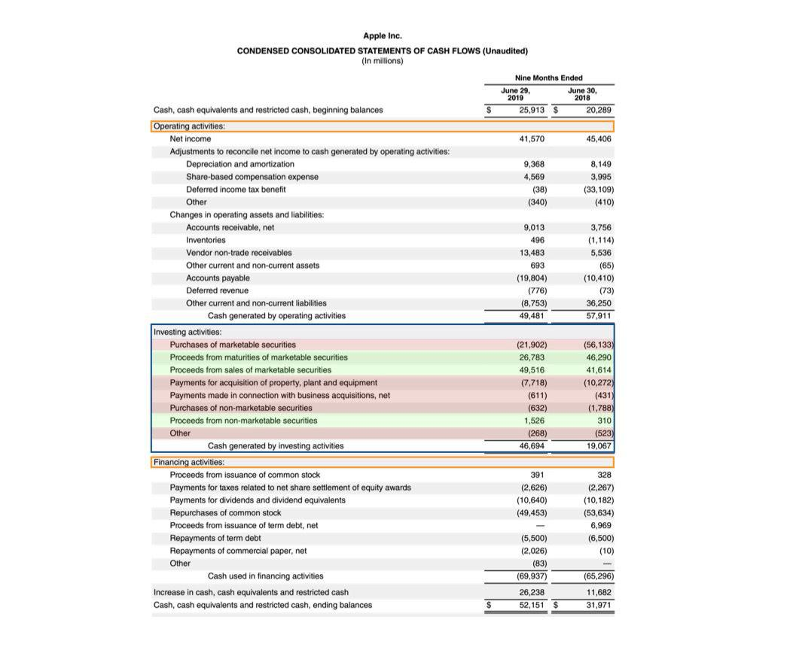

Investment activities and algorithmic trading are integral components of the modern financial ecosystem, significantly influencing how financial decisions are made and executed. Investment activities encompass the allocation of resources, including cash and other assets, toward opportunities that can generate returns over time. These activities range from purchasing company stocks and bonds to acquiring real estate or investing in technology. The ultimate goal is to enhance value and achieve financial growth. 

Algorithmic trading, on the other hand, leverages computer algorithms to automate trading decisions, allowing for high-speed transactions that human traders cannot match. This form of trading relies on predefined criteria such as timing, price, and volume to minimize human intervention and reduce emotional bias in trading. The use of sophisticated algorithms and machine learning can lead to more precise and strategic investment decisions, optimizing the timing and selection of trades.



Combining these practices with comprehensive cash flow analysis can provide a framework for evaluating the effectiveness and sustainability of investment strategies. Cash flow analysis focuses on understanding the inflow and outflow of money within an organization, particularly cash flow from investing activities. This involves scrutinizing financial statements to assess how effectively a company allocates capital and manages its investments. It is essential to discern trends and future growth prospects, particularly when investing substantial amounts in long-term assets. 

This article aims to elucidate the complexities of cash flow from investing activities, present diverse investment examples, and highlight the transformative role of algorithmic trading in contemporary financial markets. By mastering these concepts, investors will be better equipped to navigate the complexities of finance and make informed decisions that align with their strategic goals.

## Table of Contents

## Understanding Cash Flow from Investing Activities

Cash flow from investing activities is a critical component of a company's cash flow statement, offering insight into the financial strategies surrounding the acquisition and disposal of investments. It specifically reveals how much cash has been allocated to, or generated from, investments during a particular timeframe. Typical activities captured in this section include the purchase of physical assets like property and equipment, acquiring or selling investments such as stocks or bonds, and expenditures related to mergers and acquisitions.

Primarily, cash flow from investing activities can provide a window into a company's future growth strategies. For instance, purchases of long-term physical assets may result in negative cash flow. This scenario often denotes a focus on future growth and expansion, aligning with plans for increasing production capabilities or entering new markets. While such investments can decrease available cash in the short term, they are essential for sustaining long-term competitiveness and profitability.

Conversely, activities leading to positive cash flow within this segment often arise from selling assets or investments. This inflow could enhance a company's [liquidity](/wiki/liquidity-risk-premium) position, providing financial flexibility to respond to immediate obligations or to support strategic investments elsewhere. Understanding the interplay between the different elements reported in this part of the financial statement allows stakeholders to assess whether a company is prioritizing long-term opportunities or is leveraging existing assets to improve short-term liquidity.

Analyzing cash flow from investing activities involves more than just observing the figures; it requires interpreting the strategic implications of these cash flows on a company's overall financial health and strategy. It is essential for stakeholders to distinguish whether a negative cash flow signifies aggressive growth strategies or poorly performing investments. This distinction is crucial for evaluating a company's trajectory and its capability to generate sustainable value in the future. As such, financial analysts and investors alike closely scrutinize this part of the cash flow statement to understand the strategic direction and investment priorities of a business.

## Investment Examples Impacting Cash Flow

Long-term investments often involve acquiring property, plant, and equipment (PP&E), which typically result in immediate negative cash flow. These investments are fundamental for a company's future growth, as they expand operational capacity and increase production capabilities. As businesses invest in these assets, they may temporarily deplete cash reserves, but the goal is to enhance long-term returns and competitive position.

In contrast, selling investments, such as securities, generates positive cash flow, providing immediate liquidity that can enhance a company's financial flexibility. This liquidity is crucial for meeting short-term obligations, reinvesting in other opportunities, or distributing dividends to shareholders. By effectively managing the timing of asset sales, companies can optimize their cash flow and maintain a stable financial foundation.

A prominent case study in strategic asset allocation is Apple's investment endeavors. Apple consistently allocates a significant portion of its capital to marketable securities, ranging from government bonds to corporate securities. This strategy not only aids in cash flow management but also aligns with broader financial objectives of risk diversification and yield enhancement. According to Apple's financial reports, their investment in marketable securities totaled approximately $130 billion in 2020. This substantial allocation allows Apple to systematically manage liquidity while generating income from low-risk investments.

Overall, a strategic approach to investments can significantly impact a company's cash flow and financial health. Balancing long-term growth initiatives with liquidity needs through thoughtful management of investments and divestitures is crucial for sustainable financial success.

## Algorithmic Trading: Revolutionizing Investment Strategies

Algorithmic trading uses computer programs to execute trades based on a set of predefined instructions, enabling the rapid processing of trades at high speed and [volume](/wiki/volume-trading-strategy). This method of trading minimizes emotional and psychological biases, which often impact human decision-making in financial markets. By replacing human intervention with automation, [algorithmic trading](/wiki/algorithmic-trading) can achieve a level of precision and consistency that is difficult to replicate manually.

The primary advantages of algorithmic trading include increased efficiency, lower transaction costs, and the ability to execute trades at optimal times. By utilizing algorithms, traders can handle vast amounts of market data and execute trades instantaneously, capitalizing on brief windows of opportunity. Furthermore, the reduction in transaction costs stems from the ability to execute trades in numerous small orders, thus minimizing market impact and price slippage.

Despite these advantages, algorithmic trading presents challenges. The reliance on technology means that technical malfunctions or system failures can lead to significant financial losses. Additionally, the automated nature of these systems can contribute to market [volatility](/wiki/volatility-trading-strategies), as simultaneous buy or sell signals can cause dramatic price shifts. The development and maintenance of trading algorithms also require significant upfront investment, both in terms of financial resources and technical expertise.

In summary, while algorithmic trading offers enhanced efficiency and cost savings, it is not without its risks. The integration of advanced technology into trading strategies necessitates a thorough understanding of both the benefits and potential pitfalls to optimize their use in modern financial markets.

## Strategies and Examples of Algorithmic Trading

Algorithmic trading has revolutionized the way financial transactions are executed, introducing a realm of precision and speed that manual trading simply cannot match. Common strategies employed within algorithmic trading include trend-following strategies, [arbitrage](/wiki/arbitrage) opportunities, and index fund rebalancing. Each of these strategies utilizes algorithms to analyze vast amounts of data and make trade decisions based on predefined criteria, thereby minimizing human error and emotional bias.

Trend-following strategies are among the most popular in algorithmic trading. These strategies are based on the identification of price trends, where algorithms automatically execute trades when certain indicators point to a persistent price direction. For instance, an algorithm might be programmed to buy a stock when its short-term moving average surpasses its long-term moving average, signaling a sustained uptrend. By using mathematical models, such as moving average convergence divergence (MACD) or relative strength index (RSI), the algorithm can dynamically adjust its buying and selling decisions. Here is a basic Python example that illustrates a moving average crossover strategy:

```python
import pandas as pd

# Load historical price data
data = pd.read_csv('stock_data.csv')
data['Short_MA'] = data['Close'].rolling(window=40).mean()
data['Long_MA'] = data['Close'].rolling(window=100).mean()

# Generate trading signals
data['Signal'] = 0
data.loc[data['Short_MA'] > data['Long_MA'], 'Signal'] = 1
data.loc[data['Short_MA'] <= data['Long_MA'], 'Signal'] = -1
```

Arbitrage opportunities represent another essential algorithmic trading strategy. Arbitrage exploits price discrepancies of a financial asset across different markets or forms. Algorithms search for these inefficiencies and execute simultaneous buy and sell orders to capitalize on minimal price differences. High-frequency trading platforms are critical in this strategy due to their ability to execute transactions in fractions of a second, rendering any delay costly.

Index fund rebalancing involves adjusting the composition of a fund to align with the target index. Algorithms assist fund managers by automating buy and sell decisions, ensuring the fund's holdings mirror the index as closely as possible. This automated process is particularly useful during periodic rebalancing, where large volumes of trades must be executed in a short time frame.

These algorithmic implementations enable precise calculations and rapid execution, key advantages that drive trading decisions across global markets. By incorporating these strategies, traders can leverage technology to perform complex analyses and execute trades with a level of efficiency and accuracy that were previously unattainable through manual means.

## The Interplay Between Cash Flow and Trading Algorithms

Cash flow from investing activities and algorithmic trading work synergistically to enhance a company's financial health. By analyzing cash flow generated from investment activities, businesses and investors can gain insight into the profitability and viability of their long-term investments. Integrating this analysis with algorithmic trading strategies provides a dynamic mechanism for optimizing liquidity and asset allocation.

Algorithmic trading, primarily known for its speed and efficiency, can swiftly adjust the cash flow by responding to changes in liquidity needs influenced by investing decisions. For instance, when a company experiences negative cash flow from substantial asset purchases, algorithmic trading can facilitate selling non-core assets or reallocating resources to generate positive cash flow swiftly. This adaptability ensures that a company maintains sufficient liquidity to meet its operational and strategic goals.

Moreover, integrating cash flow analyses with algorithmic trading models allows for informed decision-making regarding asset allocation. By employing sophisticated algorithms that analyze cash flow data and market conditions, traders can identify optimum times for executing trades and real-time adjustments based on available financial resources. This precision can help in aligning investment strategies with market opportunities, thereby enhancing potential returns while mitigating risks.

A simplified Python example of integrating cash flow with algorithmic trading might involve setting up a trading algorithm that factors in cash flow data:

```python
def assess_cash_flow(cash_flow_data):
    # Simplified analysis method
    if cash_flow_data < 0:
        return "Consider selling assets"
    else:
        return "Evaluate new investment opportunities"

def trading_algorithm(market_data, cash_flow_data):
    decision = assess_cash_flow(cash_flow_data)
    if decision == "Consider selling assets":
        # Execute trades to enhance liquidity
        execute_sell_order(market_data)
    elif decision == "Evaluate new investment opportunities":
        # Scan for purchasing opportunities
        execute_buy_order(market_data)

def execute_sell_order(market_data):
    # Placeholder for algorithm to sell assets
    pass

def execute_buy_order(market_data):
    # Placeholder for algorithm to buy new assets
    pass
```

This conceptual framework underscores that algorithmic trading can optimize liquidity and asset allocation by leveraging insights from cash flow analysis. The integration not only enhances strategic financial decisions but also ensures robust market engagement aligned with a company's financial objectives.

## Conclusion

Understanding cash flow from investing activities and embracing algorithmic trading techniques are crucial for modern investors aiming for strategic growth. These elements form the backbone of investment strategies that seek to balance risk and reward while optimizing financial results. Algorithmic trading, with its precision and efficiency, allows investors to execute trades at speeds and volumes unattainable by human traders alone. This capability reduces transaction costs and eliminates emotional biases, helping investors achieve optimal trade executions.

On the other hand, cash flow from investing activities provides critical insights into a company's growth strategies. Accurately analyzing this section of a financial statement can reveal whether a firm is investing in its future through the purchase of long-term assets or generating immediate liquidity by selling assets. Such analysis helps investors understand the company's financial health and its capacity to fund operations or expansion initiatives.

While the complexities of these financial tools may seem daunting, they offer significant potential advantages when used effectively. Algorithmic trading helps manage vast amounts of data and execute complex calculations in real-time, offering strategic insights that drive better decision-making. For instance, algorithms can be programmed to identify arbitrage opportunities or execute trend-following strategies, ensuring trades are made at opportune times.

To effectively leverage these tools, investors can integrate cash flow analysis with algorithmic trading systems. For example, an investor can use Python scripts to automatically parse financial statements, extract cash flow data, and analyze it alongside market information sourced in real-time through trading algorithms. Here is a simplified example of how Python can aid in analyzing cash flow data:

```python
import pandas as pd

# Sample data: hypothetical cash flow from investing activities
data = {'Year': [2020, 2021, 2022],
        'CashFlowFromInvesting': [-500000, -200000, 300000]}

df = pd.DataFrame(data)

# Calculate rolling mean to identify trends
df['RollingMean'] = df['CashFlowFromInvesting'].rolling(window=2).mean()

print(df)
```

Such techniques ensure that investors remain agile amid market fluctuations, thus navigating opportunities and challenges more effectively. By leveraging detailed cash flow analysis and sophisticated trading algorithms, investors can position themselves strategically for sustained financial health, capitalizing on the converging potential of these advanced financial practices.

## References & Further Reading

[1]: Bergstra, J., Bardenet, R., Bengio, Y., & Kégl, B. (2011). ["Algorithms for Hyper-Parameter Optimization."](https://proceedings.neurips.cc/paper/2011/file/86e8f7ab32cfd12577bc2619bc635690-Paper.pdf) Advances in Neural Information Processing Systems 24.

[2]: ["Advances in Financial Machine Learning"](https://www.amazon.com/Advances-Financial-Machine-Learning-Marcos/dp/1119482089) by Marcos Lopez de Prado

[3]: ["Evidence-Based Technical Analysis: Applying the Scientific Method and Statistical Inference to Trading Signals"](https://www.semanticscholar.org/paper/Evidence-Based-Technical-Analysis%3A-Applying-the-and-Aronson/3b33df8737f1772e9e14d66a08c9696f140a2ee1) by David Aronson

[4]: ["Machine Learning for Algorithmic Trading"](https://github.com/PacktPublishing/Machine-Learning-for-Algorithmic-Trading-Second-Edition) by Stefan Jansen

[5]: ["Quantitative Trading: How to Build Your Own Algorithmic Trading Business"](https://www.amazon.com/Quantitative-Trading-Build-Algorithmic-Business/dp/1119800064) by Ernest P. Chan