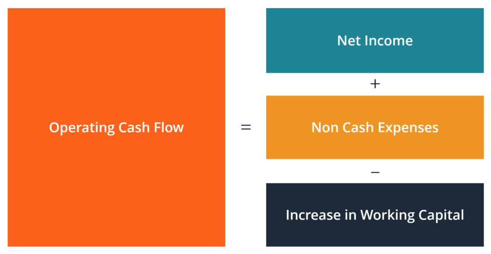

## Table of Contents

## What is cash flow from operating activities?

Cash flow from operating activities is the money a business makes from its regular business activities. This includes money coming in from selling products or services and money going out to pay for things like salaries, rent, and supplies. It shows how well a company is managing its day-to-day operations and if it can generate enough cash to keep running smoothly.

Looking at the cash flow from operating activities is important because it tells us if a company is making enough money to cover its bills without needing to borrow or use other sources of cash. If a company has a positive cash flow from operating activities, it means it is doing well and can support itself. If it's negative, it might be a sign that the company needs to make some changes to improve its financial health.

## Why is cash flow from operating activities important for a business?

Cash flow from operating activities is really important for a business because it shows how much money the company is making from its main business activities. This is the money that comes in from selling things or providing services, and the money that goes out to pay for things like salaries, rent, and supplies. It's like checking the pulse of the business to see if it's healthy. If a business has a good cash flow from operating activities, it means it's doing well at making money from what it does every day.

This measure is crucial because it tells a business if it can keep going without needing to borrow money or use other sources of cash. If a company has more money coming in than going out from its operations, it's in a good spot. It can pay its bills, invest in new things, and maybe even give money back to its owners or shareholders. But if the cash flow is negative, it's a warning sign. The business might need to cut costs, find new ways to make money, or figure out why it's losing cash so it can fix the problem and stay afloat.

## How is cash flow from operating activities different from net income?

Cash flow from operating activities and net income are both important ways to see how a business is doing, but they show different things. Net income is the profit a business makes after it pays all its costs, like taxes and interest. It's what's left over at the end of the day and is shown on the income statement. Net income includes some things that don't involve actual cash, like depreciation, which is a way to account for the wear and tear on things like machines and buildings.

Cash flow from operating activities, on the other hand, is all about the actual cash that comes in and goes out from the everyday business activities. This includes cash from selling products or services and cash used to pay for things like salaries and rent. Unlike net income, it doesn't include non-cash items like depreciation. So, a business might show a profit on its income statement (net income), but if it's not collecting cash fast enough or is spending too much cash, it might still struggle to pay its bills.

The difference between these two can be really important. A company might have a high net income but a low or negative cash flow from operating activities if it's not collecting payments from customers quickly enough or if it's spending a lot of cash on inventory. On the flip side, a company might have a low net income but a strong cash flow from operating activities if it's managing its cash well and not spending more than it's bringing in. Understanding both helps business owners and investors see the full picture of a company's financial health.

## What are the direct and indirect methods of calculating cash flow from operating activities?

The direct method of calculating cash flow from operating activities is like keeping a detailed diary of all the cash that comes in and goes out from the daily business activities. You list all the cash receipts, like the money customers pay when they buy your products or services. Then you list all the cash payments, like the money you spend on salaries, rent, and supplies. You add up all the cash coming in and subtract all the cash going out to find the net cash flow from operating activities. This method gives a clear picture of where the cash is coming from and where it's going, but it can be harder to put together because you need to gather a lot of detailed information.

The indirect method starts with the net income from the income statement and then makes adjustments to convert that number into the cash flow from operating activities. Since net income includes non-cash items like depreciation, you need to add back those expenses because they didn't actually use any cash. You also need to adjust for changes in working capital, like accounts receivable and inventory. If accounts receivable go up, it means customers haven't paid you yet, so you need to subtract that increase from net income. If inventory goes down, it means you sold more than you bought, so you add that decrease back to net income. This method is often easier to use because it starts with a number you already have, but it can be a bit trickier to understand because it involves a lot of adjustments.

Both methods should give you the same final number for cash flow from operating activities, but they show it in different ways. The direct method is more straightforward and shows exactly where the cash is coming from and going to, while the indirect method starts with net income and adjusts it to reflect the actual cash flow. Companies often use the indirect method because it's easier to prepare, but the direct method can be more useful for understanding the day-to-day cash movements in the business.

## Can you explain the formula for the direct method of calculating cash flow from operating activities?

The direct method of calculating cash flow from operating activities is pretty straightforward. You start by adding up all the cash you received from your customers. This includes money from selling products or services. Then, you subtract all the cash you paid out for things like salaries, rent, and supplies. The formula is simple: Cash Received from Customers - Cash Paid for Operating Expenses = Net Cash Flow from Operating Activities. This method shows exactly where your cash is coming from and where it's going, which can be really helpful for understanding your business's day-to-day cash movements.

For example, if your business collected $50,000 from customers and spent $30,000 on operating expenses like salaries and rent, your net cash flow from operating activities would be $20,000. This method requires you to keep detailed records of all your cash transactions, which can be a bit more work. But it gives you a clear picture of your cash flow, making it easier to see if your business is generating enough cash to keep running smoothly.

## Can you explain the formula for the indirect method of calculating cash flow from operating activities?

The indirect method of calculating cash flow from operating activities starts with the net income from your income statement. Net income is the profit you made after paying all your expenses. But net income includes some things that don't involve actual cash, like depreciation, which is just an accounting way to show that your equipment or buildings are wearing out. So, to find out how much actual cash you made from your operations, you need to make some adjustments to the net income.

First, you add back any non-cash expenses like depreciation because these didn't use any real cash. Then, you adjust for changes in your working capital, like accounts receivable and inventory. If your accounts receivable went up, it means customers owe you more money than before, so you need to subtract that increase from your net income because you didn't actually get that cash yet. If your inventory went down, it means you sold more than you bought, so you add that decrease back to your net income. After making all these adjustments, you get your net cash flow from operating activities. This method might seem a bit tricky because of all the adjustments, but it's often easier to use because you start with a number you already have from your income statement.

## What are common adjustments made to net income in the indirect method?

When you use the indirect method to figure out your cash flow from operating activities, you start with your net income. Net income is the money you made after paying all your bills, but it includes some things that don't involve real cash, like depreciation. Depreciation is an accounting way to show that things like machines or buildings are getting old and worn out. Since depreciation doesn't use any actual cash, you need to add it back to your net income. This helps you see how much real cash your business made from its everyday activities.

You also need to adjust for changes in your working capital, like accounts receivable and inventory. If your accounts receivable went up, it means customers owe you more money than before, so you need to subtract that increase from your net income. That's because you haven't gotten that cash yet. On the other hand, if your inventory went down, it means you sold more than you bought, so you add that decrease back to your net income. These adjustments help you get a clearer picture of the actual cash your business is bringing in and spending on its operations.

## How do changes in working capital affect cash flow from operating activities?

Changes in working capital can really affect how much cash a business has from its everyday activities. Working capital is all about the stuff that keeps your business running day to day, like the money customers owe you (accounts receivable), the things you have in stock (inventory), and the bills you need to pay (accounts payable). If your accounts receivable go up, it means customers are taking longer to pay you. That's bad for your cash flow because you're not getting that money right away, even though you've already counted it as part of your income. On the other hand, if your accounts payable go up, it means you're taking longer to pay your own bills. That's good for your cash flow because you're holding onto your cash longer.

Changes in inventory can also make a big difference. If you buy more stuff to put in stock, that uses up your cash, so your cash flow goes down. But if you sell a lot of your inventory, that's good because it brings in cash. So, if your inventory goes down, it means you're selling more than you're buying, and that's good for your cash flow. Keeping an eye on these parts of working capital helps you see if your business is managing its cash well. If you're not careful, changes in working capital can make your cash flow look very different from your profits, and that can be a surprise if you're not ready for it.

## What are some typical items included in cash flow from operating activities?

Cash flow from operating activities includes the money a business gets from selling its products or services. This is the main cash coming in, like when customers pay for what they buy. It also includes other cash receipts, like interest or dividends if the business gets them from its operations. On the other hand, there's the money the business spends to keep running. This includes paying salaries to employees, rent for the office or store, and buying supplies or inventory. It also covers other operating expenses like utilities and insurance.

Changes in working capital also affect cash flow from operating activities. For example, if customers owe the business more money than before (accounts receivable goes up), that's less cash coming in right now. If the business has more bills to pay (accounts payable goes up), that's more cash it can hold onto for a bit longer. Also, if the business buys more stuff to sell (inventory goes up), that uses up cash. But if it sells a lot of its inventory, that brings in more cash. Keeping track of these things helps a business see if it's managing its cash well from its day-to-day activities.

## How can a company improve its cash flow from operating activities?

A company can improve its cash flow from operating activities by making sure it gets paid faster by its customers. One way to do this is by offering discounts for early payments or by tightening up the credit terms so customers don't take too long to pay. Another way is to keep a close eye on inventory. If the company has too much stuff sitting around that isn't selling, it's tying up cash that could be used for other things. By managing inventory better, like ordering less or selling off old stock, the company can free up more cash.

Also, the company can look at its expenses and see if there are ways to spend less. This might mean cutting down on things like rent, utilities, or salaries if possible. Sometimes, negotiating better deals with suppliers can help too, so the company pays less for the things it needs to run its business. By focusing on these areas, a company can bring in more cash and spend less, which will make its cash flow from operating activities stronger and healthier.

## What are the limitations of using cash flow from operating activities as a performance metric?

Using cash flow from operating activities as a performance metric has some limitations. One big problem is that it doesn't show the whole picture of a company's financial health. It only looks at the cash coming in and going out from daily business activities, but it doesn't include cash from other important areas like investments or loans. So, a company might look like it's doing well based on its operating cash flow, but it could be struggling in other areas that aren't shown in this metric.

Another limitation is that cash flow from operating activities can be affected by things that don't happen every day. For example, if a company gets a big payment from a customer that was delayed, it might make the cash flow look really good for that period, even if the company isn't usually doing that well. On the other hand, if the company has to pay a big bill that it doesn't usually have, it might make the cash flow look bad, even if the company is usually doing okay. So, it's important to look at more than just the cash flow from operating activities to really understand how a company is doing.

## How can advanced analytical techniques be used to forecast future cash flows from operating activities?

Advanced analytical techniques can help businesses predict their future cash flows from operating activities by using past data and patterns to make smart guesses about the future. One way to do this is by using something called time series analysis. This technique looks at how cash flows have changed over time and uses that information to predict what might happen next. For example, if a business sees that its cash flow usually goes up in the summer because more people buy its products, it can use this pattern to forecast a similar increase in the next summer. Another method is regression analysis, which looks at how different factors like sales, expenses, and seasonal changes affect cash flow. By understanding these relationships, a business can make better predictions about its future cash flows.

Another powerful tool for forecasting cash flows is machine learning. This technique uses computers to learn from lots of data and find patterns that might be hard for people to see. For instance, a machine learning model can look at things like customer buying habits, economic trends, and even social media data to predict how much cash a business might bring in from its operations. These models can get better over time as they see more data, making their predictions more accurate. By using these advanced techniques, businesses can plan better, make sure they have enough cash to cover their bills, and find ways to improve their cash flow in the future.

## What is Understanding Cash Flow from Operating Activities?

Cash flow from operating activities (CFO) refers to the cash generated by a company through its primary business operations. It serves as a crucial indicator of a company's financial success and its capacity to maintain liquidity. CFO is part of the cash flow statement, one of the three primary financial statements used by financial analysts, along with the income statement and balance sheet, to assess a company's financial health.

CFO is derived by adjusting net income for non-cash items such as depreciation and amortization, and changes in working capital components like accounts receivable, inventory, and accounts payable. These adjustments ensure that the cash flow reflects the actual cash generated or used by operational activities, eliminating the effects of accounting decisions that do not involve actual cash transactions. The formula typically used to calculate CFO is:

$$
\text{CFO} = \text{Net Income} + \text{Non-Cash Expenses} - \left( \Delta \text{Accounts Receivable} \right) - \left( \Delta \text{Inventory} \right) + \left( \Delta \text{Accounts Payable} \right)
$$

Understanding and analyzing CFO is vital for stakeholders, including investors, creditors, and management, as it provides insights into how effectively a company can generate cash to fund its operations, pay off debts, and sustain growth. A positive cash flow from operations typically signals that the company is generating sufficient cash to maintain and expand its operations without relying on external financing. Conversely, a negative cash flow from operating activities could indicate potential [liquidity](/wiki/liquidity-risk-premium) issues, challenging the company's ability to meet its short-term obligations.

In summary, CFO is a fundamental measure of a company's operational efficiency and financial stability, offering critical insights necessary for making informed financial decisions.

## What are the financial formulas relating to operating activities cash flow?

Cash flow from operating activities is a fundamental measure of a company's financial health, offering insights into the cash generated or consumed by its core operations. Analyzing this flow involves complex calculations and can significantly enhance algorithmic trading models by providing precise data points for decision-making.

There are two primary methods to compute cash flow from operations: the direct method and the indirect method. Each approach presents the financial data differently but ultimately arrives at the same cash flow figure.

### Direct Method
The direct method involves itemizing and summarizing all cash transactions—both inflows and outflows—related to operating activities. This method provides a clear view of cash flows, starting with cash received from customers and deducting cash paid for operating expenses. The formula typically used is:

$$
\text{Cash Flow from Operations} = \text{Cash received from customers} - \text{Cash paid to suppliers and employees} - \text{Cash paid for operating expenses}
$$

### Indirect Method
The indirect method adjusts net income for changes in working capital and non-cash expenses, providing a link between profit and cash flow that is often preferred for its simplicity in the context of accrual-based financial statements. The formula can be expressed as:

$$
\text{Cash Flow from Operations} = \text{Net Income} + \text{Non-Cash Expenses} + \Delta \text{Working Capital}
$$

Where:
- **Net Income** is the profit reported on the income statement.
- **Non-Cash Expenses** include items like depreciation and amortization.
- **$\Delta \text{Working Capital}$** represents changes in current assets and liabilities, affecting liquidity.

#### Example Python Calculation:
To automate the calculation of cash flow from operations using the indirect method, the following Python code snippet can be employed:

```python
def calculate_cfo(net_income, non_cash_expenses, changes_in_working_capital):
    return net_income + non_cash_expenses + changes_in_working_capital

net_income = 1000000       # Example net income
non_cash_expenses = 200000 # Example non-cash expenses
changes_in_working_capital = -50000 # Example change in working capital

cash_flow_from_operations = calculate_cfo(net_income, non_cash_expenses, changes_in_working_capital)
print(f"Cash Flow from Operations: ${cash_flow_from_operations}")
```

Understanding these formulas allows for the integration of nuanced financial data analysis into algorithmic trading models, supporting more precise and informed trading strategies. By leveraging these detailed financial insights, traders can enhance the predictiveness and adaptability of their trading systems, aligning them with current market conditions and company-level fundamentals.

## References & Further Reading

[1]: ["Advances in Financial Machine Learning"](https://www.amazon.com/Advances-Financial-Machine-Learning-Marcos/dp/1119482089) by Marcos Lopez de Prado

[2]: ["Financial Statement Analysis and Security Valuation"](https://www.mheducation.com/highered/product/financial-statement-analysis-security-valuation-penman/M9780078025310.html) by Stephen H. Penman

[3]: ["Evidence-Based Technical Analysis: Applying the Scientific Method and Statistical Inference to Trading Signals"](https://www.amazon.com/Evidence-Based-Technical-Analysis-Scientific-Statistical/dp/0470008741) by David Aronson

[4]: ["Machine Learning for Algorithmic Trading"](https://github.com/stefan-jansen/machine-learning-for-trading) by Stefan Jansen

[5]: ["Quantitative Trading: How to Build Your Own Algorithmic Trading Business"](https://www.amazon.com/Quantitative-Trading-Build-Algorithmic-Business/dp/1119800064) by Ernest P. Chan

[6]: ["Fundamentals of Financial Management"](https://faculty.cengage.com/titles/9781337902571) by Eugene F. Brigham and Joel F. Houston