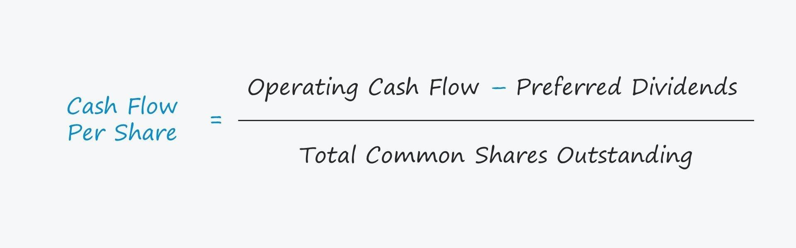

## Table of Contents

## What is cash flow per share?

Cash flow per share is a financial measure that shows how much cash a company is generating for each of its outstanding shares of stock. It is calculated by taking the total cash flow from operations and dividing it by the number of shares outstanding. This number helps investors understand how well a company is managing its cash and whether it's generating enough cash to support its operations and growth.

This measure is important because it gives a clearer picture of a company's financial health than just looking at its earnings. Earnings can sometimes be influenced by accounting practices, but cash flow is harder to manipulate. By looking at cash flow per share, investors can see if a company is actually bringing in enough cash to pay its bills, invest in new projects, and return money to shareholders through dividends or stock buybacks.

## Why is cash flow per share important for investors?

Cash flow per share is important for investors because it shows how much actual cash a company is making for each share of its stock. This is different from earnings per share, which can be affected by accounting rules and might not show the real money a company has. By looking at cash flow per share, investors can see if a company is really making enough money to keep running, grow, and pay dividends.

This measure helps investors make better decisions about buying or selling a company's stock. If a company has a high cash flow per share, it means it's doing well at bringing in cash, which is a good sign for its future. On the other hand, if the cash flow per share is low or negative, it might mean the company is struggling to make money, which could be a warning sign for investors.

## How do you calculate cash flow per share?

To calculate cash flow per share, you need to take the total cash flow from operations and divide it by the number of shares that are outstanding. The cash flow from operations is found on the company's cash flow statement, which shows how much money the company made from its regular business activities. The number of shares outstanding can be found on the company's balance sheet or in its financial reports.

This calculation gives you a clear picture of how much cash the company is generating for each share of stock. It's a useful number because it shows the real money the company is making, not just the profits it reports. Investors use this number to see if the company is doing well at making money and if it can keep paying its bills, growing, and giving money back to shareholders.

## What are the components needed to calculate cash flow per share?

To calculate cash flow per share, you need two main pieces of information. The first piece is the total cash flow from operations. This number tells you how much money the company made from its regular business activities, and you can find it on the company's cash flow statement. The second piece is the number of shares outstanding. This is the total number of shares that the company has issued and are currently held by investors, which you can find on the company's balance sheet or in its financial reports.

Once you have these two pieces of information, you can calculate cash flow per share by dividing the total cash flow from operations by the number of shares outstanding. This calculation gives you a simple number that shows how much cash the company is generating for each share of its stock. This number is helpful for investors because it shows the real money the company is making, which can help them decide if the company is doing well and if it's a good investment.

## Can you explain the difference between cash flow per share and earnings per share?

Cash flow per share and earnings per share are two different ways to measure how well a company is doing. Cash flow per share shows how much actual cash a company is making for each share of its stock. This number comes from looking at the cash flow statement, which tells you how much money the company made from its regular business activities. Earnings per share, on the other hand, shows how much profit the company made for each share of its stock. This number comes from the income statement, which lists all the money the company made and spent during a certain time.

The big difference between these two numbers is that cash flow per share looks at real money coming in, while earnings per share can be affected by accounting rules and might not show the real money a company has. For example, a company might report high earnings but have low cash flow if it's using a lot of money to buy new things or pay off debts. Investors like to look at cash flow per share because it gives a clearer picture of whether a company is really making enough money to keep going, grow, and pay dividends. Earnings per share can be useful too, but it's important to look at both numbers to get the full story about a company's financial health.

## How does cash flow per share relate to a company's financial health?

Cash flow per share is a key measure that helps show how healthy a company's finances are. It tells you how much real cash the company is making for each share of its stock. This is important because it gives a clear picture of whether the company is bringing in enough money to keep running its business, pay its bills, and invest in new projects. If a company has a high cash flow per share, it means it's doing well at making money, which is a good sign that it's financially healthy.

On the other hand, if a company's cash flow per share is low or negative, it might be a warning sign that the company is struggling to make money. This could mean it's having trouble paying its bills or growing its business. Investors look at cash flow per share to see if a company is doing well and if it's a good investment. By understanding this number, they can make better decisions about buying or selling the company's stock.

## What are common pitfalls to avoid when calculating cash flow per share?

When calculating cash flow per share, one common mistake is using the wrong number for cash flow. It's important to use the cash flow from operations, which you can find on the cash flow statement. This number shows the money the company made from its regular business activities. Sometimes, people might accidentally use the wrong kind of cash flow, like the total cash flow or the cash flow from investing or financing activities, which can give you the wrong answer.

Another pitfall to avoid is using the wrong number for shares outstanding. The number of shares outstanding can change over time, so it's important to use the right number that matches the time period you're looking at. If you use an outdated number, your calculation won't be accurate. Always make sure to check the most recent financial reports to get the correct number of shares outstanding.

Lastly, it's easy to forget that cash flow per share is just one piece of the puzzle. It's important to look at other financial measures too, like earnings per share and the company's debt levels. By looking at all these numbers together, you can get a better understanding of the company's overall financial health. Don't rely on cash flow per share alone to make investment decisions.

## How can cash flow per share be used to compare companies within the same industry?

Cash flow per share can be a helpful tool for comparing companies within the same industry. It shows how much actual cash each company is making for each share of its stock. By looking at this number, you can see which companies are doing a better job at bringing in money from their regular business activities. For example, if Company A has a higher cash flow per share than Company B, it might mean that Company A is more efficient at making money or has better control over its costs.

However, it's important to remember that cash flow per share is just one piece of information. You should also look at other numbers, like earnings per share and how much debt each company has. This way, you can get a fuller picture of how the companies are doing. For instance, a company might have a high cash flow per share but also a lot of debt, which could be a warning sign. By comparing all these numbers, you can make a smarter decision about which company might be a better investment.

## What adjustments might be necessary when calculating cash flow per share for different types of companies?

When calculating cash flow per share, you might need to make some adjustments depending on the type of company you're looking at. For example, companies that need to spend a lot of money on new things, like factories or machines, might have lower cash flow from operations because of these big purchases. To get a better picture of how much cash these companies are really making, you might want to add back the money they spent on these investments. This way, you can see how much cash the company would have if it didn't have to spend so much on new stuff.

Another thing to think about is how much debt a company has. Some companies might have a lot of debt, which means they have to pay back a lot of money. This can make their cash flow look lower than it really is. To adjust for this, you might want to look at the cash flow after subtracting the money they need to pay back on their debt. This can give you a better idea of how much cash the company has left over for other things, like growing the business or paying dividends to shareholders. By making these adjustments, you can get a clearer picture of a company's financial health, no matter what type of company it is.

## How does the timing of cash flows affect the calculation of cash flow per share?

The timing of cash flows can really change how you see a company's cash flow per share. Some companies might get a lot of money at certain times of the year, like a toy company that makes most of its sales during the holidays. If you only look at the cash flow during a slow time, it might seem like the company isn't making much money. But if you look at the whole year, you might see that the company actually makes a lot of cash. So, it's important to think about when the company gets its money when you're figuring out cash flow per share.

Another thing to think about is how the timing of big payments can affect the numbers. For example, a company might have to pay for a big project all at once, which can make its cash flow look low for that period. But if you spread that cost out over the time the company will use the project, it might show that the company is actually doing okay. By looking at the timing of these cash flows, you can get a better idea of how much money the company is really making and how healthy its finances are.

## What advanced techniques can be used to forecast future cash flow per share?

One way to forecast future cash flow per share is by using a method called discounted cash flow (DCF) analysis. This technique involves predicting how much money a company will make in the future and then figuring out what that money is worth right now. You do this by guessing how much the company's sales will grow, how much it will spend on running the business, and how much it will need to spend on new things like factories or machines. Then, you use a discount rate, which is like an interest rate, to figure out what all that future money is worth today. This can help you see if the company's stock is a good deal or not.

Another technique is to look at the company's past cash flows and use them to guess what might happen in the future. This is called trend analysis. You look at how the company's cash flow has changed over time and see if there are any patterns. For example, if the company's cash flow has been going up by 5% every year, you might guess that it will keep going up by about that much. But you have to be careful because things like new competition or changes in the economy can mess up your guesses. By using these methods, you can get a better idea of what the company's cash flow per share might be in the future, which can help you decide if it's a good investment.

## How can investors use cash flow per share in conjunction with other financial metrics for investment decisions?

Investors can use cash flow per share along with other financial metrics to make smarter investment choices. Cash flow per share shows how much real cash a company is making for each share of its stock. This is important because it tells you if the company is bringing in enough money to pay its bills, grow its business, and pay dividends to shareholders. But it's not the only number you should look at. Earnings per share is another key metric that shows how much profit the company is making for each share. By comparing cash flow per share and earnings per share, you can see if the company's profits are backed up by real cash or if they might be affected by accounting tricks.

Other metrics like the price-to-earnings (P/E) ratio and debt-to-equity ratio can also help you understand a company's financial health. The P/E ratio shows how much investors are willing to pay for each dollar of the company's earnings, which can tell you if the stock is a good deal. The debt-to-equity ratio shows how much debt the company has compared to its own money, which can help you see if the company is using too much borrowed money. By looking at all these numbers together, you can get a fuller picture of the company's financial health and make better decisions about whether to buy, hold, or sell its stock.

## What is Cash Flow Per Share?

Cash Flow Per Share (CFPS) is a financial metric that provides insight into a company's financial health by measuring its cash flow on a per-share basis. Unlike Earnings Per Share (EPS), which can be influenced by non-cash accounting practices, CFPS focuses solely on actual cash flows, thus offering a clearer view of a company's ability to generate cash. This is particularly useful as cash flow is essential for meeting obligations, reinvesting in the business, and achieving growth objectives.

The formula for calculating CFPS is:

$$
\text{CFPS} = \frac{\text{Operating Cash Flow} - \text{Preferred Dividends}}{\text{Common Shares Outstanding}}
$$

In this formula, Operating Cash Flow is a comprehensive measure of the cash generated by a company's regular business operations. Subtracting preferred dividends gives a clearer picture of the cash available to common shareholders. By spreading this figure over the number of common shares outstanding, CFPS quantifies the cash flow available to each share, thus providing a valuable comparison metric for investors. 

This metric is crucial in distinguishing between companies that might report similar EPS figures but have vastly different cash flow situations. A company with strong CFPS is likely in a better position to weather economic downturns, invest in growth opportunities, and provide returns to shareholders. Therefore, CFPS is a preferred metric for investors seeking to assess the true operational efficiency and financial health of a company.

## What is the comparative analysis between CFPS and Earnings Per Share?

Earnings Per Share (EPS) has long been a staple in financial analysis, serving as a measure of a company's profitability on a per-share basis. It is calculated using the formula:

$$
\text{EPS} = \frac{\text{Net Income} - \text{Preferred Dividends}}{\text{Average Number of Outstanding Shares}}
$$

While EPS is valuable for assessing profitability, it is susceptible to manipulation through accounting practices such as changes in depreciation methods, adjustments in revenue recognition, or even share buybacks. These practices can artificially inflate or deflate EPS, potentially misleading investors about a company's true financial performance.

In contrast, Cash Flow Per Share (CFPS) offers a more transparent insight into a company's financial health by focusing on real cash flows. The calculation for CFPS is:

$$
\text{CFPS} = \frac{\text{Operating Cash Flow} - \text{Preferred Dividends}}{\text{Common Shares Outstanding}}
$$

Unlike EPS, CFPS is less prone to manipulation because it is derived from cash flow statements, highlighting actual cash generated by the company's operations. This focus on liquidity and cash generation provides a clearer picture of a company's operational efficiency and its ability to generate cash, which is critical for sustaining operations, funding new ventures, and maintaining financial stability.

The transparency of CFPS in illustrating a company's operational success is particularly crucial for investors seeking long-term value. Companies with high CFPS are typically better positioned to weather economic downturns, manage debts, and capitalize on growth opportunities, attributes that are not always readily apparent through EPS alone.

Moreover, CFPS serves as an effective tool for assessing business sustainability. While EPS might suggest a profit due to non-cash gains or favorable accounting maneuvers, CFPS exhibits whether a company truly possesses the cash necessary to maintain or enhance operations. This aspect is vital when analyzing companies in capital-intensive industries, where significant cash is required for maintenance and growth.

In summary, while EPS remains a useful metric for gauging profitability, CFPS provides a more accurate and unmanipulated insight into a company's financial well-being by focusing solely on cash flows. This focus enables investors to make more informed decisions by concentrating on a company’s capacity to generate cash, thereby offering a strategic advantage in financial analysis.

## What is the Role of CFPS in Stock Valuation?

Cash Flow Per Share (CFPS) is an essential metric for stock valuation as it provides a quantitative basis for investors to compare companies within the same industry. Unlike earnings, which can be influenced by accounting methods, CFPS captures the actual cash flow available to shareholders, thereby offering a clearer view of a company's financial health. In stock valuation, a higher CFPS often signals stronger operational performance and a better capacity for future growth.

One primary approach to integrating CFPS into stock valuation is through the valuation model known as the Discounted Cash Flow (DCF) analysis. In this model, future cash flows of a company are projected and then discounted back to the present value using a discount rate, which reflects the risk-adjusted rate of return desired by investors. By substituting future CFPS values into the DCF model, investors can estimate the intrinsic value of a company's stock.

Mathematically, the formula for DCF using CFPS can be represented as:

$$

\text{PV} = \sum_{t=1}^{N} \frac{\text{CFPS}_t}{(1 + r)^t}
$$

where $\text{PV}$ is the present value, $\text{CFPS}_t$ is the expected cash flow per share in year $t$, $r$ is the discount rate, and $N$ is the number of periods.

By accurately estimating future CFPS, this model provides a robust framework for determining whether a stock is undervalued or overvalued in the market. Another approach involves the use of the Price-to-Cash Flow (P/CF) ratio, which is similar to the Price-to-Earnings (P/E) ratio but utilizes CFPS as its basis. The P/CF ratio is calculated as the company’s current stock price divided by its CFPS. Investors often prefer this ratio because it strips away the effects of non-cash accounting charges that can distort earnings per share (EPS).

For investors practicing comparative analysis, CFPS can serve as a critical benchmark. By comparing the CFPS of companies within the same sector, investors can assess relative performance and financial strength. This comparative analysis can also be enhanced by considering sector-specific factors, such as growth prospects and market conditions, which provide additional context in evaluating CFPS figures.

In summary, CFPS plays a vital role in stock valuation by offering a clear and reliable measure of cash profitability. Through methodologies like the DCF model and P/CF ratio, CFPS enables investors to assess a company's true value, facilitating more informed and strategic investment decisions.

## References & Further Reading

[1]: ["Financial Statements: A Step-by-Step Guide to Understanding and Creating Financial Reports"](https://www.amazon.com/Financial-Statements-Step-Step-Understanding/dp/1632652072) by Thomas Ittelson

[2]: ["Valuation: Measuring and Managing the Value of Companies"](https://www.amazon.com/Valuation-Measuring-Managing-Companies-Finance/dp/1119610885) by McKinsey & Company Inc.

[3]: ["The Intelligent Investor: The Definitive Book on Value Investing"](https://www.amazon.com/Intelligent-Investor-Definitive-Investing-Essentials/dp/0060555661) by Benjamin Graham

[4]: ["Algorithmic Trading and DMA: An introduction to direct access trading strategies"](https://archive.org/details/algorithmictradi0000john) by Barry Johnson

[5]: ["Corporate Finance: The Core"](https://www.pearson.com/en-us/subject-catalog/p/corporate-finance-the-core/P200000005828/9780135870488) by Jonathan Berk and Peter DeMarzo

[6]: ["The Cash Flow Solution: The Non-Financial Manager's Guide to Boosting Cash Flow"](https://www.nav.com/guides/understand-your-cash-flow) by Richard V. Steiner and Janice M. Roehl-Anderson

[7]: ["Principles of Corporate Finance"](https://en.wikipedia.org/wiki/Principles_of_Corporate_Finance) by Richard A. Brealey, Stewart C. Myers, and Franklin Allen