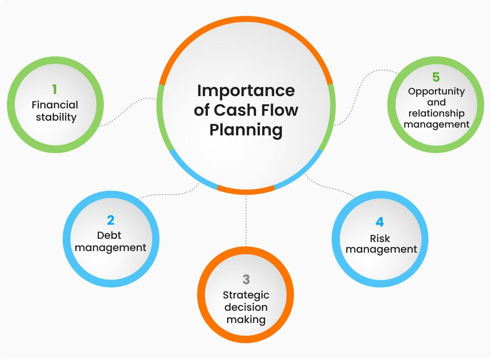

## Table of Contents

## What is a cash flow plan?

A cash flow plan is like a budget that helps you keep track of the money coming in and going out of your pocket or business. It shows you how much money you expect to receive from things like your job, investments, or selling products, and how much you plan to spend on things like rent, food, and other expenses. By making a cash flow plan, you can see if you will have enough money to cover your costs or if you need to make changes to your spending or earning habits.

Having a good cash flow plan can help you avoid running out of money and getting into debt. It lets you plan for the future, save for big purchases, and make sure you can pay your bills on time. If you find that your expenses are more than your income, you can use the plan to figure out where you can cut back or find ways to bring in more money. Overall, a cash flow plan is a useful tool for managing your finances and making smart money decisions.

## Why is a cash flow plan important for businesses?

A cash flow plan is really important for businesses because it helps them know if they will have enough money to pay for things like rent, salaries, and supplies. By making a plan, a business can see when money will come in from sales or services and when it needs to go out for expenses. This helps the business avoid running out of money and getting into trouble. If a business knows it will be short on cash at some point, it can plan ahead to get a loan or find other ways to bring in money.

Also, a cash flow plan helps businesses make smart decisions about growing or investing. If a business wants to buy new equipment or open a new location, it can use the plan to see if it can afford it without hurting its ability to pay bills. This way, the business can grow safely and not take big risks that could lead to problems. Overall, having a good cash flow plan helps a business stay healthy and plan for the future.

## How does a cash flow plan differ from a budget?

A cash flow plan and a budget are both tools that help you manage your money, but they focus on different things. A budget is like a plan that shows how you want to spend your money over a certain time, like a month or a year. It helps you set limits on how much you will spend on things like food, rent, and fun stuff. A budget is more about planning and setting goals for your spending.

On the other hand, a cash flow plan is more about tracking the actual money coming in and going out. It shows you when you will get money from your job or other sources and when you need to pay for things. A cash flow plan helps you see if you will have enough money at any given time to cover your costs. It's more about the timing of your money and making sure you don't run out of cash.

Both tools are important, but they serve different purposes. A budget helps you plan your spending and saving, while a cash flow plan helps you manage the timing of your money to avoid cash shortages. Using both together can give you a complete picture of your financial health and help you make better money decisions.

## What are the key components of a cash flow plan?

A cash flow plan has a few main parts that help you keep track of your money. The first part is your income, which is all the money you expect to get. This can come from your job, any investments you have, or money you make from selling things. Knowing when and how much money will come in is really important for making a good plan.

The second part is your expenses, which are all the things you need to spend money on. This includes things like rent, food, bills, and anything else you buy. It's important to know when these expenses will happen so you can make sure you have enough money to cover them. The last part is your cash flow, which is the difference between your income and your expenses. If you have more money coming in than going out, you have a positive cash flow. If you spend more than you earn, you have a negative cash flow, and you might need to make changes to your plan.

Putting all these parts together helps you see if you will have enough money at any time. It lets you plan for the future, save for big things, and make sure you can pay your bills on time. By keeping an eye on your cash flow plan, you can make smart choices about your money and avoid running out of cash.

## How do you create a basic cash flow plan?

To create a basic cash flow plan, start by figuring out all the money you expect to get. This includes your salary, any money from investments, or cash from selling things. Write down how much you will get and when you will get it. This part is called your income. Next, list all the things you need to spend money on. This includes rent, food, bills, and anything else you buy. Write down how much each thing costs and when you need to pay for it. This part is called your expenses.

After you have your income and expenses written down, you can see if you will have enough money at any time. Subtract your expenses from your income to find out your cash flow. If you have more money coming in than going out, you have a positive cash flow. If you spend more than you earn, you have a negative cash flow. Look at your plan and see if you need to change anything. Maybe you can spend less on some things or find ways to bring in more money. By keeping an eye on your cash flow plan, you can make sure you always have enough money to cover your costs.

## What are common methods for forecasting cash flow?

Forecasting cash flow means trying to guess how much money will come in and go out in the future. One common way to do this is by looking at past records. You can use old bank statements, invoices, and receipts to see how much money you got and spent in the past. This helps you make a good guess about what might happen in the future. For example, if you know you usually get paid on the 1st and 15th of each month, you can plan for that in your forecast.

Another way to forecast cash flow is by using a cash flow statement. This is a document that shows your income and expenses over a certain time, like a month or a year. By looking at this statement, you can see patterns and trends in your money. You can also use software or apps that help you make these forecasts. These tools can take your past data and use it to predict what might happen next. By using these methods, you can plan better and make sure you will have enough money when you need it.

## How can cash flow plans be used to manage financial risks?

A cash flow plan can help you manage financial risks by showing you when you might run out of money. If you see that you will spend more than you earn in the future, you can take steps to avoid this problem. For example, you might decide to save more money now or cut back on some expenses. By planning ahead, you can make sure you have enough money to cover your costs and avoid getting into debt.

Another way a cash flow plan helps manage financial risks is by letting you see when big payments are coming up. If you know you need to pay a big bill or make a large purchase, you can plan for it in advance. This means you can save up or find other ways to get the money you need without causing a cash shortage. By keeping an eye on your cash flow, you can make smart choices and avoid surprises that could hurt your finances.

## What are some advanced techniques for optimizing cash flow plans?

One advanced technique for optimizing cash flow plans is to use scenario analysis. This means you create different "what if" situations to see how changes might affect your money. For example, you can see what would happen if your income went up or down, or if you had to pay a big unexpected bill. By looking at these different scenarios, you can plan for the future and be ready for anything that might happen. This helps you make better decisions and avoid financial problems.

Another technique is to use cash flow forecasting tools and software. These tools can take your past data and use it to predict what might happen next. They can also help you see trends and patterns in your money, so you can make smart choices about saving and spending. Some software even lets you connect to your bank accounts and automatically update your cash flow plan. By using these tools, you can keep your plan up to date and make sure you always have enough money to cover your costs.

## Can you provide examples of cash flow plans in different industries?

In the retail industry, a cash flow plan might look at the money coming in from selling clothes and other items. A store owner would list all the sales they expect to make each month and when they will get paid for those sales. They would also list all their expenses, like rent for the store, salaries for employees, and the cost of buying new stock. By comparing their income and expenses, the store owner can see if they will have enough money to keep the store running smoothly. If they see a time when they might run out of cash, they can plan to get a loan or find other ways to bring in more money.

In the construction industry, a cash flow plan might focus on the money coming in from building projects and the money going out for materials and labor. A construction company would list all the payments they expect to get from their clients and when they will receive them. They would also list all their costs, like buying cement and wood, paying workers, and renting equipment. By looking at their cash flow plan, the company can see if they will have enough money to finish their projects on time. If they see a cash shortage coming up, they can plan to delay some expenses or ask clients for payments sooner.

In the tech industry, a cash flow plan might look at the money coming in from selling software or services and the money going out for research and development. A tech company would list all the income they expect from their products and when they will get it. They would also list all their expenses, like paying engineers, buying new computers, and marketing their products. By keeping an eye on their cash flow plan, the company can see if they will have enough money to keep developing new technology. If they see a time when they might run low on cash, they can plan to raise more money from investors or cut back on some costs.

## How do seasonal businesses adjust their cash flow plans?

Seasonal businesses have to be really careful with their cash flow plans because their income and expenses can change a lot throughout the year. For example, a ski resort might make most of its money in the winter but have very little income in the summer. To deal with this, the business needs to save up money during the busy season to cover costs during the slow season. They can do this by setting aside some of their income each month into a savings account. This way, when the slow season comes, they will have enough money to pay for things like rent, salaries, and other expenses.

Another way seasonal businesses adjust their cash flow plans is by changing their expenses based on the time of year. During the busy season, they might spend more on things like hiring extra workers or buying more supplies. But during the slow season, they can cut back on these costs to save money. For example, a beach resort might hire more lifeguards in the summer but fewer in the winter. By planning their expenses carefully, seasonal businesses can make sure they have enough money to get through the whole year without running into financial trouble.

## What software tools are available to help manage cash flow plans?

There are many software tools that can help you manage your cash flow plans. One popular tool is QuickBooks, which is great for small businesses. It lets you keep track of your income and expenses, and it can even make forecasts based on your past data. Another tool is Xero, which is also easy to use and can connect to your bank accounts to automatically update your cash flow plan. Both of these tools can help you see if you will have enough money at any time and make smart choices about your spending and saving.

Another useful software is FreshBooks, which is good for freelancers and small businesses. It helps you create invoices and track when you get paid, so you can see your cash flow clearly. If you want something more advanced, you can use CashAnalytics, which is made just for cash flow forecasting. It can help you plan for different scenarios and see how changes might affect your money. By using these tools, you can keep your cash flow plan up to date and make sure you always have enough money to cover your costs.

## How do multinational companies handle cash flow planning across different currencies?

Multinational companies have to deal with cash flow planning in different countries, which means they need to handle different currencies. They do this by keeping track of how much money they will get and spend in each currency. They use a special tool called a currency conversion rate to change the money from one currency to another. This helps them see if they will have enough money in each country to cover their costs. If they see that one currency is getting weaker, they might decide to change some of their money into a stronger currency to avoid losing money.

To make their cash flow plans work well, multinational companies also use something called hedging. This means they can protect themselves from big changes in currency values. For example, if they know they will need to pay for something in a different currency in the future, they can use hedging to lock in the current exchange rate. This way, even if the currency changes a lot, they will still know exactly how much it will cost them. By using these methods, multinational companies can manage their cash flow across different countries and make sure they always have enough money to run their business.

## What is the importance of understanding cash flow in business finance?

Cash flow management is integral to maintaining a company's financial health, as it ensures both liquidity and operational efficiency. In essence, cash flow tracks the movement of money into and out of a business, providing vital information that supports financial planning and helps meet financial obligations.

Cash flow can be categorized into three primary types: operational, investing, and financing. Each type offers unique insights into different facets of a business. 

Operational cash flow represents the cash generated or consumed by a company’s core business activities. It indicates business efficiency by revealing how well a company can convert its net income into cash. This type of cash flow answers whether a company can maintain and grow its operations without needing external financing. For example, operating cash flow can be calculated using the formula:

$$
\text{Operating Cash Flow} = \text{Net Income} + \text{Non-cash Expenses} + \text{Change in Working Capital}
$$

Investing cash flow refers to the cash used for or generated from investment activities, such as purchasing or selling assets like equipment or securities. It provides insight into a company's growth strategy by highlighting its investment in long-term assets. Positive investing cash flow might indicate divestment, while negative cash flow often suggests active investment in future growth prospects.

Financing cash flow involves the influx of cash from investors and lenders as well as the outflows associated with paying dividends or repaying debt. This category reveals a company’s capital structure strategy and includes transactions that alter the equity and long-term liabilities of a business. 

By conducting thorough cash flow analysis, companies can plan for future investments and effectively manage [liquidity](/wiki/liquidity-risk-premium) challenges. Understanding the nuances of cash flows allows businesses to align their operations with financial strategies, ensuring resources are available for both day-to-day operations and long-term growth. Analyzing these cash flow components helps a business stay solvent, attract investors by demonstrating financial health, and strategically allocate resources to areas of highest return.

## What is the role of financial analysis in decision-making?

Financial analysis is pivotal in assessing a company's performance and guiding strategic decisions. At its core, financial analysis involves evaluating a business's financial statements to understand its current and future financial condition, enabling management to make informed strategic decisions. One of the most critical components of financial analysis is cash flow analysis, which provides real-time insights into a company's financial operations and directly influences strategic choices.

Cash flow analysis involves examining the inflows and outflows of cash within a business, offering a transparent view of how well the company generates cash to pay its debt obligations, fund its operating expenses, and support its capital expenditures. The primary metrics used in cash flow analysis are free cash flow, operating cash flow, and comprehensive free cash flow.

1. **Free Cash Flow (FCF):** This metric represents the cash generated by the business after accounting for capital expenditures required to maintain or expand the asset base. It is calculated as:
$$
   \text{Free Cash Flow} = \text{Operating Cash Flow} - \text{Capital Expenditures}

$$

   A positive FCF indicates that the company can cover its expenditures and potentially invest in growth opportunities, pay dividends, or reduce its debts, which is attractive to investors.

2. **Operating Cash Flow (OCF):** This represents the cash generated from the normal operational activities of the business and reflects the firm's ability to generate sufficient cash to maintain its operations. It can be calculated from the income statement, adjusting net income for non-cash expenses and changes in working capital:
$$
   \text{Operating Cash Flow} = \text{Net Income} + \text{Non-Cash Expenses} + \text{Changes in Working Capital}

$$

   OCF is crucial for assessing whether the company has ample cash inflow to cover its short-term liabilities.

3. **Comprehensive Free Cash Flow (CFCF):** This broader metric includes considerations for common items that might require cash in the future, providing a more extensive overview of a company’s financial health:
$$
   \text{Comprehensive Free Cash Flow} = \text{Free Cash Flow} - \text{Obligatory Future Commitments}

$$

These metrics collectively illuminate a company's financial health by indicating its efficiency in generating cash, its potential for growth, and its capacity to remain solvent. A detailed cash flow analysis can help the management team direct their strategic planning, ensuring that the company remains robust during financial uncertainties and appeals to potential investors through a demonstrated capability of managing and using cash effectively.

Moreover, these insights are indispensable for maintaining financial stability, as they provide a framework for making operational, investing, and financing decisions. For instance, understanding free cash flow trends can inform whether a company should pursue acquisitions or pay down debt, while operating cash flow analysis can indicate the need for operational efficiency improvements.

In conclusion, financial analysis, underscored by meticulous cash flow analysis, serves as a fundamental tool in strategic decision-making. It empowers businesses to maintain financial health, effectively plan for future investments, and attract investors by exhibiting robust financial management practices.

## References & Further Reading

1. **"Principles of Corporate Finance" by Richard A. Brealey, Stewart C. Myers, and Franklin Allen**  
   This book provides foundational knowledge on corporate finance, including cash flow analysis and its critical role in business finance. It explores diverse financial strategies and tools essential for effective financial management.

2. **"Algorithmic Trading and DMA: An Introduction to Direct Access Trading Strategies" by Barry Johnson**  
   Focusing on [algorithmic trading](/wiki/algorithmic-trading), this book combines practical strategies with theoretical underpinnings. It covers the use of technology and algorithms to enhance trading efficiency, providing insights into developing robust trading systems.

3. **"Python for Finance: Analyze Big Financial Data" by Yves Hilpisch**  
   Yves Hilpisch introduces the application of Python in finance, detailing how libraries like Pandas and NumPy assist in developing algorithmic strategies. This book is valuable for understanding data-driven financial analysis.

4. **"Machine Learning for Asset Managers" by Marcos López de Prado**  
   Explores how [machine learning](/wiki/machine-learning) techniques contribute to financial decision-making and strategy development. It covers practical examples and methodologies for integrating AI in financial operations and trading.

5. **Case Study: "The Impact of Algorithmic Trading on Liquidity" by Albert J. Menkveld**  
   This academic article evaluates how algorithmic trading affects market liquidity, providing empirical evidence and analysis on its real-world implications. It is essential for those interested in the practical impacts of algorithmic strategies.

6. **"Financial Analytics with R: Building a Laptop Laboratory for Data Science" by Mark J. Bennett and Dirk L. Hugen**  
   This text offers a guide to using R for financial analytics, focusing on constructing models and applications relevant to modern financial strategies. It includes examples of integrating statistical analysis with financial data.

7. **"Big Data in Finance: The New Frontier for Innovation in the Future" by Irene Aldridge and Steven Krawciw**  
   Explores advancements in big data technologies and how these innovations shape financial strategies. It examines the integration of data analytics in understanding and predicting market behaviors.

8. **"Quantitative Financial Risk Management" by Constantin Zopounidis and Emilios Galariotis**  
   Provides extensive coverage of quantitative methods for risk assessment in financial markets. It combines theoretical frameworks with practical applications, highlighting how quantitative tools support effective risk management and strategic planning.

