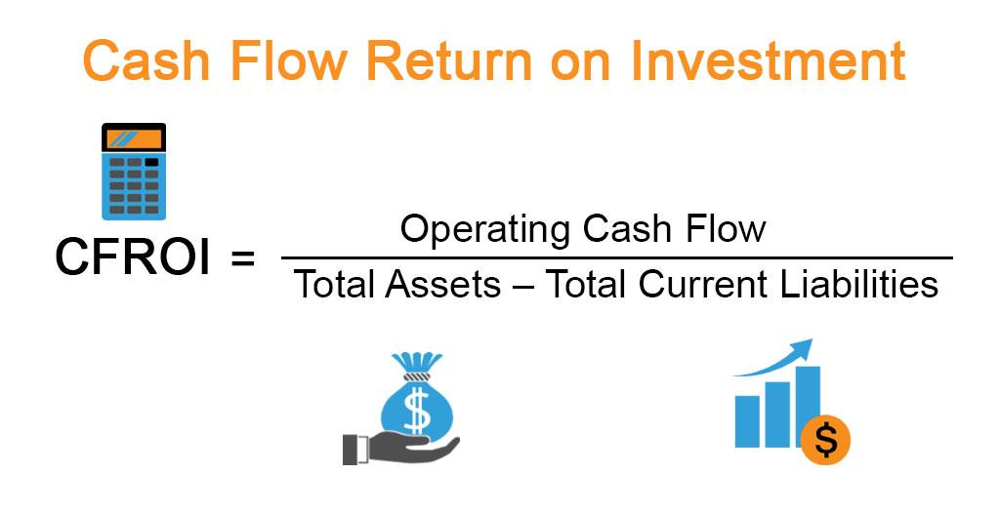

## Table of Contents

## What is Cash Flow Return on Investment (CFROI)?

Cash Flow Return on Investment (CFROI) is a way to measure how well a company is using its money to make more money. It looks at the cash that a company gets from its business activities and compares it to the amount of money the company has invested. This helps investors see if the company is a good place to put their money. CFROI is different from other measures because it focuses on cash flow instead of accounting profits, which can be affected by many different rules and estimates.

To calculate CFROI, you first find out the total cash flow that the company gets from its operations. Then, you subtract any money the company needs to keep the business running and to replace old equipment. After that, you divide this adjusted cash flow by the amount of money the company has invested in its business. The result is a percentage that shows how much cash the company is making for each dollar it has invested. A higher CFROI means the company is doing a better job of turning its investments into cash.

## How is CFROI calculated?

To calculate CFROI, you start by figuring out the total cash flow from the company's operations. This means looking at the money coming in from sales and other business activities. Then, you need to take away the money the company spends to keep the business going and to replace old equipment. This gives you the adjusted cash flow, which is the money left over after the company pays for its basic needs.

Next, you divide this adjusted cash flow by the amount of money the company has invested in its business. This includes things like buildings, machines, and other assets. The result is a percentage that shows how much cash the company makes for each dollar it has invested. A higher CFROI means the company is good at turning its investments into cash.

## Why is CFROI important for investors?

CFROI is important for investors because it tells them how well a company is using its money to make more money. It shows if the company is good at turning its investments into cash. Investors like to see a high CFROI because it means the company is making a lot of cash for each dollar it has invested. This can help investors decide if they want to put their money into the company.

Another reason CFROI is important is that it focuses on real cash flow, not just accounting numbers. Accounting profits can be tricky because they can be affected by many different rules and guesses. CFROI gives a clearer picture of how much actual money the company is making. This helps investors trust the numbers more and make better choices about where to invest their money.

## What are the key components of CFROI?

The key components of CFROI are the adjusted cash flow and the total investment. Adjusted cash flow is the money a company makes from its business activities after taking away the costs to keep the business running and to replace old equipment. This shows how much cash is left over that can be used for other things like paying back investors or growing the business.

Total investment is the amount of money the company has put into its business. This includes things like buildings, machines, and other assets that help the company make money. By dividing the adjusted cash flow by the total investment, you get the CFROI, which tells you how much cash the company makes for each dollar it has invested.

## How does CFROI differ from other return metrics like ROI and ROE?

CFROI, or Cash Flow Return on Investment, is different from other return metrics like ROI (Return on Investment) and ROE (Return on Equity) because it focuses on cash flow instead of accounting profits. ROI looks at the profit made from an investment compared to the cost of that investment. It can be used for any kind of investment, not just business. ROE, on the other hand, measures the profit a company makes compared to the money shareholders have invested. Both ROI and ROE use accounting numbers, which can be affected by different rules and estimates.

CFROI, however, uses real cash flow, which is the money a company actually gets from its business activities. This makes CFROI a more reliable measure because it's harder to manipulate cash flow numbers. CFROI also takes into account the money needed to keep the business running and to replace old equipment, which gives a clearer picture of how much cash is really being made. This focus on cash flow helps investors see if a company is good at turning its investments into cash, which is important for making smart investment choices.

## Can you provide an example of how to calculate CFROI for a company?

Let's say a company called ABC Corp made $1 million from its business last year. To keep the business going and to replace old equipment, ABC Corp spent $300,000. So, the adjusted cash flow for ABC Corp is $1 million minus $300,000, which is $700,000. Now, let's say ABC Corp has invested $5 million in its business, like buildings and machines. To find the CFROI, you divide the adjusted cash flow of $700,000 by the total investment of $5 million.

When you do the math, $700,000 divided by $5 million is 0.14, or 14%. This means ABC Corp makes 14 cents of cash for every dollar it has invested. A CFROI of 14% shows that ABC Corp is doing a good job of turning its investments into cash. If another company had a lower CFROI, like 10%, ABC Corp would look like a better place to invest money because it's making more cash from its investments.

## What are the limitations of using CFROI as a performance measure?

CFROI is a good way to see how well a company is doing, but it has some problems. One big problem is that it can be hard to figure out the right numbers to use. For example, you need to guess how long the company's buildings and machines will last. If you guess wrong, the CFROI number won't be right. Also, different people might use different ways to calculate CFROI, which can make it hard to compare companies.

Another problem is that CFROI only looks at cash flow and doesn't think about other important things. For example, it doesn't look at how much risk the company is taking or how fast it is growing. A company might have a high CFROI but be doing risky things that could hurt it later. So, while CFROI is useful, it's not the only thing investors should look at when deciding where to put their money.

## How can CFROI be used to compare companies across different industries?

CFROI can be used to compare companies across different industries by looking at how much cash each company makes from its investments. Since CFROI focuses on cash flow instead of accounting profits, it gives a clearer picture of how well a company is using its money. This makes it easier to compare companies in different industries because cash flow is a straightforward measure that isn't affected by different accounting rules. For example, if a tech company has a CFROI of 15% and a manufacturing company has a CFROI of 10%, you can see that the tech company is better at turning its investments into cash.

However, there are some challenges when using CFROI to compare companies across industries. Different industries might need different amounts of money to keep running and to replace old equipment. This means the adjusted cash flow can be different, even if the companies are the same size. Also, some industries might have higher risks or different growth rates, which CFROI doesn't take into account. So, while CFROI is a good tool for comparing companies, it's important to look at other things too, like how risky the industry is or how fast it's growing.

## What role does CFROI play in investment decision-making?

CFROI helps investors decide where to put their money by showing how well a company turns its investments into cash. If a company has a high CFROI, it means the company is good at making money from what it has spent on its business. Investors like to see high CFROI because it means their money is being used well. For example, if a company has a CFROI of 20%, it's making 20 cents of cash for every dollar it has invested. This makes it a more attractive place to invest compared to a company with a lower CFROI.

However, CFROI is just one part of the puzzle. Investors also need to look at other things like how risky the company is or how fast it's growing. CFROI doesn't tell the whole story because it only looks at cash flow. So, while a high CFROI is good, investors should also think about other factors before making a decision. By using CFROI along with other measures, investors can get a better idea of where to put their money for the best results.

## How can a company improve its CFROI?

A company can improve its CFROI by focusing on making more money from its business activities. This means finding ways to increase sales or charge more for what they sell. For example, a company could start selling new products or services, or it could find new customers. Another way to improve CFROI is by cutting costs. This could mean spending less on things like rent, supplies, or salaries. By making more money or spending less, the company will have more cash left over after paying for its basic needs, which will make the CFROI go up.

Another way to boost CFROI is by being smart about where the company spends its money. This means investing in things that will help the business make more money in the future. For example, the company could buy new machines that help make products faster or cheaper. It's also important to keep the business running smoothly so that money isn't wasted on fixing problems. By choosing the right investments and keeping costs down, a company can turn its investments into more cash, which will improve its CFROI.

## What are some advanced techniques for adjusting CFROI calculations?

One way to make CFROI calculations better is by using something called inflation-adjusted cash flows. This means looking at how much money the company makes after taking away the effects of rising prices. This can give a more accurate picture of how well the company is doing. Another technique is to use a more detailed way of figuring out how long the company's buildings and machines will last. This helps make sure the CFROI number is as correct as possible.

Another advanced technique is to use a weighted average cost of capital (WACC) to compare the CFROI to what it costs the company to get money. This helps see if the company is making more money than it's spending on loans or other ways of getting money. By using these advanced techniques, investors can get a clearer idea of how well the company is doing and if it's a good place to put their money.

## How does CFROI relate to a company's long-term sustainability and growth?

CFROI is important for a company's long-term sustainability and growth because it shows how well the company is using its money to make more money. If a company has a high CFROI, it means it is good at turning its investments into cash. This is important for long-term growth because it means the company can keep making money and use that money to grow even more. For example, if a company has a high CFROI, it can use the extra cash to invest in new projects or expand into new markets, which helps the company grow over time.

On the other hand, a low CFROI might mean the company is not using its money well, which can hurt its long-term sustainability. If a company can't make enough cash from its investments, it might not have the money it needs to keep the business going or to grow. This can make it hard for the company to stay strong over time. So, by keeping an eye on CFROI, a company can make sure it is on the right track for long-term success and growth.

## What is Cash Flow Return on Investment (CFROI) and how can it be understood?

Cash Flow Return on Investment (CFROI) is a critical valuation metric that measures the cash flow generated by a company's investments relative to its cost of capital. Distinguishing itself from traditional Return on Investment (ROI) metrics, which emphasize net income, CFROI places a greater focus on cash flow. This shift enables a more accurate depiction of a company's financial health and offers a clearer understanding of its economic performance.

The computation of CFROI involves dividing the company's operating cash flow by the capital employed, which includes both equity and debt capital. The formula can be expressed as follows:

$$
\text{CFROI} = \frac{\text{Operating Cash Flow}}{\text{Capital Employed}}
$$

Here, operating cash flow is the net cash generated from a company's operational activities, while capital employed refers to the total funds used for acquiring profits, encompassing both equity and debt.

One of the distinguishing features of CFROI is its ability to account for inflation and other financial distortions. This ensures that the assessment remains relevant and reflective of the true economic performance over time, providing a cleaner and more accurate view of a company's financial trajectory.

By focusing on cash flows instead of merely accounting profits, CFROI provides valuable insights into a company's efficiency in utilizing its capital to generate economic returns. This emphasis on cash flow is crucial since it indicates whether a company is capable of sustaining its operations, investing in growth opportunities, and returning value to shareholders without relying excessively on external financing.

The adoption of CFROI as a metric underscores its ability to portray an authentic picture of how effectively a company employs its resources. It serves as a significant tool for investors and financial analysts in their quest to evaluate the true economic potential and sustainability of a company's investment strategies, making it an essential addition to any robust financial analysis toolkit.

## References & Further Reading

[1]: Beer, S., & Thomsen, S. (2017). ["Cash Flow Return on Investment (CFROI): The Choice of the Benchmark Portfolio Matters,"](https://fastercapital.com/content/Cash-Flow-Return-on-Investment--Measuring-Investment-Success--Understanding-CFROI.html) International Review of Financial Analysis, 54, 10-26.

[2]: Rappaport, A. (1986). ["Creating Shareholder Value: The New Standard for Business Performance,"](https://archive.org/details/creatingsharehol00rapp) Free Press.

[3]: Copeland, T., Koller, T., & Murrin, J. (1994). ["Valuation: Measuring and Managing the Value of Companies."](https://www.amazon.com/Valuation-Measuring-Managing-Companies-Frontiers/dp/0471086274) Wiley Finance.

[4]: Lopez de Prado, M. (2018). ["Advances in Financial Machine Learning."](https://www.amazon.com/Advances-Financial-Machine-Learning-Marcos/dp/1119482089) Wiley.

[5]: Chan, E. (2009). ["Quantitative Trading: How to Build Your Own Algorithmic Trading Business."](https://github.com/ftvision/quant_trading_echan_book) Wiley Trading.

[6]: Jansen, S. (2020). ["Machine Learning for Algorithmic Trading: Predictive Models to Extract Signals from Market and Alternative Data for Systematic Trading Strategies."](https://www.amazon.com/Machine-Learning-Algorithmic-Trading-alternative/dp/1839217715) Packt Publishing.

[7]: Parrino, R., & Kidwell, D. S. (2009). ["Fundamentals of Corporate Finance."](https://www.amazon.com/Fundamentals-Corporate-Finance-Loose-leaf-Companion/dp/1119371406) Wiley.