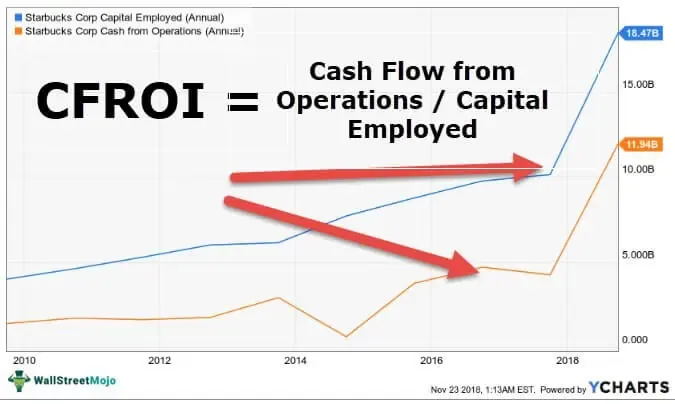

In the ever-evolving world of finance, understanding various investment metrics is essential for investors striving to optimize their portfolios. Cash Flow Return on Investment (CFROI) is a pivotal metric that evaluates the economic performance of a company's investments. Unlike traditional Return on Investment (ROI), CFROI focuses on cash flow rather than net income, thus offering a more accurate reflection of a company's financial health. As algorithmic trading becomes increasingly prevalent, CFROI has garnered recognition as a valuable tool for evaluating and executing investment strategies.

This article examines the intersection of cash flow investment returns, CFROI, and algorithmic trading, providing insights into enhancing investment decision-making. By understanding how CFROI measures the cash flow generated relative to the capital employed, investors can gain a clearer view of a company's ability to generate economic returns. Moreover, when incorporated into the algorithmic trading process, CFROI serves as a reliable valuation metric, augmenting the precision with which investment opportunities are identified and pursued.



Furthermore, the discussion extends to practical aspects, such as strategies for maximizing investment returns. These strategies include identifying undervalued stocks through CFROI analysis and leveraging real-time market data to adjust portfolios dynamically in response to changing conditions. Readers will also learn how to compare CFROI to the cost of capital to assess the efficiency of capital utilization by firms.

By the conclusion of this article, readers will have a comprehensive grasp of how CFROI can be integrated into algorithmic trading frameworks to achieve superior investment outcomes. The insights provided will enable investors to make informed decisions based on a deeper understanding of a company's financial health and potential returns, ultimately focusing on the core driver of value: cash flow.

## Table of Contents

## Understanding Cash Flow Return on Investment (CFROI)

Cash Flow Return on Investment (CFROI) is a critical valuation metric that measures the cash flow generated by a company's investments relative to its cost of capital. Distinguishing itself from traditional Return on Investment (ROI) metrics, which emphasize net income, CFROI places a greater focus on cash flow. This shift enables a more accurate depiction of a company's financial health and offers a clearer understanding of its economic performance.

The computation of CFROI involves dividing the company's operating cash flow by the capital employed, which includes both equity and debt capital. The formula can be expressed as follows:

$$
\text{CFROI} = \frac{\text{Operating Cash Flow}}{\text{Capital Employed}}
$$

Here, operating cash flow is the net cash generated from a company's operational activities, while capital employed refers to the total funds used for acquiring profits, encompassing both equity and debt.

One of the distinguishing features of CFROI is its ability to account for inflation and other financial distortions. This ensures that the assessment remains relevant and reflective of the true economic performance over time, providing a cleaner and more accurate view of a company's financial trajectory.

By focusing on cash flows instead of merely accounting profits, CFROI provides valuable insights into a company's efficiency in utilizing its capital to generate economic returns. This emphasis on cash flow is crucial since it indicates whether a company is capable of sustaining its operations, investing in growth opportunities, and returning value to shareholders without relying excessively on external financing.

The adoption of CFROI as a metric underscores its ability to portray an authentic picture of how effectively a company employs its resources. It serves as a significant tool for investors and financial analysts in their quest to evaluate the true economic potential and sustainability of a company's investment strategies, making it an essential addition to any robust financial analysis toolkit.

## The Role of CFROI in Algorithmic Trading

Algorithmic trading leverages advanced algorithms to conduct trades, and incorporating Cash Flow Return on Investment (CFROI) in these systems adds a layer of financial robustness and precision. CFROI serves as a reliable valuation metric that sheds light on the economic return a company generates relative to its total capital investment, focusing on actual cash flows rather than accounting figures like net income.

Traders can use CFROI to identify undervalued stocks by comparing the CFROI of a company with its stock price. If a company has a high CFROI but its stock price is low, it might indicate that the stock is undervalued, offering a potential investment opportunity. This approach allows traders to exploit mismatches between cash flow-generated economic returns and market valuation, capitalizing on discrepancies in market perceptions.

Integrating CFROI into [algorithmic trading](/wiki/algorithmic-trading) models enhances risk assessment capabilities. Typically, firms with higher CFROIs reflect efficient capital use and generate sufficient returns above their cost of capital. As such, these firms generally [carry](/wiki/carry-trading) lower financial risk, making them more attractive for inclusion in automated trading strategies. By using CFROI as a filter, algorithmic models can hone in on potentially more stable investments.

Algorithms can also utilize historical CFROI data to forecast future trends. By analyzing past CFROI performance, these systems can discern patterns and make projections, which are crucial for creating forward-looking trading strategies. Python, a popular programming language in algorithmic trading, can process CFROI data and conduct time-series analysis to predict future financial performance:

```python
import pandas as pd
from statsmodels.tsa.arima.model import ARIMA

# Load CFROI data from a CSV file into a DataFrame
cfroi_data = pd.read_csv('cfroi_data.csv', parse_dates=['Date'], index_col='Date')

# Fit an ARIMA model to CFROI data
model = ARIMA(cfroi_data['CFROI'], order=(1, 1, 1))
model_fit = model.fit()

# Forecast future CFROI values
forecast = model_fit.forecast(steps=12)
print(forecast)
```

By implementing such models, algorithmic systems can continuously adjust trading strategies based on anticipated CFROI trajectories, improving decision-making in volatile markets.

In summary, the integration of CFROI into algorithmic trading provides a dual advantage of enhancing valuation accuracy and risk assessment. By focusing on core financial metrics like CFROI, algorithmic traders can improve their investment strategies, achieving more informed and potentially lucrative financial outcomes.

## Maximizing Investment Returns with CFROI and Algo Trading

Investors seeking to maximize returns in today’s dynamic financial markets can effectively leverage Cash Flow Return on Investment (CFROI) by integrating it with algorithmic trading strategies. This combination enables a more efficient allocation of capital and a systematic approach to identifying high-potential investment opportunities.

Focusing on companies that exhibit a CFROI exceeding their cost of capital ensures that investments contribute positively to wealth creation. By concentrating on these firms, investors can ascertain that their resources are employed in a manner that promises optimal economic returns. CFROI serves as an indicator of a company's ability to convert invested capital into cash flow, highlighting those businesses that consistently generate value above their capital cost.

Algorithmic models, programmed with CFROI metrics, facilitate the continual evaluation of companies across various sectors. By automating the assessment process, these models can rapidly sort through extensive datasets to discover securities that match specified CFROI criteria. For example, a Python-based algorithm might analyze historical and current CFROI data to rank stocks based on their relative performance, automatically adjusting investment portfolios to prioritize superior CFROI entities. Below is a simplistic example of how such an algorithm could be structured:

```python
import pandas as pd

def select_high_cfroi_stocks(data, cost_of_capital):
    # Data should be a DataFrame with columns: ['Company', 'CFROI']
    high_cfroi_stocks = data[data['CFROI'] > cost_of_capital]
    return high_cfroi_stocks.sort_values(by='CFROI', ascending=False)

# Assuming 'df' is our DataFrame and '5%' is the cost of capital
high_cfroi_stocks = select_high_cfroi_stocks(df, 0.05)

print(high_cfroi_stocks)
```

CFROI, when used alongside real-time market data, enhances an investor’s ability to respond to fluctuating market conditions. Algorithmic trading systems equipped with live data feeds can adjust strategies dynamically, capitalizing on sudden shifts and emerging trends. This responsive adaptation allows for the timely reallocation of assets from underperforming investments to those with imminent potential, driven by high CFROI values.

By incorporating CFROI with these algorithmic systems, investors can fine-tune their strategies to actively manage risk and seize profitable opportunities as they materialize. Therefore, the synthesis of CFROI and algorithmic trading provides a robust framework for maximizing investment returns by aligning strategic decisions with one of the most fundamental drivers of business success: robust cash flow generation.

## Limitations and Considerations

Cash Flow Return on Investment (CFROI) is a valuable financial metric, but it comes with certain limitations and considerations, which investors must be aware of to make informed decisions.

One significant limitation of CFROI is its inability to fully account for industry-specific capital intensities. Different industries have varying capital requirements and investment cycles, which can distort CFROI measurements. For instance, capital-intensive industries like manufacturing may show a lower CFROI due to higher fixed asset investments compared to service-oriented sectors, which might skew the perceived efficiency of capital utilization.

Another consideration is the potential for cash flow manipulation by companies. Companies might engage in strategic financial practices, such as delaying payments or accelerating collections, to artificially inflate cash flow figures. This manipulation can lead to an inaccurate CFROI, thereby misleading investors regarding a firm's actual financial health. It is essential for investors to critically evaluate the quality of reported cash flows, looking beyond the numbers to understand the context of such figures.

Given these limitations, investors should avoid relying solely on CFROI. It is prudent to use CFROI in conjunction with other financial metrics to obtain a comprehensive view of a company’s performance. Metrics such as Return on Equity (ROE), Price-to-Earnings (P/E) ratio, and Debt-to-Equity ratio can provide additional insights that CFROI alone might not capture. A multi-metric approach ensures a more balanced assessment by addressing various aspects of financial health and market conditions.

Furthermore, the dynamic nature of financial markets necessitates the continual updating of algorithmic models. Market conditions can change rapidly, and what held true previously might not apply in new circumstances. Models incorporating CFROI should be regularly revised to reflect current market data and economic forecasts. This practice ensures that the output from such models remains relevant and accurate, enabling timely and informed investment decisions.

In summary, while CFROI is a powerful tool for assessing economic returns, investors must be cognizant of its limitations. By using CFROI alongside other financial analyses and maintaining updated algorithmic models, investors can more effectively navigate the complexities of evaluating company performance.

## Conclusion

Cash Flow Return on Investment (CFROI) serves as an effective measure for assessing the economic performance of investments, particularly when combined with algorithmic trading strategies. By emphasizing cash flows, CFROI provides a clearer image of a company's financial health and operational efficiency, surpassing traditional income-based metrics. This approach ensures that capital investments are judiciously examined, allowing for better-informed decision-making in financial analysis.

Integrating CFROI within algorithmic trading frameworks offers investors a significant edge. Algorithms can leverage CFROI data to predict and swiftly respond to market conditions, exploiting discrepancies between a company’s cash flow health and stock valuations. This strategic alignment enables investors to automate the identification of undervalued stocks and optimize portfolio performance.

The primary advantage of incorporating CFROI into investment strategies lies in its focus on cash flow as the core determinant of value creation. By highlighting the economic returns relative to the cost of capital, CFROI allows investors to identify and pursue investments that are likely to yield superior returns. Furthermore, the dynamic nature of algorithmic models facilitates ongoing assessment and adaptation to market changes, enhancing investors' ability to maintain competitive performance. 

In summary, CFROI proves invaluable when integrated with algorithmic trading, granting investors the tools needed to not only refine their decision-making processes but also achieve enhanced returns in an ever-evolving financial market. Leveraging the strengths of CFROI alongside algorithmic trading capabilities provides a pathway to maximizing investment potential through strategic, data-driven insights centered on cash flow performance.

## References & Further Reading

[1]: Beer, S., & Thomsen, S. (2017). ["Cash Flow Return on Investment (CFROI): The Choice of the Benchmark Portfolio Matters,"](https://fastercapital.com/content/Cash-Flow-Return-on-Investment--Measuring-Investment-Success--Understanding-CFROI.html) International Review of Financial Analysis, 54, 10-26.

[2]: Rappaport, A. (1986). ["Creating Shareholder Value: The New Standard for Business Performance,"](https://archive.org/details/creatingsharehol00rapp) Free Press.

[3]: Copeland, T., Koller, T., & Murrin, J. (1994). ["Valuation: Measuring and Managing the Value of Companies."](https://www.amazon.com/Valuation-Measuring-Managing-Companies-Frontiers/dp/0471086274) Wiley Finance.

[4]: Lopez de Prado, M. (2018). ["Advances in Financial Machine Learning."](https://www.amazon.com/Advances-Financial-Machine-Learning-Marcos/dp/1119482089) Wiley.

[5]: Chan, E. (2009). ["Quantitative Trading: How to Build Your Own Algorithmic Trading Business."](https://github.com/ftvision/quant_trading_echan_book) Wiley Trading.

[6]: Jansen, S. (2020). ["Machine Learning for Algorithmic Trading: Predictive Models to Extract Signals from Market and Alternative Data for Systematic Trading Strategies."](https://www.amazon.com/Machine-Learning-Algorithmic-Trading-alternative/dp/1839217715) Packt Publishing.

[7]: Parrino, R., & Kidwell, D. S. (2009). ["Fundamentals of Corporate Finance."](https://www.amazon.com/Fundamentals-Corporate-Finance-Loose-leaf-Companion/dp/1119371406) Wiley.