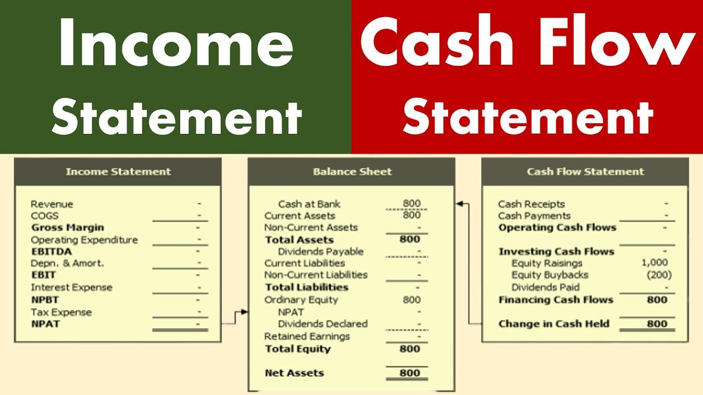

## Table of Contents

## What is a cash flow statement?

A cash flow statement is a financial document that shows how much money a business is making and spending over a certain period, usually a year. It's like a report card for the company's money, showing where the cash comes from and where it goes. This statement is important because it helps business owners, investors, and managers see if the company has enough money to pay its bills, invest in new projects, or return money to shareholders.

The cash flow statement is divided into three main parts: operating activities, investing activities, and financing activities. Operating activities show the cash made or spent from the company's main business, like selling products or services. Investing activities include money spent on or received from buying or selling things like equipment or property. Financing activities show how the company gets money from loans or investors and how it pays them back. By looking at these three parts, you can understand the overall health of the company's cash flow.

## What is an income statement?

An income statement is a financial report that shows how much money a business made and spent over a certain time, usually a year or a quarter. It's like a summary of the company's earnings and expenses, helping to see if the business made a profit or a loss. The income statement starts with the total revenue, which is all the money the company earned from selling its products or services. Then, it subtracts the costs of running the business, like the cost of goods sold, to find out the gross profit.

Next, the income statement lists all other expenses, such as salaries, rent, and utilities, which are subtracted from the gross profit to find the operating profit. If the company has other income or expenses, like interest or taxes, these are also included to calculate the net profit or net loss. The net profit is the final number on the income statement and shows whether the company made more money than it spent. This statement is crucial for business owners and investors to understand the financial performance of the company.

## How do the purposes of a cash flow statement and an income statement differ?

The purpose of a cash flow statement is to show how money moves in and out of a business over a certain time. It helps everyone see where the cash comes from and where it goes. This statement is split into three parts: operating activities, which show cash from the main business; investing activities, which show cash spent on or received from investments like equipment; and financing activities, which show cash from loans or investors. By looking at the cash flow statement, business owners and investors can tell if the company has enough cash to pay bills, invest in new projects, or give money back to shareholders.

The income statement, on the other hand, is all about showing if the business made a profit or a loss over a certain time. It starts with the total revenue, which is all the money the company made from selling things, and then subtracts the costs to find out the profit. This statement lists all the money the company made and spent, including the cost of goods sold, salaries, rent, and taxes. The final number on the income statement is the net profit or loss, which tells everyone if the company earned more than it spent. This helps business owners and investors understand the financial performance of the company.

## What are the main components of a cash flow statement?

The main parts of a cash flow statement are operating activities, investing activities, and financing activities. Operating activities show the cash that comes in and goes out from the main business things a company does, like selling products or services. This part tells you if the company is making money from its main job. It includes things like money from customers and money spent on making or buying the things the company sells.

Investing activities show the cash the company uses to buy things that will help it in the future, like machines or buildings, or the cash it gets from selling these things. This part helps you see if the company is spending money to grow or if it's selling things to get cash. Financing activities show how the company gets money from loans or investors and how it pays them back. This part tells you if the company is borrowing money, paying back loans, or giving money back to its owners.

By looking at these three parts, you can understand the whole picture of how cash moves through the company. It helps you see if the company has enough money to keep running, to grow, or to give back to its owners.

## What are the main components of an income statement?

The income statement shows how much money a business makes and spends over a certain time. It starts with the total revenue, which is all the money the company gets from selling its products or services. Then, it subtracts the cost of goods sold, which is the money spent to make or buy the things the company sells. This gives you the gross profit, which tells you how much money the company made from selling things after paying for them.

Next, the income statement lists all the other expenses the company has, like salaries for employees, rent for the office or store, and utilities like electricity and water. These expenses are subtracted from the gross profit to find the operating profit. This number shows how much money the company made from its main business after paying for everything needed to run it. Finally, the income statement includes any other income or expenses, like interest on loans or taxes. After subtracting these, you get the net profit or net loss, which tells you if the company made more money than it spent overall.

## How does the timing of revenue and expense recognition differ between the two statements?

The cash flow statement and the income statement show money differently because of when they count revenue and expenses. The cash flow statement only counts money when it actually comes in or goes out of the business. So, if a company sells something but doesn't get paid right away, that money won't show up on the cash flow statement until the payment comes in. The same goes for expenses; they are only recorded when the company actually pays for them.

On the other hand, the income statement uses something called accrual accounting, which means it counts revenue when it's earned and expenses when they're owed, not just when the money changes hands. So, if a company sells something in December but gets paid in January, the income statement will still show that sale in December. The same goes for expenses; if the company gets a bill in December but pays it in January, the expense will be on the December income statement. This difference in timing can make the two statements look very different, even though they're both important for understanding a business's financial health.

## Can you explain how non-cash items are treated differently in each statement?

Non-cash items are things that affect a company's finances but don't involve actual money moving in or out. On the income statement, these items are included because they help show the company's profit or loss. For example, if a company uses up some of its equipment over time, this is called depreciation. Even though no money is spent, the income statement will show depreciation as an expense to reflect the equipment's decreasing value. Another example is if a company has to set aside money for a possible future expense, like a lawsuit. This is called a provision, and it's also shown on the income statement as an expense, even though no money has been paid yet.

On the cash flow statement, non-cash items are treated differently because this statement only shows actual cash movements. So, things like depreciation and provisions, which don't involve cash, are added back to the net income in the operating activities section. This is done to make sure the cash flow statement accurately shows how much cash the company is really making or spending. By adding back these non-cash expenses, the cash flow statement gives a clearer picture of the company's cash position, helping everyone see if the business has enough money to keep running and growing.

## How can discrepancies between net income and cash flow from operations be explained?

Discrepancies between net income on the income statement and cash flow from operations on the cash flow statement can happen because they look at money in different ways. Net income includes all the money a company makes and spends, even if the money hasn't moved yet. For example, if a company sells something but doesn't get paid right away, that money is still counted in net income. But on the cash flow statement, only the money that actually comes in and goes out is counted. So, if the company hasn't received payment yet, it won't show up in the cash flow from operations.

Another big reason for the difference is non-cash items like depreciation and provisions. These are expenses on the income statement that don't involve actual money moving. Depreciation is when a company accounts for the wear and tear of its equipment over time, and provisions are when a company sets aside money for future expenses, like a lawsuit. These items reduce net income but don't affect the cash flow from operations because no money is spent. To make the cash flow statement accurate, these non-cash expenses are added back to the net income in the operating activities section, which can make the cash flow from operations look higher than the net income.

## What insights can be gained by comparing the cash flow from operating activities with net income?

Comparing the cash flow from operating activities with net income helps you see if a company's profits are turning into actual cash. Net income shows if the company made more money than it spent, but it includes things like sales that haven't been paid for yet or expenses that haven't been paid. On the other hand, cash flow from operating activities only counts the money that has actually moved in and out of the business. If the cash flow from operating activities is a lot higher than net income, it might mean the company is good at collecting money from sales quickly or managing its bills well. If it's lower, it could mean the company is waiting a long time to get paid or has to pay its bills before it gets money from sales.

Another thing you can learn is how non-cash items like depreciation or provisions affect the company's finances. These things lower net income but don't use any real money, so they get added back to net income to find the cash flow from operating activities. If the difference between net income and cash flow from operating activities is big, it might mean the company has a lot of these non-cash expenses. This comparison helps everyone understand if the company's profits are real cash that can be used to pay bills, invest in new things, or give money back to shareholders.

## How do changes in working capital affect the cash flow statement but not the income statement?

Changes in working capital, like money tied up in inventory or money owed by customers, can affect the cash flow statement but not the income statement. The income statement shows if a company made a profit or a loss, but it doesn't care about when the money actually comes in or goes out. So, if a company sells a lot of stuff but hasn't been paid yet, the income statement will still show that as a sale. But on the cash flow statement, which only counts real money moving, that sale won't show up until the company gets paid.

The cash flow statement has a section called operating activities where changes in working capital are shown. For example, if a company buys more inventory, it uses cash, so that will show up as a decrease in cash flow from operating activities. If the company collects money from customers faster, that will show up as an increase in cash flow. These changes don't affect the income statement because it's all about the company's profit or loss, not about when the money moves. By looking at the cash flow statement, you can see how well a company is managing its money day to day.

## In what ways can the analysis of both statements together provide a more comprehensive view of a company's financial health?

Looking at both the income statement and the cash flow statement together gives a fuller picture of how a company is doing financially. The income statement tells you if the company made a profit or a loss by showing all the money it made and spent, even if the money hasn't moved yet. This helps you see if the company is good at making money from its main business. But, the cash flow statement shows you the actual cash coming in and going out, which is important to know if the company can pay its bills, invest in new things, or give money back to shareholders. By comparing the two, you can see if the company's profits are turning into real cash that it can use.

For example, if the income statement shows a big profit but the cash flow from operating activities is low, it might mean the company is selling a lot but not getting paid quickly. Or, if the cash flow from operating activities is much higher than the net income, it could mean the company is good at collecting money or managing its bills. Also, looking at both statements helps you understand how things like buying more inventory or waiting for customers to pay affect the company's cash, even if they don't show up on the income statement. Together, these statements give you a clear view of the company's financial health, showing both its ability to make money and its ability to manage cash.

## How can advanced financial ratios using data from both statements be used to assess a company's performance and liquidity?

Advanced financial ratios that use data from both the income statement and the cash flow statement can help you understand a company's performance and liquidity. One important ratio is the operating cash flow to net income ratio. This ratio tells you how much of the company's profit is turning into actual cash. You find it by dividing the cash flow from operating activities by the net income. If this ratio is high, it means the company is good at turning its profits into cash, which is a good sign for its financial health. If it's low, it might mean the company is having trouble collecting money from sales or managing its bills.

Another useful ratio is the current ratio, which helps you see if the company can pay its short-term bills. This ratio comes from the balance sheet, but it's important to look at it alongside the cash flow statement. The current ratio is found by dividing current assets by current liabilities. A high current ratio means the company has enough money to pay its bills, but you should also check the cash flow statement to make sure the company is actually bringing in enough cash to keep that up. By using these ratios together, you can get a better idea of how well the company is doing and if it has enough cash to keep running smoothly.

## What is the key to understanding financial statements?

Financial statements provide essential insights into a company's operations and financial position, enabling investors and stakeholders to make informed decisions. The primary types of financial statements are the balance sheet, income statement, and cash flow statement.

The balance sheet, sometimes referred to as a statement of financial position, offers a snapshot of a company's financial health at a specific point in time. It details assets, liabilities, and shareholders' equity, adhering to the accounting equation: 

$$
\text{Assets} = \text{Liabilities} + \text{Equity}
$$

This equation underscores the idea that a company's resources (assets) are financed through either debt (liabilities) or investment (equity).

The income statement, also known as the profit and loss statement, provides an overview of a company's financial performance over a defined period, typically a quarter or fiscal year. It highlights revenues, expenses, and profits, thereby reflecting a company's profitability. Key components of the income statement include revenue, cost of goods sold (COGS), gross profit, operating expenses, operating income, and net income.

In contrast, the cash flow statement focuses on cash movements in and out of the business over a period. It categorizes cash flows into three activities: operating, investing, and financing activities. This classification aids in evaluating a company's [liquidity](/wiki/liquidity-risk-premium) and solvency, offering a more dynamic insight compared to static balance sheets. Cash inflows and outflows are critical for assessing a company's ability to generate cash to meet liabilities and sustain operations.

Together, these financial statements offer a multifaceted view of a company's financial condition, each contributing unique perspectives. While the income statement is a marker of profitability, the cash flow statement underscores liquidity, and the balance sheet reflects overall financial standing. Understanding these documents provides a comprehensive analysis, critical for stakeholders seeking to evaluate operational efficiency and make informed investments.

## What is the difference between a Cash Flow Statement and an Income Statement?

The income statement and cash flow statement are two fundamental components of financial analysis, each providing distinct insights into a company's overall financial health. The income statement, also known as the profit and loss statement, is designed to present a company's financial performance over a specific accounting period. It details the revenues earned and expenses incurred, ultimately calculating the net income or loss. The formula for net income as delineated in an income statement is:

$$
\text{Net Income} = \text{Total Revenues} - \text{Total Expenses}
$$

This calculation gives investors a clear picture of profitability, enabling them to assess how effectively a company is generating profit from its operations.

In contrast, the cash flow statement offers a perspective centered around actual cash transactions, reflecting the inflows and outflows of cash within the same period. It is segmented into three key areas: operating activities, investing activities, and financing activities, each showcasing different aspects of cash utilization and generation. For instance, cash flow from operating activities can be represented mathematically as:

$$
\text{Cash Flow from Operating Activities} = \text{Net Income} + \text{Non-Cash Expenses} + \text{Changes in Working Capital}
$$

Unlike the income statement, the cash flow statement highlights the company's liquidity, showing whether it has sufficient cash on hand to settle obligations and finance its activities.

Each statement serves a unique function in financial analysis. The income statement emphasizes profitability and operational performance, whereas the cash flow statement underscores cash liquidity and financial stability. Together, they provide a comprehensive view of a company’s financial status, crucial for stakeholders making informed economic decisions. For investors and analysts, evaluating both statements is imperative to gain a holistic understanding of financial health that cannot be ascertained by examining either document in isolation.

## What are the key financial ratios used in algo trading?

Financial ratios are essential tools in [algorithmic trading](/wiki/algorithmic-trading), transforming detailed financial statement data into concise, actionable indicators. These ratios allow traders and algorithms to quickly assess a company's financial health, facilitating more informed trading decisions. Among the numerous ratios, some stand out for their significance in evaluating key aspects such as leverage, stability, and efficiency. 

1. **Debt-to-Equity Ratio**:
   The debt-to-equity ratio is a fundamental indicator used to evaluate a company's financial leverage by comparing its total liabilities to its shareholder equity. It is expressed as:
$$
   \text{Debt-to-Equity Ratio} = \frac{\text{Total Liabilities}}{\text{Shareholders' Equity}}

$$
   A higher ratio suggests greater financial risk, as it indicates the company is heavily financed by debt compared to its owned capital. By integrating this ratio, trading algorithms can identify companies with either potentially unsustainable leverage or efficient capital structures.

2. **Profit Margins**:
   Profit margins, including gross margin, operating margin, and net margin, measure a company’s profitability relative to its revenue. They are calculated as:
$$
   \text{Profit Margin} = \frac{\text{Net Profit}}{\text{Revenue}} \times 100

$$
   These metrics allow traders to assess operational efficiency and the scalability of a company's profit versus its revenue. Algorithms can leverage these margins to pinpoint companies with strong or improving profitability, establishing criteria for buy or sell signals.

3. **Return on Equity (ROE)**:
   ROE gauges a company's ability to generate profits from its shareholders' equity and is a measure of financial performance.
$$
   \text{ROE} = \frac{\text{Net Income}}{\text{Average Shareholders' Equity}} \times 100

$$
   High ROE values generally indicate effective management and fruitful reinvestment strategies, key indicators for algorithmic models targeting companies with strong growth potential.

4. **Current Ratio**:
   The current ratio evaluates a company's ability to cover short-term obligations with its current assets:
$$
   \text{Current Ratio} = \frac{\text{Current Assets}}{\text{Current Liabilities}}

$$
   This liquidity ratio signals a company’s short-term financial health and operational efficiency, with implications for algorithmic trading strategies that account for liquidity risk.

Incorporating these ratios into algorithmic trading strategies is crucial for enhancing the precision and quality of trading decisions. By examining these indicators, trading algorithms can detect market opportunities and risks that manual analysis might overlook. Sophisticated algorithms can adapt to market conditions by re-evaluating these ratios in real-time, thus optimizing trade execution and improving overall strategy performance. Employing these financial metrics not only streamlines quantitative analysis but also ensures algorithms respond adeptly to dynamic market environments.

## References & Further Reading

[1]: ["Financial Reporting and Analysis"](https://www.wallstreetmojo.com/financial-reporting/) by Charles H. Gibson

[2]: ["Corporate Finance: A Focused Approach"](https://www.cengage.com/c/corporate-finance-a-focused-approach-7e-ehrhardt-brigham/9781337909747/?searchIsbn=9781337909747) by Michael C. Ehrhardt and Eugene F. Brigham

[3]: ["Investments"](https://money.usnews.com/financial-advisors/articles/best-investments) by Zvi Bodie, Alex Kane, and Alan J. Marcus

[4]: ["The Intelligent Investor"](https://www.amazon.com/Intelligent-Investor-Definitive-Investing-Essentials/dp/0060555661) by Benjamin Graham

[5]: ["Common Stocks and Uncommon Profits and Other Writings"](https://www.amazon.com/Common-Stocks-Uncommon-Profits-Writings/dp/0471445509) by Philip A. Fisher