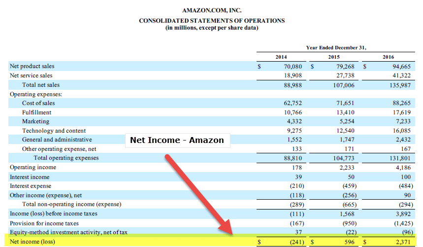

Understanding financial documents is crucial for anyone engaged in algorithmic trading and investing. These documents provide the foundation for evaluating a company's financial performance and formulating trading strategies aimed at maximizing returns. Among these documents, the income statement and cash flow statement stand out as integral components. 

The income statement, sometimes referred to as the profit and loss statement, provides a detailed account of a company's profitability over a specific period. It records revenues, expenses, and profits, painting a picture of the company's operational efficiency and financial performance. Conversely, the cash flow statement offers insights into the liquidity of a company by detailing the actual inflows and outflows of cash. This document is essential for understanding how a company manages its cash resources, which is pivotal for sustaining operations and funding growth.



In algorithmic trading, where data-driven decisions and quantitative analysis are paramount, these financial statements offer valuable data that can significantly impact trading algorithms. By comparing and understanding the differences between the income statement and cash flow statement, traders can develop strategies that capitalize on both profitability and liquidity aspects. This approach allows for identifying market opportunities and optimizing trade execution, ultimately aiming to maximize returns. Hence, a comprehensive understanding of these financial elements is essential for creating more robust and informed trading algorithms, ready to navigate the complexities of the financial markets efficiently.

## Table of Contents

## Understanding Financial Statements

Financial statements provide essential insights into a company's operations and financial position, enabling investors and stakeholders to make informed decisions. The primary types of financial statements are the balance sheet, income statement, and cash flow statement.

The balance sheet, sometimes referred to as a statement of financial position, offers a snapshot of a company's financial health at a specific point in time. It details assets, liabilities, and shareholders' equity, adhering to the accounting equation: 

$$
\text{Assets} = \text{Liabilities} + \text{Equity}
$$

This equation underscores the idea that a company's resources (assets) are financed through either debt (liabilities) or investment (equity).

The income statement, also known as the profit and loss statement, provides an overview of a company's financial performance over a defined period, typically a quarter or fiscal year. It highlights revenues, expenses, and profits, thereby reflecting a company's profitability. Key components of the income statement include revenue, cost of goods sold (COGS), gross profit, operating expenses, operating income, and net income.

In contrast, the cash flow statement focuses on cash movements in and out of the business over a period. It categorizes cash flows into three activities: operating, investing, and financing activities. This classification aids in evaluating a company's [liquidity](/wiki/liquidity-risk-premium) and solvency, offering a more dynamic insight compared to static balance sheets. Cash inflows and outflows are critical for assessing a company's ability to generate cash to meet liabilities and sustain operations.

Together, these financial statements offer a multifaceted view of a company's financial condition, each contributing unique perspectives. While the income statement is a marker of profitability, the cash flow statement underscores liquidity, and the balance sheet reflects overall financial standing. Understanding these documents provides a comprehensive analysis, critical for stakeholders seeking to evaluate operational efficiency and make informed investments.

## Cash Flow Statement vs. Income Statement

The income statement and cash flow statement are two fundamental components of financial analysis, each providing distinct insights into a company's overall financial health. The income statement, also known as the profit and loss statement, is designed to present a company's financial performance over a specific accounting period. It details the revenues earned and expenses incurred, ultimately calculating the net income or loss. The formula for net income as delineated in an income statement is:

$$
\text{Net Income} = \text{Total Revenues} - \text{Total Expenses}
$$

This calculation gives investors a clear picture of profitability, enabling them to assess how effectively a company is generating profit from its operations.

In contrast, the cash flow statement offers a perspective centered around actual cash transactions, reflecting the inflows and outflows of cash within the same period. It is segmented into three key areas: operating activities, investing activities, and financing activities, each showcasing different aspects of cash utilization and generation. For instance, cash flow from operating activities can be represented mathematically as:

$$
\text{Cash Flow from Operating Activities} = \text{Net Income} + \text{Non-Cash Expenses} + \text{Changes in Working Capital}
$$

Unlike the income statement, the cash flow statement highlights the company's liquidity, showing whether it has sufficient cash on hand to settle obligations and finance its activities.

Each statement serves a unique function in financial analysis. The income statement emphasizes profitability and operational performance, whereas the cash flow statement underscores cash liquidity and financial stability. Together, they provide a comprehensive view of a company’s financial status, crucial for stakeholders making informed economic decisions. For investors and analysts, evaluating both statements is imperative to gain a holistic understanding of financial health that cannot be ascertained by examining either document in isolation.

## The Role of Financial Statements in Algorithmic Trading

Algorithmic trading relies heavily on the analysis of financial metrics and data-driven decision-making processes. Financial statements, including income and cash flow statements, serve as crucial data sources that form the backbone of algorithmic models evaluating company performance.

**Income and Cash Flow Statements as Foundations**  
The income statement and cash flow statement each contribute unique insights into the financial health of a company. The income statement provides information on a company's profitability by documenting revenues and expenses over a specified period. The cash flow statement, on the other hand, details the actual inflows and outflows of cash, offering a snapshot of a company's liquidity. Both types of financial statements are crucial for constructing [algorithmic trading](/wiki/algorithmic-trading) models, as they allow quantification of financial performance and liquidity which are key in deciding trading strategies.

**Utilization of Key Metrics**  
Metrics such as operating cash flow and net income derived from these statements can be directly employed in trading algorithms. Operating cash flow, which indicates the cash generated by the company's core business operations, is a vital indicator of a company's financial stability and efficiency. Net income, the profit of a company after all expenses, taxes, and costs, provides insights into profitability. Algorithmic trading systems can utilize both metrics to evaluate a company's ongoing viability and potential profitability. By doing so, these algorithms can make more informed decisions about when to initiate trades based on the underlying financial health of a company.

**Optimization of Trade Execution**  
Automated trading strategies make use of financial statement data to enhance trade execution and spot market opportunities. For instance, algorithms may dynamically adjust their criteria for buying or selling stocks based on changes in these financial metrics. Rapid analysis of financial statement data enables algorithms to swiftly react to new information, capturing opportunities as they arise. The ability to execute trades automatically and accurately using well-defined financial criteria greatly enhances the efficiency of trading strategies.

**Enhancement of Quantitative Analysis**  
Incorporating comprehensive financial analysis into trading systems significantly enhances the quality of quantitative analysis. By integrating financial statement data, trading algorithms are better equipped to perform rigorous evaluations of company performance over time. This integration allows for the development of sophisticated models that can assess not only historical performance but also anticipate future trends. Thus, financial statements are not just historical records; they are essential tools for developing predictive models that improve trading performance through enhanced data analysis techniques.

In conclusion, leveraging the information present in income and cash flow statements is indispensable for the development of robust and profitable algorithmic trading strategies. These statements provide critical insights and metrics that enable traders to make informed and data-driven decisions, optimizing both strategy formulation and execution.

## Key Financial Ratios in Algo Trading

Financial ratios are essential tools in algorithmic trading, transforming detailed financial statement data into concise, actionable indicators. These ratios allow traders and algorithms to quickly assess a company's financial health, facilitating more informed trading decisions. Among the numerous ratios, some stand out for their significance in evaluating key aspects such as leverage, stability, and efficiency. 

1. **Debt-to-Equity Ratio**:
   The debt-to-equity ratio is a fundamental indicator used to evaluate a company's financial leverage by comparing its total liabilities to its shareholder equity. It is expressed as:
$$
   \text{Debt-to-Equity Ratio} = \frac{\text{Total Liabilities}}{\text{Shareholders' Equity}}

$$
   A higher ratio suggests greater financial risk, as it indicates the company is heavily financed by debt compared to its owned capital. By integrating this ratio, trading algorithms can identify companies with either potentially unsustainable leverage or efficient capital structures.

2. **Profit Margins**:
   Profit margins, including gross margin, operating margin, and net margin, measure a company’s profitability relative to its revenue. They are calculated as:
$$
   \text{Profit Margin} = \frac{\text{Net Profit}}{\text{Revenue}} \times 100

$$
   These metrics allow traders to assess operational efficiency and the scalability of a company's profit versus its revenue. Algorithms can leverage these margins to pinpoint companies with strong or improving profitability, establishing criteria for buy or sell signals.

3. **Return on Equity (ROE)**:
   ROE gauges a company's ability to generate profits from its shareholders' equity and is a measure of financial performance.
$$
   \text{ROE} = \frac{\text{Net Income}}{\text{Average Shareholders' Equity}} \times 100

$$
   High ROE values generally indicate effective management and fruitful reinvestment strategies, key indicators for algorithmic models targeting companies with strong growth potential.

4. **Current Ratio**:
   The current ratio evaluates a company's ability to cover short-term obligations with its current assets:
$$
   \text{Current Ratio} = \frac{\text{Current Assets}}{\text{Current Liabilities}}

$$
   This liquidity ratio signals a company’s short-term financial health and operational efficiency, with implications for algorithmic trading strategies that account for liquidity risk.

Incorporating these ratios into algorithmic trading strategies is crucial for enhancing the precision and quality of trading decisions. By examining these indicators, trading algorithms can detect market opportunities and risks that manual analysis might overlook. Sophisticated algorithms can adapt to market conditions by re-evaluating these ratios in real-time, thus optimizing trade execution and improving overall strategy performance. Employing these financial metrics not only streamlines quantitative analysis but also ensures algorithms respond adeptly to dynamic market environments.

## Limitations and Considerations

Financial statements, integral to understanding a company's financial health, have inherent limitations that must be acknowledged, particularly in algorithmic trading. These statements predominantly rely on historical data, meaning their capacity to predict future conditions is limited. Historical data in financial statements can often mask emerging risks or opportunities that might be apparent only through the lens of forward-looking analysis. 

Additionally, financial statements are susceptible to accounting manipulations. Companies can utilize various accounting techniques to present financial outcomes that might not fully reflect their economic realities. Techniques such as income smoothing or altering revenue recognition timings are examples that can affect the perceptibility of a company's financial health.

Furthermore, traditional financial statements often do not capture all elements of a company's value. Intangible assets such as brand value, intellectual property, or workforce capabilities might be inadequately reflected, leading to an incomplete analysis of the company’s overall value proposition. Algorithmic trading, heavily reliant on quantitative inputs, may thus gain an imbalanced view if depending solely on conventional metrics provided by these financial documents.

Understanding external factors and market conditions is crucial as well. Factors such as economic cycles, changes in governmental policy, or sudden shifts in consumer preferences can significantly impact a company's financial performance and are not easily encapsulated within static historical financial data.

Advanced technological tools and approaches afford a more nuanced view of financial health. Machine learning algorithms, for example, can process vast datasets to identify patterns or anomalies that human analysts might overlook. Natural language processing (NLP) can analyze textual data from earnings calls or news articles to glean sentiments and insights beyond traditional financial metrics. 

Consider the following Python snippet utilizing a basic NLP approach:

```python
from textblob import TextBlob

def analyze_sentiment(earnings_call):
    blob = TextBlob(earnings_call)
    return blob.sentiment.polarity

# Example usage with an earnings call statement
earnings_call_text = "The company's future looks promising with increasing revenues and expanding markets."
print(analyze_sentiment(earnings_call_text))
```

Incorporating such advanced techniques allows for a more comprehensive analysis, transcending the confines of historical numerical data.

Finally, the integration of multiple data sources enhances decision-making and trading outcomes. By combining historical data from financial statements with real-time market data, news analytics, and economic indicators, traders can create a more holistic view of potential risks and opportunities. This integrative approach mitigates the limitations inherent in relying solely on traditional financial statements, thus refining trading algorithms for improved accuracy and returns in a dynamic market environment.

## Conclusion

Integrating financial statement analysis into algorithmic trading fundamentally enhances data-driven investment strategies. The ability to systematically interpret income and cash flow statements empowers traders to construct more efficient algorithms, as these documents provide a detailed snapshot of a company's profitability and liquidity over time. This understanding is vital, given that these financial indicators form the backbone of algorithmic models designed to assess company performance and predict market behavior. 

Financial ratios, derived from elements of these statements, condense intricate data into comprehensible insights, serving as essential tools for evaluating a company's health. Ratios such as the debt-to-equity ratio, return on equity (ROE), and current ratio are critical metrics that can inform algorithmic decisions by signaling potential buy or sell opportunities. For example, high-profit margins or favorable debt levels might trigger algorithmic trades, seeking to capitalize on perceivably undervalued stocks. The mathematical representation of these ratios acts as a bridge, transforming raw financial data into actionable trading signals:

```python
# Example to compute a basic financial ratio in Python
def calculate_current_ratio(current_assets, current_liabilities):
    """Calculates the current ratio to assess liquidity."""
    if current_liabilities == 0:
        return float('inf')  # Avoid division by zero
    return current_assets / current_liabilities
```

Despite the advantages, strategic utilization of financial statements in algorithmic trading must acknowledge inherent limitations. Statements are retrospective, often limited by accounting conventions, and susceptible to managerial bias, introducing an element of uncertainty. Consequently, traders must balance this internal analysis with an understanding of market conditions and external economic factors.

Looking ahead, advancements in technology and data processing will continue to shape the integration of financial statement analysis in trading strategies. Enhanced [machine learning](/wiki/machine-learning) algorithms and [artificial intelligence](/wiki/ai-artificial-intelligence) are likely to optimize data interpretation, making complex financial statement analysis more accessible and actionable. This evolution will enable traders to exploit nascent opportunities in financial markets more effectively, heightening the precision and success of algorithmic trading practices. As these tools advance, they promise to offer deeper insights and more sophisticated approaches, transforming the landscape of [quantitative trading](/wiki/quantitative-trading).

## References & Further Reading

[1]: ["Financial Reporting and Analysis"](https://www.wallstreetmojo.com/financial-reporting/) by Charles H. Gibson

[2]: ["Corporate Finance: A Focused Approach"](https://www.cengage.com/c/corporate-finance-a-focused-approach-7e-ehrhardt-brigham/9781337909747/?searchIsbn=9781337909747) by Michael C. Ehrhardt and Eugene F. Brigham

[3]: ["Investments"](https://money.usnews.com/financial-advisors/articles/best-investments) by Zvi Bodie, Alex Kane, and Alan J. Marcus

[4]: ["The Intelligent Investor"](https://www.amazon.com/Intelligent-Investor-Definitive-Investing-Essentials/dp/0060555661) by Benjamin Graham

[5]: ["Common Stocks and Uncommon Profits and Other Writings"](https://www.amazon.com/Common-Stocks-Uncommon-Profits-Writings/dp/0471445509) by Philip A. Fisher